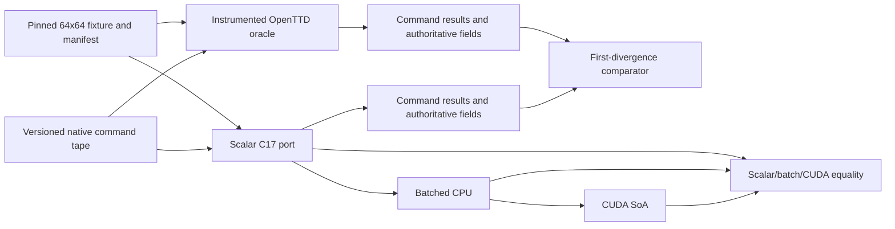

# OpenTTD C/CUDA RL Port: Complete Context and Next-Stages Implementation Handoff

Prepared: 2026-07-29 UTC<br>
Repository: `git@github.com:goldbar123467/openttd-cuda-rl.git`<br>
Outer repository commit at handoff: `58895696c8a75eda2fac2ae553654ba4398f5cda`<br>
Pinned OpenTTD submodule commit: `29f808ef0022064e6d9a83c8476d1e0f4686af86`<br>
Primary source report: `OpenTTD_CUDA_RL_REVERSE_ENGINEERING_REPORT.md`

> This document is the implementation handoff for another AI or engineer. Read it
> completely before changing code. It combines the repository's research
> conclusions with the actual state of the current Vast.ai instance. Where this
> handoff reports a live verification result, that result supersedes a prediction
> or stale count in the research report. It does not replace the research report
> as the detailed source-behavior reference.

---

## 1. Executive instruction

The selected project is an **exact, source-derived OpenTTD gameplay parity port**
for one deliberately restricted scenario first. The required sequence is:

1. retain the pinned OpenTTD C++ executable as an external oracle;
2. freeze one valid 64x64 road-freight fixture and all of its inputs;
3. record native OpenTTD commands, command results, RNG/timer state, and a
   future-complete authoritative state projection at declared boundaries;
4. build a comparator that stops at the first differing command, tick, or field;
5. port the selected behavior to an explicit per-environment scalar C17 model;
6. reach zero open divergence for the complete road-freight loop and a further
   10,000-tick continuation;
7. only then add exact snapshot/reset, semantic observations, batched CPU,
   Python, and finally CUDA;
8. broaden OpenTTD subsystem coverage only after the first complete slice remains
   green.

Do **not** start by writing CUDA kernels. Do **not** treat a plausible transport
simulation as parity. Do **not** substitute the optional invented `rules-v1`
harness for the selected OpenTTD slice. The first hard problem is building an
oracle and proving what must match.

The immediate implementation target is `PORT-001` through `PORT-005`, followed
by the scalar C substrate. The first major vertical milestone is `PORT-016`.

---

## 2. Authority and conflict-resolution order

Use this order when sources appear to disagree:

1. The pinned OpenTTD source and tests at
   `29f808ef0022064e6d9a83c8476d1e0f4686af86` are authoritative for OpenTTD
   behavior.
2. Repeated oracle observations made from that exact build are authoritative for
   the frozen fixture.
3. `OpenTTD_CUDA_RL_REVERSE_ENGINEERING_REPORT.md` is the selected architecture,
   scope, backlog, and evidence map.
4. `research-notes/09-verification-audit.md` resolves earlier ambiguity in favor
   of the exact-port plan.
5. The other files under `research-notes/` provide supporting subsystem, build,
   UI, persistence, legal, and product analysis.
6. This handoff records current machine state and turns the report into an
   execution runbook.

Before this handoff was added, the checkout contained 43 Markdown files when the
pinned OpenTTD submodule was included. They were read during environment setup;
this handoff is the 44th Markdown file. A future agent working on a specific
subsystem should still open the relevant research note and named source files
before implementing it.

### Key supporting documents

| Document | Primary use |
| --- | --- |
| `OpenTTD_CUDA_RL_REVERSE_ENGINEERING_REPORT.md` | Consolidated selected plan, contracts, phases, backlog, tests, risks |
| `research-notes/00-repository-metadata.md` | Repository identity and metadata snapshot |
| `research-notes/01-repository-build.md` | Build graph, dependencies, entry points, tests, packaging |
| `research-notes/02-docs-legal.md` | GPL, assets, AI contribution policy, reuse risks |
| `research-notes/03-gameplay-sim-path.md` | Gameplay, clocks, cargo, economy, YAPF, data ownership |
| `research-notes/04-end-to-end-workflow.md` | Source trace from construction through delivery and save |
| `research-notes/05-clean-room-cuda-mvp.md` | Earlier small C/CUDA harness design; optional plumbing only |
| `research-notes/06-ui-persistence-render.md` | Command/UI boundary, saves, rendering, assets, accessibility |
| `research-notes/07-build-verification.md` | Earlier local OpenTTD build evidence and OpenGFX integrity |
| `research-notes/08-mvp-product-audit.md` | Product-scope audit and parity corrections |
| `research-notes/09-verification-audit.md` | Final independent audit selecting exact-port direction |
| `research-notes/10-netherite-reference.md` | Methodology lessons; not reusable code and not proof of fidelity |

---

## 3. Hard truth about the repository today

The outer repository currently contains:

- research/design Markdown;
- `.gitmodules`;
- the pinned `openttd-upstream` submodule.

It does **not** yet contain:

- oracle instrumentation;
- a frozen 64x64 fixture;
- a versioned tape or field schema;
- a comparator or prefix minimizer;
- scalar C port code;
- a public C ABI;
- Python bindings;
- batched CPU code;
- CUDA kernels;
- a side-by-side viewer;
- CI for the new port;
- parity, sanitizer, soak, or performance artifacts for the new port.

Therefore, the OpenTTD installation is complete, but the C/CUDA/RL port has not
started. Any future claim that “the CUDA port is installed” or “OpenTTD parity is
working” would be false until the gates in this document pass.

### Current backlog status

| Range | Status | Meaning |
| --- | --- | --- |
| `PORT-001` | **Partially complete** | Source, toolchain, build, tests, and runtime are pinned locally, but no committed machine-readable build manifest/reproduction script exists yet |
| `PORT-002` through `PORT-005` | **Not started** | No fixture, oracle extraction, tape/comparator, or approved authoritative projection exists |
| `PORT-006` through `PORT-016` | **Not started** | No scalar C foundation or parity slice exists |
| `PORT-017` through `PORT-020` | **Not started** | No RL reset/observation, batch/Python, CUDA, or side-by-side product exists |

---

## 4. Current checkout, authentication, and live machine state

### Repository state

| Item | Current value |
| --- | --- |
| Checkout | `/workspace/openttd-cuda-rl` |
| Branch | `main`, synchronized with `origin/main` before this document was created |
| Origin | `git@github.com:goldbar123467/openttd-cuda-rl.git` |
| Access | GitHub account `goldbar123467`; repository permission verified as `ADMIN` |
| Git transport | SSH; handshake and `git ls-remote` verified |
| Git identity, repository-local | `Clark Kitchen <clarkkitchen22@gmail.com>` |
| OpenTTD submodule | `/workspace/openttd-cuda-rl/openttd-upstream` |
| Submodule revision | `29f808ef0022064e6d9a83c8476d1e0f4686af86` |

The SSH private key is `/root/.ssh/id_ed25519`; never print or commit it. GitHub
CLI stores its token at `/root/.config/gh/hosts.yml` with mode `600` because this
container has no system credential vault. Never copy either credential into the
repository, logs, manifests, or a response.

### Persistence warning

`vast-capabilities` reports `workspace_is_volume: false`. Stop/start preserves the
container, but recycle or destroy erases `/workspace`, the build, the install,
the SSH key, and the GitHub CLI credential. Commit and push valuable source and
small reproducibility artifacts. Do not depend on local build outputs as the only
copy.

### Operating system and toolchain

| Item | Current value |
| --- | --- |
| OS | Ubuntu 24.04.4 LTS, x86-64 |
| CPU | Intel Xeon E5-2686 v4 @ 2.30 GHz, 72 logical CPUs visible |
| GPU | NVIDIA GeForce RTX 5070, 12,227 MiB |
| GPU compute capability | 12.0, Blackwell |
| NVIDIA driver | 580.126.20 |
| Driver maximum CUDA | 13.0 |
| CUDA toolkit | 13.0, `nvcc` 13.0.88 |
| Minimum suitable framework-wheel CUDA | 12.8 for this GPU architecture |
| Git | 2.43.0 |
| GitHub CLI | 2.45.0 |
| CMake | 3.28.3 |
| Ninja | 1.11.1 |
| GCC/G++ executable | GCC 13.3.0 |

Never install or upgrade the NVIDIA driver from inside this container. Never use
the apt `cuda` metapackage. The driver is injected by the host. For future Python
or PyTorch work, use CUDA 12.8 or newer wheels because this Blackwell GPU cannot
run a `cu124` kernel build even though such a package may install successfully.

### Installed OpenTTD dependency families

The working build has development support for SDL2, libcurl, zlib, liblzma, LZO,
PNG, Freetype, Fontconfig, Harfbuzz, ICU, Ogg, Opus, OpusFile, FluidSynth, and
OpenGL. Key installed package versions include:

- SDL2 `2.30.0`;
- libcurl `8.5.0`;
- ICU `74.2`;
- Freetype `2.13.2`;
- Harfbuzz `8.3.0`;
- FluidSynth `2.3.4`;
- libpng `1.6.43`;
- LZO `2.10`;
- Opus `1.4` and OpusFile `0.12`.

### OpenTTD build and installation

| Item | Current value |
| --- | --- |
| Build directory | `/workspace/openttd-build` |
| Install prefix | `/workspace/openttd-install` |
| Installed executable | `/workspace/openttd-install/games/openttd` |
| PATH entry | `/usr/local/bin/openttd` symlink |
| Build type | `RelWithDebInfo` |
| Dedicated-only | Off; full SDL desktop-capable build |
| Assertions | On |
| FHS install layout | On |
| Reported version | `OpenTTD 20260729--g29f808ef00` |
| Graphics | OpenGFX 8.0 detected and usable |
| Video drivers | SDL OpenGL, SDL, dedicated, null |
| Sound drivers | SDL, null |
| Music drivers | FluidSynth, external MIDI, null |

OpenGFX acquisition was checked against the report's expected archive hash:

```text
opengfx-8.0-all.zip SHA-256:
43a0c1dabf39cb865394f3a6cc36d4da5c10ecfaaf55652043104806810903be

installed opengfx-8.0.tar SHA-256:
9389bcb0807058c80bd95121e978f05d9ef86b4b1bc3ac2da8da8bb02456043c
```

The tar is installed at:

```text
/workspace/openttd-install/share/games/openttd/baseset/opengfx-8.0.tar
```

### Verification already performed

- OpenTTD configured and compiled successfully: 929 Ninja build actions.
- `ldd` reported no unresolved shared libraries.
- `openttd -h` detected OpenGFX 8.0 and all expected drivers.
- CTest result: **99/99 tests passed**, including the four executable regression
  tests.
- A new headless game ran 128 ticks using null video, sound, music, and blitter,
  then exited with code 0.

The primary report says `98/98` in `PORT-001`, but the live pinned checkout and
current build expose **99 tests**. This is an evidence-backed documentation
discrepancy. The implementation must record the exact enumerated test list and
actual result in the build manifest instead of forcing the old number.

### Rebuild and smoke-test commands

From a surviving current instance:

```bash
cmake -S /workspace/openttd-cuda-rl/openttd-upstream \
  -B /workspace/openttd-build \
  -G Ninja \
  -DCMAKE_BUILD_TYPE=RelWithDebInfo \
  -DCMAKE_INSTALL_PREFIX=/workspace/openttd-install \
  -DOPTION_DEDICATED=OFF

cmake --build /workspace/openttd-build --parallel 16
ctest --test-dir /workspace/openttd-build --output-on-failure
cmake --install /workspace/openttd-build

openttd -h
openttd -g -v null:ticks=128 -s null -m null -b null \
  -I OpenGFX -Q -x
```

If the instance was recycled, clone through SSH and initialize the submodule:

```bash
git clone --recurse-submodules \
  git@github.com:goldbar123467/openttd-cuda-rl.git \
  /workspace/openttd-cuda-rl

git -C /workspace/openttd-cuda-rl submodule update --init --recursive
```

OpenGFX 8.0 must be restored and hash-verified before regression tests that need
base graphics. Do not commit OpenGFX into this project unless the distribution
and GPL asset obligations have been deliberately handled.

---

## 5. Licensing, publication, and upstream boundaries

This is practical engineering guidance, not legal advice.

### Selected basis

The report records a user decision to make a private, educational,
source-derived port. Because the work uses OpenTTD source internals, symbols,
formulas, data flow, and a language translation, treat the resulting port as a
GPL-2.0-only derivative. A “clean-room” label does not apply to this work.

### Live conflict that must be resolved

The GitHub API currently reports `goldbar123467/openttd-cuda-rl` as **public**,
while the report says the project basis is private. Resolve this before pushing
source-derived implementation code:

- make the repository private if that is still the intended project basis; or
- deliberately operate as a public GPL project with complete corresponding
  source, notices, dependency/asset provenance, and distribution review.

Public versus private does not remove GPL obligations when binaries or derived
source are distributed. It changes the immediate exposure and release workflow.

### Upstream OpenTTD AI policy

The pinned OpenTTD `CONTRIBUTING.md` prohibits LLM-generated issue/PR text and
entire generated code lines for upstream contributions. Therefore:

- do not open an upstream OpenTTD pull request containing AI-generated work;
- do not file generated upstream issues or review comments;
- keep this fork/project separate;
- use the pinned OpenTTD only as the oracle and GPL source basis;
- retain attribution and license texts for any derived distribution.

### Other content

- OpenGFX is independently packaged GPL content and must be tracked by exact
  version/hash and license if redistributed.
- Do not copy Netherite code. Its audited public repository had no clear
  project-wide reuse license. Only its methodology—pinned oracle, tapes,
  first-divergence debugging, layered parity gates—is adopted.
- Avoid public branding that implies this is official OpenTTD or Transport
  Tycoon software.

---

## 6. Selected product target

### Platform and API target

- Linux x86-64 first.
- Pinned OpenTTD C++ executable remains the oracle.
- Scalar ISO C17 is the authoritative new backend.
- CUDA C++ is hidden behind an `extern "C"` ABI.
- Batched CPU exists before CUDA.
- Python exposes a vector RL environment using NumPy and eventually a safe tensor
  interchange path such as DLPack.
- CPU-only installation/import must work without a CUDA runtime or NVIDIA GPU.
- Rendering is diagnostic and human-facing; it is not part of the authoritative
  RL transition.

### First parity fixture

The first product milestone is one frozen **64x64** OpenTTD road-freight
scenario because 64 is OpenTTD's minimum supported map dimension. The fixture
must contain:

- no NewGRFs;
- one human company;
- one producing industry and one compatible accepting industry;
- enough deterministic opening funds for the declared tape;
- one selected road vehicle type available under the pinned year/settings;
- exact settings, content, base-set version, save bytes, and hashes;
- the RNG and timer state at the declared replay boundary.

The command tape should construct:

- the necessary road;
- one pickup road stop;
- one delivery road stop;
- one road depot;
- one road vehicle;
- a two-stop circular order loop;
- vehicle start and deterministic time advancement through production, capture,
  loading, movement, delivery, acceptance, and payment.

The report does not finally select the cargo/industry pair, vehicle model, map
seed, year, or precise tile coordinates. Those are decisions for `PORT-002` and
must be written into a manifest rather than silently chosen in code. A simple
temperate producer/acceptor pair is a reasonable candidate, not yet an approved
fixture.

### Meaning of “playable”

For this restricted slice, playable means the same low-level command tape can be
driven manually or by an RL policy through both the OpenTTD reference and the new
port, yielding matching:

- construction acceptance/rejection and costs;
- road/station/depot state;
- vehicle creation, orders, controller, and movement;
- cargo production, capture, packets, loading, unloading, and acceptance;
- company expenses and delivery income;
- RNG and simulation/calendar/economy time.

### Meaning of “complete” for the first release

The selected slice is complete only when:

- scalar C agrees with the oracle at every declared command/tick field boundary;
- there are zero unresolved divergences for the release corpus;
- reset restores the exact frozen snapshot and identical future continuation;
- snapshot/load matches immediately and for the next 10,000 ticks;
- semantic observations are read-only and do not alter continuation;
- batched CPU and CUDA match scalar C at all required batch sizes;
- sanitizer, malformed-input, isolation, permutation, soak, packaging, and
  performance gates pass;
- supported scope is described honestly without claiming full OpenTTD.

---

## 7. What is in and out of the first slice

### Required now

- exact fixture map planes and reached tile types;
- pool occupancy, stable IDs, allocation and iteration order for reached object
  types;
- both relevant OpenTTD RNG streams and consumption order;
- game tick, economy, and calendar timer state and reached callbacks;
- native command decoding, test/execute semantics, results, costs, errors, and
  rejected-command atomicity;
- roads, two road stops, one depot, ownership, catchment/acceptance effects
  reached by the fixture;
- one road vehicle lifecycle and two-stop orders;
- the selected road YAPF/follow-track/controller behavior, ties, station/depot
  entry, cache classification, invalidation, and rebuild policy;
- industry production reached by the fixture;
- station goods and cargo packet identity, provenance, counts, age, split/merge,
  load/unload, and delivery behavior;
- company ledger and the exact reached payment/cost/timer behavior;
- canonical state projection, snapshot/reset/hash, semantic observations;
- scalar C, batched CPU, Python, and CUDA equality for the selected transition.

### Deferred until the vertical slice is green

- complete road behavior outside the selected corpus;
- broad town and industry behavior;
- rail, signals, reservations, and consists;
- ships and water pathfinding;
- aircraft and airport movement;
- procedural world generation;
- AI and GameScript;
- NewGRF breadth;
- multiplayer determinism and networking;
- historical/legacy native save compatibility;
- pixel-perfect rendering parity;
- Windows, macOS, web, mobile, multi-GPU, and distributed training.

Deferred means “not yet claimed,” not “unimportant” or “permanently removed.”
Every expansion starts by extending oracle fixtures and schema before port code.

---

## 8. Core gameplay and source trace to preserve

The representative native flow is:

1. a tool or policy supplies a typed command and tile/entity operands;
2. OpenTTD validates and prices the command;
3. accepted execution mutates state and accounts the cost;
4. roads, stops, depot, vehicle, and orders create a service loop;
5. the fixed simulation loop advances timers and entity ticks in native order;
6. road pathfinding/controller state moves the vehicle through the tile graph;
7. industry production and station capture create and age cargo state;
8. station service loads/unloads cargo packets;
9. final acceptance and `DeliverGoods`/income logic credit the company;
10. persistence can snapshot canonical state at a declared boundary.

Primary source anchors named by the report include:

- `src/openttd.cpp::StateGameLoop`;
- `src/command_func.h` and `src/command.cpp`;
- `src/road_gui.cpp` and `src/road_cmd.cpp`;
- `src/station_cmd.cpp` and `src/station_base.h`;
- `src/vehicle_cmd.cpp`, `src/roadveh_cmd.cpp`, and `src/order_cmd.cpp`;
- `src/pathfinder/yapf/yapf_road.cpp`;
- `src/economy.cpp`;
- `src/saveload/saveload.cpp`.

Do not translate only these files mechanically. Reached behavior can depend on
tile procedure tables, pool ordering, settings tables, timer callbacks, caches,
content data, and helpers elsewhere. The oracle tape and field projection exist
to expose those dependencies.

---

## 9. Required architecture

The report recommends this target layout:

```text
oracle/
  openttd-pin/          immutable pinned source/submodule reference
  instrumentation/     reviewable patch series for command/state extraction
  runner/              deterministic null-driver fixture launcher
parity/
  schema/              field IDs, widths, order, ownership, cache policy
  tape/                command/result/tick records and fixture manifests
  compare/             first-divergence comparator, reporter, prefix minimizer
src_c/
  core/                environment root, IDs/pools, RNG, timers, commands
  world/
  transport/
  pathfinder/
  cargo/
  economy/
  save/
backend_cpu/            scalar reference and environment-batched host execution
backend_cuda/           SoA device state, bounded scratch, transition kernels
include/openttd_rl/     versioned opaque C ABI
python/openttd_rl/      vector environment and tensor adapters
viewer/                 optional semantic/side-by-side diagnostic viewer
tests/                  unit, oracle, differential, fuzz, soak, package, perf
docs/                   decisions, supported-scope matrix, divergence ledger
```

The existing `openttd-upstream` submodule can serve as the immutable pinned
source. Do not leave ad hoc edits in it. Store instrumentation as an explicit
patch series and apply it to a disposable instrumented worktree/build so that:

- the pinned submodule remains clean;
- instrumentation changes are reviewable and reproducible;
- instrumented and uninstrumented builds can be compared from the same commit;
- `git submodule status` continues to prove source identity.

### Data-flow boundary



The oracle and port share serialized definitions and inputs, never mutable
memory. The scalar port must replace process-global C++ state with an explicit
environment root while preserving values and observable future behavior.

### Non-negotiable representation rules

- Use fixed-width integers for authoritative state.
- Avoid floating point in parity-critical transitions unless the pinned source
  path genuinely uses it and exact behavior is established.
- Preserve signedness, overflow/rounding behavior, iteration order, phase order,
  RNG draw order, pool slot allocation, ID reuse, and command boundaries.
- Never hash raw C structs; padding and representation are not canonical state.
- Pointers, caches, and containers may be represented differently only when the
  declared projection and future continuation remain identical.
- No renderer, Python object, filesystem handle, CUDA stream, device pointer, or
  observation cache may become hidden authoritative state.
- Rejected commands must match the oracle result and preserve all authoritative
  bytes except fields the oracle itself changes on rejection.

---

## 10. Oracle contract and tape design

### Why the oracle comes first

OpenTTD is a large global C++ simulation. A port can look plausible while being
wrong because of one omitted timer callback, cache invalidation, packet ordering,
or RNG draw. The oracle must make the first incorrect boundary visible before
the implementation becomes too large to diagnose.

### Required tape header

The versioned binary tape/manifest must identify at least:

- tape format version and endianness;
- OpenTTD commit;
- instrumentation patch-series hash;
- compiler, linker, CMake, generator, build type, defines, and dependency
  versions;
- executable hash;
- fixture save hash;
- full settings/config hash plus normalized settings listing;
- base graphics/content profile and file hashes;
- NewGRF list, required to be empty for the first fixture;
- field-schema version/hash;
- command-set version/hash;
- declared initial boundary and tick/frame/calendar/economy counters;
- both RNG states;
- optional platform/hardware metadata for performance runs.

### Required record classes

Use stable numeric types and lengths. At minimum support:

- replay-start snapshot/projection;
- command intent and raw operands;
- command test/quote result;
- command execute result and error payload;
- post-command authoritative projection;
- post-tick authoritative projection;
- optional per-RNG-draw trace while debugging;
- optional route/controller trace;
- optional named diagnostic checkpoint/frame;
- terminal/end record and complete-stream checksum.

The exact framing is a Phase P0 decision. Keep it binary, versioned, bounded, and
easy to parse from C, C++, and Python. A human-readable dump tool should render
records without being the authoritative storage format.

### Instrumentation non-perturbation requirements

- Read only at explicitly declared safe boundaries.
- Do not call RNG, pathfinding, string formatting, or simulation helpers merely
  to produce a field if that call could mutate state or cache behavior.
- Use stable IDs and explicit fields rather than pointer values.
- Buffer deterministic primitive records and move expensive formatting outside
  the transition where practical.
- Build instrumented and uninstrumented binaries from the same source/options.
- Repeat the oracle tape twice and require byte-identical output.
- Compare instrumented versus uninstrumented command outcomes, native state
  checks, saved continuation, and future behavior.
- Inject a known wrong field in a test tape and prove the comparator names the
  correct earliest tick and field.

### First-divergence rule

When a mismatch occurs, report:

```text
build/settings/content/schema IDs
backend and hardware
logical environment ID
earliest public step
earliest authoritative tick/boundary
field ID and human-readable field path
oracle value and target value
last command and command result
minimal reproducing tape prefix
```

Stop comparing contaminated later ticks as if they were independent failures.
Keep a machine-readable divergence ledger with owner, reproducer, impact,
rationale, and closure gate. The release requirement is zero open divergence for
the declared corpus.

---

## 11. Authoritative field projection: candidate inventory

`PORT-005` must freeze the actual field list. The following is a **candidate
inventory**, not permission to omit fields that later prove future-relevant.

### Global and time state

- current game mode and pause/run boundary relevant to replay;
- game tick/frame counter;
- economy/calendar date counters and fractions;
- reached timer interval state and pending callbacks;
- both RNG stream states and, when debugging, draw sequence;
- settings that affect reached behavior;
- topology/cache revision counters;
- error/fault/terminal state if relevant.

### Map state

- map dimensions and every underlying map plane for all 4,096 tiles;
- tile type, height/slope if present, owner, road bits/type, station/depot IDs,
  and any reached auxiliary bits;
- native tile iteration order;
- any reached global tile-loop cursor or scheduling state.

### Pools and identity

For companies, industries, stations/road stops, vehicles, orders, cargo packets,
and any other reached pool:

- occupancy/free-list state;
- slot and typed ID/generation rules;
- allocation/deallocation/iteration order;
- references between objects represented as stable IDs;
- every field that can influence future commands/ticks;
- declared derived/cache fields and their rebuild procedure.

### Commands and accounting

- native command ID and all raw/decoded operands;
- test versus execute flags and company context;
- status/error payload and `CommandCost` components;
- exact company debit/credit and expense category;
- post-command map/pool/cache changes;
- proof of atomic rejection behavior.

### Road vehicle and path state

- vehicle subtype, engine/type identity, owner, position/direction;
- speed/progress, controller state, station/depot state, age/service/reliability
  fields reached by the fixture;
- current/next orders and order-list identity;
- route/controller decisions, costs, ties, selected trackdirs, and no-route state;
- cache contents or an approved derived-cache classification with invalidation
  and rebuild proof.

### Cargo, station, industry, and economy state

- industry production counters/remainders and reached timer inputs;
- station `GoodsEntry` state;
- cargo packet IDs, amount/count, source/provenance, age, distance/feeder/transfer
  fields reached by the fixture, and link/order among packets;
- vehicle cargo state;
- loading/unloading dwell/progress;
- acceptance and delivery state;
- company balance, categorized expenses/revenue, loan/score fields if reached;
- date-dependent income/cost inputs and exact output.

### Cache classification

Every field must be labeled one of:

- **authoritative and serialized every boundary**;
- **authoritative but sampled periodically**, with a reason and full-snapshot
  schedule;
- **derived and compared after deterministic rebuild**;
- **diagnostic only**;
- **out of scope and proven unreachable in the fixture**.

For each derived field, clear/delete it, rebuild it, and require the same
projection plus the same next 10,000 ticks. Immediate equality alone is not
enough.

---

## 12. Phased build plan

### P0 — Oracle contract (`PORT-001` through `PORT-005`)

Objective: establish reproducible inputs and first-divergence tooling before
translation.

Deliverables:

- machine-readable toolchain/build/dependency manifest;
- reproducible uninstrumented build and 99-test result for the current profile;
- frozen 64x64 fixture/save/settings/content manifest;
- non-perturbing instrumentation patch series;
- deterministic reference runner using null backends;
- versioned tape and field schema;
- comparator, human dump, prefix minimizer, and divergence ledger;
- approved projection/cache decision record.

Exit gate:

- two reference recordings are byte-identical;
- instrumentation and uninstrumented continuation agree;
- a corrupt tape is rejected safely;
- an injected mismatch reports and minimizes the true first boundary;
- no fixture input is un-hashed or implicit.

### P1 — Scalar C state substrate (`PORT-006` through `PORT-008`)

Objective: create explicit environment-owned state matching oracle tick zero.

Deliverables:

- CPU-only CMake/Ninja build under GCC and Clang;
- stable opaque versioned C ABI foundation;
- `ottd_env` root with explicit map planes, pools, IDs, free lists, RNG, timers,
  settings, and canonical projection;
- frozen-snapshot import/reset;
- checked arithmetic and endian/canonical primitives.

Exit gate:

- the C reset projection equals oracle tick zero field-for-field;
- pool allocate/free/iteration vectors match;
- RNG transitions and timer/date boundary vectors match;
- CPU library and Python package skeleton import without CUDA installed.

### P2 — Commands and road world (`PORT-009` through `PORT-011`)

Objective: reproduce selected construction commands and exact state effects.

Deliverables:

- command codec/dispatcher;
- native test/execute/result/cost/error/accounting behavior;
- road tile mutations;
- road stop and depot creation;
- ownership, pool allocation, catchment, and cache invalidation reached by tape.

Exit gate:

- every accepted and rejected construction command matches the oracle;
- quote and debit match;
- rejected commands have matching non-mutation behavior;
- post-command tile/pool/cache fields have zero divergence.

### P3 — Road vehicle, orders, path, and controller (`PORT-012`–`PORT-013`)

Objective: reproduce the full selected vehicle service loop up to cargo.

Deliverables:

- road vehicle creation and lifecycle;
- start/stop and two-stop order behavior;
- selected road YAPF/follow-track subset;
- station/depot entry and controller transitions;
- bounded route scratch and explicit cache policy.

Exit gate:

- vehicle/order pool state matches after every command and tick;
- route ties, no-route, stop, and depot cases reached by corpus match;
- the vehicle loops for 100,000 ticks or reaches the cargo gate without a field
  divergence.

### P4 — Cargo, economy, and relevant timers (`PORT-014`–`PORT-016`)

Objective: close the vertical production-to-payment loop.

Deliverables:

- industry production;
- station capture and `GoodsEntry` behavior;
- cargo packet allocation, provenance, age, split/merge, loading/unloading;
- final acceptance and delivery payment;
- company ledger and reached timer callbacks;
- conservation and first-divergence tooling for packets and money.

Exit gate:

- full command tape reaches accepted delivery and matching revenue;
- every packet and ledger field agrees at each boundary;
- a deterministic 10,000-tick continuation has zero open divergence;
- `PORT-016` is closed before optimization or CUDA translation.

### P5 — Exact reset, observations, batched CPU, and Python (`PORT-017`–`PORT-018`)

Objective: turn the proven scalar transition into a safe RL environment.

Deliverables:

- canonical snapshot export/import and exact reset;
- semantic observations derived after transition;
- indexed opaque contexts;
- batched host storage/execution;
- Python vector wrapper with explicit reset/termination policy;
- immutable observation leases and safe lifetime rules.

Exit gate:

- reset/import matches now and for the next 10,000 ticks;
- observations never mutate or feed back into authoritative state;
- direct C and Python results/hashes agree;
- scalar and batched CPU match for `N=1,31,32,33,256`;
- environment isolation and batch permutation pass.

### P6 — CUDA parity and performance (`PORT-019`)

Objective: execute complete independent environments on the GPU without one
semantic change.

Initial design:

- structure-of-arrays logical storage;
- one logical CUDA thread per environment first;
- bounded global command/path/cargo scratch;
- device-resident reset from frozen snapshot;
- device step, projection/hash, and observation derivation;
- canonical host snapshot interchange, never raw device-memory dumps;
- immutable observation buffers with explicit stream/event lifetime.

Exit gate:

- scalar C versus CUDA exact field equality for
  `N=1,31,32,33,256,4096`;
- valid, invalid, reset, snapshot, terminal, randomized, and permuted tapes pass;
- compute-sanitizer memory/race/init checks pass;
- 10-million-tick soak is stable;
- only after parity, complete-workload performance is measured on the declared
  RTX 5070/CUDA profile.

Do not parallelize within one world until profiling shows a need and a dependency
proof shows that reordering cannot affect pool IDs, RNG, timers, cargo packets,
or phase behavior.

### P7 — Diagnostic product and breadth expansion (`PORT-020` and later)

Objective: ship honest tooling, then expand subsystem coverage.

Deliverables:

- side-by-side OpenTTD/reference and semantic port replay;
- named checkpoint state and accounting inspection;
- raw benchmark and supported-scope reports;
- clean CPU-only and optional-CUDA packages;
- one new oracle corpus/schema extension for each later subsystem.

Expansion order recommended by the report:

1. complete road edge cases;
2. town and industry breadth;
3. rail, signals, and reservations;
4. ships;
5. aircraft and airports;
6. procedural world generation;
7. AI, GameScript, and NewGRF;
8. multiplayer and historical saves last.

---

## 13. Development backlog in execution order

Estimates are relative Fibonacci points, not hours.

| ID | Deliverable | Priority | Dependencies | Points | Required evidence |
| --- | --- | ---: | --- | ---: | --- |
| `PORT-001` | Pin source, build, toolchain, options | P0 | — | 3 | Committed manifest reproduces the exact enumerated test suite and version output; update stale 98 count to observed 99 for this profile |
| `PORT-002` | Freeze a valid 64x64 road-freight fixture | P0 | 001 | 5 | Save/settings/content manifest hashes every input; two reference loads agree |
| `PORT-003` | Extract commands/results and post-tick fields non-perturbingly | P0 | 001,002 | 8 | Instrumented and uninstrumented hashes/continuation agree |
| `PORT-004` | Versioned tape/schema/comparator/minimizer | P0 | 003 | 8 | Injected mismatch identifies first tick/field and minimizes the prefix |
| `PORT-005` | Freeze parity projection and cache policy | P0 | 003,004 | 8 | Each future-relevant field has width, owner, order, class, and sample bytes |
| `PORT-006` | CPU-only C17 build and opaque RL ABI | P0 | 001,005 | 5 | GCC/Clang, ABI/layout/status tests, no CUDA loader required |
| `PORT-007` | Explicit map planes, pools, IDs per environment | P0 | 005,006 | 13 | Tick-zero C projection equals oracle; allocation/free/iteration vectors pass |
| `PORT-008` | Both RNG streams and required timer domains | P0 | 007 | 8 | Draws, timers, and date boundaries match field-for-field |
| `PORT-009` | Command test/execute/result/accounting | P0 | 007,008 | 13 | Valid/invalid matrix and rejection atomicity match |
| `PORT-010` | Road construction and tile/cache effects | P0 | 009 | 13 | Construction tape matches after every command/invalidation |
| `PORT-011` | Road stops/depot and spawn/access semantics | P0 | 009,010 | 8 | Placement, catchment, ownership, pools, results match |
| `PORT-012` | Vehicle creation, initial state, start/stop, orders | P0 | 011 | 13 | Vehicle/order fields and results match each boundary |
| `PORT-013` | Selected road YAPF/controller behavior | P0 | 010,012 | 13 | Route/tie/no-route/depot/stop traces have zero divergence |
| `PORT-014` | Station capture, packets, load/unload | P0 | 011–013 | 13 | Packet provenance/count/age/transfer and station fields match |
| `PORT-015` | Production, payment, costs, required timers | P0 | 008,009,014 | 13 | Industry/cargo/company/date ledger matches through delivery |
| `PORT-016` | Full scalar road-freight lockstep | P0 | 001–015 | 13 | Full tape plus 10,000 ticks, zero open divergence |
| `PORT-017` | Exact reset/snapshot/hash and observations | P0 | 005,016 | 8 | Exact reset; read-only observations; continuation still agrees |
| `PORT-018` | Batched CPU and Python | P1 | 006,017 | 13 | Required odd/even batch, isolation, permutation, action/field tests pass |
| `PORT-019` | CUDA complete-transition parity | P1 | 018 | 21 | All batch sizes, differential, sanitizer, and soak gates pass |
| `PORT-020` | Side-by-side verifier and honest release | P1 | 004,016–019 | 13 | First divergence, performance corpus, and supported scope are explicit |

---

## 14. Immediate next-stage runbook

The next AI should work on **one branch and one auditable P0 objective at a time**.
Do not combine oracle instrumentation with speculative C/CUDA implementation.

### Step 1: resolve project exposure and create the P0 branch

Before derived implementation is pushed, reconcile the report's “private” basis
with the live public repository. Then create a working branch such as:

```bash
git switch -c port/p0-oracle-contract
```

Do not push secrets, save files containing personal data, build trees, installed
binaries, or credentials.

### Step 2: finish `PORT-001`

Create a small, reviewable reproducibility layer, for example:

```text
oracle/manifests/
  openttd-source.json
  toolchain-linux-x86_64.json
  build-relwithdebinfo.json
  dependencies-ubuntu-24.04.json
  tests-relwithdebinfo.json
oracle/runner/
  configure_reference.sh
  build_reference.sh
  test_reference.sh
docs/decisions/
  0001-source-derived-parity.md
  0002-reference-build-profile.md
```

The scripts must fail closed when the submodule revision, build option, OpenGFX
hash, compiler, or expected test inventory changes. Avoid embedding absolute
workspace paths in authoritative identifiers; record them as diagnostics only.

Capture:

- outer and submodule commits;
- `git submodule status` and clean-state requirement;
- compiler/linker/CMake/Ninja versions;
- CMake cache options and detected feature libraries;
- OS/architecture;
- executable and base-content hashes;
- the full `ctest -N` inventory and `ctest` result;
- `openttd -h` version and available drivers/content;
- headless smoke command/result.

Do not declare `PORT-001` done merely because `/workspace/openttd-build` exists.
It is done when a clean checkout can reproduce the evidence from committed
instructions/scripts and an external artifact manifest.

### Step 3: execute `PORT-002` as a fixture-design task

Create a fixture decision record before creating the save. Freeze:

- climate;
- year/date and all settings affecting the reached loop;
- exact map dimensions;
- map generation seed only if generation is part of fixture creation;
- producing/accepting industry types, IDs, tiles, and compatibility;
- company identity and balance;
- selected vehicle engine/type and availability;
- planned road, stop, depot, and order coordinates;
- initial RNG and timer boundary;
- base graphics/content profile;
- no-NewGRF proof;
- why the route is solvable and why all relevant branches are reachable.

The frozen save should contain the company and industry pair but leave the
network/vehicle actions to the command tape unless the fixture decision explicitly
states otherwise. Produce two independent loads and projections. Hash the exact
save bytes, normalized settings, content files, and fixture manifest.

### Step 4: build `PORT-003` instrumentation as a patch series

Start by tracing only the commands and boundaries required for the fixture.
Instrument the native command path and post-tick boundary using named source
anchors from the report. Keep field writers explicit and stable. Never dump C++
object memory or pointer addresses.

Recommended patch separation:

1. trace sink and primitive little-endian record writer;
2. build/fixture/schema header record;
3. command pre/test/execute/post records;
4. post-tick global/RNG/timer/map projection;
5. selected pool/entity projections;
6. optional route/cargo diagnostic records;
7. self-test and non-perturbation comparison hooks.

Each patch should be independently reviewable. Maintain an uninstrumented build
from the same commit for comparison.

### Step 5: build `PORT-004` before broadening instrumentation

Implement the parser/comparator while the schema is still small. Required CLI
operations should include concepts equivalent to:

```text
tape inspect FILE
tape validate FILE
tape compare ORACLE TARGET
tape minimize ORACLE TARGET OUTPUT_PREFIX
tape dump FILE --from-tick N --to-tick M --fields FILTER
```

The comparator must distinguish header/input mismatches from gameplay field
mismatches. It must never compare runs with different fixture/settings/content
hashes as though they were the same experiment.

### Step 6: freeze `PORT-005`

Hold a projection review using the candidate inventory in this document and the
actual reached source paths. For every field, record:

- stable numeric field ID and hierarchical path;
- type, width, signedness, endianness, count/capacity;
- owner and lifecycle;
- ordering rule;
- sampling boundary;
- authoritative/derived/diagnostic/out-of-scope class;
- cache invalidation and rebuild rule if derived;
- sample encoded bytes and test vector;
- source symbol/path evidence;
- reason it can influence or cannot influence continuation.

Run deliberate field omission and cache-erasure experiments. Only then begin
`PORT-006` and scalar translation.

---

## 15. Scalar C implementation strategy

### Public ABI principles

- Export an opaque context, not public internal structs.
- Prefix versioned public request/result structs with `size` and `version`.
- Require reserved bytes/fields to be zero.
- Use explicit status codes and a total status-to-string function.
- Use stable handles/IDs, never pointers.
- Keep execution synchronous initially.
- Make CUDA an optional backend selected through capability negotiation.
- Range-check environment indices and buffer lengths.
- Define observation type, shape, strides, byte length, device, generation, and
  lifetime explicitly.
- Disable autoreset by default; terminal/reset behavior must be explicit.

### Porting order inside scalar C

1. canonical primitive writer/reader and field registry;
2. map dimensions and planes;
3. fixed-capacity stores, pool slots, IDs, free lists, iteration;
4. settings needed by fixture;
5. RNG streams and time domains;
6. command result, validation, execution, and accounting;
7. road/station/depot tile behavior;
8. vehicle and order stores;
9. path/controller behavior;
10. cargo/station/industry/economy behavior;
11. reset/snapshot and semantic queries.

At every step, add a focused oracle tape. Avoid a long translation phase followed
by one late integration test.

### Arithmetic and capacity policy

The port must reproduce native behavior, not replace it with generic “safer”
behavior and still claim parity. Establish every reached width, signedness,
conversion, division/rounding, overflow assumption, and capacity from the pinned
source plus oracle vectors. Use checked boundaries around parsers and new APIs,
while matching native transition results internally for the valid corpus.

Any bounded replacement for a dynamic C++ container must fail visibly with a
stable port error when capacity is exceeded. It must never silently truncate,
drop cargo, choose a different route, or reorder IDs.

---

## 16. Batched CPU, Python, and observation rules

Do not add batching until the scalar continuation gate passes.

### Batched CPU

- Preserve one scalar logical state per environment.
- Environment-major or SoA storage may differ physically but must export the same
  logical field projection.
- Stepping one index cannot touch another environment.
- Permuting environment order may only permute outputs.
- Test awkward sizes `1, 31, 32, 33, 256` to catch warp/vector boundary
  assumptions before CUDA.

### Semantic observations

Observations are derived after the authoritative boundary and may include:

- semantic tile channels;
- entity tables with masks and stable IDs;
- company/industry/station/cargo summary fields;
- time, action-result, and supported-capability metadata.

Do not expose raw struct bytes as observations. Do not let observation generation
populate a cache later read by simulation unless that behavior is already
authoritative and included in parity.

### Python

- Direct C and Python action/result/hash outputs must match.
- Define dtypes, shapes, strides, ownership, and release behavior.
- Convert C statuses to documented exceptions without losing original codes.
- Keep reward shaping outside authoritative state and always expose raw accounting
  facts/unshaped score.
- Seeded reset must be deterministic and environment-index semantics explicit.
- Do not hide automatic copies or automatic reset.

---

## 17. CUDA strategy for this machine

The RTX 5070 is Blackwell compute capability 12.0. CUDA 13.0 is installed and is
suitable. If Python frameworks are introduced, require CUDA 12.8 or newer builds.

### Correct first CUDA implementation

- one thread per independent environment;
- one explicit phase sequence inside that thread matching scalar C;
- SoA authoritative state;
- preallocated bounded scratch in global memory for command plans, routes, and
  cargo operations;
- no device heap allocation during `step`;
- device-resident frozen reset image;
- device field projection/hash and semantic observation;
- host canonical codec for import/export;
- same C ABI and status semantics as CPU.

### Optimization discipline

1. prove equality at `N=1`;
2. prove odd/even batch and isolation/permutation equality;
3. run compute-sanitizer;
4. measure state and scratch footprint/occupancy;
5. profile the complete passing workload;
6. optimize only measured bottlenecks;
7. rerun full external and internal parity after every ordering/layout change.

Throughput obtained by disabling validation, cargo, observations, hashing policy,
or selected state is a microbenchmark, not a release result.

---

## 18. Mandatory verification planes

The report separates four distinct claims:

| Plane | Question | Required evidence |
| --- | --- | --- |
| External parity | Does scalar C match pinned OpenTTD for the declared fixture? | Native command/result and per-boundary field comparison, zero divergence |
| Internal backend parity | Do batch/Python/CUDA match scalar C? | Required batch matrix, isolation/permutation, field/result/observation equality |
| Product behavior | Can a human or policy complete the declared workflow and reset/save/continue? | Acceptance tape, visible accounting, continuation, viewer checklist |
| Performance | Is the complete passing workload fast enough on declared hardware? | Raw benchmark JSON and manifest after parity |

Passing internal CUDA-versus-C tests does not prove OpenTTD parity if scalar C is
wrong. A playable viewer does not prove field parity. A fast benchmark does not
prove either.

### Required tests

- unit tests for schema, widths, IDs, pools, arithmetic, RNG, timers, commands,
  path decisions, packets, and ABI;
- two byte-identical oracle recordings;
- instrumented/uninstrumented non-perturbation continuation;
- accepted/rejected command matrices;
- per-boundary external oracle/scalar diff;
- randomized legal/illegal command-prefix differential fuzzing;
- snapshot mutation/truncation/checksum/ID/count fuzzing with transactional
  failure;
- cache clearing/rebuild plus 10,000-tick continuation;
- scalar/batch/CUDA tests at `N=1,31,32,33,256,4096`;
- environment isolation and permutation;
- observation-bank exhaustion and lifetime/cross-stream tests;
- ASan and UBSan under GCC/Clang;
- pinned static analysis;
- CUDA compute-sanitizer memcheck/race/init checks;
- at least 10 million ticks across idle, golden, valid, invalid, and randomized
  policies with invariant/memory sampling;
- CPU-only clean install/import with no CUDA;
- clean-tree reproducible package and dependency/license inventory.

### Release result vocabulary

Every gate must be `PASS`, `FAIL`, or `SKIP(reason, profile)`. A skip never
satisfies a mandatory release criterion. Keep raw artifacts; do not report only a
green summary.

---

## 19. Principal risks and mitigations

| Risk | Why it is dangerous | Required mitigation |
| --- | --- | --- |
| Projection omits future state | The first visible mismatch appears much later and points at the wrong subsystem | Field ownership review, fault injection, periodic full snapshot, 10k continuation |
| Scope expands early | No vertically complete proof ever closes | Freeze parity matrix; finish `PORT-016` before adding modes/features |
| Pool/RNG/phase order changes | Plausible behavior diverges immediately or later | Explicit order vectors and per-tick comparison |
| C/CUDA undefined arithmetic differs | Backend/platform divergence | Fixed widths, source/assembly/oracle vectors, sanitizers |
| Cargo packets reorder or disappear | Money and future routing become contaminated | Packet identity/provenance/order projection and conservation every phase |
| Path scratch/state is too large | CUDA occupancy and throughput collapse | 64x64 bounded corpus, global SoA scratch, profile after parity |
| Performance is gamed | Fast number represents a smaller simulation | Frozen feature/parity manifest and observations enabled |
| Fixture/content drifts | Two runs no longer have the same input | Hash everything and fail closed |
| Reset matches only immediately | Hidden omitted state changes later behavior | 10k continuation after every reset/import |
| Viewer mutates simulation | Headless and human paths become different products | Public query/command ABI only; trajectory equality |
| CUDA packaging fails on Blackwell | Old wheels install but cannot execute kernels | CUDA >=12.8 architecture policy; CPU artifact remains independent |
| Public/private and GPL assumptions conflict | Source is published under an unintended model | Resolve repo visibility and release obligations before derived push |
| Whole-game overclaim | A narrow successful tape is marketed as full OpenTTD | Supported-scope matrix and zero-divergence ledger |

---

## 20. Decisions that remain open

These are not permission to stall P0; oracle/schema work can progress while the
relevant owner decisions are recorded.

1. Exact authoritative field projection and periodic full-snapshot policy.
2. Cache serialization versus deterministic rebuild policy per cache.
3. Exact 64x64 fixture: climate, year, industry pair, vehicle, coordinates,
   settings, content profile, and save hash.
4. Whether OpenGFX 8.0 is the sole first content baseline or whether a separate
   original-asset profile will eventually exist.
5. RL action levels: raw native commands, enumerated legal actions, macro actions,
   or several layers over one exact low-level record.
6. Reference CPU/GPU, power mode, batch, observation channels, and
   latency/throughput release thresholds.
7. CUDA distribution: local source build, wheels/SDK archives, or hosted use.
8. Whether a human SDL viewer is required at the first library milestone or only
   the first packaged release.
9. Whether tested screen-reader support is required; custom SDL drawing alone is
   not sufficient evidence.
10. Whether native OpenTTD saves must be imported by the new library or an oracle
    conversion tool may produce its canonical snapshot.
11. Rendering policy and any allowed nonauthoritative visual divergence.
12. Public versus private GitHub repository status and corresponding GPL release
    workflow.

Store resolutions in versioned decision records. Do not leave them only in chat.

---

## 21. Definition of the first successful vertical slice

The reference loads the approved 64x64 fixture. The tape constructs the road,
two stops, and depot; buys the selected road vehicle; installs its two-stop
orders; starts it; advances until cargo is produced, captured, loaded, moved,
accepted, and paid; and then advances another deterministic 10,000 ticks.

The slice passes only when all of the following match after every declared
boundary:

- command status, error, cost, and debit;
- tick, date, timer, and both RNG states;
- tile planes and ownership;
- pool occupancy, IDs, free-list/allocation order, and references;
- vehicle/order/controller/path state and cache policy;
- station goods and all reached cargo packet fields;
- industry production;
- company balance and categorized ledger;
- reset/snapshot continuation.

There must be zero unresolved divergence. At that point—and not before—add
semantic observation/reset APIs, batched CPU/Python, and CUDA.

---

## 22. Rules for the next AI

1. Read `/workspace/AGENTS.md` or `/etc/vast-agents-guide.md` before acting on
   this Vast.ai instance.
2. Inspect `git status`, the current branch, and submodule revision before edits.
3. Preserve unrelated user changes and keep the pinned submodule clean.
4. Use out-of-tree build directories; do not commit build/install products.
5. Never install NVIDIA drivers or the apt `cuda` metapackage.
6. Never reveal `/root/.ssh/id_ed25519` or the GitHub CLI token.
7. Do not submit AI-generated work upstream to OpenTTD.
8. Treat source-derived implementation as GPL-2.0-only derivative work.
9. Label observed source behavior, proposed architecture, and unresolved
   hypotheses distinctly.
10. Do not change the selected parity target into the optional `rules-v1`
    harness.
11. Do not write CUDA before scalar external parity.
12. Do not optimize before first-divergence tooling exists.
13. Never use a hash alone to diagnose parity; field equality and future
    continuation are authoritative.
14. Keep every input, schema, tape, test, and benchmark versioned and hashed.
15. Retain raw failure artifacts and minimize the earliest divergence.
16. Keep a supported-scope matrix; never call a restricted corpus “full OpenTTD.”
17. Run focused tests after each change and the complete gate before closing a
    backlog task.
18. Commit and push valuable work before instance recycle because `/workspace`
    is not persistent.

---

## 23. Recommended first deliverable from the next AI

The safest valuable next change is a **`PORT-001` reproducibility commit**, not a
simulation translation. It should add:

- the selected-basis and reference-build decision records;
- a source/toolchain/dependency/build manifest schema;
- scripts that configure, build, enumerate tests, run tests, and smoke-test the
  pinned reference;
- OpenGFX 8.0 download/hash instructions without committing the asset;
- an artifact directory convention;
- a test that fails when the submodule commit or key build options drift;
- a recorded explanation that this environment observes 99 tests, despite the
  report's predicted 98;
- a clean rebuild log or machine-readable result artifact.

Completion of that commit creates the stable ground needed for `PORT-002` fixture
selection and all later oracle work.

---

## 24. Final summary

OpenTTD itself is installed, playable with OpenGFX 8.0, and verified by 99 passing
tests plus a headless new-game smoke run. GitHub SSH access is configured. The
research phase is extensive and internally audited.

The implementation phase has not begun. The next stages are not “write a CUDA
game.” They are:

1. finish reproducible pinning;
2. freeze one lawful, deterministic 64x64 fixture;
3. instrument the native oracle without perturbing it;
4. freeze a versioned future-complete field schema and command tape;
5. build first-divergence tooling;
6. translate a vertically complete road-freight loop to scalar C;
7. prove zero external divergence and 10,000-tick continuation;
8. add reset/observations, batched CPU/Python, and then CUDA;
9. expand scope only with new oracle evidence and honest gates.

That sequence is the core decision encoded across the repository's Markdown. It
must remain intact if the project is to produce defensible OpenTTD parity rather
than an unrelated transport simulator with a GPU backend.
