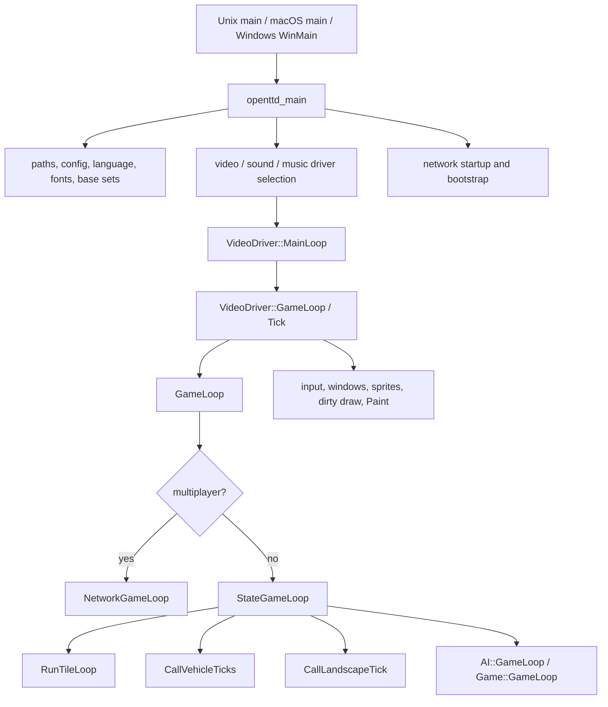
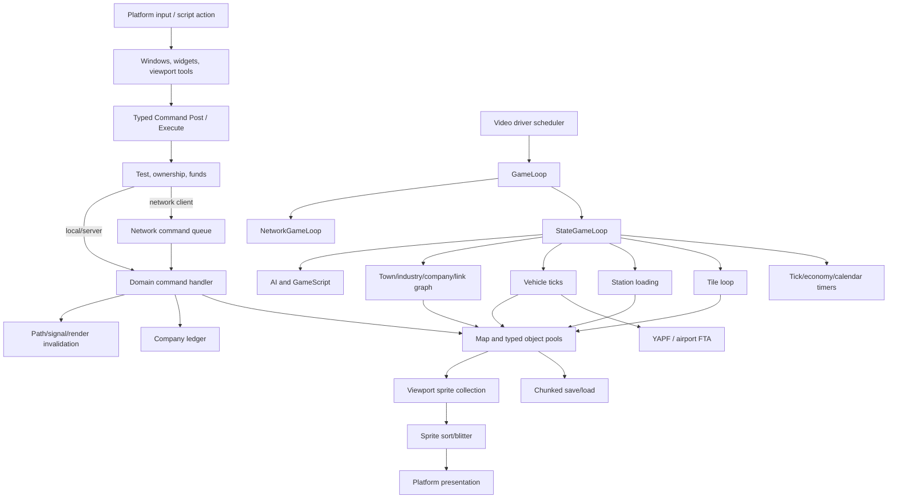
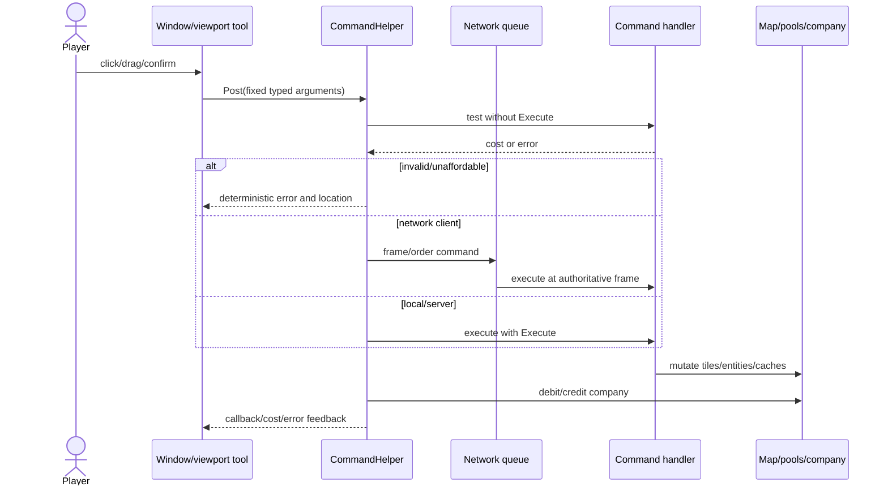
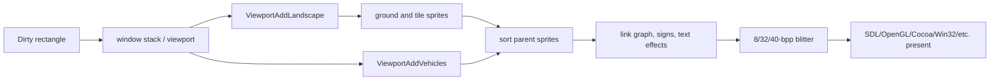
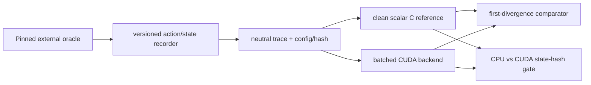
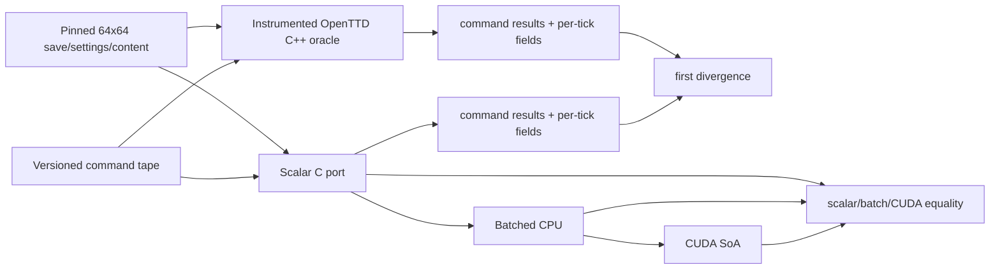
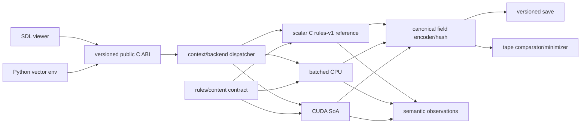

# OpenTTD reverse-engineering report and exact C/CUDA RL port plan

> **Superseded-target notice (2026-07-31):** The source research in this report
> remains historical technical evidence, but its selected exact C/CUDA gameplay
> port and road-freight MVP are no longer the active project target. The active goal
> is the actual-OpenTTD, 32 by 32 passenger-bus C++/CUDA PPO platform defined by
> `GOAL.md`. Any reuse requires the applicability review in
> `docs/project/LEGACY_P0_TRANSITION.md`.

Prepared: 2026-07-29 UTC  
Authoritative repository: <https://github.com/OpenTTD/OpenTTD>  
Analyzed branch: `master`  
Pinned commit: `29f808ef0022064e6d9a83c8476d1e0f4686af86`  
Selected MVP target: Linux x86-64, source-derived parity against the pinned
OpenTTD revision, scalar C17 reference backend, NVIDIA CUDA batch backend, Python
RL adapter, and side-by-side/null-render verification

## Scope, evidence, and legal boundary

This is one consolidated repository, product, implementation, and risk report.
Statements labeled **Observed** describe the pinned OpenTTD source or official
documentation. Statements labeled **Proposed** are new recommendations for a
smaller transportation-management RL environment. **Unverified hypothesis** is
reserved for claims that the available evidence did not establish.

For source findings, repository-relative paths refer to the pinned checkout. A
confidence label has this meaning:

- **High:** directly supported by a named source symbol, table, build rule, test,
  or official document.
- **Medium:** a reasoned architectural interpretation of several direct sources,
  or behavior configurable through content/settings.
- **Low:** insufficiently established; the report states what would verify it.

> **Practical licensing review, not legal advice.** OpenTTD's core is best treated
> as GPL-2.0-only. GPLv2 expressly includes translation to another language as a
> modification. A source-guided C or CUDA port is therefore a GPL derivative,
> not a permissively licensed clean-room implementation. CUDA linkage and binary
> redistribution require fact-specific review by qualified counsel.

> **Clean-room separation warning.** This report was produced by reading OpenTTD
> source and contains source paths, symbols, architecture, formulas, and internal
> behavior. It is an exposed-team research artifact, **not** a sanitized
> specification safe to hand to an independently licensed clean implementation
> team. If a non-GPL clean-room product is required, a legally reviewed exposed
> specification team must convert approved black-box observations into a separate
> behavior-only document for an unexposed implementation team.

> **User-selected project basis.** The project is private, educational and
> source-derived. Treat authorization/licensing as resolved for this engineering
> plan; legal independence is not a work gate. The technical acceptance target is
> exact behavior against the pinned OpenTTD source, not a legally distinct game.
> The small original `rules-v1` design later in this report is retained only as an
> optional C/CUDA plumbing harness. Its invented map, constants and economy are
> **not OpenTTD parity** and cannot satisfy the side-by-side gameplay goal.

The analysis resolved the brief's missing inputs as follows:

| Input | Resolution | Status |
| --- | --- | --- |
| Repository | `OpenTTD/OpenTTD` | Observed, High |
| Branch/revision | `master` at `29f808ef...` | Observed, High |
| Documentation | Repository README, `COMPILING.md`, `CONTRIBUTING.md`, `docs/`, source Doxygen inputs, official website/wiki | Observed, High |
| MVP platform | Linux x86-64 + NVIDIA CUDA, CPU fallback | Proposed from the user's C/CUDA RL objective |
| MVP stack | C17, CUDA C++, CMake/Ninja, Python + NumPy/PyTorch, retained OpenTTD C++ oracle executable | Proposed |
| MVP scope | One pinned 64×64 OpenTTD road-freight scenario replayed side by side with exact command/result/state parity; then broaden subsystem coverage | Proposed selected track |

---

# A. Executive Summary

## What OpenTTD is

OpenTTD is a mature open-source transport-management simulation inspired by
Transport Tycoon Deluxe. The player creates a company, constructs transport
infrastructure, purchases vehicles, assigns orders, carries passengers/mail and
industrial cargo, earns delivery revenue, pays construction and operating costs,
and expands a network in a continuing sandbox. It supports trains, road vehicles,
ships, aircraft, towns, industries, cargo distribution, multiplayer, AI,
GameScript, NewGRF content, long-lived save compatibility, and multiple platform
and rendering backends. Evidence: `README.md` §1; major types and commands in
`src/`; **Confidence: High**.

## Primary gameplay loop

The representative loop is:

1. choose a construction tool and select map tiles;
2. post a typed command that validates and prices the action;
3. execute the command atomically enough for its defined behavior and debit the
   company;
4. build stations/depots, buy a vehicle, and assign orders;
5. advance deterministic fixed simulation ticks;
6. route the vehicle across an implicit tile graph;
7. generate cargo, capture it at stations, load, move, and unload it;
8. accept final delivery, compute revenue, and credit the company;
9. render invalidated state and optionally save a versioned chunk stream.

The complete source trace is anchored in `src/road_gui.cpp`, `src/command_func.h`,
`src/command.cpp`, `src/road_cmd.cpp`, `src/station_cmd.cpp`,
`src/vehicle_cmd.cpp`, `src/roadveh_cmd.cpp`, `src/order_cmd.cpp`,
`src/pathfinder/yapf/yapf_road.cpp`, `src/economy.cpp`, and
`src/saveload/saveload.cpp`. **Confidence: High**.

## Major technical systems

- compact tile arrays with tile-type-specific behavior;
- stable typed IDs and global object pools for towns, industries, stations,
  companies, vehicles, orders, and cargo packets;
- typed commands with test, affordability, network-post, execute, accounting,
  and feedback phases;
- a fixed-step game loop with independent game-tick, economy, calendar, and
  realtime timer domains;
- mode-specific movement: YAPF for rail/road/ship and finite-state airport
  movement for aircraft;
- rail signals and path reservations;
- separate CargoDist station graphs and multicommodity-flow jobs;
- station capture/rating, cargo packet provenance, transfer accounting, and
  distance/time income;
- a custom windows/widgets/viewport/sprite/blitter stack;
- chunked, versioned persistence with pointer repair, compatibility tables, and
  post-load migrations;
- deterministic multiplayer command queues, Squirrel AI/GameScript, NewGRF, and
  signed native social integrations;
- CMake/CTest/CPack, broad platform CI, Catch2 unit tests, and executable Squirrel
  regressions.

## Hardest systems to recreate

The hardest areas are not rasterization alone. They are deterministic update and
RNG order; rail topology, signals, and reservations; variable cargo packets and
CargoDist; four distinct vehicle movement models; callbacks and content-driven
behavior; save migrations across decades; multiplayer determinism; and the large
UI/sprite/NewGRF compatibility surface. OpenTTD's mostly global, monolithic object
library also means apparent directory boundaries are not clean reusable library
boundaries. Evidence: `src/openttd.cpp::StateGameLoop`, `src/pathfinder/`,
`src/linkgraph/`, `src/saveload/`, `src/newgrf*`, `src/script/`, root
`CMakeLists.txt::openttd_lib`; **Confidence: High**.

## Selected exact-port approach

Keep the pinned OpenTTD executable/source as the external reference and port one
vertically complete 64×64 road-freight scenario to scalar C before CUDA. Record
the same validated OpenTTD commands, RNG/timer state, command results and an
explicit authoritative state projection after every tick; run the C port beside
OpenTTD and stop at the first differing field. Only after scalar C agrees should
the state move to environment-major/structure-of-arrays batched CPU storage and
then CUDA. Parallelize independent game instances first; retain exact ascending
pool/ID and phase order inside one world unless a proved transformation preserves
the same result.

Rendering is not part of the RL transition. The pinned OpenTTD renderer remains
available on the reference side for human diagnosis, while C/CUDA can run
headless with semantic observations and a minimal debug viewer. Turning off
rasterization does not remove command, simulation, pathfinding, cargo, economy,
save/reset or content work—the state transition is the real port.

Adopt the useful methodology demonstrated by
[`Infatoshi/netherite`](https://github.com/Infatoshi/netherite) at audited commit
[`3ebc6ccb6b9eaf3a5f720dd979987d60db9bf952`](https://github.com/Infatoshi/netherite/commit/3ebc6ccb6b9eaf3a5f720dd979987d60db9bf952): pinned oracle,
versioned action/state tapes, first-divergence debugging, CPU reference, separate
CPU/CUDA agreement, semantic observations, and layered gates. Do **not** copy its
code: its public repository has no clear project-wide reuse license. Also do not
repeat the claim that it is a finished exact Minecraft port; its pinned
[`docs/GATES.md`](https://github.com/Infatoshi/netherite/blob/3ebc6ccb6b9eaf3a5f720dd979987d60db9bf952/docs/GATES.md),
[`c/magma/PRODUCT.md`](https://github.com/Infatoshi/netherite/blob/3ebc6ccb6b9eaf3a5f720dd979987d60db9bf952/c/magma/PRODUCT.md), and
[`c/magma/OPEN_DIVERGENCES.md`](https://github.com/Infatoshi/netherite/blob/3ebc6ccb6b9eaf3a5f720dd979987d60db9bf952/c/magma/OPEN_DIVERGENCES.md) say full-game
fidelity and the 60-FPS renderer gate remain open. It retains custom C/CUDA
software rasterization for human/pixel verification while its RL mode can run
headless. **Confidence: High for documented structure/status; Medium for reported
benchmarks, which were not independently rerun.**

The user has selected the source-derived educational path. No clean-team split or
invented substitute economy is part of the selected acceptance target. Sections
E–K retain a deliberately tiny original `rules-v1` harness because it is useful
for validating ABI, batching, save and CUDA plumbing in isolation; it is a test
vehicle only. The project milestone called “OpenTTD parity” begins only when the
pinned OpenTTD and scalar-C runs agree on the declared projection and future
continuation for the same 64×64 scenario.

---


# B. Repository Fact Sheet

## Snapshot

| Field | Finding | Evidence | Confidence |
| --- | --- | --- | --- |
| Canonical repository | <https://github.com/OpenTTD/OpenTTD> | Official organization/repository | High |
| Default branch | `master` | GitHub metadata and symbolic `HEAD` | High |
| Pinned analysis revision | `29f808ef0022064e6d9a83c8476d1e0f4686af86` | Local Git object | High |
| Project version in pinned source | `16.0`; generated revision `20260729-master-g29f808ef00` | Root `CMakeLists.txt`; `cmake/scripts/FindVersion.cmake` | High |
| Latest stable at snapshot | 15.3, published 2026-04-04 | Official GitHub release/download metadata | High |
| License | OpenTTD core GPL version 2, best treated as GPL-2.0-only; file-specific third-party exceptions | `README.md` §3; `COPYING.md`; source headers; `src/3rdparty/**` | High |
| Primary language | C++20 | Root `CMakeLists.txt`, `CMAKE_CXX_STANDARD 20` | High |
| Supporting languages | C, Objective-C++, Squirrel, CMake, Python, HTML/JS, shell/PowerShell/batch, NFO data sources | Source tree and GitHub language data | High |
| Build/package tools | CMake 3.17+, Ninja/Make, native `strgen`/`settingsgen`, CTest, CPack, optional vcpkg | Root `CMakeLists.txt`; `cmake/`; `vcpkg.json` | High |
| Main platforms | Linux, macOS, Windows; actively built Emscripten target; source accommodations for BSD/Haiku | README, `src/os/`, `os/emscripten/`, CI workflows | High except BSD/Haiku Medium |
| GitHub repository size | 718,131 KiB metadata value | GitHub REST snapshot; not checkout size | High |
| Local shallow checkout | about 69 MiB including shallow Git data | `du -sh` | High |
| Tracked files | 1,879 total; 1,531 under `src/` | `git ls-files` | High |
| Physical C/C++/header lines | 476,054 | `wc -l` over tracked C/C++/header files | High |
| Build verification | GNU 13.3/CMake 3.28.3/Ninja dedicated RelWithDebInfo build succeeded; 98/98 CTest tests passed | Local build at pinned commit | High |
| Documentation | README/compile/contribution/style/license at root; `docs/`; generated Doxygen targets; official web/wiki | Repository inventory | High |

GitHub Linguist reported 13,249,884 bytes of C++, 1,417,718 C, 206,329
CMake, 178,090 Squirrel, 86,550 Objective-C++, and smaller HTML, Objective-C,
Awk, PowerShell, JavaScript, Python, Shell, Batch, and Dockerfile totals. These
are byte counts, not logical lines or component weights.

## Repository map

| Path | Responsibility | Important evidence | Confidence |
| --- | --- | --- | --- |
| `CMakeLists.txt` | Build composition, dependencies, executables/tests, platform links, packaging entry | `openttd_lib`, `openttd`, `openttd_test` | High |
| `README.md`, `COMPILING.md`, `CONTRIBUTING.md`, `CODINGSTYLE.md`, `COPYING.md` | Product, build, contribution, style, and license policy | Named sections | High |
| `.github/` | Platform CI, CodeQL, documentation/repository checks, releases and store uploads | `.github/workflows/*.yml` | High |
| `bin/` | Runtime AI/GameScript compatibility content, scripts, and base-set inputs | `bin/CMakeLists.txt` | High |
| `cmake/` | Source aggregation, options, find modules, generated data, regression and packaging logic | `SourceList.cmake`, `Options.cmake`, `InstallAndPackage.cmake` | High |
| `docs/` | Save, multiplayer, CargoDist, desync, directory, fonts and man-page documentation | `savegame_format.md`, `multiplayer.md`, `linkgraph.md`, `desync.md` | High |
| `media/` | Branding, platform media, and supplemental base-set sources | `media/CMakeLists.txt`, `media/baseset/` | High |
| `os/` | Emscripten, Steam/GOG, Windows installer/signing, macOS bundle/notarization | `os/*` | High |
| `regression/` | Four save-backed Squirrel executable regressions and expected output | `regression/CMakeLists.txt` | High |
| `src/` | Simulation, UI, platform drivers, networking, pathfinding, persistence, scripts, content, bundled libraries, tests | `src/CMakeLists.txt` and sources | High |
| `src/core/`, `src/timer/` | Generic containers/IDs/math/RNG/strings and clock domains | `pool_type.hpp`, `random_func.*`, timer headers | High |
| `src/network/` | Multiplayer commands, state sync, admin/content/coordinator/STUN/TURN and sockets | `network.cpp`, `network_command.cpp` | High |
| `src/pathfinder/yapf/` | Rail, road, and ship A*-family route finding and caches | `CYapfT`, mode implementations | High |
| `src/linkgraph/` | Cargo distribution graphs, demand and multicommodity-flow jobs | `LinkGraph`, `LinkGraphJob`, `LinkGraphSchedule` | High |
| `src/saveload/` | Chunk serializers, compatibility tables, loaders and post-load migrations | `SaveOrLoad`, `AfterLoadGame` | High |
| `src/script/`, `src/ai/`, `src/game/` | Squirrel VM, shared API, AI and GameScript specializations | `ScriptInstance`, `AI::GameLoop`, `Game::GameLoop` | High |
| `src/newgrf/` and `src/newgrf*.cpp` | NewGRF decode, callbacks, properties and graphics/content integration | `LoadNewGRF`, `DecodeSpecialSprite`, `SpriteGroup::Resolve` | High |
| `src/video/`, `src/blitter/`, `src/spriteloader/`, `src/fontcache/`, `src/widgets/` | Event loops, pixel backends, sprites/fonts, widgets | `VideoDriver`, `Blitter`, `ViewportDoDraw` | High |
| `src/tests/`, `src/3rdparty/` | Catch tests/mocks and bundled dependencies | `test_main.cpp`, component notices | High |

Most directories are organizational rather than binary isolation boundaries.
`cmake/SourceList.cmake::add_files` appends most production files to one
`openttd_lib` object library consumed by both the game and tests. A new project
should not reproduce that coupling merely because the directory names appear
modular. **Confidence: High**.

## Dependencies and platform notes

All normal builds require CMake 3.17+, a supported C++20 compiler, and threads.
Linux GUI builds require SDL2 or Allegro; a dedicated build avoids the GUI/font
stack. macOS requires Objective-C++ and Cocoa/QuartzCore/Audio frameworks.
Windows documentation targets Visual Studio 2022+. Emscripten uses a two-stage
native-tools then WebAssembly build.

Optional or feature-dependent dependencies include zlib, liblzma, liblzo2,
libpng, libcurl, Breakpad, FreeType/Fontconfig, HarfBuzz/ICU, FluidSynth,
OpusFile, SDL/Allegro audio, OpenGL/SSE, and GRFCodec/NFORenum. In practice,
liblzma and a graphics base set are required to run the checked-in regression
saves in this environment.

The verified local run used official OpenGFX 8.0 with SHA-256
`43a0c1dabf39cb865394f3a6cc36d4da5c10ecfaaf55652043104806810903be`.
A separate specialist build used OpenGFX 0.6.0 because that is the version pinned
by the analyzed CI workflow; it also passed all 98 tests. These are distinct
successful runs, not one conflated dependency claim.

## Entry points and runtime



Platform entry points are `src/os/unix/unix_main.cpp::main`,
`src/os/macosx/osx_main.cpp::main`, and
`src/os/windows/win32_main.cpp::WinMain`. They converge on
`src/openttd.cpp::openttd_main`, the composition root. The selected video driver
owns the outer event/scheduling loop; `GameLoop` chooses local or multiplayer
state progression. A normal tick targets 27 ms, adjusted by speed. Native SDL
can use a separate game thread; Emscripten uses `requestAnimationFrame`; the
dedicated and null drivers run headless variants. **Confidence: High**.

## Tests, CI, and packaging

- Catch2 provides `CATCH_CONFIG_MAIN`; CMake discovers individual cases into
  CTest. The pinned build registered 94 unit-style tests.
- Four serial regression suites run the real executable with checked-in saves,
  Squirrel scripts, null sound/music/video, and `-vnull:ticks=30000`, normalize
  output, and compare it with expected text.
- The 98/98 green run is valuable but not broad proof of complete gameplay,
  graphics, network, or save parity. Unit coverage is visibly utility-heavy.
- CI covers Emscripten; Linux Clang, GCC+SDL, and dedicated; macOS arm64, plus
  scheduled x86-64; Windows MSVC x86/x64, plus release arm64 and scheduled
  MinGW. Other workflows run CodeQL, Doxygen warning checks, and repository
  policy checks.
- No tracked sanitizer, coverage, clang-tidy, Cppcheck, or Valgrind workflow was
  found at the pinned revision. This bounded negative finding has **Medium**
  confidence.
- CPack/release automation emits macOS bundles, Windows ZIP/optional NSIS,
  Linux DEB/RPM/TXZ, Emscripten HTML/JS/WASM/data, and source archives, with
  upload workflows for the project CDN and distribution stores.

Local verification command:

```sh
cmake -S /workspace/openttd-upstream \
      -B /workspace/openttd-build \
      -G Ninja \
      -DOPTION_DEDICATED=ON \
      -DCMAKE_BUILD_TYPE=RelWithDebInfo
cmake --build /workspace/openttd-build --parallel 8
ctest --test-dir /workspace/openttd-build --output-on-failure
```

Result: **98/98 passed**. GCC 13.3 emitted one nonfatal
`-Wmaybe-uninitialized` warning for local `started` in
`src/road_gui.cpp::BuildRoadToolbarWindow::OnClick`; this is not evidence of a
runtime defect. Upstream remained clean. **Confidence: High for observations;
Low for any defect inference.**

Portable equivalent for a fresh checkout:

```sh
cmake -S <source> -B <build> -G Ninja \
      -DOPTION_DEDICATED=ON -DCMAKE_BUILD_TYPE=RelWithDebInfo
cmake --build <build> --parallel
ctest --test-dir <build> --output-on-failure
```

The executable regressions need an independently licensed graphics base set.
Download an official OpenGFX release separately, verify its published digest,
and extract its directory (including `opengfx.obg` and GRFs) beneath
`<build>/baseset/`; do not commit it into a new clean-room project's source.
The `/workspace` command above is retained only as reproducible evidence for this
instance.

## Issue-history and documentation audit

At the snapshot, GitHub search reported 8,885 total issues and 222 open. Example
label totals were 480 `bug`, 92 `component: pathfinder`, 1,409
`component: interface`, and 378 `component: NewGRF`. Imported FlySpray history is
present. Counts are time-varying, nonexclusive orientation signals—not quality
metrics. The persistent label domains align with the source's difficult
maintenance surfaces. **Confidence: High for the dated counts; Low for inferences
about quality from counts alone.**

A bounded, non-statistical history sample gives concrete orientation. States and
dates are the official issue records as observed on 2026-07-29; the “lesson” is
only the maintenance surface illustrated, not a quality or causation claim.

| Domain | Official issue/history | Snapshot status | Bounded lesson |
| --- | --- | --- | --- |
| Road pathfinding | [#15701, depot/bay first road tile omitted from YAPF cost/estimate](https://github.com/OpenTTD/OpenTTD/issues/15701) | Open; created 2026-06-12 | Depot access and cost accounting have tile-boundary edge cases—the MVP needs explicit access nodes and golden costs. |
| Interface | [#12465, cargo-line click/tooltip vertical misalignment](https://github.com/OpenTTD/OpenTTD/issues/12465) | Created 2024-04-09; closed 2025-12-26 | Rendering text and hit-testing are distinct UI responsibilities worth smoke-testing. |
| Multiplayer determinism | [#15188, desync on save plus collision](https://github.com/OpenTTD/OpenTTD/issues/15188) | Created 2026-01-28; closed 2026-02-24 | Save boundaries and event ordering can interact with deterministic simulation. |
| Save compatibility | [#12901, company allow-list serialized as an invalid table](https://github.com/OpenTTD/OpenTTD/issues/12901) | Created 2024-08-17; closed 2024-09-14 | Descriptor/schema errors justify malformed-fixture and round-trip coverage. |
| NewGRF/UI data | [#11127, dual-headed train capacity wrong in purchase menu](https://github.com/OpenTTD/OpenTTD/issues/11127) | Open; created 2023-07-11 | Content callbacks and presentation-derived values create a broad compatibility surface the MVP excludes. |

The official [2018 migration notice](https://www.openttd.org/news/2018/04/15/openttd-is-now-migrated-to-github)
confirms that earlier bugs were migrated from FlySpray, so issue numbers span more
than GitHub-native history. **Confidence: High for issue metadata; Medium for the
bounded architectural lessons.**

Important documentation inconsistencies at the pinned commit:

| Finding | Source evidence | Practical decision | Confidence |
| --- | --- | --- | --- |
| Compile guide says CMake 3.16; root requires 3.17 | `COMPILING.md`; root `CMakeLists.txt` | Require 3.17+ | High |
| “No libraries required” is too broad | Threads required; Linux GUI requires SDL2/Allegro; Apple frameworks required | Derive manifests from CMake/vcpkg | High |
| Release asserts prose disagrees with default | `OPTION_USE_ASSERTS` defaults ON independent of build type | Pin option explicitly | High |
| Supported-compiler prose is broader than flags logic | `cmake/CompileFlags.cmake` rejects unknown compiler families | Treat C/CUDA as new platform work | High |
| Desync docs use old `DoCommandP` symbols | Current API is templated `Command<...>::Post/Execute` | Preserve behavior, not stale names | High |
| Save-format document is deliberately incomplete | `docs/savegame_format.md`; actual `src/saveload/*_sl.cpp` | Do not implement loader from prose alone | High |
| `null:ticks=N` is real but undocumented as stable API | `src/video/null_v.cpp`; regression script | Useful pinned oracle only | High |
| README Monocypher path says `LICENSE.md`; file is `LICENCE.md` | README and actual third-party path | File-level notice scan required | High |
| License exception list is not exhaustive | BSD CMake modules and CC BY contribution text | Generate artifact-level SBOM/notices | High |
| Emscripten active but omitted from README platform list | CI and `os/emscripten/` | Treat as active build, not promised desktop release | High |
| macOS deployment floor differs | root says 10.15; workflows export 10.13 | Verify generated flags before promising 10.13 | Medium |

`CONTRIBUTING.md` explicitly rejects LLM-generated issue/PR text and entire
generated code lines. This AI-assisted work must not be submitted upstream in
violation of that policy. A separately maintained fork/project is required.

---


# C. Feature Specification Sheet

## Decision legend

- **Required:** necessary for the proposed first playable/RL release.
- **Simplified:** present with a deliberately smaller original rule set.
- **Deferred:** planned only after the MVP gates pass.
- **Excluded:** outside the initial product direction or a separate compatibility
  project.

The “rules” column distinguishes **Observed** OpenTTD behavior from **Proposed
harness** behavior. Proposed harness mechanics are not claims about OpenTTD and
use original terminology and constants. The two decision columns are normative:

- **Selected 64×64 exact-port slice:** source-derived parity against the pinned
  OpenTTD oracle. “Implemented” means every authoritative field and continuation
  checkpoint reached by the frozen fixture and command capability agrees; a
  feature is otherwise deferred, never silently simplified.
- **Optional rules-v1 harness:** the original 32×32 plumbing exercise. Its
  `Required/Simplified/Deferred/Excluded` labels, BFS, scalar cargo, abstract
  clock, and `RFSV` format are not OpenTTD-parity claims.

## World, economic, and transport features

| Feature | User value and workflow | Functional/data requirements | Rules, dependencies, and edge cases | Selected 64×64 exact-port slice | Optional rules-v1 harness | Source evidence / confidence |
| --- | --- | --- | --- | --- | --- | --- |
| Tile world and generation | Provides terrain on which the player connects a visible source and sink. The rules-v1 “new game” loads one original fixed scenario. | **Observed:** compact parallel `TileBase`/`TileExtended` arrays, tile-type metadata and procedure table, power-of-two dimensions. **Proposed:** fixed 32×32 flat row-major array with explicit terrain/obstacle, road mask and structure handle. | **Observed:** generation ordering and RNG are state-sensitive; runtime visits 1/256 of tiles per tick in deterministic LFSR order. **Proposed:** authored solvable map, reciprocal road edges, immutable obstacles, no slopes/procedural variation. Seed is accepted by the API but does not alter rules-v1 map content. | Exact `TileBase`/`TileExtended`, dimensions, tile-loop cursor/order, mutations, and invalidations for the frozen 64×64 fixture. Procedural generation is outside the first command capability because reset loads that fixture. | Simplified fixed 32×32 map. | `src/map.cpp::Map::Allocate`; `src/map_func.h::Tile`; `src/tile_cmd.h::TileTypeProcs`; `src/genworld.cpp::_GenerateWorld`; `src/landscape.cpp::RunTileLoop`. High. |
| Towns, passengers, and mail | In OpenTTD these create population demand. | **Observed:** `Town` pool, house tiles, population/growth/rating/history, passenger/mail generation. **Proposed:** none in rules v1. | **Observed:** house tile loops generate cargo and service affects growth. These mechanics and their content/UI are postponed until after the one-freight loop is complete. | Exact town/house pool fields, timer effects, ratings, and RNG consequences reached by the fixture and continuation tape. Passenger/mail actions and broader town construction are deferred. | Deferred. | `src/town.h::Town`; `src/town_cmd.cpp::TileLoop_Town`, `TownGenerateCargo*`, `GrowTown`, `UpdateTownGrowth`. High. |
| Industries and supply chains | Gives the freight origin, destination, and production objective. Player connects the fixed source to the fixed accepting sink. | **Observed:** pooled footprint, production level/counter, produced/accepted cargo slots and histories. **Proposed:** one immutable material source and one immutable sink, each one tile, with integer accumulator/stock/received fields. | **Observed:** normal output accrues on a 256-step counter; delivery can trigger conversion; NewGRF may override. **Proposed:** constant versioned production, binary sink acceptance, no closure/change or chain conversion. Capacity overflow is a deterministic error/terminal condition, never silent loss. | Exact pooled producer/consumer state, production/acceptance counters, histories, callbacks enabled by the frozen content profile, RNG, and timer effects for the selected freight pair. | Simplified fixed source/sink. | `src/industry.h::Industry`; `src/industry_cmd.cpp::ProduceIndustryGoods`, `TransportIndustryGoods`; `src/economy.cpp::DeliverGoodsToIndustry`, `TriggerIndustryProduction`. High. |
| Road construction | Lets a player create the transport graph. While paused, select one adjacent cardinal edge, preview price/error, and commit. | Command payload, validator, bounded mutation plan, reciprocal N/E/S/W edges, obstacle/structure checks, company ledger and topology revision. | **Observed:** commands use test then execute and mode-specific checks. **Proposed:** one edge per action; paused-only; quote equals debit; reject without mutation on bounds, diagonal, obstacle, duplicate edge or insufficient funds. Demolition and running-time topology change are P1. | Exact selected OpenTTD road-build command parameters, test/execute status and cost, tile bytes, ownership, ledger effects, and path/render cache invalidations on the fixture. | Required one-edge harness command. | `src/road_gui.cpp::BuildRoadToolbarWindow`; `src/road_cmd.cpp::CmdBuildLongRoad`, `CmdBuildRoad`; `src/command_func.h::CommandHelper`; `src/command.cpp`. High. |
| Terminals and catchment | Connects the fixed source/sink to the road and stores material. Place one pickup and one delivery terminal, inspect the queue, and serve them. | **Observed:** station facilities/catchment/acceptance, `GoodsEntry`, rating and loading vehicles. **Proposed:** exactly one pickup slot and one delivery slot; each structure occupies a distinct road-bearing tile, has radius-one Manhattan site catchment, a scalar queue and a stable handle. | **Observed:** rating/service/exclusivity split cargo. **Proposed:** pickup must be within radius one of the source, delivery within radius one of the sink, and trucks service a terminal only while on that terminal's tile; a second terminal of either role is rejected. No rating, decay, transfer, competing destination or removal. Edge: full queue, wrong role, missing road edge, structure overlap, disconnected route or stale handle. | Exact road-stop/station pools and IDs, catchment/acceptance, `GoodsEntry` data, ratings, timers, commands, and cache effects for the two fixture stops. | Simplified two scalar terminals. | `src/station_base.h::Station`, `GoodsEntry`; `src/station_cmd.cpp::MoveGoodsToStation`, `UpdateStationRating`; `src/economy.cpp::LoadUnloadStation`. High. |
| Depot/garage | Gives a valid purchase location and explicit vehicle lifecycle. Place a garage, buy a truck, start or stop it. | One garage handle/tile, company balance, fixed-capacity truck store. | **Observed:** depots enforce ownership and stopped conditions. **Proposed harness:** exactly one garage occupies a distinct road-bearing tile; purchase spawns a disabled truck on that tile; a second garage is rejected; no sale/removal in rules v1. Edge: missing road edge, pool full, stale garage, structure overlap or insufficient funds. | Exact road-depot construction, ownership, pool allocation/ID order, selected engine purchase, command cost/result, and initial vehicle state. | Required single garage. | `src/depot_base.h`; `src/road_cmd.cpp::CmdBuildRoadDepot`; `src/vehicle_cmd.cpp::CmdBuildVehicle`; `src/roadveh_cmd.cpp::CmdBuildRoadVehicle`. High. |
| Road trucks | Makes the network operate. Buy one of a single truck definition, assign two stops, start it, watch load/travel/unload, and pay running cost. | Stable handle, max eight slots, `enabled` scheduler flag, `TRAVELLING`/`DWELL`/`NO_ROUTE` phase, tile/direction/progress in 1/256 edge units, scalar cargo/age/trip distance, two orders and derived route cache. | **Observed:** road controller handles choices, stops/depots, crossings, overtaking and drive side. **Proposed:** speed 128 progress units/tick; start/stop idempotently sets `enabled` and preserves phase/progress; at most one edge/tick; multiple trucks may overlap; no traffic, collision, overtaking, breakdown, service or articulation. Episode outcome freezes all trucks globally. | Exact selected engine and road-vehicle pool/base fields, `RoadVehicle::Tick`/controller branches, positions, speeds, depot/station state, costs, age, breakdown settings, and RNG consequences reached by the tape. | Required reduced truck state machine. | `src/vehicle_base.h::Vehicle`; `src/roadveh_cmd.cpp::RoadVehicle::Tick`, `RoadVehController`; `src/vehicle.cpp::CallVehicleTicks`. High. |
| Orders and schedules | Converts a purchased vehicle into a repeating service. Select vehicle, add source and destination terminals, repeat, start. | Exactly two validated terminal handles per truck and a cursor; order-replacement command; route validity status. | **Observed:** many order kinds, flags, implicit/conditional/depot/waypoint/timetable behaviors. **Proposed harness:** exactly `[pickup, delivery]`, circular, installed atomically while the truck is disabled. Edge: stale handle, duplicate destination, reversed/wrong role, unreachable route or any length other than two. | Exact chosen OpenTTD order commands, pooled/shared order data and IDs, current/implicit order state, loading transitions, and timetable fields touched by the two-stop service. | Simplified circular two-stop list. | `src/order_base.h::Order`, `OrderList`; `src/order_cmd.cpp::ProcessOrders`, `CmdInsertOrder`; `src/vehicle.cpp::BeginLoading`, `HandleLoading`, `LeaveStation`. High. |
| Road routing | Finds deterministic paths after orders are assigned. A truck requests a route to its next terminal and may cache it. | Implicit four-neighbor graph, 1,024-entry BFS queue/predecessor scratch, topology revision and bounded derived route cache. | **Observed:** YAPF is an A*-family segmented search with mode costs/caches. **Proposed:** equal-cost BFS; visit N/E/S/W; mark on enqueue; first destination wins; no fallback movement; explicit `NO_ROUTE`. Trucks may overlap, so occupancy does not affect topology. Topology is immutable while running in rules v1. | Exact road YAPF/follow-track cost and tie policy, relevant settings, controller choice, and declared cache state/rebuild behavior for the fixture. | Simplified deterministic BFS. | `src/pathfinder/follow_track.hpp::CFollowTrackT`; `src/pathfinder/yapf/yapf_base.hpp::CYapfBaseT::FindPath`; `src/pathfinder/yapf/yapf_road.cpp::YapfRoadVehicleChooseTrack`. High. |
| Cargo production, loading, and delivery | Creates the central “build service, move material, earn” loop. Source produces, pickup queues, truck loads, travels and delivers. | Scalar source stock, terminal waiting, onboard amount/age, trip distance, cumulative produced/delivered and fixed load/unload limits. | **Observed:** `CargoPacket` tracks provenance/routing/transfer state; stations load before vehicle movement. **Proposed:** one cargo/source/sink; service only in `DWELL` and begins the tick after arrival; unload accepted material before loading; no lots/transfers/decay while waiting. Enforce `source + terminal + onboard + delivered == produced`. | Exact station goods and `CargoPacket` pool/IDs, provenance, age, source/destination, split/merge, load/unload order, acceptance, transfer flags, and packet conservation reached by the tape. | Required scalar cargo; no packets/transfers. | `src/cargopacket.h::CargoPacket`; `src/cargopacket.cpp`; `src/station_cmd.cpp::UpdateStationWaiting`; `src/economy.cpp::LoadUnloadVehicle`, `CargoPayment`. High. |
| Economy and company | Gives choices consequences and supplies RL reward/termination facts. Player pays to build/buy/move and receives delivery revenue. | Signed 64-bit balance, categorized cumulative build/purchase/run/revenue, delivered units, negative-balance counter, status/reason and raw result facts. | **Observed:** signed command costs centralize OpenTTD money; loans/interest/etc. use several cadences. **Proposed:** original versioned constants and integer distance/age payment; no credit, loan, inflation or subsidy. Checked arithmetic; quote=debit. Evaluate insolvency before win, then day-30 truncation; goal is 100 delivered while solvent. | Exact company pool/ID, money, loan, expense categories, command debits, cargo payment, infrastructure/running costs, score fields, and daily/monthly/yearly effects reached during continuation. | Simplified fixed ledger and invented terminal outcome. | `src/company_base.h::Company`; `src/company_cmd.cpp::SubtractMoneyFromCompany`; `src/economy.cpp::GetTransportedGoodsIncome`, `CompaniesPayInterest`. High. |
| Clock, pause, and game speed | Makes progression observable and reproducible; human can pause/speed up, RL can action-repeat. | Authoritative tick/day counters, canonical `PAUSED`/`RUNNING` mode, zero-cost run-control actions, fixed phase order and bounded repeat. | **Observed:** 27 ms nominal tick; 74 ticks/economy day; calendar/economy clocks differ. **Proposed:** abstract ticks, 32 ticks/day, `repeat=1..256`; run-control actions never advance a tick, `SINGLE_STEP` advances exactly one tick while remaining paused, and ordinary actions advance ticks only in `RUNNING`. Rendering cadence never affects state. | Exact native game-tick, economy/calendar clocks, timer queues/counters, pause mode, update order, RNG streams, and tick-boundary command timing. Wall-clock pacing and rasterization stay outside the transition. | Simplified 32-tick/day abstract clock. | `src/gfx_type.h::MILLISECONDS_PER_TICK`; `src/timer/timer_game_tick.h::Ticks`; `src/openttd.cpp::StateGameLoop`; `src/video/video_driver.cpp`. High. |
| Score, goal, and episode end | Makes “playable” and RL evaluation finite. Show 100-unit progress, balance and day; terminate or truncate with a reason. | Delivered counter, balance, negative-balance counter, deadline, terminated/truncated flags, unshaped metrics and versioned wrapper reward. | **Observed:** base play is sandbox; high-score chart does not generally stop simulation; GameScript controls goals. **Proposed harness:** insolvency is termination, 100 delivered while solvent is win, day 30 is truncation, checked in that order. Terminal state accepts reset/save/query/import only. | Preserve OpenTTD's sandbox/goal state exactly. RL termination, truncation, and reward are versioned wrapper projections over raw state and cannot mutate the simulator. | Required harness-only 100-unit goal. | `src/goal_base.h::Goal`; `src/goal.cpp`; `src/economy.cpp::_score_info`; `src/highscore_gui.cpp::ShowEndGameChart`; `src/game/game_core.cpp`. High. |

## Advanced transport and compatibility features

| Feature | User value and workflow | Functional/data requirements | Rules, dependencies, and edge cases | Selected 64×64 exact-port slice | Optional rules-v1 harness | Source evidence / confidence |
| --- | --- | --- | --- | --- | --- | --- |
| Rail, signals, and reservations | Enables dense high-capacity networks with trains and traffic control. | Trackdirs, consists, signal state/type, reservation bits/spans, safe destinations, rollback and cache invalidation. | Signals are not one Boolean per tile; block/PBS traversal, diagonal conflicts, platforms, depots and tunnel/bridge spans matter. Construction and movement must reserve/release safely. Very high deadlock/divergence risk. | Deferred; the frozen fixture and command capability contain no trains, rail, signals, or reservations. | Deferred. | `src/train_cmd.cpp::Train::Tick`, `TryPathReserve`; `src/signal.cpp::ExploreSegment`, `UpdateSignalsInBuffer`; `src/pbs.cpp`; rail YAPF. High. |
| Ships, aircraft, bridges, tunnels, slopes | Broadens network planning and geography. | Water-region graph/locks/docks; airport FTA/block occupancy; linked spans; height/slope rules and distinct vehicles. | Each mode is a separate movement model. Aircraft do not use inter-airport tile YAPF. Special tiles couple rendering, construction, movement and save state. | Deferred; absent entities and excluded commands are asserted in fixture validation. Terrain/slope fields that affect selected road commands remain exact. | Deferred. | `src/ship_cmd.cpp`; `src/pathfinder/yapf/yapf_ship.cpp`; `src/airport.h`, `src/airport.cpp`, `src/aircraft_cmd.cpp`; `src/tunnelbridge_cmd.cpp`. High. |
| CargoDist and transfers | Lets cargo choose network-wide destinations and transfers. | Per-cargo station `LinkGraph`, service-derived capacity/usage/time edges, demand model, asynchronous jobs, `FlowStat` next-hop shares and packet feeder accounting. | Modified shortest paths/multicommodity flow; deterministic job join/pause points; stale links split graphs. Transfers create virtual feeder attribution, not immediate cash. | Exact only if enabled by the frozen settings/content and reached by the tape; the initial fixture freezes it off. Cargo-packet fields remain exact. | Deferred. | `src/linkgraph/*`; `src/station_base.h::FlowStatMap`; `src/economy.cpp::CargoPayment::PayTransfer`. High. |
| Town growth, industry change, technology, failures | Makes long games evolve. | House/road growth, industry production/closure, engines/introduction/reliability, breakdown/service, inflation/recession. | Several calendar/economy/tile cadences and RNG streams; NewGRF callbacks may replace rules. Large balancing and determinism surface. | Exact for every timer, engine, company, town, industry, vehicle, and RNG effect reached during the fixture's declared continuation; the fixture/settings deliberately bound the reachable surface. | Deferred. | `src/town_cmd.cpp`; `src/industry_cmd.cpp`; `src/engine.cpp`; mode daily/calendar handlers; `src/economy.cpp`. High. |
| Competitor AI and GameScript goals | Adds opponents and scenario logic. | Sandboxed VM, deterministic scheduler/resource budget, command/query API, serialization and event model. | AI is server authoritative and issues normal commands; GameScript can run in some paused states and controls goals/story/league. | Deferred and frozen disabled in the source fixture. The parity extractor asserts no script instances or script-issued commands. | Deferred. | `src/script/`; `src/ai/ai_core.cpp::AI::GameLoop`; `src/game/game_core.cpp::Game::GameLoop`. High. |
| Multiplayer | Enables synchronized cooperative/competitive games. | Authoritative server, framed/ordered command queues, deterministic RNG/state, auth/content sync, chat/admin/network protocols and desync tooling. | Commands are distributed then executed in frame order. Any iteration/RNG/float divergence desynchronizes clients. An RL MVP gains little from this early risk. | Excluded from the initial library capability; oracle and port execute a single local authoritative command stream. | Excluded. | `docs/desync.md`; `src/network/network.cpp::NetworkGameLoop`; `src/network/network_command.cpp`. High. |
| Persistence and configuration | Saves progress and reproduces episodes. Player names slot, saves at a tick boundary, reloads and continues. | **Observed:** 71 chunk handlers, current version 366, compression, pointer fixups, compatibility and after-load migrations. **Proposed:** original small chunked/checksummed format, staging load, atomic replace, rules/content hashes. | Save only canonical state; omit caches/UI/device pointers. Reject newer/invalid files without changing live state. Future trajectory after load must match, not only immediate bytes. No OpenTTD compatibility. | Exact reset from a hashed canonical fixture plus a future-complete parity snapshot/projection and continuation equivalence. Native OpenTTD save import/export and migrations are deferred until that boundary is proven. | Required new `RFSV` harness format only. | `src/saveload/saveload.cpp::SaveOrLoad`, `SlSaveChunks`, `SlFixPointers`; `src/saveload/saveload.h::SaveLoadVersion`; `src/saveload/afterload.cpp::AfterLoadGame`; `src/settings.cpp`. High. |
| Human UI and debug renderer | Makes the environment a playable product as well as an RL library. One screen supplies map, HUD, construction, truck/orders, inspector and save/load. | SDL2 top-down semantic view, public-ABI-only data, complete keyboard path, mouse convenience, price/error preview, accessible focus/text/non-color cues. | Renderer never mutates state or consumes simulation RNG. Whole-viewport redraw is acceptable. Viewer is required for MVP acceptance but remains an optional dependency of the headless core. | OpenTTD oracle may run null-video for tapes or normal video for side-by-side diagnosis. The C/CUDA RL transition is headless; a semantic parity inspector consumes only exported state. | Simplified SDL debug viewer. | `src/window_gui.h`; `src/window.cpp`; `src/viewport.cpp`; `src/main_gui.cpp`; `src/gfx.cpp`. Observed architecture High; proposed view Medium. |
| Sprite/palette/asset compatibility | Gives OpenTTD its established visual/content ecosystem. | GRF sprite decode, indexed/32-bpp/zoom/recolor, palette animation, fonts, cache, sortable world layers, licensed assets. | This is decades of compatibility and expressive content, not core transport behavior. Use original shapes/colors/names and separate asset provenance. | Excluded from the RL transition and parity projection. The oracle/reference client uses the frozen OpenGFX content hash; pixel parity is not a gate. | Excluded. | `src/viewport.cpp::ViewportDoDraw`; `src/blitter/`; `src/spriteloader/grf.cpp`; `src/spritecache.cpp`; `src/palette.cpp`; `src/fontcache/`. High. |
| NewGRF, mods, content downloader, social plugins | Adds vehicles, industries, graphics, callbacks, scripts and platform integration. | Content identity/hash, callbacks, mapping/save schema, VM or public data schema, signed downloads/plugins and permissions. | NewGRF changes behavior and data, not only visuals. Native plugins are security/platform surfaces. Start with internal validated data definitions, not a public compatibility promise. | Disabled/excluded by the frozen initial content profile. Later profiles are separate parity capabilities with their own tapes and hashes. | Excluded/deferred. | `src/newgrf.cpp::LoadNewGRF`; `src/newgrf/`; `src/newgrf_spritegroup.*`; `src/network/network_content_gui.cpp`; `src/social_integration.cpp`. High. |
| Localization, audio, extensive settings | Improves reach and polish. | Translatable original strings, text shaping/fonts, audio assets/drivers, settings migration and UI. | Do not copy OpenTTD text/font/sound/music. MVP should keep a small settings set and externalize strings so later localization is possible. | Audio/localized presentation is outside the transition. Every simulation-affecting setting is frozen and hashed; the debug viewer exposes stable technical labels. | Deferred except essential debug text. | `src/lang/`; `src/fontcache/`; `src/sound/`; `src/music/`; `src/settings.cpp`. High. |

## Normalized observed-system interface matrix

This matrix makes the prompt's requested inputs, outputs, state transitions,
cadence, dependencies and failure surfaces explicit even for deferred systems.
It summarizes the pinned OpenTTD implementation and then states both decisions so
that “first slice” cannot mean two different projects.

| Observed subsystem | Player workflow/value | Inputs | State / transition / update cadence | Outputs | Dependencies | Errors and edge cases | Selected 64×64 exact-port slice | Optional rules-v1 harness | Evidence / confidence |
| --- | --- | --- | --- | --- | --- | --- | --- | --- | --- |
| Map and world generation | Choose climate/size/seed and receive terrain to connect | Settings, seed, heightmap/scenario/content callbacks | Allocate power-of-two tile planes; generation stages populate them; runtime LFSR visits 1/256 tiles/tick | Tiles, heights, water/objects/towns/industries and invalidations | RNG, settings, NewGRF, town/industry generators | Invalid dimensions, generation abort/restart, unsatisfied placement, content-dependent results | Exact frozen map planes, tile-loop state/order, and reached mutations; generator excluded by fixture reset. | Simplified fixed 32×32 map. | `src/map.cpp::Map::Allocate`; `src/genworld.cpp::_GenerateWorld`; `src/landscape.cpp::RunTileLoop`. High. |
| Towns, houses, passengers and mail | Serve settlements and influence growth | House/town state, station service, settings, RNG, callbacks | House tile loops generate cargo; timer callbacks update growth, ratings and histories | Population, cargo offers, authority effects and demand | Tiles, stations, cargo, economy, NewGRF | No eligible station, poor ratings, build limits, growth blocked by terrain/network | Exact fixture-reached town/house fields, timer/RNG effects, and authority consequences; broader town/passenger/mail actions deferred. | Deferred. | `src/town.h::Town`; `src/town_cmd.cpp::TileLoop_Town`, `TownGenerateCargo`, `GrowTown`. High. |
| Industries and production | Connect producers/consumers and move supply-chain cargo | Industry type/layout, accepted deliveries, production counters, RNG/callbacks | Tile/daily/monthly callbacks alter production, stock/history and closure | Produced cargo, acceptance, production changes | Map, stations, cargo, economy, NewGRF | Invalid layout, no station/catchment, closure, saturated cargo offer, callback variation | Exact fixture producer/consumer pools, production/acceptance/history, timers, callbacks, and RNG. | One simplified fixed source/sink. | `src/industry.h::Industry`; `src/industry_cmd.cpp::ProduceIndustryGoods`, `TransportIndustryGoods`. High. |
| Construction/demolition | Select road/rail/water/airport/bridge/tunnel tool and drag/click tiles | Command parameters, company/owner, geometry, settings, funds | Test/price then execute command; mutate tiles/infrastructure and invalidate caches/views | Network topology, structures, exact `CommandCost`, UI result | Commands, tile procedures, ownership, economy, path caches | Bounds/slope/ownership/vehicle obstruction, incompatible track, pool/funds limit, command-specific partial rules | Exact selected road/station/depot command status, cost, map/pool/ledger mutation, and invalidation. | Road additions only. | `src/command_func.h::CommandHelper`; `src/command.cpp`; `src/road_cmd.cpp`; `src/rail_cmd.cpp`; `src/tunnelbridge_cmd.cpp`. High. |
| Stations, stops, docks, airports and depots | Place access/facility nodes, buy/service vehicles and inspect waiting cargo | Facility command, tiles, owner, catchment, nearby acceptance | Pools/tiles link facilities; acceptance/rating/link cleanup run at fixed cadences; depots gate build/service | Facility handles, waiting goods, acceptance, vehicle spawn/service points | Map, towns/industries, cargo, vehicles, economy | Overlap/ownership/catchment/facility limits, invalid airport layout, stale IDs, no access path | Exact two road stops and depot: pool/ID order, tiles, catchment, acceptance, goods, ratings, timers, ownership, and commands. | Two scalar terminals plus one garage. | `src/station_base.h::Station`; `src/station_cmd.cpp`; `src/depot_base.h`; `src/airport.cpp`. High. |
| Road vehicles | Buy in depot, assign orders, start and watch service | Engine/company/depot, orders, road graph, per-tick speed/controller state | `RoadVehicle::Tick` updates controller, path choice, stops/loading and daily costs/age | Position/status/cargo/profit, route/cache and ledger effects | Orders, roads/YAPF, stations, economy | No route, wrong road/owner, depot/station entry, one-way/crossing/overtake/breakdown cases | Exact selected engine plus all vehicle/controller fields, branches, timers, costs, and RNG reached by command and continuation tapes. | Required reduced truck state machine. | `src/roadveh_cmd.cpp::RoadVehicle::Tick`, `RoadVehController`; `src/vehicle.cpp::CallVehicleTicks`. High. |
| Trains/signals/reservations | Build consists and signal dense rail service | Rail topology, consist/order, signal/reservation state, speed/physics | Train tick follows track, reserves/releases paths and responds to blocks/signals | Consist position, reservations, signal state, cargo/profit | Rail map, YAPF, PBS, stations/economy | Deadlock, reservation conflict, consist length/platform/turning/depot and crash cases | Deferred; fixture validator requires no rail entities/infrastructure and command registry exposes none. | Deferred. | `src/train_cmd.cpp::Train::Tick`, `TryPathReserve`; `src/signal.cpp`; `src/pbs.cpp`. High. |
| Ships and aircraft | Route water/air services between facilities | Orders, water regions/locks/docks or airport FTA/layout blocks | Mode tick advances ship path or aircraft finite-state movement; daily/calendar upkeep | Position/block occupancy, cargo/profit and effects | Mode map/facilities, orders, economy | No dock/airport path, lock/canal constraints, occupied airport block, range/crash states | Deferred; fixture validator requires no ship/aircraft entities or exposed commands. | Deferred. | `src/ship_cmd.cpp`; `src/pathfinder/yapf/yapf_ship.cpp`; `src/aircraft_cmd.cpp`; `src/airport.cpp`. High. |
| Orders, schedules and vehicle routing | Add destinations/conditions/depots/timetables and repeat service | Order commands, destination IDs, vehicle type/state, network graph | Atomic list edits; each vehicle processes current/implicit order; mode pathfinder selects/caches successors per need | Current target/order state, path/cache, lateness/service behavior | Vehicles, stations/depots/waypoints, YAPF/mode controllers | Invalid/stale target, incompatible facility, shared-list edits, conditional loops, no route/cache invalidation | Exact chosen two-stop OpenTTD order commands/state plus native road YAPF/follow-track/controller policy and declared caches. | Two-stop order plus deterministic BFS. | `src/order_base.h::Order`; `src/order_cmd.cpp::ProcessOrders`, `CmdInsertOrder`; `src/pathfinder/`. High. |
| Cargo capture, packets, transfers and CargoDist | Generate, queue, load, transfer and finally deliver demand | Source production, catchment/rating, packet provenance, vehicle capacity/orders, link graphs | Production offers cargo; station loading precedes vehicle movement; packets split/merge; async link jobs update flows | Waiting/onboard/delivered units, feeder share, revenue and network demand | Towns/industries, stations, vehicles, link graph, economy | No acceptance/service, full capacity, stale links, transfer attribution, content callback and rounding cases | Exact station goods, packet pool/IDs and fields, split/merge, provenance/age, loading order, acceptance, delivery, and payment for the frozen profile. | One scalar cargo; no packets/transfers. | `src/cargopacket.h::CargoPacket`; `src/station_cmd.cpp::MoveGoodsToStation`; `src/economy.cpp::LoadUnloadVehicle`; `src/linkgraph/`. High. |
| Company economy, loans and scoring | Build/buy/operate, borrow/repay, inspect accounts and performance | Command costs, deliveries, vehicle/infrastructure costs, settings/calendar | Commands and cargo payments post entries; daily/monthly/yearly callbacks apply costs, interest, inflation, bankruptcy and score | Balance/loan/expenses/profit/value/performance/bankruptcy | All build/vehicle/cargo systems and timers | Insufficient funds, overflow bounds, bankruptcy, subsidy/maintenance/content variants | Exact company/ledger, command cost, cargo revenue, expenses, loans, score, and reached daily/monthly/yearly transitions. | Reduced fixed ledger and invented outcome. | `src/company_base.h::Company`; `src/company_cmd.cpp::SubtractMoneyFromCompany`; `src/economy.cpp`. High. |
| Time, technology and failures | Change speed/pause and progress vehicles/engines/world | Wall-clock scheduler, game/economy/calendar timers, settings/RNG | Central fixed game ticks; economy/calendar domains trigger distributed updates, engine introduction/aging and failures | Dates, tick counters, available engines, aged/broken entities | Main loop, timer queues, vehicles, economy, AI/scripts | Pause/modal/network branches, long-game counter boundaries, differing calendar/economy clocks | Exact native tick/economy/calendar counters and callback order, engine/failure state reached under frozen settings, pause semantics, and RNG streams. | One abstract 32-tick/day clock. | `src/openttd.cpp::StateGameLoop`; `src/timer/`; `src/engine.cpp`; mode command files. High. |
| AI, GameScript, goals and sandbox | Run competitors/scenarios or continue open-ended play | Script VM code, deterministic budget/events, command/query APIs | Scheduler resumes/suspends instances; scripts issue normal commands and serialize state; base game generally has no terminal win | Competitor actions, goals/story/league state and events | Commands, simulation, Squirrel, save/network authority | Script errors/time budget, missing content/API version, multiplayer authority, no base-game terminal | AI/GameScript frozen disabled; preserve OpenTTD sandbox facts exactly and derive RL reward/outcome only in a non-mutating wrapper. | Deferred except fixed 100-unit goal. | `src/script/`; `src/ai/ai_core.cpp::AI::GameLoop`; `src/game/game_core.cpp::Game::GameLoop`; `src/goal.cpp`. High. |
| UI, input and rendering | Navigate viewport/windows, choose tools, inspect feedback and see changes | SDL/native events, window focus/widgets, camera/zoom, dirty blocks, sprites/fonts | Event loop dispatches window callbacks and posts commands; viewport composes sortable sprites and blitter presents dirty regions | Commands, selection/tool state, pixels, text/sound feedback | Public game state/commands, video/blitter, assets/fonts/localization | Modal/focus/capture, edge scrolling/zoom transforms, hit-test/render mismatch, missing assets/fonts | Null-video oracle for traces, normal OpenTTD for side-by-side diagnosis, and an ABI-only semantic inspector after headless 64×64 parity. Pixels are not a gate. | One independent semantic viewer. | `src/window.cpp::MouseLoop`; `src/viewport.cpp::HandleViewportClicked`, `ViewportDoDraw`; `src/gfx.cpp::DrawDirtyBlocks`. High. |
| Persistence, settings and migrations | Save/load games and configure behavior | Canonical/pool state, settings, save version/compression, file I/O | Chunk handlers serialize; load allocates then fixes references and runs version migrations/post-load rebuild | Save file, restored state, settings and load errors | Every persisted subsystem, compression, platform filesystem | Truncation/corruption, unsupported version/chunk, stale references, migration/content mismatch, async write failure | Hashed canonical fixture reset, future-complete authoritative projection/snapshot, derived-cache policy, and equal continuation; native save compatibility deferred. | New bounded `RFSV` harness format. | `src/saveload/saveload.cpp::SaveOrLoad`; `src/saveload/afterload.cpp::AfterLoadGame`; `src/settings.cpp`. High. |
| Multiplayer and desync control | Join/host synchronized games and exchange commands/chat/admin | Network frames, server settings/content, client commands, RNG/state | Server orders commands and frames; clients execute deterministic state; checks/logs diagnose divergence | Shared world, acknowledgements, snapshots/desync evidence | Commands, save transfer, content identity, sockets/security | Version/content mismatch, packet/auth errors, lag/timeout, desync from any nondeterminism | Excluded; single local authority only. Desync-style state hashes and first-divergence tools are reused offline. | Excluded. | `src/network/network.cpp::NetworkGameLoop`; `src/network/network_command.cpp`; `docs/desync.md`. High. |
| NewGRF, scripting/content download and native integrations | Extend content/behavior and connect platforms | GRF/script/plugin/content metadata, callbacks, download/signature/config | Load/resolve mappings and callbacks; scripts/plugins execute through versioned APIs; mappings persist | New objects/rules/graphics/scripts/content/plugin effects | Loader/cache, VM, network content, save mappings, platform ABI | Missing/incompatible/corrupt content, callback differences, signature/API mismatch, native security risk | Excluded by frozen base-content profile; each later profile requires its own exact capability, hashes, oracle tapes, and gates. | Excluded/deferred. | `src/newgrf.cpp::LoadNewGRF`; `src/script/`; `src/network/network_content_gui.cpp`; `src/social_integration.cpp`. High. |
| Localization, fonts, audio and settings UI | Read/control the game across languages and receive feedback | String tables, language/plural/gender rules, text shaping/fonts, sound/music drivers | Generated language packs resolve strings at draw time; drivers mix/play effects/music; settings UI posts changes | Localized text/glyphs, sound/music, persisted preferences | Build generators, GUI, platform drivers, assets | Missing glyph/font/audio device, clipping/RTL/plural cases, unsupported setting migration | Presentation excluded from transition; simulation-affecting settings are frozen/hashed and the inspector uses stable technical labels. | Deferred except essential debug text. | `src/lang/`; `src/fontcache/`; `src/sound/`; `src/music/`; `src/settings_gui.cpp`. High. |

## Observed vanilla revenue reference

This formula is documented only to explain OpenTTD's economic behavior. It is
**not** the proposed clean-room MVP formula and should not be handed directly to
an unexposed implementation team without legal/spec review.

For accepted units `n`, travelled distance `d`, scaled transit periods `t`, cargo
thresholds `p1/p2`, and current payment `P`, the ordinary linear branch is:

```text
over1       = max(t - p1, 0)
over2       = max(over1 - p2, 0)
time_factor = max(255 - over1 - over2, 31)
income      = (d * time_factor * n * P) >> 21
```

An asymptotic branch applies after a computed lateness boundary, and NewGRF may
replace the calculation. Capacity and station rating affect throughput/capture,
not the vanilla per-unit formula directly; acceptance gates payment. Evidence:
`src/economy.cpp::GetTransportedGoodsIncome`; **Confidence: High for vanilla,
Medium under arbitrary content**.

---


# D. System Architecture

## Observed OpenTTD architecture

OpenTTD is source-organized but operationally monolithic: platform entry points,
driver factories, a global application/game state, typed commands, domain pools,
timers, and a large object library cooperate through direct calls and shared
state. The diagrams are dependency/call views, not claims of strict layering.



### Client, scheduler, and simulation

`openttd_main` composes paths/config/content, language/fonts, drivers and
network/bootstrap state, then calls the selected `VideoDriver::MainLoop`.
`VideoDriver::Tick` handles input/windows/drawing, while `GameLoop` advances
network or local state. In normal local mode `StateGameLoop` executes an ordered
fixed step. SDL may run the game state on a separate thread under a mutex; the
authoritative transition remains the same shared state. Evidence:
`src/openttd.cpp::openttd_main`, `GameLoop`, `StateGameLoop`;
`src/video/video_driver.cpp::Tick`, `GameThread`; **Confidence: High**.

The authoritative normal-mode phase order is:

```text
1. link-graph pause/control and paused/modal branch
2. cache checks; enter persistent-storage game-loop mode
3. animated tiles
4. calendar vehicle-day callback when due
5. economy timer, then game-tick timer
6. RunTileLoop (deterministic 1/256 map batch)
7. CallVehicleTicks
   a. distributed economy-day vehicle work
   b. every station LoadUnloadStation in pool order
   c. every vehicle Tick in pool order; onboard cargo aging
8. CallLandscapeTick
   town -> trees -> stations -> industries -> companies -> link graph
9. leave persistent-storage mode
10. AI::GameLoop, Game::GameLoop
11. limits, window tick events, news
```

Timer callbacks can affect movement/production in the same tick; loading occurs
before vehicle movement; pool/ID iteration order is observable. Evidence:
`src/openttd.cpp::StateGameLoop`, `src/vehicle.cpp::CallVehicleTicks`,
`src/landscape.cpp::CallLandscapeTick`; **Confidence: High**.

### Input and command architecture

SDL events become common cursor/key state in
`VideoDriver_SDL_Base::PollEvent`; `MouseLoop` dispatches to windows/widgets or
viewport placement; a construction window posts `Command<id>::Post`.
`CommandHelper` performs a non-execute test/cost pass, ownership/network/funds
handling, and the execute pass. Successful results reach company accounting and
feedback. Scripts use the same command concept through generated APIs.



Evidence: `src/video/sdl2_v.cpp::PollEvent`; `src/window.cpp::MouseLoop`;
`src/viewport.cpp::HandleViewportClicked`; `src/command_func.h::CommandHelper`;
`src/command.cpp::InternalExecuteValidateTestAndPrepExec`,
`InternalExecuteProcessResult`; **Confidence: High**.

#### Observed UI inventory

| Surface family | Principal workflow | Representative evidence | Confidence |
| --- | --- | --- | --- |
| Title/main menu and scenario launch | Start/load/scenario/network/options/content entry | `src/intro_gui.cpp`; `src/genworld_gui.cpp`; `src/network/network_gui.cpp` | High |
| Main game viewport/toolbars/status | Pan/zoom/select company tools, time/speed, news and map objects | `src/main_gui.cpp`; `src/viewport.cpp`; `src/statusbar_gui.cpp`; `src/window.cpp` | High |
| Construction palettes/pickers | Choose road/rail/water/airport/landscape tools, drag/place, preview cost/error | `src/road_gui.cpp`; `src/rail_gui.cpp`; `src/dock_gui.cpp`; `src/airport_gui.cpp`; `src/terraform_gui.cpp` | High |
| Vehicle/depot/orders/timetable | Buy/clone/refit/start vehicles, inspect consist/profit and edit schedules | `src/build_vehicle_gui.cpp`; mode GUIs; `src/vehicle_gui.cpp`; `src/order_gui.cpp`; `src/timetable_gui.cpp` | High |
| Station/town/industry/company | Inspect waiting/accepted cargo, authority/production, finances/infrastructure | `src/station_gui.cpp`; `src/town_gui.cpp`; `src/industry_gui.cpp`; `src/company_gui.cpp`; `src/economy.cpp` | High |
| Maps, graphs and lists | Navigate minimap, network/cargo overlays, performance/company/cargo lists | `src/smallmap_gui.cpp`; `src/linkgraph/`; `src/graph_gui.cpp`; list GUIs | High |
| Save/load/settings/help | Persist games, change settings/keys and read errors/help | `src/fios_gui.cpp`; `src/settings_gui.cpp`; `src/querystring_gui.h`; `src/error.h` | High |
| Multiplayer/content/scripts/social | Join/admin/chat, manage NewGRF/downloads, AI/GameScript/debug integrations | `src/network/`; `src/newgrf_gui.cpp`; `src/network/network_content_gui.cpp`; `src/script/`; `src/social_integration.cpp` | High |

#### Reduced viewer wireframe and focus model

```text
+--------------------------------------------------------------------------+
| Day/tick | PAUSED/RUNNING | Balance | Delivered 000/100 | [Save] [Help]  |
+----------+-----------------------------------------------+---------------+
| Tools    |                                               | Inspector     |
| Road     |          scrollable/zoomable 32x32 map        | tile/road     |
| Pickup   |          keyboard cursor + focus outline      | structure     |
| Delivery |          source/sink/truck shapes + labels    | truck/orders  |
| Garage   |                                               | queue/cost    |
| Truck    |                                               | preview/error |
+----------+-----------------------------------------------+---------------+
| Persistent event/error log | current command hint | speed 1x/4x/16x   |
+--------------------------------------------------------------------------+
```

Focus order is top status/actions -> tools -> map -> inspector -> event log.
`Tab`/`Shift+Tab` traverse regions and visible controls; focus never relies only
on color. The map owns one keyboard tile cursor. Camera pan/zoom changes viewer
state only; tile selection becomes integer coordinates before a public preview.
The viewer redraws from queries after every result and never edits model memory.

| Input | Viewer behavior | Public command/query |
| --- | --- | --- |
| Arrow keys/WASD; `+`/`-` | Pan camera; zoom around cursor; cursor remains labeled/in bounds | Queries only; no canonical mutation |
| `B`, then Enter on endpoint A/B | Select/preview/commit one cardinal road edge | `BUILD_ROAD_EDGE`; invalid preview remains visible |
| `P`, `D`, or `G`, then Enter | Preview/commit pickup, delivery or garage at cursor | `BUILD_TERMINAL(role)` / `BUILD_GARAGE` |
| `T` | Focus garage/truck list; buy or choose truck | `BUY_TRUCK`; indexed garage/truck queries |
| `O` | Edit exact pickup/delivery pair and confirm atomically | `SET_TWO_STOP_ROUTE` |
| `R` | Set selected truck enabled/disabled explicitly | `START_STOP_TRUCK(enabled)` |
| Space | Set global paused/running mode | `SET_RUN_MODE` with `repeat=1` |
| `.` while paused | Advance exactly one tick | `SINGLE_STEP` with `repeat=1` |
| `1`, `2`, `3` | Viewer scheduler requests 1x/4x/16x wall-clock pacing; state still advances by explicit `NOOP` repeats | `NOOP`; result `ticks_advanced` shown |
| Escape | Cancel active tool/selection, return focus | No command |
| Ctrl+S / Ctrl+O | Atomic save / validated transactional import | snapshot size/export/import |
| Mouse click/wheel/drag | Optional equivalent cursor/focus/pan/zoom path | Same preview/command path as keyboard |

Pointer hit testing uses the same screen-to-tile transform as the cursor overlay;
tests cover zoom/pan borders and the historical class of draw/hit-test mismatch.
Construction preview shows quoted cost or stable error text and failed tile;
commit displays the returned status, `ticks_advanced`, ledger delta and new hash.

### Data model

The map is compact parallel tile storage whose byte meanings depend on tile
type. Domain objects use typed IDs and pools. Vehicles can form linked consists,
orders can be shared, cargo packets preserve provenance and routing/transfer
state, and several derived caches are maintained incrementally. This design is
memory-efficient and compatibility-rich but makes global iteration order,
allocation/free-list behavior, pointer repair, and contextual bit decoding part
of practical determinism. Evidence: `src/map_func.h`, `src/map_type.h`,
`src/core/pool_type.hpp`, `src/vehicle_base.h`, `src/order_base.h`,
`src/cargopacket.h`; **Confidence: High**.

### Transportation networks

There is no universal graph:

- rail/road/water connectivity is derived from tile bits as directed trackdirs;
- rail overlays signal state and per-track reservations;
- airports use static finite-state transitions and occupied block bitsets;
- CargoDist builds independent directed station graphs from observed service.

YAPF is an A*-family best-first search with mode-specific successor/cost/heuristic
mixins and caches. Rail/road searches can compress deterministic stretches into
segments; ships use a two-level water-region path. Evidence:
`src/pathfinder/follow_track.hpp`, `src/pathfinder/yapf/`, `src/airport.*`,
`src/linkgraph/`; **Confidence: High**.

### Rendering architecture

OpenTTD is not a conventional 3D engine. Tile draw procedures and vehicles emit
ground, parent, and child sprites; parents are sorted by overlapping world-space
bounds; overlays and strings follow; a selected custom blitter writes a backing
store; the platform video backend presents dirty regions.



The OpenGL backend can upload/present custom blitter output; OpenTTD's world is
still primarily a sprite composition pipeline. Evidence:
`src/viewport.cpp::ViewportDoDraw`, `ViewportAddLandscape`,
`ViewportSortParentSprites`; `src/blitter/base.hpp`; `src/gfx.cpp::DrawDirtyBlocks`;
`src/video/`; **Confidence: High**.

### Persistence

The current save begins with a compression tag (`OTTD`, `OTTN`, `OTTZ`, or
`OTTX`) and big-endian version, then a decompressed chunk stream. Handlers use
descriptors and version conditions; pools are loaded then references fixed;
`AfterLoadGame` performs cross-object migrations and cache reconstruction.
Saving first creates a consistent in-memory dump, then may compress/write on a
worker thread. Version 366 and 71 concrete chunk declarations at the pinned
commit illustrate the compatibility scope; neither count is a proposed new
format. Evidence: `src/saveload/saveload.cpp`, `src/saveload/saveload.h`,
`src/saveload/afterload.cpp`, `src/saveload/compat/`; **Confidence: High**.

### Networking

Multiplayer distributes validated commands through framed queues and advances a
deterministic shared state. `_random` is for authoritative state and
`_interactive_random` for non-state work. Desync tooling can dump/replay command
logs in custom builds. Determinism is an actively maintained invariant, not a
formal cross-compiler proof. Evidence: `docs/desync.md`,
`src/network/network_command.cpp`, `src/core/random_func.hpp`,
`src/network/network_func.h`; **Confidence: High**.

### Scripting, modding, and platform abstraction

Squirrel AI and GameScript instances receive controlled APIs, suspend around
commands, run at defined scheduler points, and serialize a restricted object
graph. NewGRF scanning/activation alters graphics, vehicles, cargos, houses,
industries, stations, types, callbacks, strings and sounds, and records identity
in saves. Signed native social plugins use a versioned C API. Platform-specific
process, video, sound, music, file and packaging code converges on shared game
logic. Evidence: `src/script/`, `src/ai/`, `src/game/`, `src/newgrf*`,
`src/social_integration.cpp`, `src/os/`, `src/video/`; **Confidence: High**.

### Testing architecture

Testing has four layers in the repository:

1. utility-focused Catch2 cases linked against production objects;
2. save/script/output regressions driven through the executable and null drivers;
3. cross-platform build/test CI plus CodeQL and documentation/policy checks;
4. project-specific desync/debug dumps available through custom flags.

It lacks an in-tree public C ABI, environment reset/step contract, canonical
state tensor/hash API, CPU/CUDA comparator, or formal RL benchmark. Those are new
requirements, not dormant library features. Evidence: root `CMakeLists.txt`,
`src/tests/`, `regression/`, `.github/workflows/`; **Confidence: High**.

## Representative end-to-end workflow trace

| Step | Source trace | Result | Confidence |
| ---: | --- | --- | --- |
| 1 | `src/road_gui.cpp::BuildRoadToolbarWindow::OnClick` | Player selects road/station/depot tool. | High |
| 2 | `OnPlaceObject`, `OnPlaceDrag`, `OnPlaceMouseUp` | Viewport creates drag preview and posts typed command. | High |
| 3 | `src/command_func.h::CommandHelper`, `src/command.cpp` | Command tests validity/cost/funds before execute/network. | High |
| 4 | `src/road_cmd.cpp::CmdBuildLongRoad`, `CmdBuildRoad` | Road bits/owner/type and infrastructure counters mutate; tile becomes dirty. | High |
| 5 | `src/company_cmd.cpp::SubtractMoneyFromCompany` | Company is debited and ledger/UI updated. | High |
| 6 | `src/video/video_driver.cpp::Tick`, dirty draw path | Later render reflects the mutation. | High |
| 7 | `src/station_cmd.cpp::CmdBuildRoadStop`; `src/road_cmd.cpp::CmdBuildRoadDepot` | Stops and depot are constructed through the same command protocol. | High |
| 8 | `src/build_vehicle_gui.cpp`; `CmdBuildVehicle`; `CmdBuildRoadVehicle` | A stopped hidden road vehicle is allocated in the depot. | High |
| 9 | `src/order_gui.cpp::OrdersWindow::OnPlaceObject`; `src/order_cmd.cpp::CmdInsertOrder` | Validated station orders enter the vehicle's list. | High |
| 10 | `src/openttd.cpp::StateGameLoop`; `src/vehicle.cpp::CallVehicleTicks`; `RoadVehicle::Tick` | Timers, station loading and movement advance. | High |
| 11 | `src/pathfinder/yapf/yapf_road.cpp::CYapfRoad::ChooseRoadTrack` | Route search selects/caches a path. | High |
| 12 | `ProduceIndustryGoodsHelper` or `TownGenerateCargo` -> `MoveGoodsToStation` | Cargo is generated and offered to eligible stations. | High |
| 13 | `src/economy.cpp::LoadUnloadVehicle`; `VehicleCargoList::Unload` | Cargo is reserved, loaded, transferred/kept/delivered and unloaded. | High |
| 14 | `DeliverGoods`; `GetTransportedGoodsIncome` | Acceptance/statistics and income are calculated. | High |
| 15 | `CargoPayment::~CargoPayment` -> negative `CommandCost` | Company receives cash and vehicle-revenue accounting. | High |
| 16 | `ShowSaveLoadDialog`; `SwitchToMode`; `SaveOrLoad`; `SlSaveChunks` | State becomes a versioned compressed save. | High |

## Architecture lessons for the new project

Retain the design ideas of a single authoritative tick, validated commands,
stable state ownership, read-only rendering, separate path/cargo services,
versioned persistence, replayable actions, and explicit cache invalidation. Do
not translate OpenTTD's contextual tile bytes, global pools, source names,
callback tables, formulas, or save format into a supposedly independent project.

The Netherite reference strengthens the verification design:



Pinned Netherite method evidence: its
[`README.md`](https://github.com/Infatoshi/netherite/blob/3ebc6ccb6b9eaf3a5f720dd979987d60db9bf952/README.md),
[`c/magma/VERIFY.md`](https://github.com/Infatoshi/netherite/blob/3ebc6ccb6b9eaf3a5f720dd979987d60db9bf952/c/magma/VERIFY.md),
[`scripts/bootstrap_oracle.sh`](https://github.com/Infatoshi/netherite/blob/3ebc6ccb6b9eaf3a5f720dd979987d60db9bf952/scripts/bootstrap_oracle.sh), and
[`netherite_sweep.sh`](https://github.com/Infatoshi/netherite/blob/3ebc6ccb6b9eaf3a5f720dd979987d60db9bf952/netherite_sweep.sh).
These support the workflow claim, not permission to reuse code or independent
confirmation of its reported benchmark results.

For a truly clean-room OpenTTD-inspired build, source-exposed researchers must
not hand this architecture report directly to clean implementers. Counsel should
approve an oracle stimulus/state boundary and a separately authored neutral
trace schema. The direct unmodified OpenTTD null driver may be useful for private
experiments, but `null:ticks=N` is undocumented internal behavior and OpenTTD
does not expose a stable complete state observation API.

---


# E. Core Data Model

## Observed OpenTTD model

| Entity | Purpose and important fields | Relationships, ownership, lifecycle | Persistence | Evidence / confidence |
| --- | --- | --- | --- | --- |
| Map / tile | `TileIndex`; dimensions; `TileBase` 8-byte record plus `TileExtended`; contextual type/height/metadata | Global `Map` owns parallel arrays; tile-type accessors/procedures interpret fields; lifetime is game world | Map planes use multiple save chunks | `src/tile_type.h`; `src/map_type.h`; `src/map_func.h`; `src/map.cpp::Map::Allocate`. High. |
| Town | Center, population/house/zone caches, growth, ratings, supplied/accepted histories, effects/goals | Pooled stable typed ID; houses/stations/industries/cargo sources refer to it | `CITY` handlers and migrations | `src/town.h::Town`; `src/saveload/town_sl.cpp`. High. |
| Industry | Footprint/type/town, production counters/levels, produced/accepted slots and histories | Pooled; consumes accepted cargo, produces output, tracks nearby stations | `INDY`, `IBLD`, `ITBL` and compatibility data | `src/industry.h::Industry`; `src/saveload/industry_sl.cpp`. High. |
| Station | Sign/town/owner/facilities/footprint plus stops/airport/dock/catchment/accepted cargo | `Station` extends `BaseStation`; vehicles visit; `GoodsEntry` owns waiting cargo/flows | `STNN`, `ROAD`, related chunks | `src/base_station_base.h`; `src/station_base.h`. High. |
| Company | Money, loan, infrastructure, bankruptcy/build limits, AI metadata, statistics/expenses | Pooled owner of vehicles/infrastructure; command/delivery ledger mutates it | `PLYR`, economy/cargo-payment chunks | `src/company_base.h::Company`; `src/saveload/company_sl.cpp`. High. |
| Vehicle | Chain links/shared orders, tile/exact coordinates, speed/progress, owner/engine, cargo/capacity, status/order, age/reliability/value/profit | Pooled base plus train/road/ship/air subclasses; train consists link records | `VEHS` plus domain compatibility | `src/vehicle_base.h::Vehicle`; mode headers; `src/saveload/vehicle_sl.cpp`. High. |
| Route / path cache | Not one persisted universal entity: mode-specific route cache/trackdir state and rail reservations | Derived from tile graph, orders and topology; invalidated on change | Mostly derived/rebuilt; reservation state lives in map/vehicles | `src/pathfinder/`; `src/roadveh.h`; `src/train_cmd.cpp`; `src/pbs.cpp`. High. |
| Order / order list | Type/flags/destination/refit/wait/travel/max speed and list aggregates | `OrderList` owns vector; vehicles may share it; current/implicit indices drive state | `ORDL`, legacy `ORDR`/`BKOR` | `src/order_base.h`; `src/order_type.h`; `src/saveload/order_sl.cpp`. High. |
| Cargo packet | Count, transit, source/tile/first station, travelled displacement, feeder share, next hop | Station/vehicle cargo lists split/merge/stage packet units through routing and payment | `CAPA` and cargo/link chunks | `src/cargopacket.h::CargoPacket`; `src/saveload/cargopacket_sl.cpp`. High. |
| Economy state | Prices/payment factors, inflation, recession/subsidies, company ledgers and histories | Global/settings plus company/domain fields; multiple timer cadences | `ECMY`, `CAPY`, company chunks | `src/economy.cpp`; `src/economy_type.h`; `src/saveload/economy_sl.cpp`. High. |
| Calendar/timers | Tick, economy date, calendar date, realtime and interval timer queues | Global clock domains; tick is authoritative, economy/calendar may diverge | `DATE`, settings and random chunks | `src/timer/`; `src/saveload/misc_sl.cpp`. High. |
| Game/script goals | Company/global scope, destination/text/progress/completion; story/league state | GameScript/deity commands own scenario goals; base game may remain sandbox | `GOAL`, story/league/script chunks | `src/goal_base.h`; `src/goal.cpp`; associated saveload files. High. |

Pool IDs, slot/free-list allocation, iteration order, fractional accumulators and
RNG state can affect future behavior. Replacing these structures with unordered
containers in an exact derivative changes practical determinism. This does not
mean a new original game must copy them.

## Proposed rules-v1 logical model

The logical field schema is normative. CPU may use array-of-structs and CUDA may
use structure-of-arrays. Neither raw layout, padding nor pointer value is part of
the save/hash/API contract. Every entity store is fixed-capacity; allocation
chooses the lowest free slot; public handles combine slot and generation.

| Entity | Purpose / authoritative fields | Relationships and ownership | Lifecycle | Serialization requirements |
| --- | --- | --- | --- | --- |
| `rf_game` (`GameState`) | Rules/content hashes, canonical `PAUSED`/`RUNNING` mode, `rf_clock`, `rf_world`, company, episode and fixed stores | Owned by one environment/context; root of all logical state; outcome/status exists only in `rf_episode` | Reset constructs paused; terminal state allows reset/save/query/import only | Encode every named logical field in explicit order; never raw bytes |
| `rf_world` (`World`) | Width=32, height=32, 1,024 row-major tiles, topology revision | Owned by game; sites are immutable; commands add roads/structures | Created from project-owned fixed scenario; no resize | Dimensions/revision/all tile fields; no render/path scratch |
| `rf_tile` (`Tile`) | Terrain/obstacle kind, four reciprocal road bits, structure kind/slot, reserved-zero bits | Value in world array; structure slot points into terminal/garage stores | Lifetime equals world; road/structure additions only in v1 | Fixed-width fields; validate opposite road edges and reserved bits |
| `rf_site` (`Industry` replacement) | Producer/sink kind, tile, cargo type; source owns production accumulator, stock and `produced_total`; sink owns `received_total` | Exactly two immutable scenario sites; pickup/delivery terminals query radius-one proximity; `received_total` is the sole canonical delivered counter | Reset initializes; production/delivery mutate counters | Encode kind/tile and role-valid counters in site ID order; absent-role fields encode zero |
| Deferred `Town` | Not present in v1; future settlement/population/passenger system | Would be a new original entity, not a hidden alias of the fixed sink/source | P1 or later decision | No reserved save/API compatibility promised now |
| `rf_terminal` (`Station`) | Two fixed slots: one `PICKUP`, one `DELIVERY`; generation, road-bearing tile and waiting material units | Tile points to slot; role/site catchment is fixed; truck order points by handle | Command-created once per role; a second of either role rejects; no removal | Occupancy/generation/fields in slot order; stale references reject load |
| `rf_garage` | One fixed slot with generation and road-bearing tile | Tile points to slot; purchase command targets handle; bought truck spawns on this tile | Command-created once; a second rejects; no removal | Same stable slot encoding |
| `rf_truck` (`Vehicle`) | Slot/generation; `enabled` flag; phase `TRAVELLING`, `DWELL` or `NO_ROUTE`; tile/direction; progress in 1/256 edge units; capacity/onboard; cargo-age ticks; trip distance; two orders/cursor | Owned by game, max eight; `enabled` gates truck updates while phase describes resumable motion/service; refers to terminal handles; route cache derived | Purchased disabled at garage; start/stop idempotently sets `enabled`; no sale; episode outcome globally freezes it | Encode all logical fields except cached route; validate enabled/phase/order combinations |
| `rf_route_cache` (`Route`) | Topology revision, destination handle, bounded tile/direction sequence and cursor | One derived cache per truck; uses read-only world | Rebuild on missing/stale cache; topology frozen while running in v1 | Excluded from canonical bytes/save; rebuilding must not change future state |
| `rf_order` / fixed order pair | Destination terminal handle and implicit role expectations | Exactly two entries per configured truck: pickup then delivery, circular | Atomically replaced only while truck is disabled | Encode handles/cursor; validate role, distinctness and liveness |
| Cargo state (`CargoPacket` replacement) | Source stock/`produced_total`, pickup queue, per-truck onboard amount/age/distance and sink `received_total` | Canonical counters live only on site/terminal/truck records; company/episode/observations derive delivered units from sink; no dynamic packet or transfer graph | Production, capture, load, carry, final delivery | Encode scalar locations and counters; enforce conservation equation |
| `rf_company` (`EconomyState`) | Signed 64-bit balance and cumulative categorized build/purchase/run costs and revenue | Exactly one company; commands and tick ledger supply checked deltas; delivered metrics are a derived view of sink `received_total` | Reset opens balance; terminal freezes normal actions | Fixed widths; ledger identity must reconstruct current balance exactly |
| `rf_clock` (`CalendarState`) | Tick, day, tick-in-day, public action-step counter | Owned by game; one clock only | Tick increments after semantic phases; 32 ticks/day | Encode exact counters; no wall-clock/UI time |
| `rf_episode` | Goal=100, deadline=30×32 ticks, sole termination/truncation status/reason, negative-balance counter | Reads company/clock and sink `received_total`; owns outcome precedence and all outcome state | Reset active; after each tick may become terminal | Required in save/hash, including grace counter and reason |
| `rf_action` | ABI version/size, opcode/flags, six fixed 32-bit operands | Ephemeral public input; command planner consumes it | Applied once before repeated ticks | Stable tape encoding, not save state |
| `rf_mutation_plan` | Quoted cost, bounded tile/entity writes, optional created handle | Ephemeral command scratch | Validator either fills completely or returns error; executor cannot partly validate | Record result in diagnostic tapes only |
| `rf_step_result` | Error/flags, balance and delivered deltas, created handle, terminal flags/reason, state hash | Ephemeral public output | One per environment per public step | Trace evidence, not save state |

### Normative invariants

- reciprocal road edges always agree across adjacent tiles;
- every live handle resolves to an occupied matching-generation slot;
- exactly zero-or-one pickup, zero-or-one delivery and zero-or-one garage exist;
  each live structure occupies a distinct, road-bearing, role-valid tile and
  never overlaps an immutable site;
- run mode is exactly `PAUSED` or `RUNNING`; reset is paused and terminal outcome
  freezes tick-advancing actions;
- truck `enabled`/phase/order/progress fields form one valid combination only;
- `source.stock + pickup.waiting + sum(truck.onboard) + sink.received_total
  == source.produced_total`; every other delivered/produced metric is derived;
- `opening_balance + revenue - build - purchase - running == balance`;
- an occupied truck has one phase; `enabled` is an orthogonal scheduler gate,
  not a duplicate stopped state;
- mutation loops use ascending slot ID;
- every capacity or arithmetic failure is deterministic and non-undefined;
- canonical encoding is field-by-field little-endian and excludes padding,
  pointers, caches, UI, render, device and scratch state.

---


# F. Simulation Rules

## Observed OpenTTD clocks and phase rules

- Nominal native game tick: 27 ms, adjusted by speed scheduling.
- Ordinary economy day: 74 ticks.
- Economy and calendar clocks are distinct; calendar time can be slowed/frozen.
- `StateGameLoop` runs timer callbacks before tile/vehicle/landscape work.
- `RunTileLoop` visits `Map::Size()/256` tiles per tick, so each ordinary tile is
  visited once per 256 ticks in deterministic order.
- `CallVehicleTicks` performs distributed economy-day work, then every station's
  load/unload, then every vehicle tick in pool order.
- `CallLandscapeTick` updates towns, trees, stations, industries, companies and
  link graphs; AI/GameScript follow the core tick.

Evidence: `src/gfx_type.h`, `src/timer/timer_game_tick.h`,
`src/openttd.cpp::StateGameLoop`, `src/landscape.cpp::RunTileLoop`,
`src/vehicle.cpp::CallVehicleTicks`; **Confidence: High**.

### Observed cadence inventory

| Cadence | Work | Evidence | Confidence |
| --- | --- | --- | --- |
| Every active tick | Timers, tile batch, station loading, all vehicle ticks, landscape domains, AI/GameScript | `StateGameLoop`, `CallVehicleTicks`, `CallLandscapeTick` | High |
| 70-tick base | Town growth machinery, modified by town state | timer constants, `src/town_cmd.cpp` | High |
| 74 ticks/economy day | Distributed daily vehicle/industry work | timer constants, vehicle/industry code | High |
| 185 ticks | Station rating cycle; usual onboard cargo-age cache period | station/vehicle constants and code | High |
| 250 ticks | Station acceptance refresh | `STATION_ACCEPTANCE_TICKS`, `OnTick_Station` | High |
| 256 ticks | Every tile once; normal industry output accrual | `RunTileLoop`, `ProduceIndustryGoods` | High |
| 504 ticks | Stale station-link cleanup | `STATION_LINKGRAPH_TICKS` | High |
| Economy month/quarter | Interest, maintenance, bankruptcy, town/industry/history; company value/performance | economy interval callbacks | High |
| Calendar day/month/year | Vehicle/engine aging, introduction, inflation, end-year chart | vehicle/engine/economy/high-score code | High |

### Observed movement, loading, cargo, and economy

| Rule area | Observed rule | Evidence / confidence |
| --- | --- | --- |
| Vehicle movement | Each mode's `Tick` advances controller state each game tick; road/rail/ship use directional tile connectivity/YAPF variants; aircraft use airport FTA/block occupancy. | Mode `src/*_cmd.cpp`, `src/pathfinder/yapf/`, and airport sources. High. |
| Route validity | Successors derive from tile metadata; ownership/type, one-way, signals/reservations and special tiles can reject transitions; caches are invalidated by topology/destination changes. | `src/pathfinder/follow_track.hpp`, mode map/path sources. High. |
| Loading/unloading | Offered every tick before vehicle movement; stages delivery, transfer, keep and load, respecting orders/capacity/reservations. | `src/vehicle.cpp::CallVehicleTicks`; `src/economy.cpp::LoadUnloadStation`, `LoadUnloadVehicle`. High. |
| Cargo generation | Houses/industries produce integer amounts with fixed-point/remainder/RNG/content rules and offer them to catchment stations. | `src/town_cmd.cpp::TownGenerateCargo*`; `src/industry_cmd.cpp`; `src/station_cmd.cpp::MoveGoodsToStation`. High. |
| Acceptance | Station/nearby tile cargo acceptance and facility/service rules gate station capture and final delivery; station rating controls capture/decay. | station/economy/tile procedure sources. High. |
| Revenue | Accepted amount × distance × cargo payment × time factor, with a late asymptotic branch, subsidy multipliers and possible NewGRF callback. | `src/economy.cpp::GetTransportedGoodsIncome`, `DeliverGoods`. High vanilla; Medium arbitrary content. |
| Costs | Commands debit quoted costs; vehicles accrue daily running cost; optional infrastructure maintenance is nonlinear; monthly interest/inflation/etc. add longer cadence flows. | `src/command.cpp`, `src/company_cmd.cpp`, `src/economy.cpp`, mode cost handlers. High. |
| Construction | Test pass validates/prices; execute pass mutates; top-level result checks funds, applies accounting, then invalidates related state. Command-specific partial semantics exist. | `src/command_func.h`, `src/command.cpp`, mode commands. High. |
| Failures | Insufficient funds/ownership/invalid geometry/pool limits return command errors; pathfinding may fail; bankruptcy handling is monthly. Base sandbox usually continues indefinitely. | command, pathfinder, economy/company sources. High. |
| Town/industry | Town growth and industry production/change depend on service, delivered cargo, settings, RNG and callbacks at several cadences. | `src/town_cmd.cpp`; `src/industry_cmd.cpp`; `src/economy.cpp`. High, Medium with arbitrary content. |

## Proposed rules-v1 simulation contract

These rules are original product decisions. Exactness means scalar C, CPU batch,
save/load continuation and CUDA produce the same canonical logical state—not that
they match OpenTTD.

### Frozen rules-v1 map and content

The following table is the normative **Proposed** rules-v1 content, not an
OpenTTD observation. Freezing it here closes the numeric and geometry choices a
new team otherwise could not implement consistently.

| Item | Rules-v1 value |
| --- | --- |
| Coordinates | 32×32, zero-based; `(0,0)` northwest; tile index `y * 32 + x`; N/E/S/W are `(0,-1)/(+1,0)/(0,+1)/(-1,0)` |
| Terrain/sites | All tiles are flat/buildable except immutable source `(4,16)` and sink `(27,16)` site tiles; outside-map coordinates are impassable |
| Known winning geometry | Road-bearing tiles `(5,16)` through `(26,16)` joined by 21 reciprocal edges; pickup `(5,16)`, garage `(6,16)`, delivery `(26,16)` |
| Structure rules | Exactly one pickup, one delivery and one garage; distinct tiles; each placement requires at least one existing road edge on its tile; road remains traversable under the structure |
| Site catchment/service | Pickup must be Manhattan distance ≤1 from source; delivery ≤1 from sink; service requires the truck's tile to equal the terminal tile |
| Clock/outcome | 32 ticks/day; 960-tick deadline; win at 100 delivered units while solvent |
| Fixed capacities | 8 trucks; 20 units/truck; 256 units/pickup queue; 1,024 units/source stock; two terminal slots; one garage slot; 1,024 route tiles |
| Production/service | production `1/1` unit/tick; capture 4, load 4 and unload 4 units/tick |
| Motion | one edge = 256 progress units; speed = 128 progress units/advancing tick; subtract 256 on crossing; at most one crossing/tick |
| Opening economy | balance 500; road edge 5; each terminal 25; garage 30; truck 100; moving tick 1 per truck whose progress advances |
| Revenue | unit value 2; age grace 128 ticks; value denominator 32; minimum value numerator 16; integer formula below |
| Insolvency | loss after 32 consecutive completed ticks with balance `< 0`; reset the counter to zero whenever balance is `>= 0` |

Site tiles cannot receive roads or structures. A road edge may be added only
between two buildable cardinal neighbours. Terminal/garage placement never
creates connectivity; it consumes a structure slot on an already road-bearing
tile. Later paused road additions may add another edge to that tile, but rules v1
has no edge deletion. The golden geometry costs `21*5 + 2*25 + 30 + 100 = 285`,
leaving 215 before movement; it is therefore constructible from the opening
balance. Alternate valid road geometry is allowed and is deliberately covered by
the pathfinder/economy rather than hard-coded.

For the named geometry, a direct phase calculation gives a three-unit first
delivery on tick 46 and five later 20-unit deliveries by tick 516: 103 units,
well before tick 960. Setup leaves 215; the first trip spends 44 moving ticks
before receiving 126, so it never enters insolvency. Each later full load earns
840 before age discount and has ample running-cost margin. Immediately after the
tick-516 unload, the exact checkpoints are balance 4,077, pickup queue 256,
source stock 157 and conservation `157 + 256 + 0 + 103 = 516`. These are
mandatory golden-vector checkpoints, not performance estimates.

Golden tape labels refer to state **after** the numbered tick completes:

| Post-tick | Truck tile/progress and phase | Queue / onboard / age / loaded distance | Balance / delivered | Canonical check |
| ---: | --- | --- | --- | --- |
| 0 (after paused setup/start) | garage `(6,16)`, `0`, enabled `TRAVELLING` | `0 / 0 / 0 / 0` | `215 / 0` | freeze `H0` |
| 1 | `(6,16)`, `128`, travelling west | `1 / 0 / 0 / 0` | `214 / 0` | freeze `H1` |
| 2 | pickup `(5,16)`, `0`, `DWELL` | `2 / 0 / 0 / 0` | `213 / 0` | freeze `H2` |
| 3 | pickup, `0`, departing `TRAVELLING` | `0 / 3 / 1 / 0` | `213 / 0` | freeze `H3` |
| 45 | delivery `(26,16)`, `0`, `DWELL` | `42 / 3 / 43 / 21` | `171 / 0` | freeze `H45` |
| 46 | delivery, `0`, departing `TRAVELLING` | `43 / 0 / 0 / 0` | `297 / 3` | freeze `H46` |
| 93 | pickup, `0`, departing with full load | `70 / 20 / 5 / 0` | `255 / 3` | freeze `H93` |
| 135 | delivery, `0`, `DWELL` | `112 / 20 / 47 / 21` | `213 / 3` | freeze `H135` |
| 140 | delivery, `0`, departing | `117 / 0 / 0 / 0` | `1,053 / 23` | freeze `H140` |
| 516 | delivery, `0`, departing after win tick | `256 / 0 / 0 / 0`; source stock `157` | `4,077 / 103` | freeze `H516` |

Phase 0 replaces `H*` with literal canonical byte fixtures and hash values. The
fields, not the 64-bit hashes alone, are the authoritative comparison.

### Time and public step

- one abstract authoritative tick; no dependence on wall-clock or render frame;
- 32 ticks per simulated day; deadline `30 * 32` ticks;
- `step(action, repeat)` accepts `repeat` from 1 through 256;
- validate and atomically apply the action once before the first repeated tick;
- stop the repeat immediately when the episode becomes terminal/truncated;
- reset starts in canonical, serialized `PAUSED` mode;
- `SET_RUN_MODE(PAUSED|RUNNING)` is a zero-cost action, requires `repeat == 1`,
  changes only run mode, and advances zero ticks;
- `SINGLE_STEP` is valid only while paused, requires `repeat == 1`, advances
  exactly one tick, and leaves the mode paused;
- any other accepted action advances zero ticks when paused and `repeat` ticks
  when running; `NOOP` is valid in either mode;
- topology and structure actions are accepted only while paused; purchase,
  order, start/stop, save and query operations do not silently change run mode;
- every result reports `ticks_advanced`, so a caller never infers progression
  from the requested repeat.

The following table is normative. “Rejected” includes bad opcode/operand,
reserved bits, stale handle, insufficient funds, wrong run mode, and per-action
`repeat` restrictions. It never behaves as a time-consuming `NOOP`.

| Pre-state / request | Result and canonical mutation | `action_step` | `ticks_advanced` |
| --- | --- | ---: | ---: |
| Any state, preview | Exact would-be status/quote; no mutation | unchanged | 0 |
| Call-level invalid (`context`, batch count, actions/results pointer, or repeat outside 1..256) | One call error; no environment is touched | unchanged | 0 |
| Active, rejected per-environment action | Per-environment error; that environment is byte-for-byte unchanged | unchanged | 0 |
| Paused, accepted ordinary action | Apply its atomic plan | +1 | 0 |
| Running, accepted ordinary action | Apply once, then run up to `repeat` ticks | +1 | actual ticks before outcome/fault |
| Active, valid `SET_RUN_MODE`, `repeat==1` | Change mode only | +1 | 0 |
| Paused, valid `SINGLE_STEP`, `repeat==1` | Leave mode paused and execute one tick | +1 | 1 unless the tick phase-stops on a fault, then 0 |
| Any active state, run-control action with `repeat!=1` | Per-environment scheduling error; no mutation | unchanged | 0 |
| Already terminated/truncated/faulted, any action | Per-environment `RF_ERR_EPISODE_DONE`; no mutation | unchanged | 0 |
| Accepted action whose repeats reach an outcome | Preserve the exact completed terminal tick and stop early | +1 | completed ticks only |

`action_step` is canonical, starts at zero, and counts accepted public actions—not
previews, queries, saves, rejected attempts or ticks. A well-formed batch treats
each environment independently: a rejected or run-control element does not stop
ordinary running elements. Because `repeat` is shared, a mixed batch with
`repeat > 1` rejects only its run-control elements while accepted running
ordinary elements advance up to that repeat. Result facts include only the
accepted action and completed ticks for that environment.

### Exact per-tick order

```text
for each tick until terminal:
    1. production:
       source.accumulator += production_numerator
       produced = source.accumulator / production_denominator
       source.accumulator %= production_denominator
       source.stock += produced (checked)

    2. capture:
       if the sole pickup terminal is live, road-bearing and within radius 1:
           move up to terminal_capture_per_tick from source stock to its queue

    3. trucks in ascending slot ID:
       if not truck.enabled: continue
       if phase == NO_ROUTE:
           if cached_failed_revision != world.topology_revision:
               retry BFS; on success enter TRAVELLING without moving this tick
           continue
       if phase == DWELL:
           at delivery: unload up to unload_per_tick, compute accepted revenue
           at pickup: load up to min(load_per_tick, queue, free capacity)
           if delivery cargo is now empty, or pickup cargo is now full or the
             pickup queue is now empty:
               advance circular order and enter TRAVELLING
               do not move until the next tick
       else if phase == TRAVELLING:
           rebuild BFS route if absent/stale
           if no path: enter NO_ROUTE and do not invent fallback movement
           otherwise add fixed-point speed and cross at most one edge
           on target entry: enter DWELL; do not service until next tick
           accrue running cost only when edge progress advanced

    4. commit checked ledger deltas in ascending truck ID

    5. age onboard cargo; increment tick; derive day and tick_in_day

    6. evaluate outcome in fixed order:
       a. insolvency rule and grace counter -> terminated loss
       b. delivered >= 100 and balance >= 0 -> terminated win
       c. tick >= 30*32 -> truncated deadline

    7. accumulate raw public-step accounting facts
```

Multiple trucks may occupy the same tile. There is no collision or priority
arbitration. A topology revision exists for cache correctness, but topology is
immutable while the simulation is running in rules v1.

Arrival and departure are exact: if a truck enters its destination on tick `t`,
it changes to `DWELL` after movement and receives no service on `t`. Its first
service is during the truck phase of tick `t+1`. A dwell may span multiple ticks
at the fixed four-unit rate. When the condition above becomes true, the order
cursor advances in that service tick, but travel resumes only on the following
tick. Loading that changes onboard cargo from zero to positive sets cargo age to
zero; phase 5 increments age only for cargo still onboard. Delivery revenue uses
the pre-increment age, and a complete unload resets age and trip distance after
the quote is recorded. Trip distance increments once per crossed edge while
cargo is onboard.

Purchase initializes the truck on the garage tile with `enabled=false`, phase
`TRAVELLING`, direction `NORTH`, progress zero, empty cargo, age/distance zero,
order cursor zero and two unset handles. Installing orders is allowed only while
disabled and requires exact live `[pickup, delivery]` roles; it validates both
terminal-to-terminal legs but does not require garage-to-pickup reachability.
Enabling requires installed orders. On its next truck phase, BFS from the garage
or current tile to the cursor destination selects the route; immediately before
adding progress, direction becomes the first edge's direction. Each later tile
crossing retains the crossed direction until the next edge is selected; dwell
and `NO_ROUTE` retain the last direction.

If BFS fails at a tile boundary, progress stays zero, phase becomes `NO_ROUTE`,
no running cost is charged, and the truck remembers the attempted destination
and topology revision. An enabled `NO_ROUTE` truck does nothing while that
revision is unchanged. After paused construction increments the revision, its
first resumed tick retries BFS; success changes to `TRAVELLING` but deliberately
does not move or charge until the following tick, while failure stores the new
revision. `START_STOP_TRUCK` idempotently sets `enabled` to its requested Boolean and preserves phase,
direction, progress, cargo and orders. Thus stop/start cannot snap or reroute a
truck, and topology revision is the only automatic `NO_ROUTE` recovery trigger.

### Deterministic BFS

```text
queue capacity = 1024
enqueue start; mark visited immediately
while queue not empty:
    u = pop front
    if u == destination: reconstruct predecessors; success
    for direction in [NORTH, EAST, SOUTH, WEST]:
        v = reciprocal connected in-bounds neighbour
        if not visited[v]:
            mark visited[v]
            predecessor[v] = opposite(direction)
            enqueue v
return NO_ROUTE
```

The first discovered destination wins. The longest representable path is 1,023
edges. Cache keys are topology revision and destination handle. The route cache
is derived: deleting it and recomputing must leave future canonical hashes
unchanged.

### Cargo, acceptance, loading, and conservation

- one `material` cargo; one source and one accepting sink;
- source production retains an integer remainder;
- the sole pickup-terminal queue is bounded and scalar;
- delivery terminal accepts material only when within the fixed sink catchment;
- service begins the tick after arrival; at a delivery terminal unload before
  any load; rules v1 has no return cargo;
- onboard age begins/reset at first load and increments by authoritative ticks;
- trip distance counts crossed edges;
- queue/capacity overflow never wraps or silently discards units.

Invariant after every phase:

```text
source_stock + sum(pickup_waiting) + sum(truck_onboard) + sink_received
    == cumulative_produced
```

### Original economy formula

All economic constants are new project content frozen in the rules-v1 table
above. Phase 0 still independently checks them with a hand-calculated winning
tape. The contractual calculation is:

```text
construction_cost = new_road_edges * road_edge_cost
                  + new_terminals * terminal_cost
                  + new_garages * garage_cost

late_steps = min(onboard_age_ticks / grace_ticks,
                 value_denominator - 1)
value_num = max(minimum_value_numerator,
                value_denominator - late_steps)
distance_factor = max(trip_distance_edges, 1)
revenue = units * unit_value * distance_factor * value_num
          / value_denominator

balance' = balance + revenue
                   - construction_cost
                   - purchase_cost
                   - moving_tick_cost
```

Use checked signed 64-bit intermediates and C integer division toward zero.
Validate `grace_ticks > 0`, positive denominator, minimum numerator not exceeding
denominator, and all contractual maxima during content load. Reward shaping is a
versioned Python wrapper over raw facts; evaluation reports goal success,
delivered units, final balance and ticks.

Construction and purchase reject an otherwise valid command if its exact debit
would make the balance negative. Running costs may make it negative. At the end
of each completed tick, balance `< 0` increments the insolvency counter and
balance `>= 0` clears it; reaching 32 terminates a loss before checking win or
deadline. All arithmetic is checked before its individual field/ledger update.
An impossible rules-v1 overflow or capacity violation leaves that operation
unchanged, preserves earlier completed phases, stops the tick before clock
increment, and terminates with `ARITHMETIC_FAULT` or `CAPACITY_FAULT`; remaining
phases do not run. The canonical state records the reason, so CPU/CUDA behavior
and save/replay remain defined. Phase-0 range proofs must show neither fault is
reachable from a valid reset and valid action tape before the deadline.

### Construction validation and atomicity

```text
plan(action, state):
    validate ABI/version/reserved fields and paused requirement
    validate bounds, cardinal adjacency, ground/obstacle/overlap, live handles
    select lowest free slot when allocation is needed
    calculate checked exact cost and verify funds
    materialize every bounded tile/entity/ledger write
    return complete plan OR deterministic error with zero state change

apply(plan, state):
    apply writes in documented order
    debit exact quoted cost
    increment topology revision when connectivity changes
    run invariant checker in debug/test builds
```

Normal execution cannot discover an additional validation failure. Tests compare
canonical state before/after every rejected command and quote against debit for
every accepted command.

### Randomness

The fixed rules-v1 world and ordinary ticks need no randomness, but reset accepts
a 64-bit seed for API stability and future extensions. Publish original mixer
test vectors for `episode_seed = mixer(base_seed, logical_env_id, reset_count)`.
Any later random subsystem uses counter-addressed draws keyed by rules version,
seed, subsystem, tick, entity slot and draw index. CUDA scheduling must not change
draw identity.

---


# G. MVP Definition

## Selected parity MVP

The first real product milestone is one deterministic OpenTTD parity slice, not
the invented rules-v1 game. It uses the pinned commit and a 64×64 fixture because
`src/map_type.h::MIN_MAP_SIZE_BITS` and `MIN_MAP_SIZE` establish 64 as OpenTTD's
minimum dimension. Start from a frozen reference save/snapshot with no NewGRFs,
one human company, one producing/accepting industry pair, one road depot, two
road stops, one road vehicle and a two-stop order loop. Pin every setting, base-
set/content ID and file hash. Procedural world generation, other transport modes,
competitors and visual parity are later parity expansions, not claims of absence
from the final port.

The reference runner records the exact OpenTTD command identifier/arguments and
result, tick/frame number, both RNG streams, calendar/economy/game-tick timers,
tile planes, relevant pool occupancy/IDs, company ledger, industry production,
station goods/cargo packets, vehicle/order/controller state and derived-cache
policy. The scalar-C runner consumes the same tape. A tick passes only when every
declared authoritative field and command result agrees; hash equality is a fast
screen, while field equality and identical continuation are authoritative.

“Playable” for this slice means the same command tape can be driven manually or
by an RL policy through both programs, producing the same construction/service,
vehicle movement, loading, delivery, money and time. “Complete” means scalar C
matches the reference per command/tick and for a 10,000-tick continuation,
batched CPU and CUDA match scalar C at the required batch sizes, reset restores
the same frozen snapshot, semantic observations contain no hidden mutation, and
the packaged Python environment passes differential/sanitizer/performance gates.

The project then expands parity subsystem by subsystem: road construction and
vehicles first; complete road edge cases; cargo/economy/towns/industries; rail and
signals; ships; aircraft/airports; world generation; AI/GameScript/NewGRF;
multiplayer and legacy saves last. Each expansion adds oracle tapes and fields
before implementation. “Full OpenTTD” is not claimed while any required gate or
divergence remains open.

## Optional rules-v1 plumbing harness

Everything below through section K describes a small original deterministic
harness for testing C ABI, state ownership, batching, persistence, observations
and CUDA mechanics before connecting the exact OpenTTD state. It may accelerate
engineering, but its 32×32 map, economy and actions are not the selected game and
must never be presented as OpenTTD-equivalent.

### Harness player experience

The release contains one original fixed 32×32 flat scenario. A material source
and accepting workshop are visible. The player pauses, builds cardinal road
edges, places one pickup terminal, one delivery terminal and a garage, buys the
single truck type, assigns the two terminals as a circular route, and starts it.
Material is produced, captured, loaded, transported, accepted and converted into
cash. The player wins after delivering 100 units while solvent before day 30;
insolvency loses and the deadline truncates. The same action contract drives the
human viewer, C tests and Python RL environment.

### Harness required features

1. Original fixed 32×32 world, immutable obstacles, one source and one sink.
2. One company with exact signed 64-bit ledger and raw accounting metrics.
3. Paused-only reciprocal road-edge construction, exactly one terminal per role
   and one garage on road-bearing tiles; atomic validation and exact price preview.
4. One data-defined truck type, maximum eight trucks, two-stop circular orders,
   128/256 edge progress and legal overlap/no traffic.
5. Fully specified bounded BFS and stable IDs/handles/capacity errors.
6. One material cargo, fixed production/capture/load/unload, age/distance and
   conservation.
7. Original checked integer economy, 32 ticks/day, explicit win/loss/truncation.
8. New canonical state encoding and transactional save/load.
9. Minimal keyboard-completable SDL2 top-down viewer, separate from headless core.
10. Stable synchronous C ABI, scalar and batched CPU, Python vector wrapper,
    CUDA batch backend and semantic observations.

### Harness explicit non-goals

- procedural maps or multiple scenarios at launch;
- towns, passengers/mail, multiple industries/cargos/trucks, refitting/transfers;
- demolition, removal/sale or dynamic topology while running;
- collisions, congestion, overtaking, signals, reservations, breakdowns/service;
- rail, water, aircraft, slopes, terraforming, bridges or tunnels;
- loans, interest, inflation, subsidies, ratings, competitors, scripts, mods,
  multiplayer, content downloading or online services;
- OpenTTD/TTD commands, saves, network, timing, economy, NewGRF, script, visual,
  pixel or data compatibility;
- copied names, brand, UI, maps, constants, code, tests, assets, fonts, audio or
  fixtures;
- Windows/macOS/web/mobile, multi-GPU/distributed training or public asynchronous
  stream API in v1.

### Harness technical constraints

- Linux x86-64 first; CPU-only installation/import must work without CUDA or an
  NVIDIA driver.
- ISO C17 reference transition; CUDA C++ behind `extern "C"`; no C++/STL in
  public ABI or authoritative C model.
- No floating point in authoritative transitions. Every width, rounding,
  saturation/overflow, iteration order, tie-break and capacity is specified.
- No heap allocation during `step`; commands allocate deterministic slots from
  preallocated stores.
- Logical schema is normative; CPU AoS and CUDA SoA may differ.
- Public API is synchronous in v1. Context owns its CUDA stream. User streams and
  async completion are deferred.
- Renderer, filesystem and Python are outside simulation dependencies.

### Harness content requirements

- one project-owned fixed map proven solvable by a golden winning tape;
- original cargo, site, truck and structure names;
- original versioned economy/content table with independently calculated boundary
  vectors;
- original top-down geometric icons/colors/shapes and English UI strings;
- independently licensed font or audited system-font strategy;
- asset/dependency provenance manifest with creator/source/version/license/hash;
- no OpenTTD/OpenGFX/TTD/NewGRF payload in repository, saves or distributed tapes.

### Harness performance targets

These are **provisional product gates, not measurements or Netherite-validated
predictions**. Phase 0 freezes reference hardware, compiler flags, driver/toolkit,
power mode and corpus. Reference workload: 32×32 rules v1, eight trucks, N=4,096,
one action plus four ticks/step, observations enabled, hash sampled every 32 steps.

| Gate | Provisional target |
| --- | ---: |
| Human viewer | 60-Hz presentation at 1×/4×/16×; p99 input-to-result <100 ms on declared desktop |
| Scalar C | ≥50,000 environment-ticks/s on one declared CPU core with observations |
| CUDA | ≥500,000 environment-ticks/s and ≥5× scalar on declared GPU at N=4,096 |
| CUDA N=1 latency | p99 reset/step/observation <2 ms after initialization |
| State/scratch/observation memory | ≤32 KiB per environment at v1 limits; no growth in 10-million-tick soak |
| Save | export/import each <50 ms; file <128 KiB on declared workload |

Every report includes hardware, compiler/toolkit/driver, batch, repeat, map,
entities, observation channels, hash frequency, warmup, sample count,
median/p95/p99, transfers and feature manifest. Disabling cargo, validation or
observations makes a microbenchmark, not a release result.

### Harness accessibility requirements

- complete scenario without a mouse; visible keyboard focus and bindings;
- shape/icon/text as well as color for terrain, network, entities and errors;
- grayscale review and 100%, 150%, 200% UI scale at 1280×720 without clipping;
- always-available pause and single-step; optional interpolation can be disabled;
- persistent plain-text error history with failed rule/location;
- no audio requirement; any later audio has visual equivalents;
- honest limitation: SDL2/custom drawing alone does not establish screen-reader
  support. If tested screen-reader operation is required for MVP, select an
  accessible UI toolkit or add a line-oriented control/status client before
  implementation scope is frozen.

### Harness save-game requirements

- original little-endian field codec, one supported format major/minor;
- rules/content hashes and complete fixed map inside the save;
- 1-MiB decoder input ceiling and bounded counts/length arithmetic;
- required/optional chunk flags, CRC32C with documented parameters/vectors;
- decode to scratch, validate all invariants/references, then commit atomically;
- app writes sibling temporary file, flushes/closes, then same-directory rename;
- terminal saves reload terminal; reset or transactional import of an active
  snapshot is the only return to active;
- immediate canonical equality and identical next 10,000 ticks after load;
- CPU and CUDA exchange through canonical host codec, never device memory dump;
- no OpenTTD or indefinite backward-compatibility promise.

### Harness definition of playable

A clean installation is playable when a user without debug state editing can
start the fixed scenario; build the route/structures; buy/configure/start a
truck; observe production/loading/movement/delivery/money/time; receive a clear
win/loss/truncation; save at a tick boundary; exit; reload; and continue.

### Harness definition of complete

The MVP is complete only when:

- license/source-exposure/asset decisions and provenance review pass;
- GCC and Clang CPU-only clean builds/tests/packages pass;
- keyboard-only human acceptance passes through the public command path;
- every command rejection is canonically atomic and every quote equals debit;
- repeated scalar C tapes match canonical fields/hash per tick;
- malformed save tests and future-trajectory reload pass;
- Python CPU equals direct C in state, result and observation;
- scalar C, batched CPU and CUDA match per tick at batch sizes
  1/31/32/33/256/4,096 across valid/invalid/terminal/reset/save tapes;
- batch isolation/permutation, ASan/UBSan, fuzzing, compute-sanitizer and the
  10-million-tick soak pass;
- performance, accessibility, documentation, clean packaging and repository
  cleanliness gates pass.

CUDA throughput alone is not “complete.” A skip cannot satisfy a required gate.

---


# H. Recommended MVP Architecture

## Selected exact-port architecture

```text
oracle/
  openttd-pin/          immutable pinned source/submodule
  instrumentation/     small patch series for command/state/frame extraction
  runner/              deterministic null-driver process and fixture launcher
parity/
  schema/              versioned field IDs, widths, canonicalization rules
  tape/                command/result/tick records and fixture manifests
  compare/             first-divergence comparator, minimizer, field reporter
src_c/
  core/                per-environment state, pools/IDs, RNG, timers, commands
  world/ transport/ pathfinder/ cargo/ economy/ save/
backend_cpu/            scalar reference plus batched host execution
backend_cuda/           SoA state, bounded scratch, device transition kernels
include/openttd_rl/     stable opaque C ABI
python/openttd_rl/      vector environment and tensor adapters
viewer/                 optional debug/side-by-side state viewer
tests/                  oracle, unit, differential, soak and performance gates
```

The oracle and port share **data definitions**, not mutable memory. A versioned
binary tape is the boundary: header (OpenTTD commit/build/settings/content/save
hashes), ordered commands/results, per-tick authoritative projection, optional
render frame, and field-schema hash. Oracle instrumentation reads state only at
defined boundaries and writes fields in stable ID order. The comparator stops at
the first command/tick/field mismatch and saves a minimal prefix.

The scalar C port replaces process-global state with an explicit environment
root while preserving values, update order, integer widths, RNG consumption,
pool/ID order, command test/execute semantics and cache invalidation. Pointers and
C++ containers may change representation only when canonical field output and
future behavior remain equal. The batched CPU and CUDA backends store the same
logical fields differently but must export the identical projection.



For CUDA, start with one logical thread per environment and bounded global
scratch; do not parallelize within a world until profiling and a dependency proof
show it preserves the exact phase/ID order. Rendering stays out of device state.
Reset is device-resident restoration of the frozen canonical snapshot. Semantic
observations are derived after the tick and cannot feed back into authoritative
state.

## Optional rules-v1 harness architecture

Everything from this heading through the end of section H is an optional,
self-contained plumbing harness. It does not weaken, replace, or supply evidence
for the selected exact-port architecture or its mandatory OpenTTD oracle gate.

### Repository layout

```text
include/
  routefoundry/        public versioned C ABI only
src/
  contract/            widths, limits, errors, actions/results, timing rules
  content/             original fixed scenario and economy table/hash
  model/               canonical logical CPU structs and slot stores
  world/               tile, coordinate, road and catchment queries
  routing/             bounded deterministic BFS and derived cache
  commands/            decode, validate, quote, bounded mutation plans
  simulation/          phase scheduler, trucks, cargo, ledger, episode outcome
  codec/               canonical fields/hash and save framing/validation
  observation/         semantic tensor encoders
  backend_cpu/         scalar and vector CPU storage/execution
  backend_cuda/        CUDA SoA storage, kernels, import/export, device views
  api/                 opaque contexts, dispatch and capability/lifecycle façade
  viewer/              optional-to-core but shipped SDL2 human executable
python/
  routefoundry/        vector environment, NumPy/PyTorch/DLPack adapters
tests/
  unit/ property/ fuzz/ differential/ persistence/ ui/ performance/
tools/
  tape/ inspect/ minimize/ benchmark/ provenance/
docs/
  rules-v1/ abi/ save-format/ observations/ benchmark-method/ legal/
```

The working name `RouteFoundry` is provisional and needs name/trademark review.

### Rules/content ownership

Rules v1 ships as one project-owned canonical little-endian `rules-v1.bin`
manifest compiled into the library; runtime mod/content loading is absent. A
reviewable source table and a small project generator produce the binary, C
constants and CUDA-compatible layout, and CI fails if regeneration changes a
committed artifact. The manifest contains the section-F map, constants,
capacities, field-schema version and original string/content IDs. Context
creation parses it once with the same bounds/range checks as snapshot import,
computes SHA-256 separately over its canonical length-prefixed `RULE` and
`CONTENT` sections, and exposes both immutable hashes.
CPU contexts keep an immutable parsed copy; CUDA context creation uploads the
same parsed values once per device before any environment reset. Neither reset
nor a public action can mutate rules/content, and the v1 ABI accepts no external
content path or blob.

### Dependency rules

| Module | Owns | May depend on | Must not depend on |
| --- | --- | --- | --- |
| `contract` | ABI/rules types and checked primitive contract | C standard headers | SDL, Python, CUDA runtime |
| `content` | Original map/economy definitions and content hash | `contract` | Mutable state or UI |
| `model` | Logical structs, stores, handles/invariants | `contract`, `content` | Renderer, filesystem, Python |
| `world` | Tile/coordinate/connectivity/catchment queries | `contract`, `model` | Economy/UI |
| `routing` | Bounded BFS/cache interface | `contract`, `world`, read-only `model` | Ledger/UI |
| `commands` | Decode/validate/quote/mutation plan | contract/content/world/read-only model | Renderer, device allocation |
| `simulation` | Apply plan; tick production/trucks/cargo/ledger/outcome | all domain modules | SDL, Python, filesystem |
| `codec` | Canonical encoder/hash/save framing and staged import | contract/read-only model; controlled model construction | Raw struct serialization, renderer |
| `observation` | Read-only semantic features | contract/read-only model | Reward mutation/viewer |
| `backend_cpu` | Scalar and batched CPU contexts | domain modules | CUDA |
| `backend_cuda` | GPU SoA/scratch/kernels/device observation | contract/content and approved device-safe leaf rules | CPU layout as ABI, SDL, Python |
| `api` | Opaque contexts/backend dispatch/capabilities | backends | Private model in public header |
| `viewer` | Camera/focus/tools/projection/input mapping | public ABI only | Direct model write |
| `python` | Vector API/tensor adapters/reward wrapper | public ABI only | Private C/CUDA headers |

### Backend-independent flow



### Public action contract

Rules-v1 opcodes are:

1. `NOOP`;
2. `SET_RUN_MODE`;
3. `SINGLE_STEP`;
4. `BUILD_ROAD_EDGE`;
5. `BUILD_TERMINAL`;
6. `BUILD_GARAGE`;
7. `BUY_TRUCK`;
8. `SET_TWO_STOP_ROUTE`;
9. `START_STOP_TRUCK`.

Every public struct starts with `abi_version` and `struct_size`; unused/reserved
fields must be zero. Contexts are opaque. Error/status codes are stable within
ABI major. Validation returns a complete bounded plan or no mutation; UI preview
must call the same validator as execution.

### Semantic observations

Recommended shapes for rules v1:

- `tiles uint8[N,6,32,32]`: terrain/obstacle, road bits, structure role,
  pickup queue band and truck-presence semantic channels;
- `trucks int32[N,8,F]` plus `truck_mask bool[N,8]`: slot/generation,
  tile/direction/progress/state, cargo/capacity, order targets/cursor and error;
- `global int64[N,G]`: tick/day, run mode, balance, categorized totals,
  delivered/goal, terminal flags/reason, topology revision and remaining slot capacity;
- step results return raw balance/revenue/cost/delivery deltas, error,
  `ticks_advanced`, resulting run mode, terminated/truncated and canonical hash.

No RGB observation is required. The human renderer and observation encoder read
the same authoritative facts independently. Reward lives in a versioned Python
wrapper; raw facts remain available for evaluation and alternative research.

### CPU and CUDA strategy

1. Scalar C is the rules-v1 reference backend and easiest invariant/debug implementation.
2. Batched CPU introduces environment-major storage/looping and must match scalar
   canonical fields per tick.
3. CUDA uses SoA device storage and globally allocated bounded BFS/command scratch.
4. Initial correctness kernel uses one logical thread per environment. One warp
   or block per environment is a later profiler-driven optimization.
5. No cross-environment synchronization or shared authoritative data. Batch
   permutation must only permute outputs.
6. Canonical hash/field diagnostics run on both backends. A mismatch reports the
   earliest tick, environment, field path, values and minimized action tape.
7. Compile integer authoritative paths without fast-math dependence. If floats
   appear in nonauthoritative observations/viewer, they cannot feed back.
8. Public simulation calls are synchronous. Observation acquisition creates an
   immutable refcounted CPU/CUDA lease from a two-bank pool; a bank is not reused
   until release and CUDA consumer-stream completion. Generation is diagnostic,
   not a substitute for ownership.

### Verification planes

Keep four claims separate:

| Plane | Question | Required evidence |
| --- | --- | --- |
| Product | Can a human/agent complete the declared game and save/load it? | Acceptance tape, viewer checklist, outcome/accounting |
| Internal parity | Do scalar C, CPU batch and CUDA implement rules v1 identically? | Per-tick canonical field diff over matrix |
| Optional harness comparison | Does rules-v1 happen to match any declared behavior of another program? | Optional diagnostic only; never substitutes for the selected port's mandatory OpenTTD oracle/parity gate |
| Performance | How fast is the complete passing workload? | Frozen feature manifest and raw benchmark artifact |

Use `PASS`, `FAIL`, or `SKIP(reason, profile)`. Required gates cannot be skipped.
Maintain a divergence ledger containing owner, scope, minimal reproduction,
first mismatching field/tick, impact and closure gate. This adopts Netherite's
useful process lesson without importing its code, ABI or parity claims.

---


# I. Phased Build Guide

## Selected exact-port sequence

| Phase | Objective and tasks | Dependencies / interfaces | Unit and integration tests | Completion criteria | Common risks |
| --- | --- | --- | --- | --- | --- |
| P0 — oracle contract | Freeze OpenTTD commit/build/options, 64×64 save, settings/content hashes; add read-only command/tick projection; define tape/field schema and first-divergence tool | Pinned upstream build; null driver; binary tape + manifest + field IDs | Oracle run repeats byte-identically; extractor does not alter native hashes/gameplay; corrupt tape tests | Same fixture/tape yields identical oracle results twice and a minimized injected mismatch | Instrumentation perturbs order; projection omits future-relevant field; content drifts |
| P1 — C state substrate | Create explicit `ottd_env`; port widths/IDs/pools/map planes/RNG/timers and canonical projection; load frozen snapshot | P0 schema; C ABI reset/query/hash | Pool allocation/iteration, RNG vectors, timer boundaries, snapshot field import | C reset projection equals oracle tick 0 field-for-field | C++ implicit initialization/padding/global order leaks into behavior |
| P2 — commands and road world | Port command decode/test/execute/result/accounting plus road/station/depot tile mutations and invalidation | P1 state; exact command-record ABI | Every accepted/rejected command, quote/debit, tile bits, cache revisions and atomicity against oracle | Construction prefix matches after every command with zero open divergence | Hidden callbacks, ownership flags or GUI-derived operands omitted |
| P3 — road vehicle/order/path | Port road-vehicle pool/lifecycle, orders, controller, YAPF subset and per-tick vehicle state | P2 topology/commands; route scratch/cache policy | Unique/tied/no-route/depot/stop cases; tick-by-tick controller/order/cache fields | Vehicle follows full fixture loop for 100k ticks or until first cargo gate with exact state | C++ templates/caches encode tie/order behavior; pointer/ID ordering changes |
| P4 — cargo/economy/timers | Port industry production, station goods/cargo packets, load/unload/payment, company ledger and required timer callbacks | P3 vehicles; observed phase order | Independent conservation plus oracle differential for packet split/merge, ages, income, dates and RNG | Full source→station→vehicle→sink→revenue tape and 10k continuation match | One omitted timer/callback contaminates all later ticks; variable packet memory |
| P5 — reset/RL/batched CPU | Create canonical snapshot restore, indexed C context, semantic observations, Python wrapper and batched CPU backend | P4 scalar reference; stable schema/API | Reset isolation/permutation; scalar vs batch N=1/31/32/33/256; observation/action round trips; save continuation | 256 CPU envs replay the exact tape independently with no reference divergence | Wrapper changes semantics; incomplete reset; AoS/SoA conversion drops state |
| P6 — CUDA parity/performance | Port full selected transition to SoA/device kernels, bounded path/cargo scratch, device reset/hash/observations and immutable leases | P5 scalar/batch; CUDA capability policy | Per-tick scalar/CUDA fields at N=1/31/32/33/256/4096; compute-sanitizer; cross-stream leases; 10M-tick soak | Zero divergence on release corpus and frozen hardware performance gate passes | Race/order/overflow differences, excessive scratch, transfers hide throughput |
| P7 — breadth expansion | Add road edge cases, towns/industries, rail/signals, ships, aircraft, generation, content/scripts/network/save history in dependency order | Previous phase stays green; new oracle fixtures/schema revisions | One focused oracle corpus and first-divergence gate per added subsystem plus old regression corpus | Claim only the subsystems whose mandatory tapes/gates pass; full-game claim requires all declared gates | Scope explosion, unsupported callbacks/content, false “complete port” claim |

Every phase produces a runnable vertical comparison: the reference and newest
backend consume the same prefix, and failure artifacts name the first differing
field. No throughput optimization can waive external parity.

## Optional rules-v1 harness sequence

### Harness phase 0 — decision record, contracts, and clean build

**Objective:** freeze the product, licensing process, semantics, ABI conventions
and reproducible build before implementation can drift.

**Tasks:**

- sign the GPL-derivative versus independent-process decision and identify
  source-exposed/clean roles;
- independently verify/freeze the rules-v1 map and table in section F, tick/run
  phases, outcome precedence, widths, fault, overflow and rounding behavior;
- define benchmark hardware/workload and dependency/asset policy;
- create original repository, CMake presets, GCC/Clang warnings-as-errors,
  ASan/UBSan, CTest and Python test skeleton;
- define public struct version/size prefix, statuses, handles, canonical endian
  primitives, rules/content hashes and artifact names.

**Dependencies:** product/legal decision only.

**Suggested interfaces:** `rf_status`, versioned public struct prefix,
`rf_handle`, checked arithmetic, endian writer/reader, capability flags.

**Unit tests:** C/C++ ABI size/alignment; reserved-zero checks; checked
add/multiply/divide; endian/CRC/hash vectors; status-string completeness.

**Integration tests:** clean GCC and Clang CPU configure/build/test; CPU-only
package/import on a machine/container without CUDA libraries.

**Completion:** decision record approved; two clean trees emit identical empty
canonical bytes; CPU CI green; no unreviewed upstream/Netherite content.

**Common risks:** coding before license decision; constants exist only in code;
CUDA layout dictates semantics; provisional name becomes public before review.

### Harness phase 1 — fixed world, clock, canonical state

**Objective:** deterministic reset, time progression, observation and hashing for
the original fixed scenario.

**Tasks:** implement world/tile/sites/company/episode/slot stores; fixed scenario
loader/content hash; clock; canonical encoder/hash; invariant checker; semantic
tile observation; original seed-derivation vectors.

**Dependencies:** Phase 0.

**Interfaces:** `rf_reset`, world query, clock tick, invariant report, canonical
size/encode/hash, tile observation view.

**Unit tests:** coordinates/bounds; reciprocal road invariant; handle generation;
fixed content hash; tick/day vectors at 0/1/31/32/33; paused/no-progress,
run-control and exact single-step vectors; canonical bytes unaffected by struct
padding/build mode.

**Integration tests:** two scalar runs execute 10,000 `NOOP` ticks with identical
field bytes/hashes; environment order does not affect reset/result.

**Completion:** fixed scenario resets, advances and observes deterministically
without vehicles or commands; original map is independently reviewed/solvable.

**Common risks:** raw struct hashing; renderer/content dependency; unsolvable or
derivative map; undefined overflow in counters.

### Harness phase 2 — atomic construction commands

**Objective:** build all route infrastructure while paused with deterministic
price/error and no partial failures.

**Tasks:** action/tape codec; bounded mutation plan; road edge; exact one-per-role
pickup/delivery terminal and one garage on distinct road-bearing tiles;
quote/debit; topology revision; error taxonomy and failed-location diagnostics.

**Dependencies:** Phase 1.

**Interfaces:** `rf_command_plan`, `rf_command_apply`, `BUILD_ROAD_EDGE`,
`BUILD_TERMINAL`, `BUILD_GARAGE`, validation preview query.

**Unit tests:** ABI/opcode; bounds/cardinality; obstacle/duplicate/overlap;
site-catchment and road-bearing placement; second-role/second-garage rejection;
insufficient funds; capacity; lowest-slot allocation; stale handles; cost
overflow; exact quote/debit.

**Integration tests:** golden construction tape creates expected route; every
rejection preserves canonical bytes; property/fuzz actions preserve road, handle
and ledger invariants.

**Completion:** source-to-sink infrastructure is built solely through public
actions and fuzzing finds no partial mutation.

**Common risks:** validator/executor disagreement; missing reciprocal edge;
UI direct mutation; mutation scratch overflow changes semantics.

### Harness phase 3 — trucks, orders, BFS, and movement

**Objective:** purchased trucks follow a deterministic two-terminal loop.

**Tasks:** truck store; buy/start-stop/two-order commands; BFS scratch and cache;
1/256-edge progress at speed 128; exact arrival/service/departure ticks; no-route
state; moving costs;
overlap semantics.

**Dependencies:** Phase 2.

**Interfaces:** truck query, `BUY_TRUCK`, `SET_TWO_STOP_ROUTE`,
`START_STOP_TRUCK`, `rf_route_find`, `rf_truck_tick`.

**Unit tests:** equal-path N/E/S/W vector; disconnected/max route; enqueue-time
visited; cache key; stale destination; state transitions; one-edge bound;
multi-tick dwell and no same-tick departure movement; running-cost ledger.

**Integration tests:** one then eight overlapping trucks loop 100,000 ticks;
deleting/rebuilding route caches leaves future hashes unchanged; no-route is
stable and recoverable only through allowed state changes/reset.

**Completion:** public actions produce a continuous deterministic route with all
truck/ledger invariants intact.

**Common risks:** cache becomes authoritative; arrival services twice/off by one;
accidental occupancy/collision; path scratch treated as persistent state.

### Harness phase 4 — cargo, economy, outcomes, and vertical loop

**Objective:** complete production → capture → load → move → deliver → revenue
and win/loss/truncation.

**Tasks:** production accumulator; source stock; terminal capture; bounded load/
unload; onboard age/distance; checked original payment; ledger batching; raw
reward facts; exact 32-tick negative-balance grace; outcome order; heuristic/golden winning
tape.

**Dependencies:** Phase 3.

**Interfaces:** `rf_cargo_tick`, `rf_terminal_service`, `rf_delivery_quote`,
`rf_ledger_commit`, `rf_episode_evaluate`, raw info view.

**Unit tests:** fractional production; capture tie/role; queue/truck capacities;
arrival/DWELL phase; conservation; payment boundary and overflow vectors;
insolvency counter reset and 31/32 boundaries; insolvency/win/deadline precedence;
arithmetic/capacity fault phase-stop behavior.

**Integration tests:** independent hand calculation matches every tick of a
winning tape; idle/wasteful tapes truncate/fail correctly; 10-million-tick random
valid/invalid soak samples all invariants and stable memory.

**Completion:** headless scalar C can win and lose with exact explainable
accounting; all economic constants and solvability are frozen/versioned.

**Common risks:** cargo duplication/loss; reward leakage; impossible/trivial
economy; overflow; terminal step includes extra hidden ticks.

### Harness phase 5 — persistence and human-playable Linux app

**Objective:** deliver the human product and safe resume behavior before GPU
optimization.

**Tasks:** canonical full-state codec; save framing/CRC/transactional import;
atomic app write; SDL2 top-down view/HUD/tools/inspector; keyboard and mouse action
mapping; pause/step/speed; error history; scaling/non-color cues; original
strings/icons/font audit.

**Dependencies:** Phase 4; canonical primitives from Phase 1.

**Interfaces:** snapshot size/export/import; renderer projection/query; input to
`rf_action`; app save repository.

**Unit tests:** field codec and checksum vectors; every malformed-save class;
binding-table uniqueness; tile/screen round trips; layout bounds at three scales.

**Integration tests:** save/load and next 10,000 ticks; failed import leaves live
state identical; keyboard-only completion; grayscale/200%-scale review; pause/
speed produces same canonical trajectory; clean packaged app run.

**Completion:** a new user can build, complete, save, exit, reload and finish
without debug mutation; viewer only uses public ABI.

**Common risks:** UI becomes a second simulation; unsafe file replacement;
unclear font/art license; screen-reader requirement discovered too late.

### Harness phase 6 — Python and batched CPU environment

**Objective:** expose the complete verified CPU simulation to RL users.

**Tasks:** batched CPU context; stable observation buffers; public façade;
Python lifecycle/status mapping; Gymnasium-like semantics; reward wrapper;
seeded vector reset; examples and deterministic heuristic baseline.

**Dependencies:** Phase 4; Phase 5 snapshot API.

**Interfaces:** `rf_get_api`, indexed context/capabilities/reset/preview/query/
step/observation-lease/hash/snapshot; `VectorEnv`; NumPy/DLPack leases.

**Unit tests:** shape/dtype/stride/byte length; lease exhaustion/release; seed
array length; exception mapping; action conversion; reward components;
reset/terminal/import/autoreset policy (off by default).

**Integration tests:** Python golden tape equals direct C fields/hashes; scalar
versus CPU batch at N=1/31/32/33/256; environment permutation; random/heuristic
agents; view/destruction/reset stress.

**Completion:** documented Python script evaluates 256 CPU environments and the
heuristic reaches the goal deterministically.

**Common risks:** hidden Python copies; wrapper reward mutates/obscures state;
unsafe view lifetime; different auto-reset semantics.

### Harness phase 7 — CUDA parity, profiling, and release

**Objective:** implement complete rules-v1 in CUDA batches without changing one
semantic result, then meet measured product performance.

**Tasks:** SoA state; one-thread-per-environment reference step; global BFS and
command scratch; reset/step/observation/hash; canonical import/export; DLPack
adapter/lifetime; first-divergence/minimizer; compute-sanitizer; profile-led
optimization; packaging/SBOM/docs/reproducible release.

**Dependencies:** Phase 6 and all prior semantic gates.

**Interfaces:** backend capability/selection through same synchronous ABI; CUDA
observation view with device/shape/stride/generation; optional CUDA component
loading.

**Unit tests:** device primitives/content constants; batches
1/31/32/33/256/4,096; every error/capacity boundary; view invalidation.

**Integration tests:** scalar C vs CPU batch vs CUDA per-tick canonical fields for
valid, invalid, reset, save/import, win, insolvency, deadline, randomized and
permuted tapes; isolation; compute-sanitizer; 10-million-tick soak; complete
benchmark after parity.

**Completion:** all release acceptance criteria, performance budgets,
documentation/provenance and clean consumer installs pass; raw benchmark and
failure/skip artifacts published.

**Common risks:** state/scratch footprint; divergence from parallel order;
lease exhaustion/stream misuse; CUDA toolkit/architecture packaging; benchmarking disabled features;
mistaking internal parity for external/whole-game parity.

---


# J. Development Backlog

Estimates are relative Fibonacci points, not hours. These are the selected exact-
port project's first twenty tasks in execution order; CUDA does not start until
the scalar-C slice matches the pinned OpenTTD oracle.

| ID | User Story / Deliverable | Priority | Dependencies | Estimate | Acceptance Criteria |
| --- | --- | ---: | --- | ---: | --- |
| PORT-001 | As a verifier, I pin the exact OpenTTD source/build/toolchain/options | P0 | — | 3 | Commit/build manifest reproduces 98/98 tests and identical version output |
| PORT-002 | As a product team, I freeze one valid 64×64 road-freight save/settings/content fixture | P0 | 001 | 5 | Manifest hashes every input and two reference loads agree |
| PORT-003 | As a verifier, I extract commands/results and post-tick authoritative fields without changing gameplay | P0 | 001,002 | 8 | Instrumented and uninstrumented reference hashes/continuation agree |
| PORT-004 | As a verifier, I have a versioned tape/schema/comparator/minimizer | P0 | 003 | 8 | Injected mismatch reports first tick/field and minimizes its prefix |
| PORT-005 | As an architect, I freeze the selected parity projection and cache policy | P0 | 003,004 | 8 | Every future-relevant field has width/owner/order and sample bytes |
| PORT-006 | As an integrator, I have a CPU-only C17 build and versioned opaque RL ABI | P0 | 001,005 | 5 | GCC/Clang CI, ABI/layout/status tests, no CUDA loader required |
| PORT-007 | As the port, I own explicit per-environment map planes, pools and IDs | P0 | 005,006 | 13 | Tick-0 C projection equals oracle; pool allocate/free/iteration vectors pass |
| PORT-008 | As the port, I reproduce both RNG streams and required timer domains | P0 | 007 | 8 | RNG draws/timers/date boundaries match oracle field-for-field |
| PORT-009 | As the port, I reproduce command test/execute/result/accounting semantics | P0 | 007,008 | 13 | Valid/invalid command matrix and no-mutation failures match oracle |
| PORT-010 | As a player, road construction mutates the same tiles/caches/costs | P0 | 009 | 13 | Construction tape matches after every command and invalidation |
| PORT-011 | As a player, road stops and depot creation/spawn semantics match | P0 | 009,010 | 8 | Placement/catchment/ownership/pool/result fields match oracle |
| PORT-012 | As a player, road-vehicle creation, start state and two-stop orders match | P0 | 011 | 13 | Vehicle/order pool fields and command results match at each step |
| PORT-013 | As a vehicle, the selected road YAPF/controller cases match | P0 | 010,012 | 13 | Route/tie/no-route/depot/stop tick tapes show zero field divergence |
| PORT-014 | As cargo, station capture, packets and loading/unloading match | P0 | 011–013 | 13 | Packet provenance/count/age/transfer and station fields match each tick |
| PORT-015 | As a company, industry production, payment, costs and required timers match | P0 | 008,009,014 | 13 | Industry/cargo/company/date ledger agrees through final delivery |
| PORT-016 | As a verifier, the complete scalar-C road-freight slice stays in lockstep | P0 | 001–015 | 13 | Full tape plus 10,000-tick continuation has zero open divergence |
| PORT-017 | As an RL client, reset/snapshot/hash and semantic observation preserve parity | P0 | 005,016 | 8 | Reset is exact; observations are read-only; continuation still agrees |
| PORT-018 | As an RL user, batched CPU and Python reproduce scalar C independently | P1 | 006,017 | 13 | N=1/31/32/33/256 isolation/permutation/action/field tests pass |
| PORT-019 | As an RL user, CUDA reproduces the entire selected transition | P1 | 018 | 21 | N=1/31/32/33/256/4096 differential, sanitizer and soak gates pass |
| PORT-020 | As a researcher, I can run OpenTTD and C/CUDA side by side with honest gates | P1 | 004,016–019 | 13 | Viewer/report names first divergence, performance corpus and supported scope |

Immediate continuation broadens parity in dependency order: road edge cases;
town/industry breadth; rail/signals; ships; aircraft/airports; generation;
AI/GameScript/NewGRF; multiplayer and historical saves. Each addition starts with
new oracle tapes/schema fields and cannot regress the completed corpus.

---


# K. API and Interface Proposals

The following are newly written design sketches. They are not OpenTTD or
Netherite APIs and are not intended to preserve either project's names or layout.
The Phase-0 ABI review must finalize widths, packing/alignment strategy,
thread-safety and error table before implementation.

For the selected exact port, the opaque context/indexed queries, lifecycle,
snapshot and observation-lease design below is retained, but the illustrative
`rules-v1` opcodes are a harness only. The parity path has a versioned command
registry generated from the pinned OpenTTD command definitions: each record
contains command-schema ID, company/client context, explicit typed payload length
and canonical payload bytes. The oracle recorder, scalar C and CUDA decode the
same record; a higher-level RL action wrapper may expose legal choices but must
emit that exact record and preserve the native command result. Unsupported
commands return an explicit capability error and cannot be silently approximated.

There are two deliberate layers below. **Public ABI** records and calls cross the
library boundary, use opaque `rf_context *` plus an environment index, and every
extensible record begins with `rf_public_header`. **Private leaf** sketches are
implementation interfaces inside the library; they may use `rf_environment *`
and fixed internal records without a public header. `rf_environment *` is never
obtainable by the viewer, Python, or another public caller.

## Public ABI conventions

```c
typedef uint64_t rf_handle;

typedef struct rf_public_header {
    uint32_t abi_version;
    uint32_t struct_size;
} rf_public_header;

typedef enum rf_memory_location {
    RF_MEMORY_HOST = 1,
    RF_MEMORY_CUDA = 2
} rf_memory_location;

typedef enum rf_run_mode {
    RF_RUN_PAUSED = 0,
    RF_RUN_RUNNING = 1
} rf_run_mode;

typedef struct rf_buffer_view {
    rf_public_header header;
    void *address;
    uint64_t byte_length;
    uint64_t generation;
    int32_t device_index;
    uint16_t location;
    uint16_t element_type;
    uint16_t rank;
    uint16_t reserved0;
    int64_t shape[4];
    int64_t byte_stride[4];
} rf_buffer_view;
```

Every public reserved value must be zero. Public context types remain opaque.
The ownership policy for `address`, including CPU borrows and immutable CUDA
leases, is specified with the public façade below; a generation number alone is
diagnostic and never claimed to make raw tensor access safe.

## Simulation clock

```c
typedef struct rf_clock_state {
    rf_public_header header;
    uint64_t tick;
    uint64_t action_step;
    uint32_t day;
    uint16_t tick_in_day;
    uint8_t run_mode;
    uint8_t reserved0;
} rf_clock_state;

rf_status rf_clock_derive(uint64_t tick, uint64_t action_step,
                          uint8_t run_mode, rf_clock_state *out);
rf_status rf_simulate_ticks(rf_environment *env,
                            uint32_t tick_count,
                            rf_tick_facts *facts);
```

`rf_clock_derive` is a public pure helper and publishes 32-tick/day test vectors.
`rf_simulate_ticks` is a **private leaf**. The simulation
scheduler, not the viewer, owns clock advancement. `rf_simulate_ticks` is an
internal/test interface: normal public clients use `rf_step`; it rejects paused
or terminal environments so it cannot bypass the run-control contract.

## World query service

```c
typedef struct rf_tile_view {
    rf_public_header header;
    uint16_t x, y;
    uint8_t terrain;
    uint8_t road_edges;
    uint8_t structure_kind;
    uint8_t reserved0;
    rf_handle structure;
} rf_tile_view;

rf_status rf_world_dimensions(const rf_environment *env,
                              uint16_t *width, uint16_t *height);
rf_status rf_world_tile(const rf_environment *env,
                        uint16_t x, uint16_t y, rf_tile_view *out);
rf_status rf_world_neighbours(const rf_environment *env,
                              uint32_t tile_index,
                              uint32_t out_tiles[4], uint8_t *out_count);
```

The three `rf_world_*` calls shown here are **private leaf** queries. They return
copies only; the equivalent public indexed queries appear in the façade and no
mutable pointer into the model crosses the ABI.

## Command dispatcher

```c
typedef enum rf_opcode {
    RF_OP_NOOP = 0,
    RF_OP_SET_RUN_MODE,
    RF_OP_SINGLE_STEP,
    RF_OP_BUILD_ROAD_EDGE,
    RF_OP_BUILD_TERMINAL,
    RF_OP_BUILD_GARAGE,
    RF_OP_BUY_TRUCK,
    RF_OP_SET_TWO_STOP_ROUTE,
    RF_OP_START_STOP_TRUCK
} rf_opcode;

typedef struct rf_action {
    rf_public_header header;
    uint16_t opcode;
    uint16_t flags;
    uint32_t operand[6];
    uint32_t reserved[2];
} rf_action;

typedef struct rf_command_preview {
    rf_public_header header;
    rf_status status;
    int64_t quoted_cost;
    uint32_t failed_tile;
    rf_handle prospective_handle;
    uint32_t write_count;
} rf_command_preview;

rf_status rf_internal_command_plan(const rf_environment *env,
                                   const rf_action *action,
                                   uint32_t repeat,
                                   rf_command_preview *out);
rf_status rf_internal_command_apply(rf_environment *env,
                                    const rf_mutation_plan *plan,
                                    rf_command_result *out);
```

These are **private leaf** calls. The public `rf_preview` passes `repeat` through
the same planner used by `rf_step`; apply accepts only its complete plan and
charges exactly `quoted_cost`. `RF_OP_SET_RUN_MODE` stores `RF_RUN_PAUSED` or
`RF_RUN_RUNNING` in `operand[0]`; both run-control opcodes require `repeat == 1`,
cost zero and use the exact advancement semantics in section F.

## Economy service

The ledger operations are **private leaf** interfaces; public callers obtain
quotes through `rf_preview` and accounting through query/result records.

```c
typedef enum rf_ledger_category {
    RF_LEDGER_ROAD_BUILD,
    RF_LEDGER_STRUCTURE_BUILD,
    RF_LEDGER_TRUCK_PURCHASE,
    RF_LEDGER_TRUCK_RUNNING,
    RF_LEDGER_DELIVERY_REVENUE
} rf_ledger_category;

typedef struct rf_ledger_entry {
    uint32_t truck_slot;
    uint16_t category;
    uint16_t reserved0;
    int64_t amount;       /* positive credits, negative debits */
} rf_ledger_entry;

rf_status rf_delivery_quote(const rf_rules *rules,
                            uint32_t units,
                            uint32_t distance_edges,
                            uint32_t age_ticks,
                            int64_t *revenue);
rf_status rf_ledger_commit(rf_environment *env,
                           const rf_ledger_entry *entries,
                           uint32_t count);
```

`rf_ledger_commit` requires entries sorted by truck slot then stable category;
it validates the entire checked sum before changing balance or totals.

## Pathfinding service

Routing is a **private leaf** service. No public caller supplies or mutates a
route; the view/query API exposes only derived diagnostics.

```c
enum { RF_MAX_ROUTE_TILES = 1024 };

typedef struct rf_route {
    uint32_t count;
    uint32_t tile[RF_MAX_ROUTE_TILES];
} rf_route;

rf_status rf_route_find(const rf_environment *env,
                        uint32_t start_tile,
                        uint32_t destination_tile,
                        rf_route *out);
```

The result is completely determined by reciprocal roads and fixed N/E/S/W
neighbour order. No path is an explicit status and never returns an arbitrary
fallback direction.

## Vehicle controller

```c
typedef struct rf_truck_view {
    rf_public_header header;
    rf_handle handle;
    uint32_t tile;
    uint32_t progress;
    uint16_t phase;
    uint16_t direction;
    uint8_t enabled;
    uint8_t order_cursor;
    uint16_t reserved0;
    uint32_t cargo;
    uint32_t capacity;
    rf_handle order[2];
} rf_truck_view;

rf_status rf_truck_query(const rf_environment *env,
                         rf_handle truck, rf_truck_view *out);
rf_status rf_truck_tick(rf_environment *env,
                        uint32_t truck_slot,
                        rf_tick_ledger *ledger);
```

Both calls above are **private leaf** examples; the public façade has an indexed
copy query and advances only through `rf_step`. `rf_truck_tick` may emit ledger
deltas but cannot commit them, preserving ordered phase accounting.

## Cargo service

These are **private leaf** services invoked only by the phase scheduler.

```c
typedef struct rf_cargo_facts {
    uint32_t produced;
    uint32_t captured;
    uint32_t loaded;
    uint32_t unloaded;
    uint32_t delivered;
    int64_t revenue;
} rf_cargo_facts;

rf_status rf_cargo_produce_and_capture(rf_environment *env,
                                       rf_cargo_facts *facts);
rf_status rf_terminal_service_truck(rf_environment *env,
                                    uint32_t truck_slot,
                                    rf_cargo_facts *facts,
                                    rf_tick_ledger *ledger);
rf_status rf_cargo_check_conservation(const rf_environment *env,
                                      rf_conservation_report *out);
```

Production/capture precede trucks; terminal service executes only for a truck
already in `DWELL`. The conservation checker is always available in tests and
optionally compiled into diagnostic builds.

## Save-game repository and canonical state

These `rf_environment *` functions are **private leaf** codec operations. The
public indexed size/export/import calls below are the only external snapshot
surface.

The byte algorithms are fixed for cross-language work:

- canonical primitives are field-by-field little-endian; booleans are `uint8`
  0/1; no padding, pointers or native structs enter the stream;
- the fast state hash is FNV-1a-64 over canonical state bytes (offset basis
  `0xcbf29ce484222325`, prime `0x100000001b3`; empty and ASCII `a` vectors are
  `cbf29ce484222325` and `af63dc4c8601ec8c`);
- rules/content identities are full SHA-256 digests over the canonical
  length-prefixed `RULE` and `CONTENT` sections of `rules-v1.bin`; artifact
  manifests also use SHA-256;
- the 64-bit state hash is only a divergence accelerator. Equality claims compare
  canonical fields/bytes, with SHA-256 available for archived evidence.

The uncompressed v1 save is exactly this sequence:

```text
offset  size  field
0       4     ASCII "RFSV"
4       2     format_major = 1 (little-endian)
6       2     format_minor = 0
8       4     header_size = 92
12      4     payload_size
16      4     flags = 0
20      32    rules SHA-256
52      32    content SHA-256
84      4     CRC32C of the complete payload
88      4     reserved = 0
92      ...   chunk payload, with exact file length 92 + payload_size

chunk := tag[4] | flags:u16 | reserved:u16=0 | length:u32 | bytes[length]
```

CRC32C uses the Castagnoli polynomial (`0x1EDC6F41`, reflected
`0x82F63B78`), init `0xffffffff`, reflected input/output, xor-out `0xffffffff`;
ASCII `123456789` checks to `0xe3069283`. Exactly one required `GAME` chunk
(`flags & 1`) contains the canonical state. Duplicate `GAME`, unknown required
chunks, unknown flag bits, mismatched hashes, trailing bytes and nonzero reserved
fields reject; unknown optional chunks are skipped within bounds. The v1 writer
emits only `GAME`. Total decoder input is at most 1 MiB and every addition is
checked before allocation/read. The exact field order inside `GAME` follows the
section-E ownership table and a Phase-0 generated schema/golden fixture; changing
that order requires a new format minor or major as its compatibility rule states.

```c
typedef rf_status (*rf_write_fn)(void *user, const void *data, size_t size);

rf_status rf_canonical_size(const rf_environment *env, size_t *out_size);
rf_status rf_canonical_encode(const rf_environment *env,
                              void *dst, size_t capacity, size_t *written);
rf_status rf_state_hash(const rf_environment *env, uint64_t *out_hash);

rf_status rf_snapshot_encode(const rf_environment *env,
                             rf_write_fn writer, void *user);
rf_status rf_snapshot_import_transactional(rf_environment *env,
                                           const void *bytes, size_t length);
```

The library is filesystem-independent. The app implements temporary write,
flush/close and atomic rename; the codec never partially imports.

## Context and vector environment façade

```c
typedef struct rf_step_result {
    rf_public_header header;
    int32_t action_status;
    uint32_t ticks_advanced;
    uint8_t run_mode;
    uint8_t terminated;
    uint8_t truncated;
    uint8_t reserved0;
    uint16_t outcome_reason;
    uint16_t reserved1;
    int64_t balance_delta;
    uint32_t produced_delta;
    uint32_t delivered_delta;
    rf_handle created_handle;
    uint64_t state_hash;
} rf_step_result;

rf_status rf_get_api(uint32_t requested_abi, const rf_api **out);
rf_status rf_context_create(const rf_config *config, rf_context **out);
void      rf_context_destroy(rf_context *context);
rf_status rf_capabilities(const rf_context *context, rf_caps *out);
rf_status rf_environment_count(const rf_context *context, uint32_t *out_count);
rf_status rf_reset_all(rf_context *context,
                       const uint64_t *seeds, uint32_t count);
rf_status rf_preview(const rf_context *context, uint32_t env,
                     const rf_action *action, uint32_t repeat,
                     rf_command_preview *out);
rf_status rf_step(rf_context *context,
                  const rf_action *actions, uint32_t repeat,
                  rf_step_result *host_results);
rf_status rf_query_clock(const rf_context *context, uint32_t env,
                         rf_clock_state *out);
rf_status rf_query_world_dimensions(const rf_context *context, uint32_t env,
                                    uint16_t *width, uint16_t *height);
rf_status rf_query_tile(const rf_context *context, uint32_t env,
                        uint16_t x, uint16_t y, rf_tile_view *out);
rf_status rf_query_terminal(const rf_context *context, uint32_t env,
                            uint8_t role, rf_terminal_view *out);
rf_status rf_query_garage(const rf_context *context, uint32_t env,
                          rf_garage_view *out);
rf_status rf_query_truck(const rf_context *context, uint32_t env,
                         rf_handle truck, rf_truck_view *out);
rf_status rf_query_company(const rf_context *context, uint32_t env,
                           rf_company_view *out);
rf_status rf_observation_acquire(rf_context *context,
                                 rf_observation_lease **out_lease,
                                 rf_observation_views *out_views);
void      rf_observation_release(rf_observation_lease *lease);
rf_status rf_state_hashes(rf_context *context, uint64_t *host_hashes);
rf_status rf_snapshot_size(const rf_context *context, uint32_t env,
                           size_t *out_size);
rf_status rf_snapshot_export(rf_context *context, uint32_t env,
                             void *dst, size_t capacity, size_t *written);
rf_status rf_snapshot_import(rf_context *context, uint32_t env,
                             const void *src, size_t length);
```

This is the sole public object model: a context owns exactly `N` environments,
and every single-environment call range-checks `env`. `rf_reset_all` requires
`count == N` and one seed per environment; masked/prefix reset is deferred.
`rf_step` requires exactly `N` actions and results as established by context
configuration. Its function return reports call-level ABI/pointer/range failure;
each `rf_step_result.action_status` reports that environment's outcome under the
truth table in section F. `rf_preview` includes `repeat`, invokes the same action
and scheduling validation, and never mutates any counter or generation.

Queries, preview, hash, size and export are valid in active and finished states.
Step follows section F. `rf_snapshot_import` is also valid in either state and
transactionally replaces exactly one environment with the active or finished
state stored in the snapshot; therefore reset **or successful import** can leave
a finished environment active. `rf_snapshot_size` is the required negotiation
call. Export with a short buffer returns `RF_ERR_BUFFER_TOO_SMALL`, sets
`written` to the required size, and writes no bytes. Import failure changes
nothing. Reset/import invalidate prior borrowed diagnostics, but leased
observations follow the stronger ownership rule below.

Observation acquisition encodes an immutable snapshot into one of two
preallocated per-context banks and returns a refcounted lease. State may continue
to step, but a leased bank is never overwritten; if both banks are leased,
acquire returns `RF_ERR_VIEW_BUSY` rather than allocating. Views remain valid
until release. Context destruction marks the context closing and defers backing
storage destruction until all leases release. Generation numbers help diagnose
misuse but do not enforce safety.

For CUDA DLPack, Python's `__dlpack__(stream=consumer_stream)` records completion
on the context-owned producer stream and inserts a wait on the supplied consumer
stream. The capsule deleter records an event on that consumer stream; the bank is
not reusable until the event completes. Cross-stream and context-destroy cases
are required tests. Thus raw tensors are immutable snapshots with real lifetime
and stream ownership, rather than stale mutable views.

The corresponding Python contract is:

```python
env = VectorEnv(num_envs=256, backend="cpu", rules="v1")
obs, info = env.reset(seed=7)
obs, reward, terminated, truncated, info = env.step(actions, repeat=4)
```

Python actions use `uint32[N,8]` logical storage with columns
`[opcode, flags, arg0, arg1, arg2, arg3, arg4, arg5]`. The wrapper range-checks
opcode/flags and each opcode's used arguments, requires unused arguments and all
v1 flags to be zero, synthesizes `rf_public_header`, and zeroes C reserved words.
A 64-bit handle occupies consecutive low/high 32-bit arguments. The mapping is:

| Opcode | Python argument columns |
| --- | --- |
| `NOOP`, `SINGLE_STEP` | all zero |
| `SET_RUN_MODE` | `arg0=0` paused or `1` running |
| `BUILD_ROAD_EDGE` | `arg0=x0, arg1=y0, arg2=x1, arg3=y1` |
| `BUILD_TERMINAL` | `arg0=x, arg1=y, arg2=role` |
| `BUILD_GARAGE` | `arg0=x, arg1=y` |
| `BUY_TRUCK` | `arg0:arg1=garage_handle` low:high |
| `SET_TWO_STOP_ROUTE` | `arg0:arg1=truck`, `arg2:arg3=pickup`, `arg4:arg5=delivery` |
| `START_STOP_TRUCK` | `arg0:arg1=truck`, `arg2=enabled` (0 or 1) |

Round-trip vectors cover every opcode, maximum `uint32`, invalid role/mode/flag,
nonzero unused fields and handle halves. Automatic reset defaults off so terminal
state is inspectable. CPU and CUDA observations use the same immutable lease
contract; the Python wrapper never promises that generation checks alone protect
an arbitrary raw framework tensor.

---


# L. Testing Strategy

## Reproducibility and random seeding

The selected exact port preserves the pinned OpenTTD authoritative and
interactive RNG states, draw order and seed/reset behavior; it must not replace
them with a new mixer and still claim parity. Every oracle fixture stores both
RNG states, settings/content/build hashes and the state boundary at which command
replay starts. Scalar C compares every consumed draw/state transition, then
batched CPU/CUDA compare against scalar C.

The optional rules-v1 harness consumes no ordinary simulation randomness. Its
API still accepts a 64-bit base seed and an original documented mixer derives:

```text
episode_seed = mixer(base_seed, logical_environment_id, reset_count)
```

Published golden vectors cover boundary seeds and environment/reset permutation.
Any future randomness is counter-addressed by `(rules_version, episode_seed,
subsystem, tick, entity_slot, draw_index)` rather than one scheduling-sensitive
global stream.

## Selected exact-port required tests

These tests are mandatory for the selected 64×64 source-derived port. A harness
test cannot satisfy one of these gates, even if it exercises a similarly named
subsystem.

| Layer | Required exact-port coverage | Evidence artifact |
| --- | --- | --- |
| External OpenTTD parity | Same pinned 64×64 fixture and native command tape; exact command result and future-complete authoritative fields after every declared boundary; stop on first mismatch | Oracle/port field logs, minimized prefix and zero-open-divergence ledger |
| Oracle determinism and non-perturbation | Two oracle recordings are byte-identical; instrumentation changes no native control flow, RNG consumption, hashes, or continuation | Repeat manifests, instrumented/uninstrumented continuation comparison, extractor audit |
| Command semantics | Selected native command parameter decoding, test/execute status, `CommandCost`, company debit, error payload, pool/ID allocation, and rejected-state atomicity | Command matrix with pre/post projections and minimized negative cases |
| Map, pools, and identity | Exact fixture map planes, tile-loop order, owners, station/depot/vehicle/order/cargo/company/industry pools, allocation order, and stale-ID behavior reached by the corpus | Field-by-field pool/map logs and allocation/deallocation tapes |
| Native RNG and timers | Both OpenTTD RNG streams, draw order, game/economy/calendar counters, timer callback order, pause and command/tick boundaries | Per-draw/per-boundary trace and long-boundary continuation corpus |
| Road service workflow | Exact road/station/depot construction, selected engine purchase, start/stop, orders, station entry/loading, vehicle controller, costs, age, and reached failure branches | Full road-freight command/tick tape and subsystem field diffs |
| Native road YAPF/controller | OpenTTD road YAPF/follow-track cost and tie policy, selected settings, controller choice, cache classification/invalidation/rebuild, no-route and depot/station cases | Native oracle route/controller traces plus first-divergence reports |
| Native cargo and economy | `GoodsEntry` and `CargoPacket` pool/IDs/provenance/age/split/merge, capture/load/unload/acceptance; industry production; exact payment/ledger and reached daily/monthly/yearly effects | Packet conservation plus oracle field/result/ledger logs |
| Projection, cache policy, reset, and snapshot | Every future-relevant authoritative field is serialized; derived fields are named and rebuildable; reset/snapshot equality includes identical next 10,000 ticks; malformed import is transactional | Schema manifest, cache-erasure experiment, snapshot fuzz corpus, continuation logs |
| Scalar/batch/CUDA differential | N=1/31/32/33/256/4,096; valid/invalid/reset/snapshot/randomized native-command tapes; exact fields/results/observations and first mismatch | Machine-readable differential matrix and minimized tape |
| ABI, Python, and observation lifetime | Direct C and Python agree; opaque indexed contexts are range checked; observation schemas are versioned; CPU/CUDA two-bank leases survive exhaustion and cross-stream handoff | ABI compatibility tests, C/Python diff, lifetime/event logs |
| Batch isolation | Reset/import/step of one environment cannot change another; batch permutation only permutes results and observations | Isolation/permutation matrix |
| Long running | At least 10 million ticks across idle, golden, heuristic, valid and invalid native-command policies with invariant/memory sampling | Soak logs, open-divergence count, stable memory counters |
| Performance | Complete passing 64×64 workload only after parity, observations enabled; median/p95/p99 throughput, latency, memory and occupancy on declared hardware | Raw benchmark JSON, manifest and human-readable report |
| Side-by-side diagnostic | After headless parity, normal OpenTTD and the semantic inspector replay the same tape; visible accounting and named checkpoint state agree; rendering never changes hashes | Acceptance tape/checklist and checkpoint captures |
| Packaging | Clean CPU-only C/Python install without CUDA; optional CUDA detection/errors; reproducible build, examples, content/source inventory and clean tree | Consumer logs, archive manifest and Git status |

### Selected exact-port unit tests

- Oracle projection field IDs, widths, signedness, order, cache classification,
  schema hash, and non-perturbing read boundaries;
- pinned OpenTTD integer/arithmetic boundary vectors used by reached commands,
  movement, cargo, production, payment, ledger, and timer paths;
- map plane access, tile-type procedures, ownership, pool slot/ID allocation and
  reference fixups for every entity present in the fixture;
- both native RNG transitions and every reached game/economy/calendar timer
  rollover/callback boundary;
- selected command parameter/result encoding, test/execute equivalence, exact
  costs and byte-preserving rejected execution;
- road YAPF/follow-track native cost/tie/controller decisions, station/depot
  entry and declared cache invalidation/rebuild behavior;
- station goods and cargo-packet creation, split/merge, provenance/age,
  load/unload/acceptance and conservation;
- company/industry production, expenses, payment, loan/score and reached cadence
  effects against oracle vectors;
- opaque ABI negotiation, indexed environment bounds, snapshot primitives,
  observation shapes/strides and immutable lease lifecycle.

### Selected exact-port property and fuzz tests

- selected native commands with valid and invalid parameter boundaries preserve
  oracle accept/reject/result/state behavior and never mutate on rejection;
- randomized legal command prefixes and tick counts compare oracle and scalar C
  at every declared boundary and retain the first mismatch only;
- omit or clear each field classified as derived, rebuild it, then demand the
  same projection and future continuation;
- mutate/truncate every exact-port snapshot framing/field class, counts, IDs,
  enum values and checksums; failed import never changes the live environment;
- permute batch membership, reset/import only chosen indices, exhaust/release
  observation banks, and retain every failure seed as a minimized regression.

### Selected exact-port differential tooling

On mismatch report:

```text
rules/content/build IDs
backend and hardware
environment logical ID
earliest public step and authoritative tick
field path and scalar/target values
last accepted action/result
minimal reproducing tape
```

Do not continue comparing contaminated later ticks as if they were independent
bugs. Accepted divergences require a ledger entry with owner, rationale,
reproduction, impact and closure gate.

### Selected exact-port sanitizers and static checks

- warnings-as-errors under GCC and Clang;
- ASan and UBSan on CPU debug/optimized representative configurations;
- a static analyzer selected and pinned in Phase 0;
- exact-port snapshot/conversion parser fuzzing with sanitizer instrumentation;
- CUDA compute-sanitizer memcheck/race/init checks on release-candidate kernels;
- Python lease/lifetime tests including two-bank exhaustion and cross-stream DLPack release;
- dependency/SBOM/license, copied-identifier/string and asset-provenance scans.

## Optional rules-v1 harness tests

These apply only if the 32×32 rules-v1 plumbing harness is built. They do not
replace or reduce any selected exact-port test above.

| Harness layer | Optional harness coverage | Evidence artifact |
| --- | --- | --- |
| Deterministic harness simulation | Same harness seed/action tape across builds; abstract phase/outcome and canonical harness fields per tick | Rules-v1 tape and hash log |
| Harness construction | One-edge/terminal/garage predicates, invented quote/debit table, lowest-slot allocation and atomic rejection | Harness command matrix and property corpus |
| Invented economy and cargo | Rules-v1 production remainder, scalar capture/load/dwell/unload, fixed payment/ledger and 100-unit outcome | Project-owned golden calculator and conservation vectors |
| Harness BFS | Unique/equal/disconnected/maximal 32×32 routes, N/E/S/W order, bounded queue and topology-revision rebuild | Golden routes and future hash comparison |
| `RFSV` persistence | Canonical bytes, save/load/save, unsupported/duplicate/unknown chunks, truncation, checksum and transactional failure | `RFSV` fuzz corpus and harness continuation log |
| Harness scalar/batch/CUDA | Harness actions/results/fields match at the declared batch sizes; environment isolation and permutation hold | Harness differential matrix |
| Harness viewer | Keyboard-only 100-unit outcome, pointer picking, scaling/grayscale, run-control and `RFSV` error feedback | Harness checklist and captures |

### Optional harness unit/property tests

- handles/free-slot generations, fixed capacities, 32×32 coordinates, reciprocal
  roads, rules/content hashes and the abstract 32-tick/day terminal precedence;
- bounded BFS queue/visited/predecessor and fixed-order route reconstruction;
- harness planner completeness, preview/execute equality, rejected-state byte
  equality, scalar cargo conservation and invented production/payment vectors;
- canonical little-endian/CRC32C/FNV/SHA primitives, `RFSV` framing and harness
  observation shapes/strides;
- random valid/invalid harness actions preserve world/handle/cargo/ledger
  invariants, and every malformed `RFSV` failure remains transactional.

## Release acceptance criteria

| ID | Criterion | Authoritative evidence |
| --- | --- | --- |
| AC-01 | Pinned OpenTTD build, 64×64 save, settings, content and field-schema inputs reproduce exactly | Complete hash/toolchain manifest plus repeated oracle log |
| AC-02 | GCC and Clang CPU clean build/test/package; no CUDA required for CPU import | Clean CI and consumer artifact log |
| AC-03 | A user drives the same road-freight workflow through reference and port with matching visible accounting/state | Side-by-side acceptance tape/checklist |
| AC-04 | Selected command accept/reject, cost/result and post-command state equal OpenTTD | Oracle command matrix + minimized mismatch artifacts |
| AC-05 | Every release tape matches OpenTTD in scalar C and repeats identical authoritative fields per tick | External determinism/parity corpus |
| AC-06 | Save/load matches now and next 10,000 ticks; malformed import never commits | Continuation and fuzz logs |
| AC-07 | Python CPU result/observation/hash equals direct C; view lifetimes enforced | C/Python differential report |
| AC-08 | Scalar C, CPU batch and CUDA match per tick across N=1/31/32/33/256/4,096 and full tape matrix | Differential matrix |
| AC-09 | CUDA environments are isolated; batch permutation only permutes outputs | Isolation/permutation logs |
| AC-10 | ASan/UBSan, save fuzz, compute-sanitizer and long soak pass | Tool artifacts |
| AC-11 | Frozen full-feature performance/memory targets pass on declared hardware | Benchmark JSON/raw logs |
| AC-12 | Keyboard, grayscale and UI scale gates pass | Accessibility report/captures |
| AC-13 | ABI, rules, save, observation, errors, build/install and benchmark method are consumer-documented | Versioned docs and example log |
| AC-14 | Final artifacts reproduce from clean tree, inventories match, worktree remains clean | Rebuild manifest and Git status |

Every gate result is `PASS`, `FAIL`, or `SKIP(reason, profile)`. `SKIP` cannot
satisfy a required release criterion.

---


# M. Risks and Open Questions

## Risk register

| Risk | Likelihood | Impact | Mitigation / proof gate |
| --- | ---: | ---: | --- |
| Scope expands toward “all OpenTTD” before one loop is finished | High | Critical | Signed parity matrix; only add a subsystem after the complete road slice is green |
| The parity projection omits a future-relevant field and hides the true first divergence | High | Critical | Field ownership audit, continuation tests, periodic full snapshot comparison, deliberate fault injection |
| CPU/CUDA divergence from iteration, layout, capacity or undefined arithmetic | High | Critical | Logical field schema, checked integer rules, odd batch sizes, per-tick field diff, AC-08/09 |
| YAPF/pool/cargo/state/observation scratch reduces GPU occupancy | High | High | 64×64 fixture first, bounded selected pools, global SoA scratch, profile only after parity |
| Performance target is gamed by omitting selected OpenTTD state or observations | Medium | High | Frozen parity/feature manifest, raw transfers/metrics, external diff immediately before benchmark |
| Economy/timer behavior appears plausible but differs from OpenTTD | High | Critical | Per-tick external company/industry/cargo/date field comparison, not hand-tuned balance |
| Cargo packets are lost/duplicated or reordered across backends | High | Critical | Packet provenance/count/age/next-hop projection and conservation after every phase |
| Snapshot conversion/reset omits state and matches only immediately | Medium | Critical | Full projection, cache policy and 10,000-tick future continuation after every reset/import |
| Viewer becomes an authoritative mutation path | Medium | High | Viewer links only public ABI; headless golden tape; pause/speed trajectory equality |
| UI complexity/accessibility expands late | Medium | High | One-screen scope, keyboard and 200%/grayscale gates; decide screen-reader requirement now |
| Reference content/settings/assets drift and invalidate comparison | Medium | High | Frozen lawful fixture, exact hashes, offline manifest and fail-closed loader |
| CUDA runtime/toolkit/driver packaging blocks reproducible use | Medium | Critical | CPU-only artifact, pinned toolchain/architecture matrix, optional component loading |
| Cross-platform expectations emerge before ABI is stable | Medium | Medium | Declare Linux-first; portable C core; defer viewers/packages until v1 proof |
| External oracle comparisons overclaim whole-game parity | Medium | Critical | Separate external/internal/product gates; frozen restricted scope; first-divergence ledger |
| Device tensor lifetime causes stale data/use-after-free | Medium | High | Immutable two-bank leases, deferred reuse after consumer-stream event, exhaustion/lifetime tests |
| Provisional name conflicts with existing mark/project | Medium | High | Trademark/name search and approval before public branding/repository release |

## Most important unanswered questions

1. Which authoritative field projection and cache policy must the first 64×64
   road-freight tape compare, and which fields require periodic full snapshots?
2. After the road-freight slice, which OpenTTD subsystem order defines useful
   progress: complete road behavior, towns/industries, rail, or generation?
3. Which CPU, NVIDIA GPU architecture, CUDA toolkit/driver, power mode and batch
   define release performance, and must single-environment latency be prioritized
   over throughput?
4. Which exact OpenTTD content baseline accompanies the fixture—original
   purchased assets, OpenGFX, or both as separate hash-pinned profiles?
5. How should agents act: low-level coordinate operands, enumerated legal
   construction actions, macro planners, or a hierarchical policy? The simulator
   can expose structured actions without choosing the training architecture.
6. Will the CUDA component ship in wheels/SDK archives, be built locally, or be
   hosted only? The toolkit, architecture and consumer-install design changes by channel.
7. Is a human SDL viewer mandatory for the first library milestone or only the
   MVP release? This report requires it for product completion, not for the first
   scalar vertical slice.
8. Is tested screen-reader operation required at launch? If yes, custom SDL2
   drawing is not a sufficient UI stack.
9. Must the first release import native OpenTTD saves directly, or may an oracle
   conversion tool produce the port's canonical device snapshot?
10. What quantified divergence allowance, if any, applies to nonauthoritative
    rendering while authoritative gameplay remains exact?

## Decision record required before code

```text
project basis: private educational source-derived port (resolved)
oracle executable/commit/build/config/content hashes:
first 64x64 fixture/save hash:
parity command set and authoritative field schema:
derived-cache comparison/rebuild policy:
public artifact types and distribution channels:
CUDA toolkit/architecture/package model:
reference CPU/GPU and benchmark workload:
RL action/observation/reset contract:
rendering parity policy:
approval date/owners:
```

Until this is approved, implementation should remain on oracle instrumentation,
schema/tape tooling and the scalar state substrate; otherwise early translation
will outrun the ability to detect the first real divergence.

---


# N. Clean-Room Implementation Checklist

This checklist is process evidence, not a guarantee of legal independence.
Qualified counsel must approve the actual separation and deliverables.
It is retained to satisfy the original analysis brief; the user selected the
private educational source-derived path, so it is not part of the active
engineering gate or remaining work plan.

GPLv2 section 0 does not restrict merely running the program, and private
modification without distributing copies does not by itself trigger the source-
delivery duties discussed here. Those duties become central when a modified or
translated work/object code is distributed to others. GPLv2 also is not the
AGPL: operating a private network service is not, by that fact alone, its source-
offer trigger. What counts as a derivative whole, distribution, adequate source
and compatible CUDA/dependency combination is fact-specific; obtain counsel
before choosing a release or hosted-service structure.

## Reuse-risk matrix

| Material/approach | Practical risk | Required disposition |
| --- | --- | --- |
| OpenTTD source, source-guided translation, internal tables/layouts/tests | Very high derivative/GPL risk | Treat as GPL-2.0 derivative and satisfy distribution duties, or exclude from independent implementation |
| General transport-game ideas and independently designed algorithms | Lower copyright risk, but facts/process still matter | Re-express at system level; create original code, constants, data and structure; counsel reviews boundary |
| OpenTTD black-box command/state traces | Medium contamination/content risk | Counsel-approved observable schema, pinned lawful oracle/content, numeric scrubbing and separate provenance |
| OpenTTD names, prose, UI arrangement, maps/scenarios and save/network formats | High copyright/trademark/passing-off or compatibility risk | Create distinct names/text/layout/content/formats; use only expressly approved interoperability facts |
| TTD payloads and OpenGFX/OpenSFX/OpenMSX/NewGRF/font assets | High and license-specific | Do not bundle by assumption; audit and comply per asset or replace with original material |
| OpenTTD/Transport Tycoon branding and logos | High trademark/endorsement risk | Independent name/visual identity and explicit non-endorsement after name review |
| Netherite code/API/tests | High because no clear project-wide reuse license was found | Methodological reference only; obtain explicit license before any reuse |
| Third-party libraries, CUDA runtime/toolkit and Python packages | Variable copyleft/proprietary/distribution risk | Pin, inventory, SBOM, notices, channel-specific license review and CPU-only fallback |

## Strategy and team boundary

- [ ] Choose either a transparent GPL-2.0-only derivative or an independently
  implemented product; do not blend or market the strategies ambiguously.
- [ ] If source is reused/translated, stop calling the component clean-room and
  satisfy GPL text, notices, complete source/build scripts, modification dates,
  third-party notices and asset obligations.
- [ ] If independent licensing is required, identify source-exposed researchers
  and unexposed implementers before implementation starts.
- [ ] Do not give the clean team this report, the upstream checkout, the
  source-derived notes, pasted source, generated translations or Netherite source.
- [ ] Have an exposed specification/legal team produce and approve a separate
  behavior-only document using permitted public observations/experiments.
- [ ] Route clean-team questions into new black-box experiments and sanitized spec
  revisions, not informal “how the source does it” answers.

## Original implementation and content

- [ ] Copy no OpenTTD or Netherite source lines, identifiers, comments, layouts,
  tables, constants, APIs, tests, fixtures, saves, script/content interfaces or
  binary formats.
- [ ] Create new project names, module/API/entity/action/error names, data layouts,
  algorithms, economy, balancing, save tags, maps and scenarios.
- [ ] Create distinct UI layout, visual language, icons, palette, strings, font
  plan, logo and marketing. Avoid passing off as OpenTTD/Transport Tycoon.
- [ ] Do not ship original TTD payloads or assume OpenGFX/OpenSFX/OpenMSX/NewGRF
  licenses are covered by OpenTTD's code license.
- [ ] Keep public tapes numeric/semantic. Exclude pixels/audio/user names/chat and
  third-party content unless separately approved and licensed.

## Evidence and provenance

- [ ] Give every requirement permitted provenance: approved black-box experiment,
  public user documentation, independently known general rule, or original product
  decision.
- [ ] Freeze oracle executable, config, compiler/platform, settings, seeds and
  content/base-set hashes for any external comparison.
- [ ] Use a neutral project-owned trace schema and immutable experiment ID; record
  action, result, tick-boundary semantic state/hash and relevant configuration.
- [ ] Keep external-oracle agreement, CPU/CUDA self-agreement, product completion
  and performance as separate claims/gates.
- [ ] Maintain first-divergence reports and a divergence ledger; do not tune to a
  target-generated self-golden as proof of external correctness.
- [ ] Require contributor attestations for source exposure, employer rights,
  generated material and asset authorship; review similarity/provenance before
  merge and release.

## Dependencies and distribution

- [ ] Record every reused component/asset's canonical source, exact version,
  author, license, checksum, modification and required notices in an SBOM.
- [ ] Obtain fact-specific review of GPLv2/CUDA linkage and NVIDIA runtime/toolkit
  terms for every binary, wheel, SDK, container or service distribution model.
- [ ] Ensure CPU-only build/install/run works without CUDA loader libraries.
- [ ] Generate `THIRD_PARTY_NOTICES` from actual release contents; do not rely on
  upstream README exception lists.
- [ ] Rebuild from a clean environment, inspect final archives, verify source and
  notice completeness, scan for credentials/private/user/oracle artifacts, and
  record a clean Git worktree.
- [ ] Apply original licensing and clear contributor policy to all new code,
  content, tapes, documentation and model artifacts.

## GPL derivative release checklist, if selected instead

- [ ] Record upstream URL/commit and retain Git provenance.
- [ ] Include GPLv2 text and copyright/warranty notices.
- [ ] Add prominent modification author/date notices to changed/translated files.
- [ ] License the derived whole consistently and impose no incompatible further
  restrictions.
- [ ] Provide complete corresponding source, including CUDA/generated inputs,
  headers, build/install/package scripts and dependency lockfiles, through a valid
  GPLv2 distribution method.
- [ ] Preserve credits and all applicable third-party notices/file-specific
  licenses; separately audit art/fonts/content.
- [ ] Rebrand as an unofficial independent fork and do not imply upstream
  endorsement.
- [ ] Do not send AI-generated issues, PR prose or generated code upstream in
  violation of `CONTRIBUTING.md`.

---


# Conclusion

## 1. Recommended MVP scope (ten bullets)

1. Pin OpenTTD `29f808ef...` as the immutable external gameplay reference.
2. Freeze one valid 64×64 road-freight save, settings and content/base-set hashes.
3. Record exact commands/results and a future-complete authoritative field
   projection after every tick.
4. Port the required map, pools/IDs, RNG, timers and command engine to explicit
   per-environment scalar C state.
5. Match road construction, stops/depot, vehicle creation, orders, road YAPF and
   controller state for the selected tape.
6. Match industry production, cargo packets, station load/unload, company ledger,
   payment and relevant calendar/economy callbacks.
7. Keep RL headless with semantic observations; retain reference rendering only
   for human/diagnostic side-by-side checks.
8. Provide exact reset/snapshot/hash, an opaque indexed C ABI and Python wrapper
   only after scalar continuation parity.
9. Batch independent environments on CPU, then CUDA SoA; preserve intra-world
   phase, RNG and pool/ID ordering.
10. Claim only the parity corpus that passes external, scalar/batch/CUDA,
    sanitizer, soak and measured performance gates with zero open divergence.

## 2. First twenty backlog tasks in execution order

1. Pin the exact source/build/toolchain/options (`PORT-001`).
2. Freeze the 64×64 save/settings/content fixture (`PORT-002`).
3. Add non-perturbing oracle command/tick extraction (`PORT-003`).
4. Build the versioned tape, comparator and minimizer (`PORT-004`).
5. Freeze the authoritative field projection/cache policy (`PORT-005`).
6. Create the CPU-only C17 foundation and opaque ABI (`PORT-006`).
7. Port explicit per-environment map planes, pools and IDs (`PORT-007`).
8. Port both RNG streams and required timer domains (`PORT-008`).
9. Port command test/execute/result/accounting semantics (`PORT-009`).
10. Port road construction and exact tile/cache effects (`PORT-010`).
11. Port road stops and depot creation/access semantics (`PORT-011`).
12. Port road-vehicle creation, start state and orders (`PORT-012`).
13. Port the selected road YAPF/controller behavior (`PORT-013`).
14. Port station capture, cargo packets and load/unload (`PORT-014`).
15. Port industry production, payment, company costs and timers (`PORT-015`).
16. Close the complete scalar-C road-freight parity tape (`PORT-016`).
17. Add exact reset/snapshot/hash and semantic observations (`PORT-017`).
18. Add batched CPU plus the Python vector wrapper (`PORT-018`).
19. Add CUDA SoA reset/step/path/cargo/observation parity (`PORT-019`).
20. Ship the honest side-by-side verifier and scoped release gates (`PORT-020`).

## 3. Five greatest technical risks

1. The oracle projection omits future-relevant state, hiding the true first error.
2. C/CUDA changes pool order, RNG consumption, arithmetic or tick phase ordering.
3. Full-game scope expands before one complete road-freight loop reaches parity.
4. YAPF/cargo-packet scratch and state size erase useful GPU occupancy/throughput.
5. Save/settings/content/toolchain drift makes “same input” comparisons invalid.

## 4. Five most important unanswered questions

1. Which exact state fields/caches comprise the first authoritative projection?
2. Which subsystem follows the road slice: road breadth, towns/industries, rail,
   or world generation?
3. Which CPU/GPU/toolkit, batch and latency/throughput thresholds define success?
4. Which OpenGFX version and base-content profile or profiles must be hash-pinned?
5. Should RL expose raw OpenTTD commands, enumerated legal actions, macro actions,
   or multiple layers while preserving one exact low-level command record?

## 5. Recommended first vertical slice

Complete `PORT-001` through `PORT-016` before optimizing. The pinned OpenTTD
reference loads one 64×64 fixture with a company and producing/accepting industry
pair. A recorded command tape constructs the necessary road, two road stops and
depot; buys one road vehicle; assigns the two-stop service; starts it; advances
until cargo is loaded, transported, accepted and paid; then continues 10,000
ticks under a deterministic policy. Run reference and scalar C side by side with
rendering disabled for speed, while retaining optional reference frames at named
checkpoints.

The slice passes only when command status/cost, tick/date/RNG, tiles, pools/IDs,
orders/controller/path policy, station/cargo packets, industry production and
company ledger match after every recorded boundary, with no unresolved
divergence and identical continuation. Then add exact reset/observations,
batched CPU/Python and finally CUDA. The 32×32 invented rules-v1 harness may be
used to test plumbing, but it is neither this vertical slice nor evidence that
OpenTTD gameplay has been ported.
