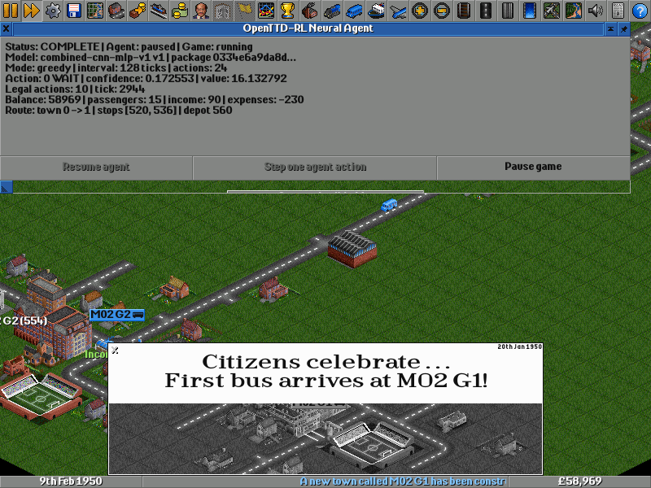

# OpenTTD Reinforcement Learning Platform

OpenTTD RL is a source-integrated C++/CUDA reinforcement-learning platform that
trains PPO policies for controlled passenger-bus games, exports them to ONNX, and
runs them as a visible neural company inside normal OpenTTD.

**Version 2 is now active.** It expands the released V1 system to native map sizes,
all base cargo/industry chains and transport modes, multimodal planning, and
reproducible shared-map competition against byte-pinned OpenTTD AIs. G14 authority
and opponent qualification, G15 scalable passenger operation, G16 cargo/industry
accounting, G17 rail networks, G18 ships/waterways, and G19 aircraft/multimodal
service have passed. G20 adds native shared-map competition, fair paired
external-AI evaluation, public-state isolation, fault containment, and complete
scoring. G21 now adds four-climate 1900–2100 coverage, native authority/economy
and recoverable events, a live pinned Game Script, a finite ten-package NewGRF
pack with fail-closed capability discovery, and exact evidence for all 18
research domains and 145 command occurrences. M22 generalist learning and M23
release remain incomplete. The M22 foundation is now frozen: a 17-program
learning contract, a 42-case final-only evaluation manifest, and a reproducible
32-entry native training/development corpus. The current execution checkpoint
adds a production recurrent PPO trainer, a development-retention campaign, and
atomic exact-recovery checkpoints, all exercised on CPU and CUDA. The declared
update-16 recovery fork now matches exactly for both learned architectures in
six isolated fresh processes. A fail-closed matched-campaign runner and evidence
validator now cover the six architecture-by-seed development runs and their
public heuristic, seeded-random, and wait-only baselines. The first clean run
completed all six 48-update processes, but the set was rejected because
specialist seed `1636894266` did not learn the newly introduced `mode-router`
development program and therefore produced no eligible checkpoints after
update 16. The resulting semantic-v2 learning contract now guarantees one
training episode for every introduced program in every update before drawing
weighted extras, and defines forgetting only as loss of a previously passing
program. The rejected seed passes all 16 programs through update 48 in a
development smoke. The revised source now reproduces exactly for both
architectures in six new isolated fresh processes, and the complete clean
six-campaign rerun now passes all 288 updates and all 36 development candidates.
Development-only ordering selects monolithic seed `1636894266` at update 32. A
subsequent clean, final-manifest-blind qualification retains all 16 programs,
passes every frozen CPU/CUDA tolerance at batches 1, 8, and 32, measures CUDA
benefit for inference and updates at every batch, and revalidates the exact
G15-G21 native evidence chain. Selection is now finalized before final access;
the independent source boundary is now frozen too. A dedicated optimizer-free
single-case evaluator loads only the selected model and development-selection
identity, reconstructs the public 32-feature input, starts from explicit zeroed
recurrent state, applies a wait-plus-capability legal mask, and exposes no final
seed or required-program input. A cumulative OpenTTD 15.3 patch adds token-gated,
all-or-none final width, height, and climate overrides to the accepted G15-G21
native harnesses without changing their default behavior. The evaluator passes
its structural/schema gates and a real selected-checkpoint CPU smoke; the patched
engine builds cleanly and has passed representative actual-world source smokes
through all seven G15-G21 capability gates. A manifest-generic native dispatcher
now accepts one caller-supplied public case plus its private execution seed,
removes the seed and required-program label from its public projection, and
launches exactly one network-unshared OpenTTD process with the frozen final-world
overrides. The retained final runtime is now frozen from clean repository commit
`c0c3ac7`: all 98 upstream CTests pass and eight fresh synthetic source smokes
span road, cargo, rail, water, air, real-AAAHogEx competition, finite NewGRF
content, and the live Game Script. The first clean runner invocation has now
opened the final manifest once but failed closed on an unrecognized public probe
alias before creating the cases directory; zero final cases, evaluator processes,
or native dispatches ran. The exact rejected attempt is retained, selection is
unchanged, and the corrected aggregate runner/report source is closed around one
additional accepted-execution manifest read, one fresh optimizer-free CUDA
evaluator process and one fresh
network-unshared native dispatch per declared case, no retry/replacement/post-
selection path, complete failure retention, and exact Student-t/paired baseline
statistics. The corrected immutable execution then attempted all 42 declared
cases in manifest order with 42 fresh evaluator processes, 42 native dispatches,
zero retries, zero replacements, and no post-result selection. The selected
policy chose the required program in every case and its lower paired 95-percent
confidence bounds over seeded-random-legal and wait-only were `+0.43445` and
`+0.99994`. The gate nevertheless fails: eight native executions did not
complete, comprising two passenger multimodal harness rejections, four
seed-specific 64-by-64 competition worlds without generated towns or industries,
and two broad save failures. The complete failed evidence is retained without
rerunning or replacing a case. Fresh-seed, explicitly nonaccepting diagnostics
have now isolated all three failure classes. Passenger multimodal needs
cargo-aware bus versus truck stops; the two broad failures were assertion
crashes hidden by a secondary crash-save diagnostic, caused by a leaked
competitor company context and an unchecked direct disaster-vehicle allocation;
and the competition failures came from projecting G20's frozen 128-by-128 map
contract onto 64-by-64 worlds that could not always meet its eight-town floor.
A follow-up OpenTTD patch contains the two native corrections, and fresh runs
pass passenger multimodal, authority/economy, event recovery, and all three
qualified opponents at the contracted 128-by-128 size. These diagnostics are
not an acceptance rerun. A subsequent clean, create-only preparation has now
identity-bound the corrected source and executable: all 98 upstream CTests and
14 fixed, fresh, network-unshared source smokes pass. That preparation did not
open a follow-up manifest or run an evaluator. No follow-up protocol has been
frozen or executed, and no G22 pass or V2 release claim has been made.

[`V2 feature and competitor research`](docs/project/V2_RESEARCH.md)
· [`V2 milestone and release plan`](docs/project/V2_PLAN.md)
· [`V2 machine research baseline`](config/v2/research-baseline.json)
· [`V2 pinned setting inventory`](config/v2/setting-inventory.json)
· [`V2 atomic requirements`](docs/project/requirements-v2.json)
· [`V2 defect ledger`](docs/project/defects-v2.json)
· [`M14 package evidence`](config/v2/opponent-package-evidence.json)
· [`M14 runtime evidence`](config/v2/opponent-runtime-evidence.json)
· [`M14 frozen competition manifest`](config/v2/m14-competition-manifest.json)
· [`M15 scalable machine contract`](config/v2/m15-scalable-contract.json)
· [`M15 native map evidence`](config/v2/m15-map-evidence.json)
· [`M15 native source evidence`](config/v2/m15-native-source.json)
· [`M15 native reset evidence`](config/v2/m15-native-reset-evidence.json)
· [`M15 complete reset matrix`](config/v2/m15-native-reset-matrix.json)
· [`M15 observation contract`](config/v2/m15-observation-contract.json)
· [`M15 observation source evidence`](config/v2/m15-observation-source.json)
· [`M15 observation oracle evidence`](config/v2/m15-observation-evidence.json)
· [`M15 action contract`](config/v2/m15-action-contract.json)
· [`M15 action source evidence`](config/v2/m15-action-source.json)
· [`M15 action oracle evidence`](config/v2/m15-action-evidence.json)
· [`M15 stateful episode program`](config/v2/m15-episode-program.json)
· [`M15 episode source evidence`](config/v2/m15-episode-source.json)
· [`M15 lifecycle/replay evidence`](config/v2/m15-episode-evidence.json)
· [`M15 scalable policy contract`](config/v2/m15-policy-contract.json)
· [`M15 CPU/CUDA policy evidence`](config/v2/m15-policy-evidence.json)
· [`M15 cross-scale replay program`](config/v2/m15-cross-scale-replay-program.json)
· [`M15 cross-scale replay evidence`](config/v2/m15-cross-scale-replay-evidence.json)
· [`M15 passenger competence program`](config/v2/m15-competence-program.json)
· [`M15 passenger competence source`](config/v2/m15-competence-source.json)
· [`M15 passenger competence evidence`](config/v2/m15-competence-evidence.json)
· [`M16 cargo/industry contract`](config/v2/m16-cargo-contract.json)
· [`M16 cargo source evidence`](config/v2/m16-cargo-source.json)
· [`M16 cargo matrix evidence`](config/v2/m16-cargo-evidence.json)
· [`M17 rail contract`](config/v2/m17-rail-contract.json)
· [`M17 rail source evidence`](config/v2/m17-rail-source.json)
· [`M17 rail matrix evidence`](config/v2/m17-rail-evidence.json)
· [`M18 ship/waterway contract`](config/v2/m18-ship-contract.json)
· [`M18 ship source evidence`](config/v2/m18-ship-source.json)
· [`M18 ShipAI qualification`](config/v2/m18-shipai-evidence.json)
· [`M18 ship matrix evidence`](config/v2/m18-ship-evidence.json)
· [`M19 aircraft/multimodal contract`](config/v2/m19-air-contract.json)
· [`M19 aircraft source evidence`](config/v2/m19-air-source.json)
· [`M19 aircraft matrix evidence`](config/v2/m19-air-evidence.json)
· [`M20 competition contract`](config/v2/m20-competition-contract.json)
· [`M20 map manifest`](config/v2/m20-map-manifest.json)
· [`M20 settings manifest`](config/v2/m20-settings-manifest.json)
· [`M20 content manifest`](config/v2/m20-content-manifest.json)
· [`M20 competition source evidence`](config/v2/m20-competition-source.json)
· [`M20 competition matrix evidence`](config/v2/m20-competition-evidence.json)
· [`M21 finite content request`](config/v2/m21-content-request.json)
· [`M21 acquired content lock`](config/v2/m21-content-lock.json)
· [`M21 passive Game Script fixture`](config/v2/m21-gamescript/info.nut)
· [`M21 broad-feature contract`](config/v2/m21-broad-contract.json)
· [`M21 feature/command coverage`](config/v2/m21-broad-coverage.json)
· [`M21 native source evidence`](config/v2/m21-broad-source.json)
· [`M21 exact-twin matrix evidence`](config/v2/m21-broad-evidence.json)
· [`M21 native harness patch`](integration/openttd/patches/15.3/m21/broad/0001-Add-native-V2-broad-feature-qualification.patch)
· [`M22 generalist learning contract`](config/v2/m22-learning-contract.json)
· [`M22 native-qualified corpus`](config/v2/m22-native-corpus.json)
· [`M22 semantic-v2 fresh-process recovery evidence`](config/v2/m22-recovery-evidence-v2.json)
· [`M22 historical fresh-process recovery evidence`](config/v2/m22-recovery-evidence.json)
· [`M22 matched training evidence`](config/v2/m22-training-evidence.json)
· [`M22 selected-checkpoint qualification evidence`](config/v2/m22-qualification-evidence.json)
· [`M22 final-only evaluation manifest`](config/v2/m22-evaluation-manifest.json)
· [`M22 optimizer-free evaluator report schema`](docs/project/schema/v2-m22-evaluator-report.schema.json)
· [`M22 final-world native harness patch`](integration/openttd/patches/15.3/m22/final/0001-Add-M22-final-world-overrides.patch)
· [`M22 diagnosed native follow-up patch`](integration/openttd/patches/15.3/m22/followup/0001-Correct-M22-native-harness-boundaries.patch)
· [`M22 one-case native dispatcher`](scripts/v2/m22_final_native.py)
· [`M22 retained-runtime preparer`](scripts/v2/prepare_m22_final_runtime.py)
· [`M22 retained-runtime validator`](scripts/v2/validate_m22_final_runtime_source.py)
· [`M22 retained-runtime record schema`](docs/project/schema/v2-m22-final-runtime-source.schema.json)
· [`M22 retained-runtime source record`](config/v2/m22-final-runtime-source.json)
· [`M22 corrected follow-up runtime preparer`](scripts/v2/prepare_m22_followup_runtime.py)
· [`M22 corrected follow-up runtime validator`](scripts/v2/validate_m22_followup_runtime_source.py)
· [`M22 corrected follow-up runtime record schema`](docs/project/schema/v2-m22-followup-runtime-source.schema.json)
· [`M22 corrected follow-up runtime source record`](config/v2/m22-followup-runtime-source.json)
· [`M22 final one-shot runner`](scripts/v2/run_m22_final_evaluation.py)
· [`M22 final evidence validator`](scripts/v2/validate_m22_final_evaluation.py)
· [`M22 final evidence schema`](docs/project/schema/v2-m22-final-evaluation-evidence.schema.json)
· [`M22 rejected pre-case attempt`](config/v2/m22-final-attempt-a.json)
· [`M22 rejected-attempt schema`](docs/project/schema/v2-m22-final-attempt.schema.json)
· [`M22 immutable failed final-v1 evidence`](config/v2/m22-final-evaluation-evidence.json)
· [`M14 source decision`](docs/project/M14_ENGINE_SOURCE_DECISION.md)
· [`M14 opponent acquisition`](docs/project/M14_OPPONENT_ACQUISITION.md)
· [`M14 competition protocol`](docs/project/M14_INVENTORY_AND_COMPETITION.md)
· [`G14 gate report`](docs/project/G14_GATE_REPORT.md)
· [`M15 scalable contract`](docs/project/M15_SCALABLE_CONTRACT.md)
· [`G15 gate report`](docs/project/G15_GATE_REPORT.md)
· [`M16 cargo/industry contract`](docs/project/M16_CARGO_INDUSTRY_CONTRACT.md)
· [`G16 gate report`](docs/project/G16_GATE_REPORT.md)
· [`M17 rail network contract`](docs/project/M17_RAIL_NETWORK_CONTRACT.md)
· [`G17 gate report`](docs/project/G17_GATE_REPORT.md)
· [`M18 ship/waterway contract`](docs/project/M18_SHIP_WATERWAY_CONTRACT.md)
· [`G18 gate report`](docs/project/G18_GATE_REPORT.md)
· [`M19 aircraft/multimodal contract`](docs/project/M19_AIR_MULTIMODAL_CONTRACT.md)
· [`G19 gate report`](docs/project/G19_GATE_REPORT.md)
· [`M20 competitive-company contract`](docs/project/M20_COMPETITION_CONTRACT.md)
· [`G20 gate report`](docs/project/G20_GATE_REPORT.md)
· [`M21 broad-content contract`](docs/project/M21_BROAD_CONTENT_CONTRACT.md)
· [`G21 gate report`](docs/project/G21_GATE_REPORT.md)

## Version 2 implementation through G21 and the M22 training checkpoint

The committed V2 work is a gate-controlled expansion, not a release candidate:

- M14/G14 freezes the 15.3 feature, command, setting, map, source, package,
  runtime, and competition authority. It inventories 18 gameplay domains, 145
  commands, 435 settings, 49 native rectangles, and ten external-AI candidates.
- M15/G15 provides the scalable 4,096-row hierarchical action surface, bounded
  observations, exact reset/save/load/replay, and a 1,239,406-parameter recurrent
  CPU/CUDA policy contract. Twelve retained native competence runs demonstrate
  useful passenger service through held-out rectangular and 1024 tiers.
- M16/G16 covers all 46 base-climate cargo occurrences, 31 labels, 37 industry
  specs, 24 production edges, passenger/mail coordination, subsidies, and
  exploit-free transfer accounting in 102 cases and 204 exact-twin native runs.
- M17/G17 adds 24 rail action families, four rail types, six track orientations,
  116 train engine entries, 12 signal variants, native train lifecycle and rail
  save/load. Its 14-case/28-run matrix includes profitable passenger and freight
  service and a 32,768-tick, two-train junction-connected soak with no unresolved
  deadlock or unexplained collision; all 14 twins are exact.
- M18/G18 adds 25 ship/water action families, 17 bounded observation tables,
  three water classes, and 11 base ship engine entries. Its 16-case/32-run matrix
  proves construction/removal, independent water-region connectivity, ship
  lifecycle/save-load, profitable natural sea/river and constructed
  lock/aqueduct service, exact road-to-ship accounting, and bounded route
  recovery; all 16 twins are exact. A retained 128 by 128 coastal scenario also
  qualifies byte-pinned ShipAI v10 as active with two ships before and after
  save/load.
- M19/G19 adds 24 air action families, 19 bounded observation tables, eight
  graph-edge types, ten airport specifications, and 41 aircraft engine entries.
  Its 20-case/40-run matrix proves airport legality, aircraft lifecycle and
  save/load, native occupancy/failure behavior, profitable airplane/helicopter
  service, bounded close/reopen recovery, exact road-water-air accounting, and a
  deterministic four-mode router; all 20 twins are exact.
- M20/G20 runs native shared-map competition against byte-pinned AAAHogEx v115,
  KrakenAI2 v3, and the NoOpAI control. Its 32-case/64-run development matrix
  covers two seeds, four symmetric slot/start-delay legs, solo competence,
  four-company mixed fields, opponent deletion/fault containment, wrong-owner
  vehicle control rejection, native subsidies, hostile purchase, and shared
  save/load. All scheduled runs are included and all 32 public save/load and
  score projections replay exactly. The stratified RL-minus-opponent company-
  value difference is 9,672,271.958 with a 95% interval of 9,635,177.458 to
  9,709,366.458; universal victory is not a gate requirement.
- M21/G21 freezes a deliberately finite, dependency/license-complete ten-package
  NewGRF pack spanning 14 closed capabilities; a passive live API-15 Game Script;
  four climates and seven date boundaries from 1900 through 2100; authority,
  subsidy, exclusive-rights, inflation, recession, breakdown, disaster, and
  recovery semantics; and all 18 feature/145 command dispositions. Its 16-case,
  32-run matrix has 16 exact report twins and 14 byte-identical stateful save
  pairs. Unknown capability, content ID, and schema mutations fail before world
  or report creation. The source passes 98/98 upstream CTests. The finite pack is
  accepted without claiming arbitrary-NewGRF compatibility.
- The M22 checkpoint freezes 17 bounded programs, seven G15-G21 curriculum
  stages, matched monolithic/specialist/non-neural architectures, three derived
  trainer seeds, exact PPO and recovery budgets, CPU/CUDA tolerances, and a
  final-only 42-case manifest whose seeds and required-program labels are
  forbidden from training and development selection. Its 32-entry corpus is
  rebuilt byte-for-byte from accepted native G15-G21 evidence, covers every
  active program once in each training and development split, contains no final
  cases, and now has an independently decoded, hash-bound 10,272-byte native
  trainer representation. The C++ LibTorch implementation reconstructs the full
  M15 input surface from compact public state and extends the multimodal backbone
  with typed domain-token attention, 17-program scoring, explicit recurrent
  state, legal masking, clipped PPO, float64 GAE, deterministic minibatches,
  finite checks, and matched 1,457,520-parameter monolithic and specialist-router
  models. The production campaign uses the frozen 16-step by 8-environment
  geometry, eight-step recurrent sequences, all seven curriculum stages,
  development-only retention every four updates, eligible saves every eight
  updates, and a hard 48-update ceiling. Its seven-file content-addressed
  checkpoint package records the model, Adam state, normalization, hidden state,
  counters, curriculum/case state, retention/selection history, and four exact
  RNG streams through an atomic never-overwrite commit; canonical CPU payloads
  load on CPU or CUDA, and the Adam archive uses stable parameter-order keys
  rather than process-specific pointer identities. In the accepted recovery
  campaign, uninterrupted 24-update, independent 16-update prefix, and resumed
  eight-update CUDA processes reproduce every case order, action, log
  probability, value, reward, metric, recurrent state, development result, and
  checkpoint byte identity for both learned architectures. Bubblewrap makes the
  source read-only, masks the final manifest with an empty read-only file, and
  unshares the network for all six processes. Matched wait-only and
  public-heuristic baselines remain covered by the offline gates. The committed
  matched-campaign tooling adds strict schemas, mutation-tested validation,
  complete update/checkpoint retention, case/action-count projections, and
  deterministic development-only candidate ordering against matched public
  heuristic, seeded-random, and wait-only baselines. Its first clean six-process
  run completed all 48 updates for every seed and architecture; five runs met
  their run-level checkpoint contract, while specialist seed `1636894266`
  retained every previously passing program but failed to learn `mode-router`
  after its G19 introduction. That run consequently had eligible checkpoints
  only at updates 8 and 16, so the orchestrator rejected the entire evidence set
  for checkpoint-cadence drift and did not write an accepted report. Inspection
  showed that the sampler could give late programs very few episodes and that
  expansion from six perfect decisions to nine of ten decisions was incorrectly
  called catastrophic even though all six old programs remained present. The
  semantic-v2 correction stratifies every update across all introduced programs,
  retains the frozen stage-weighted sampler for remaining episode slots, shuffles
  environment order, and rejects forgetting exactly when a previously passing
  bit disappears. A full CUDA smoke of the formerly failing seed produced all
  six checkpoints and passed all 16 development programs at every check from
  update 28 through 48. Because that smoke used an uncommitted source, it is
  diagnostic rather than accepted evidence. The committed semantic-v2 source
  subsequently passed exact update-16 recovery for both architectures in six
  new fresh CUDA processes, including byte-identical case/action projections,
  trajectories, optimizer state, recurrent state, metrics, and checkpoint
  packages. The subsequent clean matched rerun completes all six architecture-
  by-seed campaigns, 288 finite updates, 36,864 transitions, 36 scheduled
  checkpoints, and 18 exact-budget baseline campaigns. Every development
  candidate passes its introduced suite, every learned run beats its matched
  seeded-random and wait-only returns, no architecture-superiority claim is
  made, and frozen ordering provisionally selects monolithic seed `1636894266`
  at update 32 with checkpoint
  `03894fd1238b69b6724d82eb441380312be4e8226efa602fa5e43972f7fa9f5f`.
  Clean source commit `7b8e01a` then qualifies that exact checkpoint inside a
  read-only, network-unshared sandbox whose final manifest is replaced by an
  empty read-only file. CPU/CUDA forward, PPO-loss, gradient, Adam-update, and
  canonical-checkpoint maximum absolute errors remain at or below
  `2.8611e-6`, `1.1921e-7`, `5.9605e-7`, `8.8987e-5`, and `9.0599e-5`,
  respectively, against frozen tolerances of `1e-4`, `1e-5`, `5e-4`, `5e-4`,
  and `1e-4`. All 41 compared greedy decisions are identical and the minimum
  top-two margin is `4.9014`. The full 10-warmup/30-sample measurements show
  CUDA update speedups of `1.287x`, `4.571x`, and `9.984x` and inference
  speedups of `1.273x`, `5.159x`, and `9.336x` at batches 1, 8, and 32. All 16
  native-qualified development programs pass identically on CPU and CUDA; the
  corpus is rebuilt through the seven G15-G21 evidence validators before acceptance.
  The 92.722-second process retained 371/371 GPU telemetry samples, peaking at
  92 percent utilization, 5,958 MiB, 117.07 W, and 50 C. This closes native and
  device qualification and finalizes selection, but it is not a G22 pass: the
  final-only 42-case evaluation had not been opened or executed at qualification time. The pre-final
  source gate now additionally separates `m22_evaluator` from every trainer,
  PPO, campaign, recovery-checkpoint, and optimizer translation unit. It validates
  the complete checkpoint inventory and identities, then opens only identity
  metadata, `model.pt`, and `selection.json`; optimizer, runtime, and trainer-state
  payloads are neither opened nor deserialized. Its closed CLI accepts the
  checkpoint, device, and
  public task/mode/climate/map/cargo/opponent/probe/gate fields, requires the
  `final` policy split, and has no case seed or required-program channel. Each
  fresh process derives exactly one active capability plus wait, zeroes and
  resets the recurrent state, performs greedy masked inference, and writes a
  create-only report containing the public tensors, logits, value, next hidden
  state, chosen action, and explicit optimizer-absence assertions. The report
  schema is closed and mutation-tested, all 16 active capability mappings pass
  the strict-warning C++ gate, and the selected monolithic checkpoint completes
  a real CPU smoke with 32 public features and 256 hidden values. The cumulative
  M22 OpenTTD patch applies exactly over the accepted M21 source, preserves every
  old gate when its four final-only environment variables are absent, and accepts
  only the frozen width/height/climate domain when the private activation token
  and all three overrides are present. It propagates the actual world shape and
  climate through G15-G21, reports actual dimensions where earlier harnesses used
  constants, and selects a buildable base passenger road engine whose native
  default cargo is passengers. Final-world G15 planning searches a wider bounded
  area and requires passenger acceptance at both bus stops; its invariant counts
  only learning-company vehicles so transient Toyland effect vehicles cannot
  create a false failure. Default G15 behavior remains unchanged. G20 continues
  to require the development split by default and requires the final split only
  while the complete private M22 override is active. The regenerated cumulative
  patch applies with whitespace checking, its incremental build succeeds, and
  all 98 upstream CTests pass. Representative one-process source smokes pass for
  default and final-world G15 passenger service, G16 toyland cargo, G17 arctic
  passenger rail, G18 tropic natural shipping, G19 toyland air service, G20
  tropic competition against the real byte-pinned AAAHogEx, and G21 arctic
  content plus tropic Game Script coverage. The new one-case dispatcher owns the
  G15-G21 request/report translation, fixed final-only environment, isolated
  home directories, network namespace, resource limits, process count, and
  output hashes without opening the final manifest. Its offline boundary smoke
  confirms that the public case omits both seed and required-program data and
  that its source contains one process-launch site. These are source preparation
  checks only, not final cases or G22 evidence. A create-only retained-runtime
  preparer now clones the accepted M21 source without hardlinks, applies the
  cumulative patch exactly, creates a reproducible fixed-identity source commit,
  configures a fresh Ninja build, requires all 98 upstream CTests, stages the
  byte-pinned OpenGFX, M20 AI/library, M21 NewGRF, and M21 Game Script closure,
  and schedules eight fixed synthetic smokes through the one-case dispatcher.
  Its closed schema and independent validator bind the repository/base/patch/
  source/executable/config/content/log/report identities and reject seed or
  required-program leakage into a public smoke case. The preparer has no final-
  manifest pathname or case loader. Its offline mutation suite passes, including
  two independent clones that produce the same source commit and tree. The first
  fresh retained attempt was correctly
  rejected at 96/98 CTests because the two graphics-dependent regression tests
  ran before OpenGFX staging. The failed artifact and its logs are preserved; the
  corrected source stages the pinned OpenGFX archive before CTest, bounds failure
  diagnostics, and adds a regression test that freezes this ordering. The second
  clean attempt then passed all 98 CTests and staged every runtime asset, but was
  rejected before its first smoke because the shared smoke parent did not exist;
  it likewise wrote no accepted record. The runner now creates that parent
  explicitly and tests its existence before every mocked native dispatch. A
  subsequent non-accepting diagnostic reached the G15 parser, which correctly
  rejected the adapter's invented `final` resource tier before world creation.
  The adapter now derives the accepted M15 `curriculum` or `generalization` tier
  from tile count, with boundary coverage across the complete final map domain.
  Replaying the non-accepting diagnostic on the already built engine then passes
  all eight synthetic G15-G21 smokes in eight fresh, network-unshared processes.
  The third clean create-only execution now retains a fully accepted runtime from
  repository commit `c0c3ac70436dcea467f26db11e5bf3ab2e7a2f1d`: patched source
  tree `0a5e2aca102b6713c74fceff3aa7b512fb06a13c`, executable SHA-256
  `f38b63a2d431411d30e44e7d3c43e46268cf2556c3bde1b74bc3291af52b0577`,
  all 98 upstream CTests, three AI archives, four AI libraries, ten NewGRF
  archives, ten active GRFs, two Game Script files, and all eight synthetic
  smokes. G15-G19 each deliver positive cargo and income, G20 retains real
  AAAHogEx with 25 RL cargo units, and both G21 probes pass. The independent live
  validator rehashes every retained source, executable, asset, log, manifest,
  report, and smoke artifact; mutation tests cover patch/prerequisite/executable/
  report drift, public seed leakage, final-access claims, ordering, CTest count,
  and vacuous service. V2-DEF-0003 records the rejected attempts and closes all
  three preparer defects. This retained source evidence is not a final case or a
  G22 pass.
  The manifest-generic final runner and independent evidence validator are now
  source-frozen too. All runtime, selected-checkpoint, executable, source, clean-
  tree, output-path, and CUDA prerequisites are checked before the runner's one
  manifest read. A fixed synthetic public preflight first exercises the exact
  evaluator/checkpoint/CUDA/bubblewrap path without consuming final access. Once
  access begins, the runner preserves manifest order and attempts all 42 cases
  even after a case failure: each case receives one evaluator process without a
  seed or required-program CLI channel and one native dispatch with the private
  seed, while create-only per-case records prevent overwrite or replacement.
  Learned, seeded-random-legal, wait-only, and public-heuristic returns use the
  native-corpus reward formula; the aggregate publishes every private seed,
  required label, action, native metric, failure category, mean, median, range,
  Student-t 95-percent interval, and paired effect. Acceptance is recomputed
  independently and requires all 42 attempts, every learned program, positive
  road/rail/water/air/multimodal service, all opponents, all climates and map
  sizes, every G21 probe, complete G15-G21 native retention, and positive lower
  paired confidence bounds over random and wait. Fourteen offline/mutation tests
  cover all 16 public mappings, hidden-input absence, source/order closure,
  deterministic baselines, exact statistics, missing runs, score recomputation,
  missing processes, create-only output, and failure retention. This is the last
  source gate. Its first clean invocation passed the fixed CUDA preflight and
  opened the manifest, then failed closed on `G15/m15-competence` before creating
  the cases directory. The retained attempt proves zero final case/evaluator/
  native executions and no selection change. V2-DEF-0004 records the missing
  `m15-competence` and `industry-chain` aliases; both now project to their already
  frozen G15 passenger-service and G16 single-leg native transactions, and the
  accessed manifest's complete 17 gate/probe pairs are regression-tested. The
  corrected execution explicitly reports this prior nonexecuting manifest read
  rather than hiding it. It then attempted the complete 42-case manifest exactly
  once in order: 42 evaluator attempts/processes, 42 native dispatches, 34 native
  process completions, no retry, no replacement, and no post-result selection.
  All 42 evaluator reports pass identity, process, report, and public-boundary
  validation; all 42 learned actions equal their preregistered required programs.
  The learned mean return is `1.21161`, and the lower paired 95-percent confidence
  bounds over seeded-random-legal and wait-only are `0.43445` and `0.99994`.
  The aggregate remains `FAIL`: `multimodal-passenger-a` and
  `multimodal-passenger-b` expose a G19 native probe restricted to freight;
  both AAAHogEx cases plus `competition-krakenai2-a` and
  `competition-noopai-b` expose seed-specific G20 64-by-64 maps that do not meet
  the frozen 128-by-128 competition contract's eight-town/four-industry floor;
  and `broad-authority-economy` plus `broad-events` appeared to exit on failed
  save creation after their native mutations. Those eight cases are
  immutable failed evidence and will not be retried, replaced, or relabeled.
  Consequently service-every-mode, opponent retention, broad retention, complete
  G15-G21 native retention, and overall acceptance are false even though all
  climates, map sizes, programs, and both baseline confidence requirements pass.
  The independent live validator reports
  `V2_M22_FINAL_EVIDENCE=FAIL cases=42 failures=10 live=true`; the ten
  classifications comprise eight native-execution failures and two overlapping
  broad-retention classifications, not ten distinct cases. Source inspection
  and fresh-seed diagnostics, kept outside acceptance, subsequently resolved the
  apparent save failures to assertions: authority/economy left
  `_current_company` set to the competitor before advancing the game loop, and
  events directly allocated a `DisasterVehicle` without the pool-allocation
  precondition. The crash handler then attempted its own save and emitted the
  misleading `File not writeable` message. The follow-up patch scopes the
  competitor identity with `AutoRestoreBackup`, checks the vehicle pool, and
  makes G19 multimodal road stops cargo-aware. Its assertion-enabled source tree
  `f8985045f9ba14bad1e46a81cb58fdbb8037f277` builds cleanly; executable SHA-256
  is `84430cb4a27b1ee09717655011ae288042975e7fe9687ee7d9890560f839f58f`.
  Six network-unshared diagnostics using seeds absent from final-v1 pass: one
  passenger multimodal case delivers 17 units with positive income, all three
  qualified opponents retain the G20 service floor on 128-by-128 maps, the
  authority/economy case preserves exact save/load across six commands, and the
  events case recovers in seven ticks with exact save/load. Their retained
  summary is classified `nonaccepting-fresh-seed-diagnostic` and has SHA-256
  `3f662a56713347cdf646c93c8c10b28a137ecc2dffc446bc338ec0bc65f5b50d`.
  A new create-only corrected-runtime preparer starts from the exact accepted
  M21 source, applies the frozen final-world patch followed by only the two-file
  correction, reproduces corrected source commit
  `87c5f81fc62818a642b88921b7394bcf2723e2a8` and tree
  `f8985045f9ba14bad1e46a81cb58fdbb8037f277`, and stages the same complete
  AI, library, NewGRF, Game Script, configuration, and OpenGFX closure. Its clean
  retained artifact has executable SHA-256
  `607702be982848e5099cd72022b4379d5a5fe68c77b69797f0b2b5fb8eb014ef`,
  passes all 98 upstream CTests, and passes 14 fixed smokes: the original eight
  G15-G21 source cases plus passenger multimodal, all three qualified opponents
  on contracted 128-by-128 maps, authority/economy, and recoverable events. The
  independent validator rehashes every retained file and checks the complete
  corrected patch order, immutable failed-final identity, public/private case
  boundary, source reproduction, process isolation, meaningful native metrics,
  and all live artifact identities. The admitted record remains manifest-blind:
  it binds zero follow-up evaluator processes and native dispatches, leaves the
  protocol `not-yet-frozen`, and preserves immutable final-v1 as `FAIL`.

Cargo packets, sink acceptance, and competence preloading in M16-M19 are bounded
qualification fixtures. Construction, vehicles, pathfinding, movement, delivery,
payment, transfers, recovery, and the M17-M19 save/load transitions are native.
The useful-service controllers are deterministic qualification oracles, not
learned generalist policies. Earlier native matrix runs truthfully record
`rlimit-only` isolation where bubblewrap namespaces were unavailable. Byte-pinned
Lufthansa v2 remains truthfully rejected because its archive contains malformed
and truncated Squirrel source; AAAHogEx remains the active generalist but chose
rail rather than aircraft in its retained M19 run. M20 uses unmodified external
AIs and retains both fresh-process results when their private decision streams
vary; exactness is claimed for frozen manifests, public save/load restoration,
and score projection, not third-party AI choices. Physical plane crashes are
disabled in the qualification settings, while crash counts remain scored and
the interaction cases prove native ownership isolation. The M20 controller is a
deterministic competence oracle, the M14 3,650-day final protocol was not run,
and M22 must still close native final-world qualification for the broad learned
generalist. The selected checkpoint was frozen and qualified before final access
and remains unchanged after the failed gate. The retained final-v1 runtime,
optimizer-free evaluator, synthetic CUDA preflight, and complete uncertainty/
failure report are preserved. Diagnosis and a reviewable source correction are
now complete, and the corrected runtime is identity-bound. The next M22 work is
to freeze a follow-up protocol before accessing new cases and evaluate it
independently without presenting it as a retry or replacement for the immutable
failed final-v1 suite. G22 stays open.



**Version 1 is complete.** The clean M12 release gate passed 12 campaigns, all
217 applicable requirements, and zero nonclosed defects. The selected combined
CNN/MLP policy averaged 150 delivered passengers and 424 operating profit on its
independent final suite; visible final playback earned positive income on both
held-out layouts.

[`Download V1`](https://github.com/goldbar123467/openttd-cuda-rl/releases/tag/v1.0.0)
· [`Source quality: passing`](https://github.com/goldbar123467/openttd-cuda-rl/actions/runs/30746165828)
· [`G13 publication evidence`](docs/project/G13_GATE_REPORT.md)

## Verify the source

The quick check targets Ubuntu 24.04 x86_64 and repairs missing apt-provided
dependencies when requested:

```bash
git clone --recurse-submodules https://github.com/goldbar123467/openttd-cuda-rl.git
cd openttd-cuda-rl
bash scripts/v1/setup_and_verify.sh --bootstrap
```

This validates the full project traceability suite, frozen M12/M13 contracts,
ShellCheck, Bash syntax, Python compilation, the pinned OpenTTD commit, and Git
whitespace. It intentionally does not download the CUDA training stack or rerun
the 6.7 GiB clean-room training/playback campaign. See the
[`V1 publication guide`](docs/project/V1_PUBLICATION.md) for the reviewed model
archive and [`V1 reproduction guide`](docs/project/V1_RELEASE_REPRODUCTION.md)
for the full supported-host workflow.

The unfinished legacy P0 64 by 64 road-freight workstream is retained only for
deterministic tooling and historical evidence; it is not V1 bus/RL progress.

Validate the current V2 research/command inventory, its mutation tests, and the
full frozen V1 traceability regression with:

```bash
./scripts/v2/verify.sh
```

The M22 validators are part of that command and rebuild both the JSON and bounded
native corpus representations exactly from accepted G15-G21 evidence before
accepting them, validate the historical and active exact-recovery reports, and
validate the accepted matched-campaign and selected-checkpoint qualification
reports plus their fail-closed mutations. At this checkpoint the suite passes 462 V2
tests and the unchanged 235-test V1 regression. The standalone
[`training/v2/m22/CMakeLists.txt`](training/v2/m22/CMakeLists.txt) entry point uses
the pinned LibTorch 2.13.0/CUDA 13 toolchain without changing the hash-frozen M15
build definition. Its strict-warning suite now defines ten CTests: the
optimizer-free CPU evaluation gate; the policy, trainer, checkpoint, and campaign
gates on both CPU and `cuda:0`; and the independent corpus decoder gate. Both
learned architectures remain fixed at 1,457,520 parameters.

OpenTTD RL is distributed under [`GPL-2.0-only`](LICENSE). OpenTTD, OpenGFX,
ONNX Runtime, PyTorch/LibTorch, CUDA, and other dependencies retain their own
terms; see [`THIRD_PARTY_NOTICES.md`](THIRD_PARTY_NOTICES.md). This is an
independent project and does not imply OpenTTD endorsement.

## Start here

1. [`GOAL.md`](GOAL.md) — authoritative project scope, frozen V1 boundary and
   active V2 objective.
   Start V2 work with [`V2_RESEARCH.md`](docs/project/V2_RESEARCH.md) and
   [`V2_PLAN.md`](docs/project/V2_PLAN.md).
2. [`docs/project/REQUIREMENTS.md`](docs/project/REQUIREMENTS.md) — atomic
   requirements and acceptance evidence.
   The synchronized machine registry is
   [`docs/project/requirements-v1.json`](docs/project/requirements-v1.json),
   validated by `./scripts/v1/traceability.sh`.
3. [`docs/project/ROADMAP.md`](docs/project/ROADMAP.md) — ordered implementation
   phases and gates.
4. [`docs/architecture/V1_ARCHITECTURE.md`](docs/architecture/V1_ARCHITECTURE.md)
   — target component and data-flow design.
5. [`docs/contracts/V1_ENVIRONMENT.md`](docs/contracts/V1_ENVIRONMENT.md) — reset,
   step, observation, action, reward, and termination contracts.
6. [`docs/training/PPO_AND_MODEL_PIPELINE.md`](docs/training/PPO_AND_MODEL_PIPELINE.md)
   — PPO, checkpoint, ONNX, and in-game inference plan.
7. [`docs/project/VERIFICATION.md`](docs/project/VERIFICATION.md) — test,
   evaluation, reproducibility, and evidence gates.
8. [`docs/project/LEGACY_P0_TRANSITION.md`](docs/project/LEGACY_P0_TRANSITION.md) —
   how existing P0 artifacts are preserved, reused, or retired.
9. [`NEXT_STAGES_IMPLEMENTATION_HANDOFF.md`](NEXT_STAGES_IMPLEMENTATION_HANDOFF.md)
   — current implementation handoff and immediate critical path.
10. [`docs/project/M00_WORKTREE_PRESERVATION.md`](docs/project/M00_WORKTREE_PRESERVATION.md)
    — current dirty-worktree identity and preservation boundary.
11. [`docs/decisions/`](docs/decisions/) — accepted project decisions. V1's source,
    integration, toolchain, evidence, publication, and legacy boundaries are ADRs
    0007 through 0014.
12. [`docs/project/G00_GATE_REPORT.md`](docs/project/G00_GATE_REPORT.md) — passed
    authority/preservation gate and its historical M01 handoff boundary.
13. [`docs/project/M01_SOURCE_PREPARATION.md`](docs/project/M01_SOURCE_PREPARATION.md)
    — verified offline OpenTTD 15.3 reconstruction and patch-series guard.
14. [`docs/project/M01_TOOLCHAIN_PROBE.md`](docs/project/M01_TOOLCHAIN_PROBE.md)
    — verified offline dependency, compiler, CUDA, LibTorch, and ONNX probe runner.
15. [`docs/project/M01_OPENTTD_BUILD_REPRODUCIBILITY.md`](docs/project/M01_OPENTTD_BUILD_REPRODUCIBILITY.md)
    — two clean, byte-identical headless builds and two clean, byte-identical
    playable builds with complete commands, tests, hashes, and timing evidence.
16. [`docs/project/M01_BUILD_PROFILE_RESOURCE_PROVENANCE.md`](docs/project/M01_BUILD_PROFILE_RESOURCE_PROVENANCE.md)
    — validated seven-profile matrix, repeated runtime-resource measurements, and
    byte-identical complete dependency-provenance manifests.
17. [`docs/project/G01_GATE_REPORT.md`](docs/project/G01_GATE_REPORT.md) — passed
    reproducible build/runtime gate and the exact conditional 32 by 32 next slice.
18. [`docs/project/M02_MAP_FEASIBILITY.md`](docs/project/M02_MAP_FEASIBILITY.md) —
    passed conditional 32 by 32 engine feasibility, sanitizer matrix, and
    two-run binary/canonical-output reproducibility evidence.
19. [`docs/project/M02_SCENARIO_RESET_CONTRACT.md`](docs/project/M02_SCENARIO_RESET_CONTRACT.md)
    — frozen eight-template passenger-bus scenario, reset projection, and
    scripted native trajectory contract.
20. [`docs/project/G02_GATE_REPORT.md`](docs/project/G02_GATE_REPORT.md) — passed
    controlled scenario/reset gate and repeated current-Ubuntu evidence.
21. [`docs/project/M03_SYNCHRONIZED_BRIDGE.md`](docs/project/M03_SYNCHRONIZED_BRIDGE.md)
    — frozen lifecycle, framed local protocol, process isolation, and tick policy.
22. [`docs/project/G03_GATE_REPORT.md`](docs/project/G03_GATE_REPORT.md) — passed
    synchronized-bridge gate and repeated all-template native evidence.
23. [`docs/project/M04_VERSIONED_OBSERVATION.md`](docs/project/M04_VERSIONED_OBSERVATION.md)
    — frozen native structured/spatial observation and shared preprocessing.
24. [`docs/project/G04_GATE_REPORT.md`](docs/project/G04_GATE_REPORT.md) — passed
    observation semantic, compatibility, and non-perturbation gate.
25. [`docs/project/M05_EXPLICIT_BUS_ACTIONS.md`](docs/project/M05_EXPLICIT_BUS_ACTIONS.md)
    — frozen 41-action catalog, masks, typed outcomes, and transactions.
26. [`docs/project/G05_GATE_REPORT.md`](docs/project/G05_GATE_REPORT.md) — passed
    action/mask oracle and useful actual-engine bus-service gate.
27. [`docs/project/M06_REWARD_TRAJECTORY_FOUNDATION.md`](docs/project/M06_REWARD_TRAJECTORY_FOUNDATION.md)
    — frozen native reward, termination, integrity, and trajectory foundation.
28. [`docs/project/G06_GATE_REPORT.md`](docs/project/G06_GATE_REPORT.md) — passed
    reward, episode, and byte-exact trajectory gate.
29. [`docs/project/M07_TRUSTED_CPU_PPO.md`](docs/project/M07_TRUSTED_CPU_PPO.md)
    — trusted C++ PPO, structured MLP, monitoring, and exact recovery.
30. [`docs/project/G07_GATE_REPORT.md`](docs/project/G07_GATE_REPORT.md) — passed
    PPO reference, recovery, soak, and development-readiness gate.
31. [`docs/project/M08_SPATIAL_COMBINED_MEASURED_CUDA.md`](docs/project/M08_SPATIAL_COMBINED_MEASURED_CUDA.md)
    — frozen CNN/combined architectures and measured device policy.
32. [`docs/project/G08_GATE_REPORT.md`](docs/project/G08_GATE_REPORT.md) — passed
    CPU/CUDA parity, performance, monitoring, and live-integration gate.
33. [`docs/project/G09_GATE_REPORT.md`](docs/project/G09_GATE_REPORT.md) — passed
    independent multi-seed evaluation, baselines, profitability, and robustness gate.
34. [`docs/project/G10_GATE_REPORT.md`](docs/project/G10_GATE_REPORT.md) — passed
    reproducible ONNX package, three-runtime equivalence, and rejection gate.
35. [`docs/project/M11_NORMAL_GAME_PLAYBACK.md`](docs/project/M11_NORMAL_GAME_PLAYBACK.md)
    — normal-game controller build, configuration, inspection, controls, and
    fail-closed operating guide.
36. [`docs/project/G11_GATE_REPORT.md`](docs/project/G11_GATE_REPORT.md) — passed
    visible final-scenario playback, determinism, timing, rejection, and
    inference-only dependency gate.
37. [`docs/project/V1_RELEASE_REPRODUCTION.md`](docs/project/V1_RELEASE_REPRODUCTION.md)
    — clean-host build, train, resume, evaluate, export, install, play, and
    troubleshooting guide.
38. [`docs/project/G12_GATE_REPORT.md`](docs/project/G12_GATE_REPORT.md) — passed
    final release, traceability, defect, quality, and fresh-root reproduction gate.
39. [`docs/project/V1_PUBLICATION.md`](docs/project/V1_PUBLICATION.md) — M13 public
    release boundary, privacy repair, approved assets, claims, and publication gate.
40. [`docs/project/G13_GATE_REPORT.md`](docs/project/G13_GATE_REPORT.md) — passed
    deterministic publication, privacy/license, GitHub asset, and hosted-CI gate.

## Current status

| Area | Current evidence | Project status |
|---|---|---|
| V1 OpenTTD source/integration/toolchain profile | Offline source preparation, repeated probes/builds/resources/provenance, and deterministic closure audit | `M01/G01 PASS`; frozen baseline only |
| Conditional 32 by 32 engine support | Flag-off/flag-on matrix, true-empty saves, ASan/UBSan soaks, and two byte-identical clean runs | `M02 feasibility PASS`; frozen prerequisite |
| Pinned historical P0 reference build | Existing manifests, scripts, and P0 evidence | Retained legacy evidence; not the V1 source profile |
| Legacy tape/parity tooling | C17 library, schemas, tests, and in-progress fixes | Incomplete legacy workstream |
| 32 by 32 passenger-bus scenario/reset | Frozen contract/corpus/seeds, native reset projection, scope mutations, and repeated scripted delivery/income trajectory | `M02/G02 PASS`; frozen baseline |
| Headless RL environment API | Versioned local framing, typed lifecycle, process isolation, 1–128 tick stepping, repeated all-template oracle | `M03/G03 PASS`; frozen synchronization boundary |
| Structured/spatial observations | Frozen native encoder, exhaustive semantics, shared bytes, and 264,192 actual-engine comparisons | `M04/G04 PASS`; frozen observation boundary |
| Legal bus action masking | Fixed 41-action catalog, boundary tokens, native command test/execute paths, 614 oracle comparisons, and profitable all-template trajectories | `M05/G05 PASS`; frozen action boundary |
| V2 scalable environment/policy | Fixed 4,096-row typed actions, all 12 families, exact rollback, 18-run replay through 1024², a 1.24M-parameter recurrent CPU/CUDA policy, and 12-run useful passenger service through held-out rectangle/1024 tiers | `M15/G15 PASS`; frozen scalable passenger boundary |
| V2 cargo and industries | All 46 four-climate cargo occurrences, 31 labels, 37 industry specs, 24 production edges, 204 exact-twin native runs, shared passenger/mail, subsidies, and exploit-free transfer accounting | `M16/G16 PASS`; frozen cargo/accounting boundary |
| V2 rail networks | Four rail types, six track orientations, 116 train engine entries, 12 signal variants, native consists/orders/timetables/service/autoreplace/save-load, profitable passenger/freight runs, and a 32,768-tick two-train junction soak | `M17/G17 PASS`; frozen rail boundary |
| V2 ships and waterways | Sea/canal/river semantics, 11 ship engines, native docks/depots/buoys/locks/aqueducts, independent region connectivity, lifecycle/save-load, profitable natural/constructed routes, conserved road transfer, bounded recovery, and ShipAI active with two ships across save/load | `M18/G18 PASS`; frozen water boundary |
| V2 aircraft and multimodal routing | Ten airport specifications, 41 aircraft entries, native construction/lifecycle/occupancy/failure, profitable airplane and helicopter service, conserved road-water-air transfer, closed-airport recovery, and deterministic four-mode routing | `M19/G19 PASS`; frozen air/multimodal boundary |
| V2 competitive companies and external-AI benchmark | Native shared maps with exact company slots, three byte-pinned admitted opponents, four symmetric slot/delay legs, public-state-only inputs, fault containment, ownership/subsidy/purchase interactions, 64 complete executions, exact public replay, and preregistered uncertainty | `M20/G20 PASS`; frozen development-competition boundary |
| V2 broad base game, Game Script, and finite NewGRF pack | Four climates over 1900–2100, authority/economy and recoverable-event semantics, ten byte-locked open-license NewGRFs, 14 closed capabilities, a live pinned API-15 Game Script, all 18 feature/145 command dispositions, 32 native runs, 16 exact report twins, 14 byte-identical save pairs, and three pre-world rejections | `M21/G21 PASS`; frozen finite-content boundary; M22 next |
| V2 generalist-learning foundation | Semantic-v2 17-program/seven-stage contract with per-update introduced-program coverage, three trainer seeds, matched 1,457,520-parameter learned architectures plus public-heuristic/random/wait baselines, exact PPO/recovery/device semantics, a 32-entry native-qualified training/development corpus, a final-blind 42-case manifest, current and historical exact update-16 recovery, six accepted 48-update CUDA campaigns with all 36 candidates development-eligible, clean selected-checkpoint qualification across all 16 programs and CPU/CUDA batches 1/8/32, an optimizer-free single-case evaluator with no final-label channel, a token-gated cumulative final-world patch, a retained 98-CTest final-v1 engine with the complete M20/M21 content closure, eight fresh network-unshared G15-G21 source smokes, and a create-only one-shot runner with complete failure/uncertainty accounting; its first manifest read is retained as a zero-case adapter rejection, then immutable final-v1 attempted all 42 cases without retry/replacement and produced 42/42 required learned programs plus positive lower paired confidence bounds but failed on eight native harness/runtime executions; all failure classes are diagnosed, and a retained corrected runtime now passes 98 CTests and 14 fixed source smokes while remaining follow-up-manifest-blind | `M22 training/qualification and source gates PASS`; immutable final-v1 `FAIL`; corrected runtime identity-bound; independent follow-up and G22 remain open |
| Reward, termination, and trajectories | Native lifetime-delta projection, eight-component scalar, 13 typed outcomes, exploit guards, and byte-exact bounded trajectories | `M06/G06 PASS`; frozen learning-data boundary |
| PPO trainer | Trusted C++/LibTorch clipped PPO, exact recovery, structured monitoring, and development-selected MLP | `M07/G07 PASS`; frozen CPU oracle |
| CNN and combined models | Frozen 32-channel CNN plus structured/spatial fusion, paired learning, and live OpenTTD smoke | `M08/G08 PASS`; ready for independent comparison |
| CUDA training path | All-model numerical parity, measured CNN inference/update benefit, GPU telemetry, and explicit failure classes | `M08/G08 PASS`; enabled only for measured workloads |
| Independent evaluation | Optimizer-free read-only evaluator, matched nine-run architecture campaign, three baselines, unseen final layouts, stochastic seeds, confidence intervals, and robustness matrix | `M09/G09 PASS`; frozen selected package |
| ONNX export/equivalence | Reproducible opset 18 exports/packages for all architectures, 36 native/standalone/in-game golden cases, sampled distributions, 30 rejection mutations, and inference-only dependency closure | `M10/G10 PASS`; frozen portable package boundary |
| In-game neural agent | Source-integrated C++ controller, accepted combined ONNX policy, greedy/seeded modes, 128–1024 tick interval, native inspection/pause/step controls, canonical logs, visible paid-service evidence, and fail-closed dependency audit | `M11/G11 PASS`; frozen playback boundary |
| V1 release/reproduction | Fresh clean clone, dual OpenTTD builds, C++/CUDA/ONNX rebuild, 12 release campaigns, full quality matrix, complete provenance manifest, zero nonclosed defects, and clean operator guide | `M12/G12 PASS`; Version 1 complete |
| Public distribution | Path-neutral inference-equivalent ONNX package, deterministic reviewed archive, explicit license/notices, public source verifier, release tag/assets, round-trip verification, and hosted CI | `M13/G13 PASS`; V1 published |

This table is intentionally conservative. A legacy freight fixture, a buildable
OpenTTD submodule, or a passing tape test does not prove a V1 bus-platform item.

## Version 1 boundary

Included: 32 by 32 maps, default economy, one learning company, passengers,
buses, roads, bus stops, required road-vehicle depots, PPO, MLP/CNN/combined
baselines, headless training, structured monitoring, independent evaluation,
ONNX packaging, and visible in-game playback.

Post-V1 only: mail, trucks, industries, trains, ships,
aircraft, larger maps, multiplayer or competitive training, NewGRFs, arbitrary
mods, additional RL algorithms, screenshot vision, GUI input imitation, and
distributed multi-machine training.

## Repository note

The accepted milestone commits are kept synchronized with `origin/main` and the
worktree is expected to be clean at handoff. Any future user-owned changes must
still be preserved. Follow the transition document before deleting, renaming, or
repurposing an existing oracle, parity fixture, or evidence artifact.
