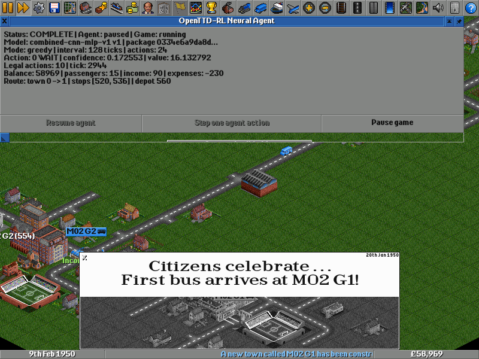
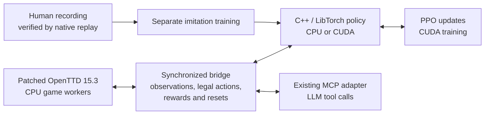

# OpenTTD RL

Train neural networks to play **real OpenTTD**, then compare neural policies,
scripted agents and LLMs in a shared transport economy.

**OpenTTD 15.3 runs on the CPU. CUDA accelerates the neural network.** This
repository patches the actual C++ game into a deterministic RL environment and
trains policies with C++/LibTorch PPO and a separate imitation objective.
The repository name `openttd-cuda-rl` refers to CUDA learning, not a GPU game engine.

The environment and training pipeline work. The strongest held-out result is a
small passenger-bus task; reliable general OpenTTD play is still the goal.



*Actual in-game screenshot from the V1 playback work. This is a still image,
not a recording of the latest bus-order imitation model.*

## How it works


```mermaid
flowchart LR
    Game["Patched OpenTTD 15.3<br/>CPU game workers"] <--> Bridge["Synchronized bridge<br/>observations, legal actions,<br/>rewards and resets"]
    Bridge <--> Policy["C++ / LibTorch policy<br/>CPU or CUDA"]
    Policy <--> PPO["PPO updates<br/>CUDA training"]
    Replay["Human recording<br/>verified by native replay"] --> Imitation["Separate imitation training"]
    Imitation --> Policy
    Bridge <--> MCP["Existing MCP adapter<br/>LLM tool calls"]
```

- **Environment:** source patches, deterministic stepping, action masks and
  resets expose the game's own rules and accounting.
- **Learning:** C++/LibTorch PPO, checkpoints, CUDA training and CPU references.
  Python handles orchestration and audits, not neural-network optimization.
- **Playback:** supported policy modes export to ONNX and run inside the game.
  The latest exact bus-order model currently requires the native runtime.
- **MCP:** [the existing server](scripts/dev/mcp_v2.py) exposes `observe`,
  `legal_actions`, `submit_action` and `step`. Local Gemma matches have run through
  it; packaging and useful competitive play remain unfinished. The latest
  bus-order model has not been qualified for shared MCP matches.

Simulation throughput depends on CPU game-worker capacity, process communication
and policy inference. GPU utilization alone does not establish faster games;
there is no demonstrated millions-of-games-per-night throughput here.

## Quickstart: check the source

Use Ubuntu 24.04, directly or through WSL2, and its system Python 3.12.
The current development branch is `codex/local-training-foundation`.

```bash
sudo apt-get update
sudo apt-get install -y git python3-jsonschema
git clone --branch codex/local-training-foundation https://github.com/goldbar123467/openttd-cuda-rl.git
cd openttd-cuda-rl
bash scripts/v2/verify.sh --tier fast --tools-python /usr/bin/python3
```

This runs offline repository checks. It does not train a policy or launch
the game, and needs no GPU, model weights or OpenTTD installation.

To train or watch a policy, follow the [host and dependency setup](docs/DEVELOPMENT.md#host-and-dependencies),
[native build](docs/DEVELOPMENT.md#build-and-verify-the-existing-c-implementation),
[isolated game build](docs/DEVELOPMENT.md#prepare-and-build-the-existing-game-integration),
[live PPO instructions](docs/DEVELOPMENT.md#train-on-real-openttd-transitions) and
[in-game playback guide](docs/DEVELOPMENT.md#export-and-watch-a-development-policy).
Those paths require additional toolchains and assets; CUDA runs fail explicitly
when CUDA is unavailable. Keep experimental game data separate from personal saves.

The [`V2 verification guide`](docs/project/V2_VERIFICATION.md) explains the tiers.
A clean clone can run fast without submodules or artifacts. After
`git submodule update --init --recursive`, that same clean checkout can run
contract. Neither tier validates retained live evidence.
Offline M23 semantic and package checks are not retained-live validation.
The default `full` tier additionally requires the documented live artifact tree.

## Results and limits

These are different experiments, not interchangeable measures of playing strength.

| Experiment | Observed result | Limitation |
| --- | --- | --- |
| V1 live PPO, 32×32 passenger-bus maps | Sampled service in **18/18 held-out episodes**; mean 2,017 passengers and 6,023 operating profit. Greedy service in 4/6. | Narrow fixed-map task. Mean cash after capital was −2,488; the one-bus script remains more cash-efficient. |
| Human bus-order imitation, October 2 | **12/12 exact training decisions**, uniquely selected without input aliases or ties. Native replay matches the manual save. | One recording, only 12 usable decisions. This demonstrates memorization of the training examples, not generalization. |
| Four-game human imitation pilot, October 5 | **53/79 exact training choices** after 256 CUDA updates. The equal-update one-game control transfers to 25/79. | Station insertions remain 4/23 and repayments 0/2; all four live continuations still drift and lose operating money. |
| Seven-game human imitation, October 5 | **128/186 training choices; 41/64 held-out choices**, versus 19/64 for the four-game model. | Twenty of 22 additional correct test choices are repayments. Other actions improve only from 19/44 to 21/44; training insertions remain 6/43. Isolated insertion training reaches only 21/43 after 1,000 updates. |
| Saved bus-control comparison, October 5 | **250 attempts and final saves** across four frozen neural models and one script; 247 reach the full budget. The new model delivers in 24/25 sampled and 0/25 greedy episodes. | Mean operating profit is −9,485 versus the script's +3,623; sustained profitable service is 0/50 versus 44/50. Three older-model attempts end at unsupported order states. Infrastructure is supplied; eight map seeds recur across dimensions. |
| Four short live bus-order runs | Greedy and sampled policies reproduce both target route sequences, setting Full load any cargo before starting the target bus. | Infrastructure was supplied; one context also supplied both buses. Later actions overbuy and repeat edits. All four runs have negative operating profit. |
| Shared-game MCP prototype | Local Gemma and neural agents execute through the same company-scoped interface. | Gemma chose WAIT on all 1,024 turns across four LLM matches; shared construction conflicts defeated both actors in eight scripted matches. Useful competition is not established. |

The October 2 imitation dataset contains two buys, three station insertions, three full-load
changes, one independent order copy, one deletion and two starts. Another 27
records are explicitly excluded. Unlogged waiting and human reasoning are not
labels. The live contexts test route setup, not learned construction or sustained
fleet management. Importing the weights into PPO preserves the fit before any
updates; retention after further PPO learning is unmeasured for this model.

The [ten-game human collection campaign](docs/HUMAN_DATASET_10_GAMES.md) now has
seven qualified training games with **186 exact choices**, including 32 repayments.
Game 08 is reserved for development, and games 09–10 for testing. Unsupported
construction and unlogged waiting remain outside supervised labels.

See the [V1 evaluation record](docs/PROGRESS.md),
[the ten-game training and gameplay figure gallery](docs/assets/human-ten-game-benchmark-2026-10-05/README.md),
[exact bus-order results and reproduction commands](docs/DEVELOPMENT.md#exact-bus-order-imitation-october-2)
and [MCP experiments](docs/DEVELOPMENT.md#shared-company-games-and-mcp).
Historical V2 corpus-training and scripted transport gates are not evidence of
general neural mastery of rail, ships, aircraft or a multimodal economy.

## Next steps

1. **Targeted learning and demonstrations.** Diagnose underfitting in station and
   bus targeting. Capture intentional waiting and human corrections in states
   visited by the policy; additional games alone do not resolve the current fit.
2. **Sustained fleet control.** Stop unnecessary purchases and destructive edits;
   measure imitation retention after bounded PPO updates, then evaluate on fresh
   scenarios against simple scripts.
3. **Package the existing MCP server.** Provide a reproducible client setup,
   qualify compatible models and keep information, action budgets and simulation
   time fair across participants.
4. **Measure collection throughput.** Benchmark parallel headless CPU workers
   and inference before committing to large demonstration or training campaigns.
5. **Make the result easier to try.** Publish a reproducible demo and a short
   genuine gameplay GIF once the selected policy and runtime are qualified.

## Repository guide

| Path | Purpose |
| --- | --- |
| [`training/`](training/) | C++ policies, PPO, imitation and development builds |
| [`integration/openttd/`](integration/openttd/) | Patches against pinned OpenTTD source |
| [`scripts/dev/`](scripts/dev/) | Local builds, live runs, human replay and MCP |
| [`docs/DEVELOPMENT.md`](docs/DEVELOPMENT.md) | Practical workflows, detailed results and known failures |
| [`docs/internal/`](docs/internal/README.md) | [Archived README ledger](docs/internal/README_HISTORY_2026-10-02.md), agent handoffs and historical reviews |
| [`AGENTS.md`](AGENTS.md) / [`GOAL.md`](GOAL.md) | Contributor instructions and longer-term scope |

Large model archives, human recordings, composed engine trees and runtime outputs
are kept outside the source checkout. Historical records describe their original
environments; they do not imply that a fresh clone has reproduced those runs.

## License

Project code is licensed under [GPL-2.0-only](LICENSE), with
[REUSE metadata](.reuse/dep5). Dependencies and the OpenTTD/OpenGFX screenshot
retain their own notices; see [third-party notices](THIRD_PARTY_NOTICES.md).
This is an independent project and does not imply OpenTTD endorsement.
