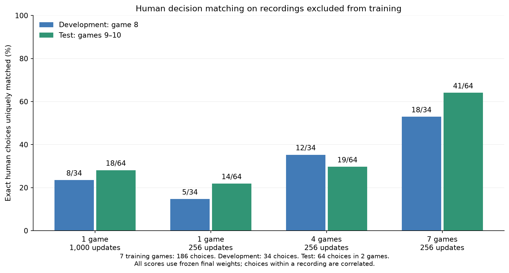
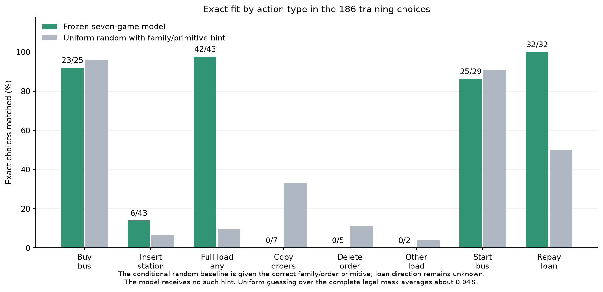
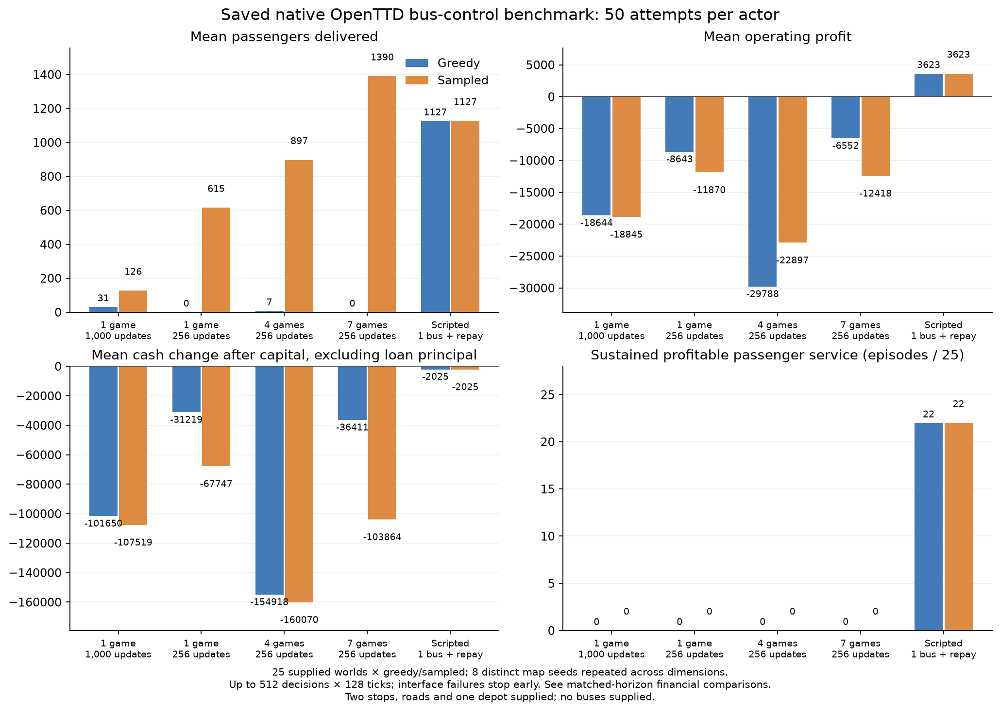

# Ten human games: training and gameplay figures

Results from the October 5, 2026 passenger-bus and money-management experiment.
All ten human recordings passed native replay checks. Seven games supplied 186
training choices, one supplied 34 development choices, and two supplied 64 test
choices. C++/LibTorch imitation training used CUDA; OpenTTD itself ran on the CPU.

The seven-game policy fits 128/186 training choices and matches 41/64 held-out
choices. Twenty of its 22 additional correct test choices relative to the
four-game policy are repayments. Other choices improve from 19/44 to 21/44.
The benchmark weights remained frozen throughout evaluation and the separate
insertion-only diagnostics. No PPO updates ran in this experiment.

## Human decision matching

[Download the figure as PDF](human-decision-comparison.pdf).
The test score covers two recordings; their 64 choices are not independent games.

## Training accuracy by action type

[Download the figure as PDF](action-type-diagnostics.pdf).
The conditional random baseline receives the correct family/order primitive;
the model receives no such hint. Loan direction still competes between borrowing
and repayment. Uniform guessing over the complete legal mask averages about 0.04%.

Training contains 43 insertions, seven copies and 32 repayments. The frozen model
fits 6/43, 0/7 and 32/32 respectively. All 43 insertion targets are present and
aligned, with no input aliases or changed semantic choices after row permutation.
Errors comprise 11 wrong stations, 12 wrong buses and 14 wrong action/order
primitives; six are correct and none are position-only errors. Separate
insertion-only CUDA fits reach 12/43 after 256 updates and 21/43 after 1,000.
The remaining underfitting points toward representation or optimization work.

## Saved native gameplay

[Download the figure as PDF](live-game-comparison.pdf).

| Frozen actor | Held-out choices | Delivering attempts | Mean operating profit | Sustained profitable service |
| --- | ---: | ---: | ---: | ---: |
| One game, 1,000 updates | 18/64 | 5/50 | -18,744.46 | 0/50 |
| One game, 256 updates | 14/64 | 22/50 | -10,256.58 | 0/50 |
| Four games, 256 updates | 19/64 | 25/50 | -26,342.34 | 0/50 |
| Seven games, 256 updates | 41/64 | 24/50 | -9,484.70 | 0/50 |
| One-bus repayment script | — | 48/50 | +3,623.16 | 44/50 |

The new model delivers in 24/25 sampled episodes and 0/25 greedy episodes.
Sustained profitable service requires deliveries and positive operating profit
in each of the final three complete 128-decision windows. Monetary values use
native game units. Loan principal is financing, separate from operating profit.

Each actor attempted 50 episodes on the same 25 saved starting worlds, using
greedy and seeded sampled modes. The deterministic script repeats in both groups.
Eight map seeds recur across dimensions: these are not 50 independent maps.
Roads, two stops and a depot are supplied; no buses are supplied. This measures
bus control and does not establish learned construction or general OpenTTD mastery.

All 250 attempts have native final saves. Of these, 247 reach 512 decisions × 128
ticks; three sampled older-model cases stop at unsupported order states (395,
329 and 239 decisions). All failures remain in the denominators and raw means.
Paired financial comparisons use equal simulated horizons. Relative to the
four-game policy, the new model improves mean operating profit by 17,202.58
at matched horizons, but trails the script by 13,107.86. All 127,427 decisions,
16,310,656 ticks, native financial ledgers and final save hashes passed independent
verification. Zero invalid actions and bankruptcies do not establish playing strength.

## Data and provenance

[Aggregate figure data](figure-data.json) includes the plotted values and paired
intervals. [The figure manifest](figure-manifest.json) records SHA-256 hashes of
all three PNGs, their PDF versions, the aggregate data, the source results and
the local plotting script. Full native traces, saved games, model archives and
execution source snapshots remain in the preserved local evidence package.
