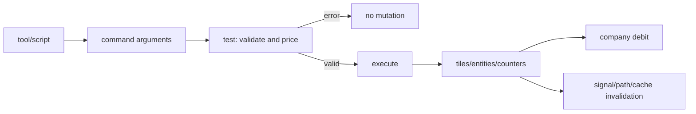
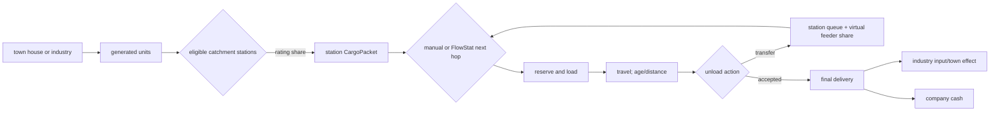

# OpenTTD gameplay, simulation/economy, and pathfinding specification

## Scope and evidence standard

This is a static source analysis of `/workspace/openttd-upstream` at commit
`29f808ef0022064e6d9a83c8476d1e0f4686af86`. It covers the gameplay-systems,
simulation/economy, and transportation-network/pathfinding assignments. The
checkout was not modified.

Confidence labels:

- **High**: directly visible in a named type, function, table, or timer.
- **Medium**: an architectural conclusion assembled from several direct call
  sites, or behavior that settings/NewGRF callbacks can alter.
- **Low**: not established; low-confidence items are questions, not claims.

Everything before **Clean-room C/CUDA/RL target** describes observed OpenTTD.
That final section is a proposal and is kept visibly separate.

## Executive findings

OpenTTD is a deterministic fixed-step tile simulation with several cadences
layered on one game tick. A tick is nominally about 27 ms, and 74 ticks form one
ordinary economy day. Calendar and economy clocks are separate: calendar time can
be slowed/frozen while economy time continues. Each active tick advances timers,
visits a deterministic fraction of map tiles, loads/unloads stations, ticks every
vehicle, updates towns/stations/industries/companies/cargo distribution, then runs
AI and GameScript.

There is no single universal transport graph. Four representations coexist:

1. Ground/water connectivity is implicit in tile bitfields and traversed as
   directional trackdirs.
2. Rail occupancy adds signals and per-track reservations.
3. Airports use finite-state transition tables and airport-block occupancy.
4. Cargo distribution uses a separate directed station `LinkGraph` per cargo,
   learned from vehicle service rather than directly from track tiles.

The cargo/economic loop is similarly layered. Producers create cargo; station
rating controls how much reaches a station; capacity and service control
throughput; CargoDist can choose intermediate station hops; only accepted final
delivery creates company cash. Transfers create a virtual feeder share for profit
attribution, not cash. Vanilla income is linear in accepted units and distance and
declines with cargo-specific transit time. Demand, capacity, and station rating
affect eligibility/throughput, not that per-unit formula directly.

An exact one-to-one port is a large compatibility project, not merely OpenTTD with
rasterization disabled. Behavior is coupled to fixed-point arithmetic, pool and
iteration order, RNG-call order, timer priority, NewGRF callbacks, scripts and
cache invalidation. An RL-first implementation should start with one mode, integer
rules and state-hash differential tests. CUDA is most useful for batches of
independent environments and observations; preserve a simple deterministic C
reference until parity is established.

## Core model and ownership

| Entity | Observed representation and lifecycle | Important relationships | Evidence | Confidence |
|---|---|---|---|---|
| Map/tile | `TileIndex` is a 32-bit typed index. `Map` dimensions are powers of two from 64 through 4096. `Tile` wraps parallel `TileBase` and `TileExtended` arrays. `TileBase` is exactly 8 bytes (`type`, `height`, `m1`–`m5`); extended storage contains `m6`, `m7`, `m8`. Metadata meaning is tile-type-specific. | Metadata can contain owner and town/industry/station IDs. `*_map.h` accessors are the semantic interface. | `src/tile_type.h`; `src/map_type.h`; `src/map_func.h`: `Tile`; `src/map.cpp`: `Map::Allocate`; `docs/landscape.html` | High |
| Tile behavior | Each tile type supplies `TileTypeProcs` for clear/draw, track status, acceptance/production, tile loop, ownership, vehicle entry and terraforming. | Data stays in compact map arrays; behavior dispatches by `TileType`. | `src/tile_cmd.h`: `TileTypeProcs`; `src/landscape.cpp` | High |
| Town | Pooled `Town` stores center, population/house/zone caches, growth, ratings/exclusivity/statues, supplied/accepted histories, received effects/goals and nearby stations. | Houses refer to towns; stations and industries have towns; cargo sources can be towns. | `src/town.h`; `src/town_cmd.cpp` | High |
| Industry | Pooled `Industry` owns footprint/type/town, production level/counter, produced and accepted cargo slots with waiting/history, nearby stations, owner/founder/date and optional neutral station. | Consumes accepted cargo and produces output; stations mediate both. | `src/industry.h`; `src/industry_cmd.cpp`; `src/economy.cpp` | High |
| Station | `BaseStation` contains sign tile, town, owner, facilities, rectangle/train area/build date. `Station` adds road stops, airport, dock state, catchment, accepted cargo, `GoodsEntry[]`, nearby-industry cache and loading vehicles. | `GoodsEntry` contains station cargo packets and CargoDist flows. Stations are both physical stops and cargo-network nodes. | `src/base_station_base.h`; `src/station_base.h`; `src/station_cmd.cpp` | High |
| Depot/waypoint | Pooled identities associated with mode-specific tiles and usable as order targets. | Vehicles service/build/sell in depots; waypoints shape routes. | `src/depot_base.h`; `src/waypoint_base.h`; mode `*_cmd.cpp` | High |
| Company | Pooled `Company` stores money, loans, infrastructure counts, bankruptcy, build limits, AI metadata, current/quarterly statistics and expense history. | Owns vehicles/infrastructure and is debited/credited by commands/delivery. | `src/company_base.h`; `src/company_cmd.cpp`; `src/economy.cpp` | High |
| Vehicle | Pooled `Vehicle` stores chain links, shared orders, tile/destination/exact coordinates, speed/progress, owner/engine, cargo/type/capacity, status/order, age/reliability/value/profit. Subclasses add mode movement. | Train consists are linked chains; multiple vehicles may share an `OrderList`. | `src/vehicle_base.h`; `src/train.h`, `roadveh.h`, `ship.h`, `aircraft.h` | High |
| Order | `Order` is compact type/flags/destination plus refit, wait/travel and max speed. `OrderList` owns a vector and timetable aggregates. Types include station, waypoint, depot, loading, leave-station, conditional, implicit and dummy. | Vehicle indices distinguish real and implicit progression. | `src/order_base.h`; `src/order_type.h`; `src/order_cmd.cpp` | High |
| Cargo packet | `CargoPacket` stores count, transit periods, source/tile, first station, travelled displacement, feeder share and next hop. Station cargo is keyed by next hop; vehicle cargo stages transfer/deliver/keep/load. | One packet model spans generation, routing, loading, transfer and payment. | `src/cargopacket.h` | High |
| Goal | Pooled `Goal` holds company/global scope, destination type/ID, text, progress and completion. | GameScript/deity commands control goals; sandbox score is separate. | `src/goal_base.h`; `src/goal.cpp`; `src/script/api/script_goal.cpp` | High |

Pool iteration order and stable typed IDs are observable simulation order. A
parity implementation cannot replace pools with unordered maps without changing
updates and random-call order.

## Gameplay-system specification

### World, terrain and map generation

**Inputs:** dimensions, generation seed, terrain/climate/sea settings,
town/industry density, GameScript and NewGRF content.

**Outputs:** allocated tile arrays; terrain, water/coast/river and climate zones;
towns, industries, objects, trees, companies, engines, disasters, script state and
warmed tile-loop state.

**Transitions/cadence:** `_GenerateWorld` seeds RNG, initializes economy, calls
terrain and clear-tile generation, counts land, generates towns/industries/objects/
trees, starts companies/engines/disasters/GameScript and performs tile-loop
warmup. At runtime, `RunTileLoop` visits `Map::Size()/256` tiles per tick in a
deterministic maximal-length Galois LFSR order; tile zero is special-cased. Every
tile's `tile_loop_proc` therefore runs once per 256 ticks. Commands and vehicle
actions can mutate tiles immediately.

**Dependencies/sources:** `src/genworld.cpp`: `_GenerateWorld`;
`src/landscape.cpp`: `GenerateLandscape`, `RunTileLoop`; `src/map.cpp`:
`Map::Allocate`; `src/map_func.h`: `Tile`; `src/tile_cmd.h`: `TileTypeProcs`.

**MVP:** fixed flat rectangular map; explicit `terrain`, `road_mask`,
`building_id`, `station_id` arrays instead of contextual `m1`–`m8` packing. Defer
procedural terrain, climates, water, bridges and tunnels. Preserve stable
row-major tile IDs and documented update order. **Confidence: High.**

### Towns, houses, passengers and mail

**Inputs:** house tile loops/specs, random values, generation/scaling settings,
recession, catchment stations and ratings, cargo deliveries, funding and growth
settings.

**Outputs:** passenger/mail packets, supplied/transported statistics, acceptance,
population/house changes, town roads/houses, ratings and growth state.

**Transitions/cadence:** completed houses reach `TileLoop_Town`. The original
generator performs rate-based random trials; the binomial generator counts
successful random bits. Both call `TownGenerateCargo`, which records production
and uses `MoveGoodsToStation`. Passenger and mail are ordinary cargo types with
town effects. House production follows the once-per-256-tick tile visit.
`OnTick_Town` counts down growth state; `GrowTown` attempts roads/buildings.
`UpdateTownGrowth` evaluates delivered cargo goals, active stations, funding and
settings, while `UpdateTownGrowthRate` computes cadence. The base growth constant
is 70 ticks; monthly/yearly economy callbacks update longer-term state.

For each eligible town-produced cargo, the original generator draws `r` and, if
its low byte is below the house rate, produces
`(low_byte * town_production_multiplier / TOWN_PRODUCTION_DIVISOR) / 8 + 1`.
The binomial variant sets `(rate + 7) / 8` candidate bits (capped at 32), counts
set bits in `r & mask`, and applies the cargo multiplier/divisor. Recession halves
affected output with `(amount + 1) >> 1`; cargo-scale settings apply afterward.

**Dependencies/sources:** `src/town.h`: `Town`; `src/town_cmd.cpp`:
`TileLoop_Town`, `TownGenerateCargoOriginal`, `TownGenerateCargoBinomial`,
`TownGenerateCargo`, `OnTick_Town`, `GrowTown`, `UpdateTownGrowth`,
`UpdateTownGrowthRate`, `_economy_towns_monthly`.

**MVP:** one producer/consumer node per town, fixed population, deterministic
passenger rate, monthly growth from a delivered/service ratio; no house or town-
road construction. Add mail later. **Confidence: High.**

### Industries

**Inputs:** definitions, production level/rates, input stockpiles, RNG, economy
mode, transported percentage, cargo scale, NewGRF callbacks and station ratings.

**Outputs:** output cargo, station packets, input consumption/conversion,
production change, closure/new-industry events and histories.

**Transitions:** each tick `ProduceIndustryGoods` decrements a counter. Normally,
every 256 counter steps it adds each scaled `rate` to output `waiting`; callback
industries can use a scale-adjusted interval. Industry tile loops call
`TransportIndustryGoods`, remove a bounded chunk and send it to nearby stations.
Final delivery increments accepted input. `TriggerIndustryProduction` converts:

```text
output_waiting += input_waiting * input_cargo_multiplier[input][output] / 256
```

and clears input, unless callbacks own production behavior.

**Cadence:** output accrual normally every 256 ticks; accepted waiting is sampled
daily with industry-index staggering. A map-size-scaled economy-day loop performs
random build/production-change attempts. The economy-month loop rolls statistics,
deletes already-closing industries and runs monthly change logic.

**Dependencies/sources:** `src/industry.h`; `src/industry_cmd.cpp`:
`ProduceIndustryGoods`, `OnTick_Industry`, `TransportIndustryGoods`,
`ChangeIndustryProduction`, `_economy_industries_daily`,
`_economy_industries_monthly`; `src/economy.cpp`: `DeliverGoodsToIndustry`,
`TriggerIndustryProduction`.

**MVP:** fixed producers/consumers, one input/output each, constant rate, no
closure/random changes; processing uses one explicit integer ratio. **Confidence:
High.**

### Stations and catchment

**Inputs:** station facilities and surroundings, visiting vehicles, last pickup
age/speed/vehicle age, cargo waiting, statue/exclusivity and CargoDist settings.

**Outputs:** catchment/acceptance, cargo queues, rating, reservations, vehicle
load/unload, link capacity/usage/time statistics.

**Transitions:** `MoveGoodsToStation` filters catchment stations by service,
facility and exclusivity. With one station, amount is multiplied by `rating+1`
and passed through an 8-bit fraction in `UpdateStationWaiting`. With multiple, it
allocates among companies using each company's best rating, then among that
company's stations by rating, with stable high-rating rounding. A `CargoPacket`
enters `StationCargoList` and link supply is updated.

`UpdateStationRating` derives a target from pickup speed, time since pickup,
waiting cargo, statue and vehicle age; actual rating changes by at most two per
update. Low rating can decay waiting cargo. `LoadUnloadStation` advances each
vehicle's countdown and `LoadUnloadVehicle` stages deliver/transfer/keep/load,
reserves/loads packets and updates link stats.

**Cadence:** load/unload is offered every tick before vehicle movement. Rating,
acceptance and stale-link cleanup are distributed over 185, 250 and 504 ticks.

**Dependencies/sources:** `src/station_base.h`: `Station`, `GoodsEntry`;
`src/station_cmd.cpp`: `MoveGoodsToStation`, `UpdateStationWaiting`,
`UpdateStationRating`, `OnTick_Station`; `src/economy.cpp`:
`LoadUnloadStation`, `LoadUnloadVehicle`; `src/cargopacket.h`.

**MVP:** one-tile stops, Manhattan catchment, FIFO per cargo, binary acceptance,
constant service fraction and fixed units loaded/unloaded per tick. Defer rating
decay, exclusivity and CargoDist. **Confidence: High.**

### Infrastructure, depots, bridges, tunnels, construction and demolition

**Inputs:** command arguments, owner, tile slope/type/occupancy, mode compatibility,
authority/settings, vehicles, money and price tables.

**Outputs:** tile/entity mutation, infrastructure counts, company cost,
signal/path invalidation and deterministic command success/error.

**Transitions:** commands use test-then-execute. `CommandHelper` invokes a
non-`Execute` validation/cost pass, then execute after ownership/money/network
checks. `InternalExecuteProcessResult` asserts test/execute cost equality where
supported, debits the company, records build location and flushes signal updates.
Build/remove handlers maintain tile metadata and infrastructure counts. Bridges
and tunnels are linked special endpoints spanning intermediate tiles.



**Cadence/dependencies:** event-driven; construction immediately affects later
work according to command order. Signal recalculation may be buffered until the
top-level command finishes.

**Sources:** `src/command_func.h`: `CommandHelper`; `src/command.cpp`:
`InternalExecuteValidateTestAndPrepExec`, `InternalExecuteProcessResult`;
`src/rail_cmd.cpp`: `CmdBuildSingleRail`; `src/road_cmd.cpp`:
`CmdBuildLongRoad`; `src/station_cmd.cpp`: `CmdBuildRailStation`,
`CmdBuildRoadStop`, `CmdBuildAirport`, `CmdBuildDock`; `src/water_cmd.cpp`;
`src/tunnelbridge_cmd.cpp`; `src/landscape_cmd.cpp`.

**MVP:** atomic `build_road`/`build_stop`; validate bounds, terrain, occupancy,
adjacency and cash; mutate only after all checks. No slopes, authority, bridges,
tunnels, shared ownership or drag tools. **Confidence: High.**

### Vehicles and all four modes

**Shared inputs/outputs:** a depot command, engine availability, owner/funds,
refit/orders create a pooled mode vehicle or consist, purchase debit/value,
capacity and stopped status. Each `Tick()` advances controller state; daily work
ages/services vehicles, updates reliability/breakdowns and running cost. Sale has
mode-specific stopped/depot conditions and credits current value.

Movement occurs each game tick. Economy-day and calendar-day work is spread over
all 74 ticks using pool index modulo the timer day fraction; it is not one bulk
phase. Cargo aboard a vehicle ages on that vehicle's cached cargo-age period; the
default engine value is 185 ticks, but content can change it. Station-waiting
cargo is not passed through `VehicleCargoList::AgeCargo`.

| Mode | Representation and state transition | Special dependencies | Evidence | MVP |
|---|---|---|---|---|
| Train | Rail trackdirs, linked consist, signals/reservations. `Train::Tick` runs front/consist movement and can reserve a YAPF route. | Rail compatibility, acceleration, length, stations, reversing, curves/slopes, block/PBS signals. | `src/train_cmd.cpp`: `Train::Tick`, `TrainLocoHandler`, `ChooseTrainTrack`, `TryPathReserve`; rail YAPF | Defer; later use single-tile trains and exclusive edges. |
| Road | Road/tram trackdirs and per-vehicle cached path. Controller follows route and enters stops/depots. | One-way roads, curves/slopes/crossings, overtaking, stop occupancy and drive side. | `src/roadveh_cmd.cpp`; `src/pathfinder/yapf/yapf_road.cpp` | Best first mode: one lane, no overtaking/crossings. |
| Ship | Water trackdirs, 16×16 water regions and cached low-level path. | Docks, locks, aqueducts, water speed, lanes and occupancy penalties. | `src/ship_cmd.cpp`; ship YAPF and `water_regions.cpp` | Defer; later explicit sparse water graph. |
| Aircraft | Airport finite-state automaton/block occupancy and direct inter-airport flight. | Layout, terminal/hangar/runway blocks, range and crash rules; no inter-airport tile YAPF. | `src/aircraft_cmd.cpp`; `src/airport.h`, `src/airport.cpp` | Defer; later direct edges with capacity semaphores. |

**Shared sources:** `src/vehicle_base.h`; `src/vehicle.cpp`:
`CallVehicleTicks`, `RunEconomyVehicleDayProc`, `RunVehicleCalendarDayProc`;
`src/vehicle_cmd.cpp`: `CmdBuildVehicle`; mode files above.

**Shared MVP:** fixed-capacity road vehicles with `STOPPED`, `TRAVELLING`,
`LOADING`, `UNLOADING`; no articulation, breakdowns, servicing, refit,
depreciation or autoreplace. Stable IDs and integer progress. **Confidence: High.**

### Orders, schedules and waypoints

**Inputs:** order list/indices, position, station/via/depot/load flags,
conditionals, timetable values/lateness and mode rules.

**Outputs:** `current_order`, destination, possible reverse, loading state, order
advance, measured timetable and implicit visited-stop orders.

**Transitions:** `ProcessOrders` preserves special depot/loading/leaving states,
detects reached via destinations, evaluates the real order (including
conditionals), copies it to `current_order`, then calls `UpdateOrderDest`. Arrival
controllers call `Vehicle::BeginLoading`, which turns a station order into
`OT_LOADING` or inserts an implicit stop, records travel/link data and stages
unload. `HandleLoading` waits for cargo/timetable completion; `LeaveStation`
cancels reservations, updates data and enters `OT_LEAVESTATION`; the index advances.

```text
STOPPED/DEPOT -> select order -> path/TRAVELLING -> destination reached
-> BeginLoading/LOADING -> deliver/transfer/load -> wait satisfied
-> LeaveStation -> advance order -> next destination
```

**Cadence/dependencies:** evaluated from mode controllers, often every tick or at
route/station transitions; loading every tick; timetable values are tick-based.

**Sources:** `src/order_base.h`; `src/order_cmd.cpp`: `ProcessOrders`,
`UpdateOrderDest`; `src/vehicle.cpp`: `Vehicle::BeginLoading`, `HandleLoading`,
`LeaveStation`; mode arrival handlers.

**MVP:** circular `GOTO_STOP` only; no shared/implicit/conditional/waypoint/depot/
refit/full-load/timetable orders. **Confidence: High.**

### Company finance, loans, costs and progression

**Inputs:** command costs, cargo delivery, running ticks, infrastructure counts,
price tables, interest/inflation/difficulty, loan actions, calendar/economy time,
assets and engine introduction dates.

**Outputs:** cash/loan, categorized expenses, quarterly income/expense/delivery,
company value/score, bankruptcy, vehicle and track technology availability.

**Transitions:** normal money paths converge on `SubtractMoneyFromCompany`:
`money -= cost`, then the categorized ledger is updated. Revenues are negative
costs, so they credit cash. Commands debit after successful execution. Loans use
`LOAN_INTERVAL = 10000` units unless an explicit allowed amount is supplied.
Purchase uses engine cost plus refit where applicable. Sale credits a negative
cost based on current value.

A new company starts with cash equal to its initial current loan: the configured
`INITIAL_LOAN` scaled by price inflation, rounded down to a 10,000 interval and
capped by maximum loan. Borrowing increases both cash and current loan; repayment
decreases both after an available-money check.

Daily running cost per mode is:

```text
cost = GetRunningCost() * running_ticks / (365 * 74)
```

with mode-specific consist aggregation and fractional carry where used. Optional
monthly infrastructure maintenance is nonlinear:

```text
rail(rt) = price_rail * rail_multiplier(rt) * n_rt
           * (1 + isqrt(total_rail)) >> 11
signals  = price_rail * 15 * n * (1 + isqrt(n)) >> 8
road(rt) = price_road * road_multiplier(rt) * n_rt
           * (1 + isqrt(total_road_or_tram_class)) >> 12
canals   = price_water * n * (1 + isqrt(n)) >> 6
stations = price_station * n * (1 + isqrt(n)) >> 7
airports = sum(price_airport * airport_spec.maintenance_cost) >> 3
```

Monthly interest constructs an exact annual fee and charges the difference
between cumulative month fractions:

```text
yearly_fee = current_loan * interest_rate / 100
if available_money < 0:
    yearly_fee += -available_money * interest_rate / 100
charge = yearly_fee * (month + 1) / 12 - yearly_fee * month / 12
```

It also charges `StationValue / 4` as “other.” Bankruptcy is checked monthly;
company history/value/rating rolls in economy months 0, 3, 6 and 9.

Calendar-month inflation updates separate fixed-point price/payment factors by
approximately `factor += factor * configured_rate * 54 >> 16`.
`RecomputePrices` applies difficulty/content multipliers, computes cargo payments,
and rounds maximum loan down to a 10,000 multiple. Normal checked inflation stops
outside the original supported calendar-year span.

Engine progression is calendar-based. `StartupOneEngine` assigns deterministic
introduction timing; calendar callbacks handle preview, availability and
reliability. Content callbacks can alter properties.

**Cadence:** purchase/build/sale at command time; running costs per-vehicle
economy day, spread through the 74 ticks; interest/infrastructure/bankruptcy each
economy month; history/score each economy quarter; inflation each calendar month;
technology/reliability on calendar callbacks.

**Sources:** `src/company_base.h`; `src/company_cmd.cpp`:
`SubtractMoneyFromCompany`; `src/misc_cmd.cpp`; `src/economy.cpp`:
`CompaniesPayInterest`, `CompaniesGenStatistics`, `AddInflation`,
`RecomputePrices`, `UpdateCompanyRatingAndValue`; `src/economy_type.h`;
`src/rail.h`, `src/road_func.h`, `src/water.h`, `src/station_func.h`,
`src/station.cpp`; mode `*_cmd.cpp` running-cost handlers; `src/engine.cpp`.

**MVP:** signed 64-bit cash, fixed build/vehicle prices and fixed per-moving-tick
cost. Defer interest, inflation, nonlinear maintenance, depreciation, bankruptcy,
subsidies and technology dates. **Confidence: High** for formulas/cadence;
**Medium** across arbitrary NewGRF content.

### Competitors, scripts, goals, scoring and sandbox end

**Inputs:** competitor settings/speed, network authority, script VM/events,
calendar end year, company statistics and GameScript goal commands.

**Outputs:** AI companies/commands, scenario events, global/company goals and
progress, performance score and an end-game chart.

**Transitions/cadence:** `AI::GameLoop` is server-authoritative in multiplayer and
throttles scripts by competitor speed. `OnTick_Companies` considers starting
competitors at configured/random intervals. AIs issue normal script commands.
`Game::GameLoop` runs GameScript and can create/update goals using deity commands.
The base performance score is weighted by `_score_info` and updated quarterly.
At the configured ending year, the high-score chart appears; this does not
generally stop simulation. Without a GameScript objective, play is sandbox.

AI/GameScript run after the core tick; GameScript may still run while world
simulation is paused (except modal/debug conditions). Competitor starts use game
tick timers; end-chart behavior uses calendar year.

**Sources:** `src/openttd.cpp`: `StateGameLoop`; `src/ai/ai_core.cpp`:
`AI::GameLoop`; `src/game/game_core.cpp`: `Game::GameLoop`;
`src/company_cmd.cpp`: `OnTick_Companies`; `src/goal_base.h`, `src/goal.cpp`;
`src/economy.cpp`: `_score_info`, `UpdateCompanyRatingAndValue`;
`src/highscore_gui.cpp`: `ShowEndGameChart`.

**MVP:** one company, no script VM/competitors. Define RL episode termination
explicitly (time limit, bankruptcy or delivery target), outside the transition
function; expose reward components. **Confidence: High.**

## Exact simulation loop

### Clocks

`TimerGameTick` is monotonic fixed-step time. `Ticks::DAY_TICKS` is 74 and source
comments document about 27 ms/tick. `TimerGameEconomy` advances one fraction per
active tick and emits day/week/month/quarter/year; wallclock-unit mode can use
30-day months and 360-day years. `TimerGameCalendar` drives engine aging/
introduction, inflation and end year and may be slowed or frozen. “Day” must
therefore be qualified as economy or calendar. `IntervalTimer` priorities order
callbacks within a clock.

### Normal-mode ordering

```text
StateGameLoop():
    update link-graph pause control
    if paused or modal:
        run GameScript in normal mode when permitted
        return

    CheckCaches()
    current_company = OWNER_NONE
    enter persistent-storage game-loop mode

    AnimateAnimatedTiles()
    if CalendarTimer.Elapsed(): RunVehicleCalendarDayProc()
    EconomyTimer.Elapsed()
    TickTimer.Elapsed(1)

    RunTileLoop()                    # deterministic 1/256 map batch
    CallVehicleTicks():
        clear autoreplace visits
        RunEconomyVehicleDayProc()
        for station in pool order: LoadUnloadStation(station)
        for vehicle in pool order:
            vehicle.Tick()
            age its onboard cargo when its cached period expires
            perform post-vehicle animation work

    CallLandscapeTick():
        OnTick_Town()
        OnTick_Trees()
        OnTick_Station()
        OnTick_Industry()
        OnTick_Companies()
        OnTick_LinkGraph()

    leave persistent-storage game-loop mode
    AI::GameLoop()
    Game::GameLoop()
    update limits, windows and news
```

Timer callbacks precede tile/vehicle work, so a day/month callback can affect
that tick's movement/production. Station loading precedes vehicle movement.
Station iteration precedes vehicle iteration. These are parity-sensitive.

The editor branch runs tile, vehicle and landscape callbacks without advancing
the three normal timers. A paused normal game skips the world transition while
GameScript may execute. **Confidence: High.**

### Update-cadence inventory

| Cadence | Work | Source/symbol | Confidence |
|---|---|---|---|
| Every active tick | timers, tile batch, all station load/unload, all vehicles, town/tree/station/industry/company/linkgraph, AI/GameScript | `src/openttd.cpp`: `StateGameLoop`; `src/vehicle.cpp`: `CallVehicleTicks`; `src/landscape.cpp`: `CallLandscapeTick` | High |
| 70-tick base | town growth machinery, modified by per-town counters/rate | `src/timer/timer_game_tick.h`; `src/town_cmd.cpp` | High |
| 74 ticks/economy day | economy day; per-vehicle daily work spread by index; industry daily budget | tick constants, `src/vehicle.cpp`, `src/industry_cmd.cpp` | High |
| 185 ticks | station-rating cycle; default onboard cargo-aging period (vehicle/content cache may differ) | tick constants; station/vehicle/cargo code | High |
| 250 ticks | station acceptance refresh | `STATION_ACCEPTANCE_TICKS`; `OnTick_Station` | High |
| 256 ticks | each tile once; normal industry output accrual | `RunTileLoop`; `ProduceIndustryGoods` | High |
| 504 ticks | stale station link cleanup | `STATION_LINKGRAPH_TICKS`; `OnTick_Station` | High |
| Economy month | interest, maintenance, bankruptcy, towns/industries/history | interval timers in economy/town/industry code | High |
| Economy quarter | company history, value, performance | `CompaniesGenStatistics` | High |
| Calendar day/month/year | vehicle calendar aging, engine lifecycle, inflation, end year | vehicle/engine/economy/highscore code | High |

## Cargo-flow and economy model

### End-to-end state machine



1. A house tile loop or industry output creates an integer amount.
2. `MoveGoodsToStation` filters catchment/facility/service rules. Rating controls
   capture and station split.
3. `UpdateStationWaiting` preserves an 8-bit fractional remainder and creates a
   `CargoPacket` with origin/first station.
4. Manual distribution can leave destination unresolved. CargoDist uses
   `FlowStatMap` next-hop shares from the latest link-graph job.
5. Loading reserves matching packets up to capacity/refit/order rules; gradual
   loading can take multiple ticks.
6. Packets aboard vehicles age when that vehicle's cached age period expires
   (default 185 ticks) and carry travelled displacement. Station-waiting packets
   are not aged by `VehicleCargoList::AgeCargo`.
7. Unload stages keep, transfer or deliver. Transfer returns a packet to station
   cargo and adds virtual feeder share, not cash. Delivery tests acceptance,
   consumes accepted units, computes revenue and credits cash when `CargoPayment`
   is destroyed.
8. Industry input delivery can trigger input-to-output conversion; output still
   awaits its normal station path.

### Vanilla revenue and transfer accounting

Let `n` be accepted units, `d` packet distance, `t` transit periods scaled by the
cargo-aging-rate percentage, `p1/p2` cargo thresholds and `P` current payment.

```text
over1 = max(t - p1, 0)
over2 = max(over1 - p2, 0)
time_factor = max(255 - over1 - over2, 31)
income = (d * time_factor * n * P) >> 21       # BigMulS semantics
```

The boundary variable is computed exactly as:

```text
periods_over_max = 31 - 255
if p2 > 255 - 31:
    periods_over_max += t - p1
else:
    periods_over_max += 2 * (t - p1) - p2
```

When `periods_over_max > 0`, the code uses a four-fraction-bit asymptotic factor:

```text
time_factor_fp = max(2 * 31 * 16 * 16 / (periods_over_max + 32), 1)
income = (d * time_factor_fp * n * P) >> 25
```

Otherwise it uses the linear formula. A NewGRF profit callback can replace both.
Subsidy settings then multiply profit by 1.5, 2, 3 or 4. Only accepted units are
paid.

`CargoPayment::PayTransfer` calculates virtual feeder credit:

```text
increment = (-prior_feeder_share_for_units
             + hypothetical_income(source -> transfer point))
increment = increment * feeder_payment_share_percent / 100
```

The packet carries it onward. Final delivery adds actual route revenue to cash
and subtracts feeder shares only from the final vehicle's displayed profit. The
destructor credits the actual delivery total as a negative revenue cost.

**Effects:** distance/time directly alter vanilla unit income. Acceptance/demand
is a delivery gate, not a price curve. Capacity changes throughput, not unit
income. Service rating changes captured cargo/queue loss, not unit income.
CargoDist demand changes destination flow, not `GetTransportedGoodsIncome`.
NewGRFs can override vanilla conclusions. **Confidence: High** for vanilla,
**Medium** with arbitrary content.

**Sources:** `src/economy.cpp`: `GetTransportedGoodsIncome`, `DeliverGoods`,
`CargoPayment::PayFinalDelivery`, `PayTransfer`, destructor,
`TriggerIndustryProduction`; `src/station_cmd.cpp`: `MoveGoodsToStation`,
`UpdateStationWaiting`; `src/cargopacket.h`.

### Essential versus advanced economics

Essential feedback is producer -> station capture -> capacity/frequency ->
accepted delivery -> cash/destination counters. Town growth and industry change
then use history to alter future production. These can be deferred from an MVP:

- rating inertia, queue decay and exclusivity;
- CargoDist demand/multicommodity routing;
- recession, subsidies, inflation and nonlinear infrastructure maintenance;
- randomized industry changes/closure/building;
- house-by-house town construction;
- reliability, breakdowns, servicing, previews and autoreplace;
- NewGRF callbacks.

## Physical transport networks and pathfinding

### Implicit tile graph

Rail, road and water nodes/edges are derived on demand from tile metadata.
`GetTileTrackStatus` returns directional connectivity and track bits become
trackdirs. `CFollowTrackT` enters an adjacent tile, checks owner/type
compatibility, tunnel/bridge/station/depot behavior, one-way/signal restrictions,
sharp turns and reservations, then yields outgoing trackdirs. Mode accessors
decode packed fields:

- `src/rail_map.h`: tracks, railtype, signal type/state and reservation bits;
- `src/road_map.h`: road/tram bits/types/owners and crossing/depot/normal state;
- `src/water_map.h`: water class/type, locks, depots and navigability;
- `src/tunnelbridge_map.h`: linked endpoints and transport type.

Map construction is graph construction: changing a bit changes successors. This
minimizes persistent graph memory but makes traversal branch-heavy and tightly
coupled to tile encoding. **Confidence: High.**

### YAPF algorithm inventory

`CYapfBaseT::FindPath` is an A*-family best-first search. Its node-list container
maintains open priority and open/closed hash lookup. The loop selects the best
open node, tests destination, follows successors, and stops on success, empty open
set or `max_search_nodes` (documented default 10,000). Mode mixins define cost and
heuristic.

YAPF frequently searches *segments* rather than every geometric tile. A node is
keyed by segment-start tile/trackdir; a track follower walks deterministic
non-choice tiles until a choice/end. This reduces heap operations.

| Pathfinder | Observed cost/heuristic inputs | Cache/optimization | Source | Confidence |
|---|---|---|---|---|
| Rail | track length, curves, slopes, switches, station/platform, speed, crossings, signal type/state, reservation and reverse/depot penalties; destination distance | global segment-cost cache; variants for 90-degree turns, depots and safe reservation targets | `src/pathfinder/yapf/yapf_rail.cpp`, `yapf_costrail.hpp`, `yapf_node_rail.hpp`, `yapf_costcache.hpp` | High |
| Road | length, curves/slopes, crossings/stops, occupancy, speed limits and destination distance | per-road-vehicle path vector reused while valid | `src/pathfinder/yapf/yapf_road.cpp`, `yapf_costroad.hpp` | High |
| Ship | water length, curves, docking occupancy, preferred lane, water speed, locks/aqueducts | two-level 16×16 water-region then low-level search; per-ship vector | `src/pathfinder/yapf/yapf_ship.cpp`, `yapf_ship_regions.cpp`, `src/pathfinder/water_regions.cpp` | High |
| Airport | FTA transition and occupied airport blocks, not tile YAPF between airports | static movement/transition tables and block bitsets | `src/airport.h`, `src/airport.cpp`, airport tables, `src/aircraft_cmd.cpp` | High |

The rail segment cache keeps endpoint, cost, last-signal and end-reason data keyed
from tile/trackdir. `CSegmentCostCacheBase::s_rail_change_counter` changes when
track layout changes; pathfinder cache users notice and invalidate. Water-region
component labels are invalidated by water-connectivity changes. Vehicle path
vectors are rejected when destination or next element is invalid.

### Rail signals and path reservation

`SignalType` has block, entry, exit, combo, path and one-way path behavior; state
is red/green. `signal.cpp` buffers changed track sides. `UpdateSignalsInBuffer`
calls `ExploreSegment`, a flood traversal collecting train presence, presignal
exits/green state, PBS/split and other flags, then changes signal state. Fixed
small traversal containers and flush thresholds bound normal buffered work.

Path-based signaling stores reservations in rail track bits, with special rules
for station, depot and tunnel/bridge spans. `TryReserveTrack` rejects occupied or
overlapping/conflicting reservations. `TryPathReserve` uses
`YapfTrainChooseTrack` to find/reserve a safe route; reservation code rolls back
new pieces if it cannot complete the reservation. The consist releases track
behind/under it as appropriate. Construction touching rail releases/rebuilds
affected reservations and signals.

This is not one Boolean per block/tile: diagonal overlap, direction, platform and
special-span rules are mode-specific. **Confidence: High.**

**Sources:** `src/signal_type.h`; `src/signal.cpp`: `ExploreSegment`,
`UpdateSignalsInBuffer`; `src/rail_map.h`: `TryReserveTrack`/signal accessors;
`src/pbs.cpp`; `src/train_cmd.cpp`: `TryPathReserve`, `ChooseTrainTrack` and
release; `src/pathfinder/yapf/yapf_rail.cpp`: `YapfTrainChooseTrack`.

### Cargo-routing station graph

CargoDist is independent of the physical graph. A `LinkGraph` is a connected
station component for one cargo. Nodes store station, position, supply and demand;
directed edges store capacity, usage, travel time and update dates. When a vehicle
travels between loading stations, `IncreaseStats`/`LinkRefresher` creates or
updates service edges and may join components. Stale service removes links and
can split/compress graphs.

`LinkGraphSchedule` snapshots a component into `LinkGraphJob` and runs
initialization, demand, two multicommodity-flow passes and flow mapping. Jobs may
run in background threads but join at deterministic schedule points; pause control
can stop the simulation if a required job is unfinished. Demand can be manual,
symmetric or asymmetric by cargo/settings/distance. Modified shortest path and
multicommodity flow account for capacity/saturation. Express cost includes average
travel time plus a day-scale penalty; freight uses geometric distance.
`FlowMapper` writes per-station, per-origin `FlowStat` next-hop shares used by
packets.

**Sources:** `src/linkgraph/linkgraph.h`, `linkgraphjob.h`,
`linkgraphschedule.h`, `demand.cpp`, `mcf.cpp` and flow mapper;
`src/station_base.h`: `FlowStat`, `FlowStatMap`; station `IncreaseStats`;
`src/openttd.cpp`: link-graph pause control.

**Confidence: High** for representation/pipeline/concurrency; **Medium** for a
summary of all cost terms because cargo/settings select specializations.

### Caches, invalidation and performance risk

| Derived state | Refresh/invalidation | Risk and safe MVP choice |
|---|---|---|
| Company infrastructure counts | every relevant build/remove; checked by cache validation | Missed deltas alter money/save state. Maintain directly and test by full recount. |
| Station catchment/nearby industries/acceptance | station/map changes and periodic acceptance | Alters cargo eligibility. Recompute small MVP catchments instead of caching. |
| Vehicle path vectors | order/destination change, invalid next edge, construction | Stale path diverges movement. Add one global `map_version`. |
| Rail YAPF segment cache | layout change counter/segment validation | Important at scale, unnecessary initially. |
| Rail signals/reservations | construction, train movement, reserve/free/rollback, buffered flush | Very high collision/deadlock risk. Exclude from road MVP. |
| Water regions | affected water connectivity | Omit with ships. |
| LinkGraph/`FlowStatMap` | service changes, stale links, periodic scheduled job | Complex and concurrent. Use direct/manual cargo first. |

### Simpler MVP path design

Represent each road tile as up to four directed `(tile,direction)` neighbors. Run
deterministic A* on destination or map-version change:

```text
g = traversed edge count
h = Manhattan distance
priority = (g + h, h, tile_id, direction)   # complete stable tie-break
```

Cache the tile-ID vector with a `map_version`; increment on road mutation. Replan
on version mismatch or invalid next edge. Treat vehicle occupancy as a movement
constraint, not a topology change, to avoid replanning each tick.

For later rail, start with an explicit directed graph and one exclusive owner per
edge. Reserve a bounded lookahead in stable vehicle-ID order, wait when unavailable
and release behind. Add signal semantics only after reservation model tests. This
is a proposal, not an assertion about OpenTTD.

## Clean-room C/CUDA/RL target (proposal)

### Declare the compatibility level

“Exact one-to-one” needs a boundary:

1. **Behavioral MVP:** same build/buy/order/carry/earn loop, not identical ticks.
2. **Restricted scenario parity:** identical canonical state hashes for a frozen
   subset (for example flat map, roads, one cargo, no content/scripts).
3. **Save/network parity:** compatible state, RNG, commands and all modes; this
   effectively requires most simulation semantics and appropriate treatment of
   upstream GPL-derived code/data.

Level 2 over an explicit subset is the feasible first target. Removing rendering
does not remove order, tile, station, callback, script, allocation, timing or
cache behavior.

### Minimal deterministic data model

Use structure-of-arrays with stable integer handles and keep a readable C
reference transition:

```c
typedef struct {
    uint16_t width, height;
    uint8_t *terrain;
    uint8_t *road_mask;       /* N/E/S/W */
    int32_t *stop_id;
    int32_t *producer_id;
    int32_t *consumer_id;
} World;

typedef struct {
    int64_t cash;
    uint64_t tick;
    uint64_t rng_state;
    World world;
    ProducerSoA producers;
    ConsumerSoA consumers;
    StopSoA stops;
    VehicleSoA vehicles;
    OrderSoA orders;
} Sim;
```

Serialized canonical state must include tick, RNG, allocation/free-list state,
ordered active IDs, map connectivity, vehicle progress/order, cargo queues and
fractional production/cost carries. Exclude rebuildable caches from hashes.

### MVP rules and transition

- Flat fixed map, one company/road type/producer cargo/consumer.
- Fixed-speed/capacity road vehicles and one-cell occupancy.
- One-tile stops, fixed Manhattan catchment, circular `GOTO_STOP` orders.
- Fixed integer production/load/unload and build/purchase/moving costs.
- Revenue linear in delivered units/distance with integer age penalty.
- No CargoDist, signals, AI, town construction, callbacks, inflation or failure.

```text
step(sim, action):
    apply_action_transactionally(sim, action)

    for producer_id in ascending order:
        producer.frac += producer.rate
        units = producer.frac / RATE_DENOM
        producer.frac %= RATE_DENOM
        enqueue units at eligible stop; tie-break by stop_id

    for vehicle_id in ascending order:
        if LOADING: move min(load_rate, free_capacity, matching_queue)
        if UNLOADING: deliver min(unload_rate, onboard)
        if TRAVELLING:
            advance integer edge progress
            on edge end, occupy next cell or wait
            on stop arrival, enter UNLOADING then LOADING
        charge moving cost only when progress advances

    sim.tick += 1
    reward = cash_delta + delivered_bonus - invalid_action_penalty
    done = tick_limit || bankruptcy || delivery_target
    return observation, reward, done, canonical_state_hash
```

```text
age_factor = max(MIN_FACTOR, MAX_FACTOR - age_ticks / AGE_DIVISOR)
revenue = units * manhattan(source,destination) * cargo_rate
          * age_factor / SCALE
```

Use 64-bit intermediates, explicit division rounding and no floating point in
canonical transitions.

### CUDA boundary

Parallelize across **independent environments** first, not arbitrary entities in
one world. Keep command validation, allocation, variable queues, A*, order state,
collision arbitration and canonical hashing on reference C initially; they are
branchy/order-dependent. Good later GPU work includes batched observations,
reward reductions, fixed-degree neighbor masks, fixed-capacity producer updates
and batches of deterministic environments. GPU integer operations and tie-breaks
must match reference C before becoming authoritative.

### Differential parity plan

Run the reference and target from the same logical seed/action log. After every
tick emit:

```text
tick, cash, RNG state,
sorted producer waiting,
sorted station cargo by (station,cargo,source,next_hop),
sorted vehicle (tile,progress,state,order,cargo),
map connectivity hash
```

Stop on first difference. Add traces in this order:

1. no-op time progression;
2. one build command/cost;
3. one vehicle on a fixed road;
4. producer to station capture;
5. load, travel, accepted delivery and cash;
6. two vehicles contending for one cell;
7. path invalidation after construction;
8. save/load continuation and batch independence.

Literal parity additionally needs upstream pool IDs, timer fractions, RNG-call
count and fractional remainders. Screenshot comparison cannot detect early cargo,
rating, finance or RNG divergence.

### Performance-risk assessment

| Risk | Why difficult | Containment |
|---|---|---|
| Determinism | iteration/RNG/rounding and GPU scheduling reorder state | stable IDs, serialized/counter RNG, explicit update phases, per-tick hash |
| Variable cargo packets | split/merge plus source/hop/feeder metadata | aggregate `(source,destination,age_bucket)` initially; fixed GPU capacity |
| Dynamic A* | variable open sets and branchy successor logic | cache CPU paths, batch environments, use distance fields for repeated goals |
| Rail signaling/PBS | overlap, spans, rollback and invalidation | defer; introduce exclusive edges before richer signals |
| CargoDist | background MCF, learned edges and scheduled joins | manual/direct destinations; later synchronous episode-boundary routing |
| Extensible content | callbacks replace costs/production/properties; scripts issue commands | declare NewGRF/AI/GameScript outside initial parity subset |
| Packed map | compact contextual bytes are hard to evolve/GPU decode | explicit SoA first; pack only after profiling with decoder tests |

## Evidence index and unresolved questions

| Claim | Repository-relative source and symbol | Confidence |
|---|---|---|
| Fixed-step loop and phase order | `src/openttd.cpp`: `StateGameLoop`; `src/vehicle.cpp`: `CallVehicleTicks`; `src/landscape.cpp`: `CallLandscapeTick` | High |
| Tick constants and nominal timing | `src/timer/timer_game_tick.h`: `Ticks` | High |
| LFSR visits every tile once per 256 ticks | `src/landscape.cpp`: `RunTileLoop` | High |
| Compact parallel tile arrays and map bounds | `src/map_func.h`: `Tile`; `src/map_type.h`; `src/map.cpp`: `Map::Allocate` | High |
| World generation stage order | `src/genworld.cpp`: `_GenerateWorld`; `src/landscape.cpp`: `GenerateLandscape` | High |
| Passenger/mail generation and town growth | `src/town_cmd.cpp`: `TileLoop_Town`, `TownGenerateCargo*`, `GrowTown`, `UpdateTownGrowth` | High |
| Industry accrual, transport, conversion, lifecycle | `src/industry_cmd.cpp`: `ProduceIndustryGoods`, `TransportIndustryGoods`, timers; `src/economy.cpp`: `TriggerIndustryProduction` | High |
| Rating-weighted station capture | `src/station_cmd.cpp`: `MoveGoodsToStation`, `UpdateStationWaiting`, `UpdateStationRating` | High |
| Packet loading, transfer and delivery | `src/cargopacket.h`; `src/economy.cpp`: `LoadUnloadVehicle`, `CargoPayment` | High |
| Vanilla income and feeder accounting | `src/economy.cpp`: `GetTransportedGoodsIncome`, `DeliverGoods`, `CargoPayment::*` | High |
| Command test/execute/debit transaction | `src/command_func.h`: `CommandHelper`; `src/command.cpp`: internal execute functions | High |
| Running and infrastructure cost formulas | mode `*_cmd.cpp`; `src/rail.h`, `road_func.h`, `water.h`, `station_func.h`, `station.cpp`; `src/economy.cpp`: `CompaniesGenStatistics` | High |
| Implicit directional tile graph | `src/pathfinder/follow_track.hpp`: `CFollowTrackT`; mode `*_map.h` | High |
| A*-family YAPF and search bound | `src/pathfinder/yapf/yapf_base.hpp`: `CYapfBaseT::FindPath` | High |
| Rail reservation and signal flood | `src/train_cmd.cpp`: `TryPathReserve`; `src/pbs.cpp`; `src/signal.cpp`: `ExploreSegment`, `UpdateSignalsInBuffer` | High |
| CargoDist station graph/job pipeline | `src/linkgraph/*`; `src/station_base.h`: `FlowStatMap` | High |
| AI/GameScript and sandbox goals/end | `src/ai/ai_core.cpp`, `src/game/game_core.cpp`, `src/goal.cpp`, `src/economy.cpp`, `src/highscore_gui.cpp` | High |

Unresolved decisions—no assumptions made:

1. Which parity boundary is intended: behavioral, restricted state parity,
   savegame compatibility, or network protocol compatibility?
2. Which exact settings, climate, content packs and NewGRFs define the reference?
   Without a frozen configuration, “exact” behavior legitimately varies.
3. Are GPL-derived code/data acceptable, or must the implementation be fully
   clean-room? This report is not legal advice, but that decision changes whether
   a literal port is an option.
4. Must both engines exchange identical OpenTTD player commands, or is an
   RL-specific action space authoritative?
5. Is CargoDist required? Manual/direct cargo is substantially smaller, but it
   should not be assumed without project-owner confirmation.
6. Is determinism required only on one machine, across CPU architectures, or
   across GPU models? Cross-device bitwise identity is materially harder.
