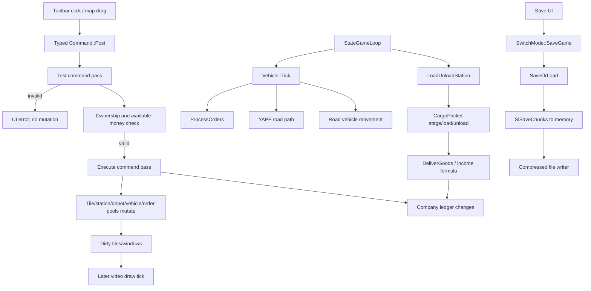

# End-to-end source trace: road route, cargo delivery, and save

Authoritative source: `/workspace/openttd-upstream`, `master` commit
`29f808ef0022064e6d9a83c8476d1e0f4686af86` (2026-07-29).

This trace follows one representative player workflow through the current source.
It is deliberately a road-vehicle route because that is the smallest coherent
OpenTTD-like vertical slice proposed for the clean-room MVP. Paths and symbols are
repository-relative.

## Trace

1. **Choose a construction tool.** `BuildRoadToolbarWindow::OnClick` in
   `src/road_gui.cpp` calls `HandlePlacePushButton`, stores the selected widget in
   `last_started_action`, and opens the appropriate depot/station picker when
   required. **Confidence: High.**
2. **Select map tiles.** `BuildRoadToolbarWindow::OnPlaceObject` starts drag sizing
   with `VpStartPlaceSizing`; `OnPlaceDrag` updates direction and selected tiles;
   `OnPlaceMouseUp` submits `Command<Commands::BuildRoadLong>::Post` (or a station,
   depot, removal, bridge, tunnel, or conversion command). **Confidence: High.**
3. **Validate before mutation.** `CommandHelper<...>::Execute` in
   `src/command_func.h` invokes the command procedure first without
   `DoCommandFlag::Execute`, validates its `CommandCost`, checks multiplayer
   handling, then invokes it with `Execute`. Direct nested `Do` calls similarly
   perform a test pass at top level. `CommandHelperBase::InternalDoAfter` in
   `src/command.cpp` calls `CheckCompanyHasMoney` after a successful test pass.
   **Confidence: High.**
4. **Construct road tiles.** `CmdBuildLongRoad` in `src/road_cmd.cpp` walks from
   start to end by axis and delegates each tile to `CmdBuildRoad`. `CmdBuildRoad`
   checks tile type, slope, ownership, road type, crossings, existing pieces, and
   vehicles; in execute mode it applies road bits/owners/types (including
   `MakeRoadNormal` or crossing/tunnel/bridge updates), adjusts company
   infrastructure, and calls `MarkTileDirtyByTile`. **Confidence: High.**
5. **Charge the company.** The top-level command result is passed through
   `CommandHelperBase::InternalExecuteProcessResult`/`InternalDoAfter`; successful
   execution reaches `SubtractMoneyFromCompany`. Its implementation in
   `src/company_cmd.cpp` subtracts `CommandCost::GetCost()` from `Company::money`,
   records the expense category, and invalidates company windows. **Confidence:
   High.**
6. **Reflect the mutation visually.** Road construction calls
   `MarkTileDirtyByTile`; the GUI/video loop drains queued commands, polls input,
   updates windows, and draws under `VideoDriver::Tick` in
   `src/video/video_driver.cpp`. The dirty-tile invalidation is the direct bridge
   from world mutation to later redraw; rendering is not itself performed by the
   command. **Confidence: High.**
7. **Build stations and a depot.** Bus/truck placement flows through
   `PlaceRoadStop` and `Command<Commands::BuildRoadStop>::Post` in
   `src/road_gui.cpp`; `CmdBuildRoadStop` is implemented in
   `src/station_cmd.cpp`. Depot placement posts `BuildRoadDepot`, implemented by
   `CmdBuildRoadDepot` in `src/road_cmd.cpp`. Both follow the same test/execute/cost
   command protocol. **Confidence: High.**
8. **Purchase a road vehicle.** `BuildVehicleWindow` posts
   `Command<Commands::BuildVehicle>` in `src/build_vehicle_gui.cpp`.
   `CmdBuildVehicle` (`src/vehicle_cmd.cpp`) checks depot ownership, engine/cargo
   validity, pool capacity, and unit-number availability; it adds engine cost and
   dispatches by vehicle type. `CmdBuildRoadVehicle` (`src/roadveh_cmd.cpp`)
   allocates and initializes `RoadVehicle` only in execute mode. The new vehicle
   starts hidden, stopped, and in its depot. **Confidence: High.**
9. **Assign orders.** In goto mode, `OrdersWindow::OnPlaceObject` in
   `src/order_gui.cpp` derives an `Order` with `GetOrderCmdFromTile` and posts
   `Commands::InsertOrder`. `CmdInsertOrder` (`src/order_cmd.cpp`) validates vehicle
   ownership, destination type/ownership/usability, load/unload modes, and other
   constraints, then updates the vehicle's order list in execute mode. Repeat for
   the source and destination stations. **Confidence: High.**
10. **Start and simulate the vehicle.** Vehicle start/stop is
    `CmdStartStopVehicle` in `src/vehicle_cmd.cpp`. The authoritative state step is
    `StateGameLoop` in `src/openttd.cpp`: timers advance, tile/vehicle/landscape
    loops run, then AI/Game scripts and UI tick/news work run. `CallVehicleTicks`
    (`src/vehicle.cpp`) processes station loading and then calls `Tick` on every
    vehicle. `RoadVehicle::Tick` and `RoadVehController`
    (`src/roadveh_cmd.cpp`) process orders/loading, depot exit, speed, movement,
    collisions, and viewport invalidation. **Confidence: High.**
11. **Find a route.** At a road choice point, road-vehicle code calls
    `YapfRoadVehicleChooseTrack`. `CYapfRoad::ChooseRoadTrack` in
    `src/pathfinder/yapf/yapf_road.cpp` builds the reachable start trackdirs, sets
    the vehicle destination, runs YAPF, walks the winning parent chain, and caches
    selected choice segments in `RoadVehPathCache`. If no path is found, the public
    wrapper falls back to an available trackdir. **Confidence: High.**
12. **Generate and offer cargo.** Industry production uses
    `ProduceIndustryGoodsHelper` in `src/industry_cmd.cpp`, which calls
    `MoveGoodsToStation`; town/house production reaches the same function through
    `TownGenerateCargo` in `src/town_cmd.cpp`. `MoveGoodsToStation` in
    `src/station_cmd.cpp` selects eligible nearby stations and creates/appends
    cargo packets. **Confidence: High.**
13. **Load and unload.** Every state tick, `CallVehicleTicks` calls
    `LoadUnloadStation` for all stations. It decrements each loading vehicle's
    delay and calls `LoadUnloadVehicle` in `src/economy.cpp`. That routine stages
    deliver/transfer/keep actions, reserves and loads station cargo, unloads via
    `VehicleCargoList::Unload` (`src/cargopacket.cpp`), updates timing/status, and
    dirties affected vehicle/station UI. **Confidence: High.**
14. **Accept cargo and calculate revenue.** `CargoPayment::PayFinalDelivery`
    calls `DeliverGoods` in `src/economy.cpp`. Acceptance is attributed to nearby
    industries and/or the town; delivered-cargo statistics are updated; then
    `GetTransportedGoodsIncome` calculates income from cargo quantity, Manhattan
    travel distance stored by cargo packets, transit periods, cargo payment rate,
    and a piecewise time factor (or a NewGRF callback). Subsidies can multiply the
    result. **Confidence: High.**
15. **Credit the company.** `CargoPayment` accumulates route and visible profit.
    Its destructor posts the net route result through `SubtractMoneyFromCompany`
    using a negative `CommandCost`, thereby increasing company money and recording
    the appropriate vehicle-revenue category. **Confidence: High.**
16. **Save.** The toolbar opens `ShowSaveLoadDialog`; confirmation sets
    `_switch_mode = SwitchMode::SaveGame` in `src/fios_gui.cpp`.
    `SwitchToMode` in `src/openttd.cpp` calls `SaveOrLoad`. The save path in
    `src/saveload/saveload.cpp` opens a file, `DoSave` serializes registered chunks
    into a `MemoryDumper` with `SlSaveChunks`, and optionally writes/compresses it
    asynchronously. Chunk handlers and per-entity descriptors live throughout
    `src/saveload/*_sl.cpp`; version conversion is centralized in the same module.
    **Confidence: High.**

## Control/data flow

## Clean-room lesson from this trace

The essential reusable *design ideas* are a deterministic state step, commands
with separate validation and execution, authoritative entity stores, route
finding behind a service boundary, cargo packets with provenance/time, and
renderer invalidation after state mutation. A clean-room implementation should
define original C APIs and original data layouts for those ideas; it must not
translate the C++ functions or copy their constants, tables, strings, or save
format unless GPL-2.0 obligations are intentionally accepted.

