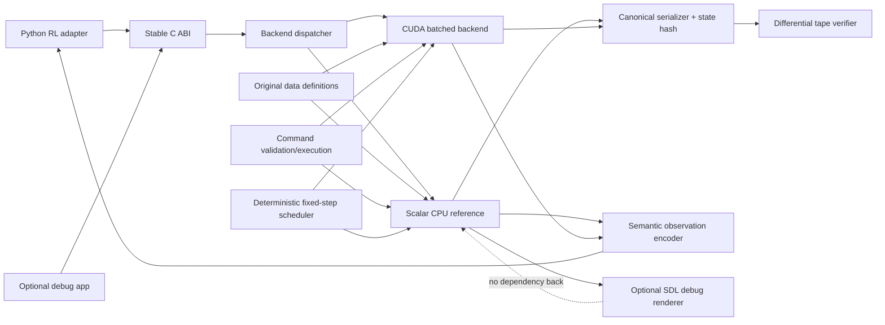

# Recommended clean-room C/CUDA RL MVP

## Status and assumptions

Everything in this note is a **new design proposal**, not a description of
OpenTTD source and not copied code. It applies the user-stated direction—an
OpenTTD-inspired C/CUDA reinforcement-learning library—to the attached clean-room
brief.

The repository-input placeholders are resolved as follows:

| Input | Resolution | Basis |
|---|---|---|
| Repository | `https://github.com/OpenTTD/OpenTTD` | Official organization/repository |
| Branch | `master`, pinned at `29f808ef0022064e6d9a83c8476d1e0f4686af86` | Git symbolic `HEAD` and local checkout |
| Official docs | Repository `README.md`, `COMPILING.md`, `docs/`, generated docs, official website/wiki | Repository links |
| MVP target | Linux x86-64; NVIDIA CUDA; CPU reference backend; Python RL client | Inference from the conversation; recommended |
| Stack | C17 state/core/API, CUDA C++ kernels behind a C ABI, CMake/Ninja, Python 3 + NumPy/PyTorch adapter, optional SDL debug viewer | Recommended |
| Scope | Small road-freight/passenger transport sandbox; deterministic batched simulation; no compatibility with OpenTTD data or saves | Attached MVP constraints + GPU feasibility |

If Windows/macOS, graphical fidelity, or direct OpenTTD save compatibility are
required, the architecture and schedule must be revisited. They are not silently
assumed.

## Product definition

Working title: **RouteFoundry** (provisional; run trademark clearance before use).

The player or RL agent builds a small road network, places terminals and garages,
buys carriers, assigns stop sequences, and earns money by moving people and one
industrial good between compatible origins and destinations. The same action
stream and seed must produce identical authoritative state on the CPU and CUDA
backends.

### Definition of playable

A fresh seeded world can be completed through this loop without debug tools:

1. Inspect settlements and producer/consumer sites.
2. Build connected roads, two terminals, and a garage.
3. Buy a carrier and assign two terminal stops.
4. Start the carrier and observe it route, load, move, unload, and earn revenue.
5. Continue until a positive-balance delivery goal is reached or insolvency ends
   the episode.
6. Save, load, and continue to the same deterministic state trajectory.

### Definition of MVP complete

MVP is complete only when:

- the playable loop above passes an automated end-to-end test;
- fixed-seed CPU runs are byte-identical across two repetitions;
- CPU and CUDA state hashes match after every step in a ≥10,000-step randomized
  command tape across at least 256 parallel environments;
- save/load round-trips preserve the canonical state hash and future trajectory;
- invalid actions do not partially mutate state or money;
- a Python vector environment exposes zero-copy CUDA tensors where supported;
- the CPU backend works without CUDA;
- the debug renderer is optional and the simulation links without SDL;
- clean-room provenance, dependencies, licenses, and original assets are audited;
- performance gates are measured and published without overstating them.

## Scope

### Required

- 64×64 tile map, fixed for the first release but generated deterministically
  from a seed.
- Four settlements, one producer, one consumer, and configurable placement.
- Orthogonal two-way road pieces; junctions; demolition.
- Two terminal classes: people and freight; one garage.
- One road-carrier family with two data-defined variants/capacities.
- Two cargo classes: riders and material crates.
- Purchase, start/stop, sell, and ordered terminal visits.
- Deterministic shortest-path routing on road connectivity.
- Cargo production, station catchment, loading, unloading, aging, and delivery.
- Construction/purchase costs, running expenses, delivery revenue, balance,
  insolvency, and a delivery/solvency score.
- Fixed-step simulation clock, pause, and configurable action repeat.
- Versioned custom snapshots and save/load.
- CPU scalar backend and batched CUDA backend using the same behavioral contract.
- Semantic tensor observations and compact legal action encoding.
- Minimal original debug visuals and keyboard/mouse inspection tools.

### Simplified

- Flat terrain with water/blocked tiles; no slope geometry.
- Vehicles occupy one tile plus sub-tile fixed-point progress.
- No overtaking, collisions, breakdowns, servicing, or articulated carriers.
- A terminal serves one tile and a fixed Manhattan catchment radius.
- Cargo chooses a compatible destination directly; no transfer network.
- One company and one owner; no ratings or municipal permissions.
- Integer price model with a simple distance bonus and lateness penalty.
- Fixed entity capacities chosen at environment creation.

### Deferred or excluded

- Rail/signals, ships, aircraft, bridges, tunnels, terraforming, and slopes.
- Multiplayer, competitors, scripting, plug-ins, modding, and user-downloaded
  content.
- Advanced cargo distribution, transfers, station ratings, subsidies, inflation,
  loans, stock markets, town growth, or industry closure.
- NewGRF, Squirrel, OpenTTD networking protocol, OpenTTD save compatibility, or
  original Transport Tycoon compatibility.
- Original graphics, sounds, music, fonts, text, names, maps, scenarios, tables,
  balancing constants, or UI layout.
- Pixel parity with OpenTTD. The debug view only needs semantic correctness.

## Architecture



### Dependency rules

```text
src/
  app/          optional human/debug executable; depends on api + rendering + ui
  api/          public C ABI, handles, error codes; depends on simulation façade
  simulation/   scheduler, state transition order, reset/step; no presentation
  world/        tile storage, generation, connectivity queries
  transport/    terminals, garages, carriers, orders, routing
  economy/      cargo lifecycle, ledger, score, episode termination
  commands/     action decoding, validation, atomic mutation plans
  observation/  semantic tensors, masks, scalar features
  persistence/  canonical state codec, snapshots, version migration
  cuda/         batched storage/kernels/backend; no Python dependency
  rendering/    optional read-only debug projections; no authoritative state
  ui/           optional tool state and input mapping; submits commands only
  content/      original data tables with stable schema/version
  tests/        unit, differential, fuzz, replay, performance
python/
  routefoundry/ ctypes/cffi or compiled thin binding, Gymnasium-style adapter
tools/
  tape/, inspect/, benchmark/, asset-pipeline/
```

Rules:

1. `world`, `transport`, `economy`, and `commands` must compile for host and
   device where shared behavior is needed. Use an `RF_HD` annotation macro only
   in leaf functions with device-safe types.
2. Authoritative state contains no owning pointers, virtual methods, STL types,
   file handles, renderer objects, or allocation during `step`.
3. Rendering and Python never mutate state directly; they submit encoded actions.
4. All entity references are `(index, generation)` handles or fixed IDs; stale
   handles fail validation.
5. Commands produce a mutation plan or fail before changing state. Execution is
   atomic from the public API's perspective.
6. CPU is the behavioral reference. CUDA optimization cannot change state layout,
   update order, tie-breaking, overflow behavior, or random streams without a
   versioned contract change.

## Core state model

The listed fields are proposed and intentionally original. Exact sizes are set in
`rf_limits_t` at environment creation, then frozen for the episode/batch.

| Entity | Purpose and important fields | Relationships / lifecycle | Serialization |
|---|---|---|---|
| `rf_game_t` | Seed, rules version, tick, day, status, score, RNG namespace, limits | Owns all fixed-capacity arrays; reset creates, terminal state freezes normal commands | Header plus all canonical arrays in fixed order |
| `rf_world_t` | Width, height, tile words, occupancy, connectivity revision | Owned by game; generated/reset, changed by commands | Dimensions + tile arrays; no cached render data |
| `rf_tile_t` | Terrain category, road edge mask, structure kind/ID, blocked flag | Value inside world grid; lifecycle equals world | Packed fixed-width integer with reserved bits zeroed |
| `rf_settlement_t` | ID, center, population band, rider production accumulator | Refers to nearby terminals through recomputable query/cache | Serialize authoritative fields, rebuild caches |
| `rf_site_t` | Producer/consumer kind, tile, cargo type, production/acceptance accumulator | Fixed on reset in MVP | Serialize accumulators and identity |
| `rf_terminal_t` | Handle, tile, cargo class, waiting amount/age buckets, owner | Created/demolished by commands; catches nearby sources | Serialize occupied slots in ID order |
| `rf_garage_t` | Handle, tile, owner | Required purchase location; command-created | Serialize occupied slots |
| `rf_carrier_t` | Handle, kind, owner, tile, fixed-point progress, direction, speed, capacity, cargo, order cursor, flags, cost counters | Purchased in garage; references route/order ranges | Serialize all state; omit derived route cache |
| `rf_order_t` | Destination terminal handle, load policy, unload policy | Stored in fixed per-carrier slots; validated on insert | Fixed-length arrays + count |
| `rf_route_cache_t` | Connectivity revision, bounded direction sequence, cursor | Derived from world+orders; invalidated on road change | Omit or mark non-authoritative and rebuild |
| `rf_cargo_lot_t` | Type, amount, source ID/tile, birth tick | MVP may use aggregated fixed buckets, not heap packets | Serialize occupied buckets in stable order |
| `rf_company_t` | Balance, cumulative construction/purchase/run costs, revenue, delivered units | One per environment in MVP | Signed fixed-width integer fields |
| `rf_calendar_t` | Tick, day, tick-in-day, action-step | Owned by game; advanced only in scheduler | Serialize exact counters |
| `rf_command_t` | Opcode and fixed payload union | Ephemeral input, optionally recorded in tapes | Stable little-endian action codec |
| `rf_result_t` | Error, cost, created handle, flags | Ephemeral output from validation/execution | Recorded in verification tapes, not saves |

### Tile and graph representation

- Index tiles row-major: `index = y * width + x`.
- Road connectivity is a four-bit N/E/S/W edge mask. A legal edge requires the
  matching opposite bit on the neighbor.
- The graph is implicit; no heap adjacency lists exist in authoritative state.
- A monotonically increasing `connectivity_revision` invalidates all route caches
  when road/terminal topology changes.
- The MVP pathfinder is deterministic A* or BFS. On equal total cost, compare
  `(f, h, tile_index, incoming_direction)` lexicographically. Fixed-capacity
  frontier storage must return `RF_ERR_PATH_CAPACITY`, never silently change the
  route.
- CPU and GPU use the same integer costs and tie-break rule. An initial GPU kernel
  may assign one warp per environment; optimize only after profiling.

## Deterministic simulation contract

### Time

- One authoritative tick is an abstract simulation quantum, not wall-clock time.
- Proposed default: 32 ticks per simulated day.
- `rf_step(actions, repeat)` validates/applies at most one player action per
  environment, then advances exactly `repeat` ticks (`1..256`).
- UI frame rate and training batch cadence do not alter simulation time.

### Per-tick phase order

```text
1. apply already-validated player command (first tick of action repeat only)
2. advance clock
3. produce settlement/site cargo on scheduled integer periods
4. update each carrier in ascending carrier ID
   a. resolve or invalidate current route
   b. update fixed-point progress and enter at most bounded tiles
   c. on terminal arrival, unload then load
   d. accrue running cost
5. age waiting and onboard cargo
6. apply ledger deltas in deterministic entity-ID order
7. evaluate insolvency, delivery goal, and step reward
8. emit result flags and optional canonical state hash
```

The maximum movement per tick is bounded so a carrier cannot cross an unbounded
number of tiles in one kernel. All aggregate sums specify width and overflow:
signed 64-bit money, unsigned 32-bit cargo/tick counters, saturating additions for
waiting queues, and explicit error/termination when a contractual limit is hit.

### Randomness

- World generation is deterministic from an explicit 64-bit seed.
- Simulation randomness uses counter-addressed draws keyed by
  `(seed, subsystem, tick, entity_id, draw_index)`, so batching and thread
  scheduling cannot reorder a global stream.
- The exact mixer and test vectors are an original project artifact and part of
  `rules_version`; do not reuse OpenTTD's RNG source.
- Tests include golden vectors and batch-order invariance.

### Construction

```text
validate_build_road(state, a, b):
  reject out-of-bounds, diagonal, immutable, occupied, insufficient funds
  enumerate tiles in canonical ascending traversal from a to b
  build proposed edge masks in scratch/mutation plan
  ensure reciprocal edges and legal structures
  compute cost with checked arithmetic
  return plan or error without mutation

execute_plan(state, plan):
  deduct exact quoted cost
  apply writes in plan order
  increment connectivity_revision
  invalidate affected route caches
```

### Carrier movement and orders

```text
tick_carrier(state, v):
  if stopped: return
  target = validated current order destination
  if route missing or revision changed: deterministic_route(v.tile, target.tile)
  progress += speed
  while progress >= TILE_UNIT and crossings < MAX_CROSSINGS_PER_TICK:
    require next reciprocal road edge; otherwise stop with NO_ROUTE status
    move to next tile; progress -= TILE_UNIT
    if tile == target.tile:
      unload_matching_cargo(v, target)
      load_available_cargo(v, target)
      advance order cursor
      break
```

### Cargo

- Settlements generate riders; a producer generates crates.
- A source offers cargo to the nearest compatible terminal within catchment; ties
  resolve by terminal ID.
- Terminal queues aggregate cargo by `(type, source, age_bucket)` to avoid dynamic
  packet allocation.
- Unload occurs before load. A lot is delivered only if the destination accepts
  its type and is different from the source.
- No transfers in MVP. Cargo that cannot be delivered remains onboard unless an
  explicit unload policy says return it to the terminal.

```text
produce(source):
  amount = floor_and_retain_fraction(source.rate_accumulator)
  terminal = nearest_compatible_terminal(source, CATCHMENT_RADIUS)
  if terminal exists: enqueue_saturating(terminal, source, amount, birth_tick)

service_terminal(carrier, terminal):
  delivered = remove onboard lots accepted by terminal destination
  revenue_delta += sum(revenue(lot, delivered_amount))
  capacity_left = capacity - onboard_amount
  load oldest compatible lots first; tie by source ID
```

### Original MVP economy

These are proposed formulas, not OpenTTD constants.

```text
construction_cost = ROAD_EDGE_COST * new_edges
                  + TERMINAL_COST * new_terminals
                  + GARAGE_COST * new_garages

running_cost_per_tick = carrier_kind.run_cost

base_delivery = amount * cargo_kind.unit_value * max(1, manhattan_distance)
lateness       = min(age_ticks / cargo_kind.grace_ticks, MAX_LATENESS_STEPS)
delivery_value = base_delivery * max(MIN_VALUE_NUM,
                                      VALUE_DEN - lateness * LATE_STEP_NUM)
                 / VALUE_DEN

balance_next = balance + delivery_value
                       - construction_cost
                       - purchase_cost
                       - running_cost
```

All constants live in an original, versioned content table. Revenue uses checked
64-bit integer arithmetic with a specified round-toward-zero rule. Insolvency
terminates after `balance < debt_floor` for `grace_days`; the MVP has no loans.

## Command/action API

Commands are public actions and testable state transitions, not UI callbacks.

```c
typedef uint64_t rf_env_handle_t;

typedef enum rf_opcode {
    RF_ACT_NOOP,
    RF_ACT_BUILD_ROAD,
    RF_ACT_REMOVE_ROAD,
    RF_ACT_BUILD_TERMINAL,
    RF_ACT_BUILD_GARAGE,
    RF_ACT_BUY_CARRIER,
    RF_ACT_SELL_CARRIER,
    RF_ACT_SET_ORDERS,
    RF_ACT_START_STOP_CARRIER
} rf_opcode_t;

typedef struct rf_action {
    uint16_t opcode;
    uint16_t flags;
    uint32_t a;
    uint32_t b;
    uint32_t c;
    uint32_t d;
} rf_action_t;

typedef struct rf_step_result {
    int32_t error;
    int32_t reward;
    int64_t balance_delta;
    uint64_t created_handle;
    uint64_t state_hash;
    uint8_t terminated;
    uint8_t truncated;
    uint8_t reserved[6];
} rf_step_result_t;
```

Suggested façade:

```c
rf_error_t rf_context_create(const rf_config_t *, rf_context_t **out);
void       rf_context_destroy(rf_context_t *);
rf_error_t rf_reset_cpu(rf_context_t *, uint32_t env, uint64_t seed);
rf_error_t rf_step_cpu(rf_context_t *, uint32_t env,
                       const rf_action_t *, uint32_t repeat,
                       rf_step_result_t *);
rf_error_t rf_batch_create_cuda(const rf_config_t *, uint32_t count,
                                int device, rf_batch_t **out);
rf_error_t rf_batch_reset_cuda(rf_batch_t *, const uint64_t *device_seeds,
                               void *stream);
rf_error_t rf_batch_step_cuda(rf_batch_t *, const rf_action_t *device_actions,
                              uint32_t repeat, rf_step_result_t *device_results,
                              void *stream);
rf_error_t rf_batch_observation_cuda(rf_batch_t *, rf_observation_view_t *out);
rf_error_t rf_snapshot_write_cpu(const rf_context_t *, uint32_t env,
                                 rf_writer_fn, void *user);
rf_error_t rf_snapshot_read_cpu(rf_context_t *, uint32_t env,
                                rf_reader_fn, void *user);
rf_error_t rf_state_hash_cpu(const rf_context_t *, uint32_t env, uint64_t *out);
const char *rf_error_string(rf_error_t);
```

CUDA pointers are never guessed by Python. The library returns a documented view
containing address, dtype, shape, strides, device, lifetime token, and stream/event
contract. Prefer DLPack for zero-copy PyTorch interoperability; keep raw-pointer
access internal or explicitly unsafe.

## Observations and rewards

### Observation

- `tile[N,H,W,C]` byte/short channels: terrain, road edges, structure type,
  owner, waiting-cargo bins, carrier occupancy.
- `carrier[N,V,F]` integer features plus `carrier_mask[N,V]`: position,
  direction, progress, cargo, capacity, order target, route/error state.
- `global[N,G]`: tick/day, balance, delivered totals, score, connectivity
  revision, remaining entity capacity.
- `action_mask[N,A]` only for discrete presets; parameterized actions use a
  separate validity-query endpoint for UI/debugging. Training must still tolerate
  invalid actions and receive deterministic error results.

No RGB observation is required. An optional semantic raster can be generated for
CNN policies without sprite assets.

### Reward

Keep raw accounting signals separate from the default reward:

```text
reward = delivered_value_scaled
       - new_construction_cost_scaled
       - running_cost_scaled
       + first_valid_route_bonus
       + goal_bonus
       - invalid_action_penalty
       - insolvency_penalty
```

Return every component in an info tensor during training. Reward shaping is a
versioned wrapper configuration, not an authoritative simulation rule; evaluation
must report an unshaped score as well.

## Persistence

Use an original, chunked little-endian format:

```text
Header:
  magic = project-specific 8 bytes
  format_major, format_minor
  rules_version, content_hash
  width, height, limits
  payload_length, payload_crc64
Chunks (tag, version, length, payload):
  GAME, WRLD, SETL, SITE, TERM, GARG, CARR, ORDR, CARG, COMP, CALR
```

- Canonical state hashing uses the same field order but excludes file framing,
  padding, caches, UI, and render state.
- Unknown optional chunks may be skipped; unknown required chunks fail.
- Major versions need explicit migrators; no promise of OpenTTD or indefinite
  legacy compatibility.
- Loader checks dimensions/counts/lengths before allocation and rejects duplicate
  chunks, invalid handles, bad reserved bits, and integer overflow.
- Save tests must continue the same action tape after reload and match every
  subsequent state hash—not merely compare immediately after parsing.

## CPU/CUDA execution design

### Start with correctness

1. Implement one scalar CPU environment and canonical serializer.
2. Add command tapes and invariant checking.
3. Factor pure leaf transitions into host/device headers.
4. Add a structure-of-arrays batched CPU representation and prove it matches the
   scalar environment.
5. Port reset, step, observation, and hashing to CUDA.
6. Optimize only profiles that retain differential parity.

### Proposed CUDA mapping

- State is structure-of-arrays with environment as the outer index.
- Initial kernel mapping: one CUDA block per environment; lanes cooperate for map
  queries/pathfinding, and a deterministic lane handles ordered ledger commits.
- Alternative for small entity counts: one warp per environment. Select by measured
  occupancy and map/frontier memory, not analogy to another project.
- Fixed per-environment scratch holds A*/BFS frontier, visited generation stamps,
  mutation plan, and observation workspace.
- No cross-environment synchronization. No atomics are needed for authoritative
  state within an environment if phases are serialized/cooperatively ordered.
- Batch reset, tick, observation, and hash are separate kernels initially; fuse
  only when profiler evidence justifies it.
- Compile deterministic kernels with contraction and fast-math choices explicitly
  controlled. Authoritative arithmetic is integer, minimizing CPU/GPU float drift.

### Performance targets (goals, not measurements)

| Gate | Baseline target | Stretch target |
|---|---:|---:|
| Scalar CPU, headless 64×64/16 carriers | 50,000 env-ticks/s | 150,000 |
| CUDA batch at N=1,024 | 250,000 env-ticks/s | 1,000,000 |
| CUDA batch at N=8,192 | 1,000,000 env-ticks/s | 4,000,000 |
| Action-to-observation latency N=1 | <2 ms | <0.5 ms |
| Snapshot size default env | <256 KiB | <128 KiB |

Report GPU model, driver/toolkit, clocks, batch, map/entities, action repeat,
observation cost, warmup, and percentile timings. A throughput number without the
full feature/observation configuration is not an acceptance result.

## Phased build guide

### Phase 0 — foundation

- **Objective:** reproducible C project and behavioral contract.
- **Tasks:** repository/license/provenance log; CMake presets; warnings,
  sanitizers, formatter; test runner; error/handle conventions; state limits;
  fixed-point/time/RNG specs; CI on Linux CPU.
- **Interfaces:** `rf_config_t`, errors, handles, RNG, checked arithmetic.
- **Tests:** ABI layout assertions, RNG vectors, overflow, handle generation,
  reproducible empty-state hash.
- **Complete when:** two clean clones configure/build/test with documented commands.
- **Risks:** premature CUDA data layout, unspecified overflow, accidental source
  contamination.

### Phase 1 — tile world

- **Objective:** inspectable deterministic map.
- **Tasks:** tile arrays; seed generator; settlements/sites; queries; canonical
  serializer/hash; optional semantic debug view/camera/selection.
- **Interfaces:** world get, coordinate conversion, reset, observation tile view.
- **Tests:** fixed seed golden hashes, boundary/property tests, no invalid overlap,
  save/load empty world.
- **Complete when:** CPU reset and visual inspection agree for a seed corpus.
- **Risks:** biased/unplayable placement, padding in hashes, hidden renderer state.

### Phase 2 — construction commands

- **Objective:** build a legal network without partial failures.
- **Tasks:** command codec; validation/mutation plans; road edge reciprocity;
  terminals/garages; demolition; ledger; topology revision.
- **Interfaces:** validate, execute, quote cost, query validity.
- **Tests:** insufficient funds, overlap, bounds, atomic rejection, construct/remove
  round trip, randomized graph invariants.
- **Complete when:** a human/test can construct the first route and all invariants
  survive fuzzed command sequences.
- **Risks:** validation/execution disagreement, stale handles, cache invalidation.

### Phase 3 — carriers and routing

- **Objective:** bought carriers follow assigned terminal orders.
- **Tasks:** carrier pool; purchase/sell/start; order slots; deterministic BFS/A*;
  route cache; fixed-point movement; no-route state.
- **Interfaces:** carrier query, order replacement, route service, per-tick update.
- **Tests:** shortest paths, tie-break vectors, road edits under vehicle, stale
  destination, capacity/frontier exhaustion, long route loop.
- **Complete when:** a carrier continuously visits two terminals on multiple maps.
- **Risks:** pathfinding scratch dominates GPU memory; differing tie breaks; vehicle
  deadlock behavior.

### Phase 4 — cargo and economy

- **Objective:** transport creates understandable profit/loss.
- **Tasks:** source production; catchment; bounded lot queues; load/unload;
  acceptance; revenue/age formula; running cost; score/termination.
- **Interfaces:** cargo service, ledger transactions, reward components.
- **Tests:** production accumulation, catchment ties, queue saturation, capacity,
  unload-before-load, revenue boundary vectors, conservation, insolvency.
- **Complete when:** automated source-to-destination delivery changes balance by
  exactly the independently calculated amount.
- **Risks:** cargo loss/duplication, reward leakage, overflow, unbalanced economy.

### Phase 5 — playable and RL loop

- **Objective:** human and agent use the same action contract.
- **Tasks:** optional SDL tools; complete observation tensors; masks; Python vector
  API; Gymnasium conventions; scenario goal; tutorial/debug HUD.
- **Interfaces:** reset/step/observe, DLPack views, snapshot, metrics.
- **Tests:** end-to-end vertical slice, invalid-action robustness, observation
  oracle, Python lifetime/stream tests, random policy soak.
- **Complete when:** scripted actions and a random/heuristic agent complete or fail
  deterministically with useful diagnostics.
- **Risks:** unsafe tensor lifetime, hidden CPU copies, UI bypassing commands,
  reward optimizing unintended behavior.

### Phase 6 — persistence and CUDA parity

- **Objective:** portable saves and scalable identical batched execution.
- **Tasks:** file framing/migrations; batched SoA; CUDA reset/tick/obs/hash;
  differential tapes; sanitizer/compute-sanitizer; benchmarks; CI GPU job.
- **Interfaces:** backend-neutral batch API and capability query.
- **Tests:** corrupted files, migration fixtures, future-trajectory save test,
  scalar-vs-batch-vs-CUDA hash per step, batch permutation, 24-hour soak.
- **Complete when:** all completion gates and published performance methodology
  pass on a clean runner.
- **Risks:** state footprint, kernel divergence, GPU frontier capacity, nondeterminism,
  misleading benchmark shortcuts.

## First 20 backlog tasks in execution order

Estimates are relative Fibonacci points, not hours.

| ID | User story | Priority | Dependencies | Estimate | Acceptance criteria |
|---|---|---:|---|---:|---|
| RF-001 | As a maintainer, I have license/provenance rules | P0 | — | 2 | `LICENSE`, third-party manifest, clean-room log template reviewed |
| RF-002 | As a developer, I can configure/build/test C on Linux | P0 | RF-001 | 3 | Clean CMake/Ninja build; unit test runs in CI |
| RF-003 | As a backend author, I have stable numeric/ID/time conventions | P0 | RF-002 | 3 | Written contract + compile-time layout checks |
| RF-004 | As a tester, seeded RNG is reproducible and order-independent | P0 | RF-003 | 3 | Golden vectors and permutation tests pass |
| RF-005 | As a simulator, I can reset a 64×64 world | P0 | RF-003,004 | 5 | Invariants and seed hashes pass corpus |
| RF-006 | As a verifier, I can canonically serialize/hash state | P0 | RF-005 | 5 | Repeated state hashes byte-identically |
| RF-007 | As a player, I can inspect an original semantic map | P1 | RF-005 | 3 | Optional viewer shows tiles/entities without state mutation |
| RF-008 | As an agent, I can submit a stable fixed-size action | P0 | RF-003 | 3 | Codec round-trip and invalid opcode tests pass |
| RF-009 | As a player, I can quote/build/remove road atomically | P0 | RF-005,008 | 8 | Fuzz tests preserve reciprocal edges and balance |
| RF-010 | As a player, I can place/remove terminals and garages | P0 | RF-009 | 5 | Ownership/occupancy/cost/handle tests pass |
| RF-011 | As a player, I can buy/sell/start a carrier | P0 | RF-010 | 5 | Pool, ledger, stale-handle tests pass |
| RF-012 | As a player, I can replace a carrier's ordered stops | P0 | RF-011 | 3 | Destination/type validation and replay tests pass |
| RF-013 | As a carrier, I get a deterministic shortest route | P0 | RF-009,012 | 8 | Path/tie/no-path/frontier vectors pass |
| RF-014 | As a carrier, I move through routes by fixed ticks | P0 | RF-013 | 8 | Position trajectory hashes match expected vectors |
| RF-015 | As a world, I produce and queue two cargo types | P0 | RF-010 | 5 | Conservation/catchment/saturation tests pass |
| RF-016 | As a carrier, I load, deliver, and unload cargo | P0 | RF-014,015 | 8 | End-to-end cargo conservation test passes |
| RF-017 | As a company, I receive revenue and pay costs | P0 | RF-016 | 5 | Independent ledger oracle matches all transactions |
| RF-018 | As an RL client, I receive observations/results/rewards | P0 | RF-006,017 | 8 | Shape/dtype/value oracle and random-agent test pass |
| RF-019 | As a user, I can save/load and continue identically | P0 | RF-006,017 | 8 | Corruption + future-trajectory round-trip tests pass |
| RF-020 | As a trainer, I can run CPU batches then CUDA parity | P0 | RF-018,019 | 13 | 256-env/10k-step CPU-CUDA differential gate passes |

## Testing strategy

- **Unit:** checked arithmetic, coordinates, edge masks, handles, RNG, content
  schema, formulas, command validation, path tie-breaking.
- **Property/fuzz:** random command sequences preserve reciprocal edges, entity
  uniqueness, valid references, cargo conservation, and ledger conservation.
- **Determinism:** same seed/action tape repeated; shuffled batch order; different
  CPU thread counts; scalar vs batched CPU vs CUDA hash after each step.
- **Construction:** every command failure snapshot compares identical before/after;
  successful quote equals charged cost.
- **Economy:** an independent small test oracle calculates production, loading,
  revenue, and running expense vectors.
- **Pathfinding:** disconnected graphs, equal paths, loops, edited topology,
  exhausted frontier, maximal map.
- **Persistence:** canonical byte fixtures per format version; malformed lengths;
  duplicate/unknown chunks; save/load plus continued tape trajectory.
- **Long running:** random valid/invalid policy for ≥10 million ticks; leak and
  capacity telemetry; state invariant checks sampled and at termination.
- **Performance:** feature-complete fixed corpus; kernel and end-to-end metrics;
  observation enabled; CPU/GPU parity run immediately before timing.
- **UI smoke:** build route, create carrier, set stops, deliver, save, reload.
- **Tooling:** ASan/UBSan on CPU, static analysis, warnings-as-errors, CUDA
  memcheck/compute-sanitizer, Python reference/lifetime tests.

## Clean-room operating procedure

1. A research team records high-level behavior and evidence in this specification.
2. Implementation personnel work from approved clean-room requirements, not from
   OpenTTD source. Separate accounts/workspaces are preferable for strong process
   evidence.
3. No source-line translation, identifiers, comments, constants, tables, layouts,
   strings, tests, fixtures, binary formats, or assets are copied.
4. New names, APIs, formulas, content, UI, visuals, sound, map generation, save
   format, and balancing are independently designed.
5. Every dependency has name/version/source/license recorded before merge.
6. Each implementation change includes provenance: requirement ID, author, sources
   consulted, and confirmation that no restricted material was introduced.
7. Behavioral comparisons use public gameplay observations or independently
   generated black-box traces only if counsel approves the method and applicable
   terms.
8. If any OpenTTD GPL-2.0 code is intentionally reused or adapted, stop calling
   that component clean-room, isolate it in the license inventory, and satisfy the
   GPL distribution/source/notices obligations for the resulting work as reviewed
   by qualified counsel.
9. Project naming and visual identity must avoid OpenTTD and Transport Tycoon
   marks/trade dress; obtain a trademark review before public launch.
10. This is a practical engineering review, not definitive legal advice.

## Risk register

| Risk | Probability | Impact | Mitigation / proof gate |
|---|---|---|---|
| Scope expands toward full OpenTTD | High | Critical | Fixed MVP non-goals; change-control requires dependency/risk update |
| CPU/CUDA divergence | High | Critical | Integer state, common leaf contract, per-step hashes, randomized tapes |
| Pathfinding state/scratch exceeds GPU budget | High | High | 64² map, fixed frontier, measure BFS/A*, bounded carriers, capacity errors |
| GPL/content contamination | Medium | Critical | Team separation, provenance review, no source-derived names/constants/assets |
| Reward exploits instead of transport skill | High | High | Component telemetry, unshaped evaluation score, adversarial policy tests |
| Save format becomes an accidental ABI prison | Medium | Medium | Explicit compatibility window and migrators; canonical state separate from file framing |
| Entity limits silently corrupt or alter behavior | Medium | Critical | Checked capacities and deterministic errors; saturation telemetry |
| GPU speed claim omits observations/features | Medium | High | Feature manifest in every benchmark; parity before timing |
| Python exposes unsafe device memory | Medium | High | DLPack/lifetime tokens/stream contract; sanitizer and destruction tests |
| Original content creation lags engine | Medium | Medium | Semantic visuals first; tiny data schema; content acceptance milestones |
| Economic loop is not fun or learnable | Medium | High | Heuristic baseline, curriculum scenarios, metrics, tune data not code |
| Cross-platform expectations emerge | Medium | Medium | Linux-first declaration; portable C core; defer viewer/platform work |

## Most important open questions

1. Is the intended final deliverable a legally independent clean-room game, or an
   explicit GPL-2.0 OpenTTD derivative? The engineering and distribution process
   differ materially.
2. Is exact behavioral parity with a named OpenTTD release required, or is the
   transportation-management loop sufficient? Clean-room originality and exact
   parity pull in opposite directions.
3. Which GPU and minimum batch/throughput target define success, and must single-env
   latency also be competitive?
4. Should the learned agent control low-level construction coordinates directly,
   choose from masked macro-actions, or operate through a hierarchical planner?
5. Does the first public release require a human-playable viewer, or is a headless
   library plus trace visualizer sufficient?

## Recommended first vertical slice

Use a fixed 16×16 test map before procedural generation: one crate producer, one
consumer, two pre-placed terminals, a pre-built road, one stopped carrier, and two
orders. Implement only `NOOP`, `START_STOP`, fixed ticks, movement along a unique
path, cargo production/load/delivery, ledger changes, semantic observation, state
hash, and save/load. Run it in scalar CPU first, then batched CPU, then CUDA.

This slice proves the hardest architectural seams—time, entity state, cargo
conservation, economy, observation, persistence, C ABI, batching, and CPU/CUDA
parity—without first implementing construction UI, general pathfinding, or world
generation. After it is green, add road-building commands and path choice to turn
it into the full MVP loop.

