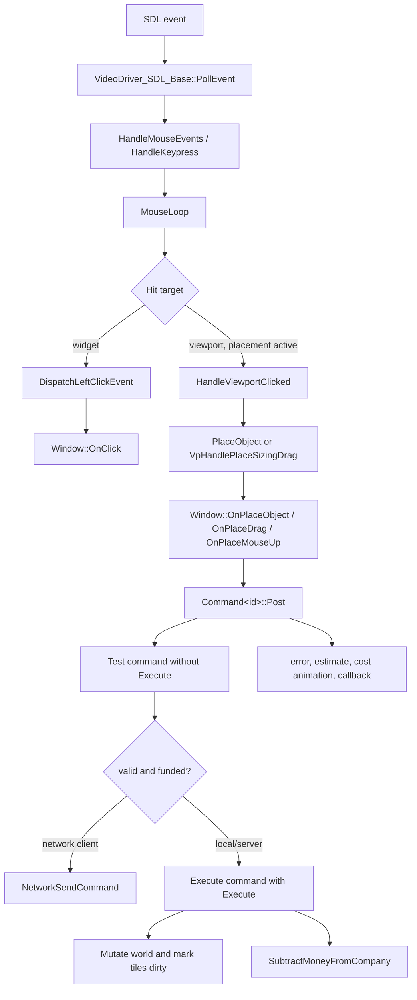
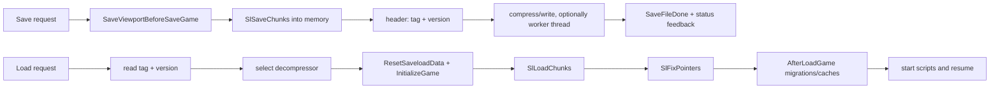
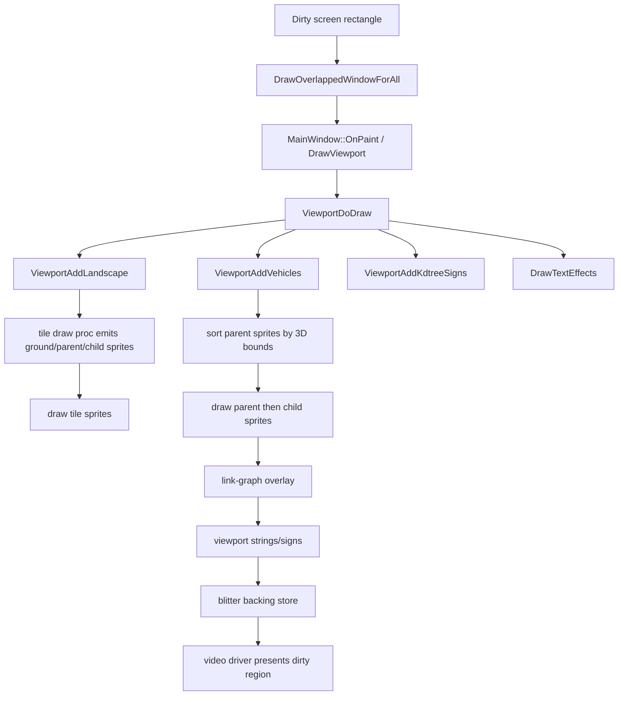
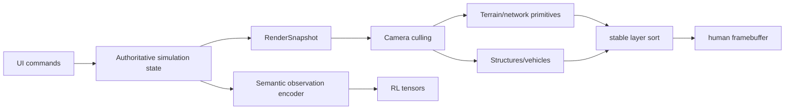

# UI, persistence/modding, and rendering analysis

> Source scope: `/workspace/openttd-upstream` at commit
> `29f808ef0022064e6d9a83c8476d1e0f4686af86` (2026-07-29). Repository-relative
> paths below refer to that checkout. The upstream tree was inspected but not
> modified.

## 1. Conclusions and boundary

OpenTTD's presentation is not a thin skin over ad-hoc mutations. Platform input
is normalized by a video driver, dispatched through a custom window/widget
system, translated into a viewport placement interaction, and finally posted as
a typed command. A command is tested before execution, can be routed through the
network command queue, deducts money centrally, and drives spatial invalidation
and player feedback. This is the most important interaction pattern to retain in
a clean-room implementation.

Persistence and extensibility are much larger systems than a first playable
transport game needs. The observed save system contains dozens of independently
handled chunks, hundreds of version transitions, pointer reconstruction,
post-load migrations, legacy loaders, scripts, and content identity checks.
NewGRF can alter graphics and game specifications, while AI and GameScript run
inside Squirrel VMs. Social integrations are signed native libraries. All three
extension surfaces should be deferred from the MVP.

Rendering is a custom sprite pipeline. Tiles emit ground and sortable sprites;
vehicles, signs, effects, overlays, and UI are added later; parent sprites are
depth-sorted; a selectable blitter writes an 8/32/40-bpp backing store; and the
video driver presents dirty rectangles. A clean-room MVP does not need this
compatibility surface. It should use an original top-down visual language,
render immutable simulation snapshots, and keep its semantic RL observation
encoder separate from the human renderer.

Terminology in this note is deliberate:

- **Observed** means directly evidenced in the pinned OpenTTD source.
- **Proposed MVP** is a newly designed clean-room system. It is not a statement
  about OpenTTD behavior and must not be implemented by copying OpenTTD code,
  strings, artwork, sprite IDs, file formats, or branding.

## 2. Observed UI and interaction architecture

### 2.1 UI primitives and ownership

OpenTTD owns a custom retained window system rather than delegating its game UI
to SDL. `WindowDesc` describes class, default placement, flags, widgets, and
hotkeys; `Window` supplies virtual event methods such as `OnPaint`, `OnClick`,
`OnPlaceObject`, `OnPlaceDrag`, and `OnPlaceMouseUp`. Nested widget trees resolve
screen positions to `NWidgetCore` instances. `WindowClass` is the central
inventory of window identities.

| Observed element | Evidence | Role | Confidence |
| --- | --- | --- | --- |
| Window type registry | `src/window_type.h`, `WindowClass` | Stable identity for the main viewport, toolbars, dialogs, entity windows, construction pickers, networking, scripts, and diagnostics. | High |
| Window/event contract | `src/window_gui.h`, `Window`, `WindowDesc`, `OnClick`, `OnPlaceObject`, `OnPlaceMouseUp` | Presentation classes receive normalized input and invalidation events. | High |
| Nested widget dispatch | `src/window.cpp`, `DispatchLeftClickEvent` | Hit-tests the nested tree, applies focus/disabled/button behavior, then invokes the window event. | High |
| Window persistence | `src/window.cpp`, `WindowDesc::LoadFromConfig`, `WindowDesc::SaveToConfig` | Remembers preferred size/sticky state in `windows.cfg`; this is client UI state, not simulation state. | High |
| Dirty-window painting | `src/window.cpp`, `DrawOverlappedWindow`, `DrawOverlappedWindowForAll`; `src/gfx.cpp`, `DrawDirtyBlocks` | Splits dirty rectangles around occluding windows and calls `Window::OnPaint`. | High |

### 2.2 Screen, window, dialog, and toolbar inventory

The table is a functional catalog rather than a promise that every transient
window is independently needed in a recreation. `src/window_type.h` is the
authoritative exhaustive class list; the files below provide implementations.

| Area | Principal observed screens/windows | Source anchors |
| --- | --- | --- |
| Startup and bootstrap | Main/select-game screen; new-game/scenario/heightmap generation; base-set download and progress; high scores/end game | `src/intro_gui.cpp`, `SelectGameWindow`, `ShowSelectGameWindow`; `src/genworld_gui.cpp`; `src/bootstrap_gui.cpp`; `src/highscore_gui.cpp` |
| Game shell | Full-screen map viewport; top toolbar; bottom status bar; pause/fast-forward; date, company name, money, news/save state | `src/main_gui.cpp`, `MainWindow`; `src/widgets/toolbar_widget.h`, `ToolbarNormalWidgets`; `src/statusbar_gui.cpp`, `StatusBarWindow` |
| Main toolbar menus | Settings, save/load, small map, towns, subsidies, stations, finances, companies, story/goals, graphs/league, industries, four vehicle lists, zoom, build menus, landscaping, music/sound, messages, help | `src/widgets/toolbar_widget.h`, `ToolbarNormalWidgets`; handlers in `src/main_gui.cpp` |
| Construction toolbars | Rail/signals/station/depot/waypoint; roads/trams/stops/depots/bridges/tunnels; docks/canals; airports; landscaping/terraform; trees; objects | `src/rail_gui.cpp`, `BuildRailToolbarWindow`; `src/road_gui.cpp`, `BuildRoadToolbarWindow`; `src/dock_gui.cpp`, `BuildDocksToolbarWindow`; `src/airport_gui.cpp`, `BuildAirToolbarWindow`; `src/terraform_gui.cpp`; `src/tree_gui.cpp`; `src/object_gui.cpp` |
| Placement/picker dialogs | Station and road-stop orientation/classes; depot direction; signals; bridge choice; object/tree picker; join/select station | `src/rail_gui.cpp`; `src/road_gui.cpp`; `src/bridge_gui.cpp`; `src/picker_gui.cpp`, `PickerWindow`; `src/station_gui.cpp`, `SelectStationWindow` |
| Map inspection | Small map and legends; extra viewport; land information; transparency/invisibility controls; sign list/edit; viewport labels | `src/smallmap_gui.cpp`, `SmallMapWindow`; `src/viewport_gui.cpp`, `ExtraViewportWindow`; `src/misc_gui.cpp`; `src/transparency_gui.cpp`; `src/signs_gui.cpp` |
| Town/industry/station views | Town directory/view/authority; industry directory/view/funding; company stations; station details and waiting cargo; waypoint details | `src/town_gui.cpp`; `src/industry_gui.cpp`; `src/station_gui.cpp`, `CompanyStationsWindow`, `StationViewWindow`; `src/waypoint_gui.cpp` |
| Fleet workflows | Depot contents; build/purchase vehicle; vehicle lists and groups; vehicle viewport/details; orders; timetable; refit; autoreplace; engine preview | `src/depot_gui.cpp`, `DepotWindow`; `src/build_vehicle_gui.cpp`; `src/vehicle_gui.cpp`, `VehicleListWindow`, `VehicleViewWindow`; `src/order_gui.cpp`, `OrdersWindow`; `src/timetable_gui.cpp`; `src/autoreplace_gui.cpp`; `src/engine_gui.cpp` |
| Company and economy | Company overview/manager/livery/infrastructure; finances and loan controls; graphs; performance league; subsidies | `src/company_gui.cpp`, `CompanyWindow`, `CompanyFinancesWindow`, `CompanyInfrastructureWindow`; `src/graph_gui.cpp`; `src/league_gui.cpp`; `src/subsidy_gui.cpp` |
| Scenario goals/scripts | Goal list/questions; story book; league tables from script; AI configuration; GameScript configuration; script settings and debugger/log | `src/goal_gui.cpp`; `src/story_gui.cpp`; `src/league_gui.cpp`; `src/ai/ai_gui.cpp`, `AIConfigWindow`; `src/game/game_gui.cpp`; `src/script/script_gui.cpp` |
| Save, settings, content | Save/load browser and previews; game options and advanced settings; NewGRF selection/parameters/debug; online content browser/download; textfile/license/readme viewer | `src/fios_gui.cpp`, `SaveLoadWindow`; `src/settings_gui.cpp`; `src/newgrf_gui.cpp`; `src/newgrf_debug_gui.cpp`; `src/network/network_content_gui.cpp`; `src/textfile_gui.cpp` |
| Multiplayer | Server browser/details; join status/password/company selection; client list/chat; content mismatch/download flows | `src/network/network_gui.cpp`, `NetworkGameWindow`; `src/network/network_chat_gui.cpp`; `src/network/network_content_gui.cpp` |
| Modal and utility UI | Error/news windows, tooltip, dropdown, query/confirmation, text entry, on-screen keyboard, date picker, help/about, console, music | `src/error_gui.cpp`; `src/news_gui.cpp`; `src/misc_gui.cpp`, `GuiShowTooltips`, `ShowQueryString`; `src/dropdown.cpp`; `src/osk_gui.cpp`; `src/date_gui.cpp`; `src/help_gui.cpp`; `src/console_gui.cpp`; `src/music_gui.cpp` |

This inventory shows why graphical parity is not an MVP target. The essential
human loop needs only the map, a compact HUD, one construction palette, entity
inspection, vehicle purchase/orders, feedback, and save/load.

### 2.3 Platform input to command execution

SDL is one concrete platform source. `VideoDriver_SDL_Base::PollEvent` updates
global cursor/button/wheel/key state and calls `HandleMouseEvents` or
`HandleKeypress`. `MouseLoop` prioritizes active placement drag, generic drag and
window operations, viewport scrolling, viewport clicks, then normal widget
dispatch. A viewport click in placement mode calls the active construction
window rather than mutating the map.



Evidence for this chain:

- `src/video/sdl2_v.cpp`, `VideoDriver_SDL_Base::PollEvent` and `InputLoop`:
  platform events become common cursor, modifier, and direction-key state.
- `src/window.cpp`, `HandleMouseEvents`, `MouseLoop`, and
  `DispatchLeftClickEvent`: prioritization and window/widget dispatch.
- `src/viewport.cpp`, `HandleViewportClicked`, `PlaceObject`,
  `VpHandlePlaceSizingDrag`, and `SetObjectToPlace`: placement routing.
- `src/command_func.h`, `CommandHelper::Post`, `InternalPost`, and `Execute`:
  test-first command execution and network routing.
- `src/command.cpp`, `InternalExecuteValidateTestAndPrepExec`,
  `InternalExecuteProcessResult`, and `InternalPostResult`: affordability,
  execution, money deduction, and user feedback.

### 2.4 Complete observed construction user flow: dragging a road

This flow is useful as the interaction reference for a clean-room command UI.

```mermaid
sequenceDiagram
    actor Player
    participant Toolbar as BuildRoadToolbarWindow
    participant VP as Viewport placement
    participant Command as Command system
    participant Road as CmdBuildLongRoad/CmdBuildRoad
    participant World as Map and company state
    participant UI as Feedback/renderer

    Player->>Toolbar: Click autoroad
    Toolbar->>VP: HandlePlacePushButton(cursor, highlight)
    Player->>VP: Press on start tile
    VP->>Toolbar: OnPlaceObject(point, tile)
    Toolbar->>VP: VpStartPlaceSizing(..., DDSP_PLACE_AUTOROAD)
    Player->>VP: Drag
    VP->>Toolbar: OnPlaceDrag(...)
    Toolbar->>VP: VpSelectTilesWithMethod(...)
    VP-->>Player: highlighted route + measurement tooltip
    Player->>VP: Release
    VP->>Toolbar: OnPlaceMouseUp(start_tile, end_tile)
    Toolbar->>Command: Command&lt;BuildRoadLong&gt;::Post(...)
    Command->>Road: test without Execute
    Road-->>Command: CommandCost/error
    Command->>Road: execute with Execute
    Road->>World: set road bits/owner/type; infrastructure count
    Command->>World: SubtractMoneyFromCompany
    Road->>UI: MarkTileDirtyByTile
    Command-->>UI: cost animation or error
```

Precise anchors are `src/road_gui.cpp`, `BuildRoadToolbarWindow::OnClick`,
`OnPlaceObject`, `OnPlaceDrag`, and `OnPlaceMouseUp`; `src/road_cmd.cpp`,
`CmdBuildLongRoad` and `CmdBuildRoad`; and `src/command.cpp`,
`InternalExecuteProcessResult`. `CmdBuildRoad` only writes road state when
`DoCommandFlag::Execute` is set, updates infrastructure accounting, and calls
`MarkTileDirtyByTile`.

### 2.5 Camera, zoom, picking, placement, and feedback

#### Camera and zoom

- `MainWindow::OnScroll` changes viewport scroll coordinates; dragging,
  scroll-wheel map scrolling, key scrolling, and edge autoscroll ultimately
  update the same destination. See `src/main_gui.cpp` and `src/window.cpp`,
  `HandleViewportScroll`, `HandleKeyScrolling`, and `HandleAutoscroll`.
- `UpdateViewportPosition` in `src/viewport.cpp` supports vehicle following,
  smooth interpolation toward a destination, speed limiting, map clamping, and
  overlay rebuilding after movement settles.
- `DoZoomInOutWindow` changes the discrete `ZoomLevel` and virtual viewport
  dimensions. `ZoomInOrOutToCursorWindow` preserves the map point under the
  cursor when possible. The main toolbar also exposes zoom controls.

#### Coordinate conversion and picking

`RemapCoords` in `src/landscape.h` maps 3D world coordinates to the isometric
viewport:

```text
screen_x = (world_y - world_x) * 2 * ZOOM_BASE
screen_y = (world_y + world_x - world_z) * ZOOM_BASE
```

`TranslateXYToTileCoord` in `src/viewport.cpp` converts window coordinates to
virtual coordinates and calls `InverseRemapCoords2`. The latter, in
`src/landscape.cpp`, iteratively samples terrain height so clicks resolve to the
visible surface rather than a flat plane. `GetTileBelowCursor` is the common
picker entry point.

#### Placement state and preview

`TileHighlightData _thd`, `SetObjectToPlace`, `VpStartPlaceSizing`,
`VpSelectTilesWithMethod`, and `DrawTileSelection` in `src/viewport.cpp` form a
stateful interaction: selected tool/callback window, cursor, highlight style,
start/end tile, size limit, selection color, and error tile. Closing or changing
the tool calls `OnPlaceObjectAbort` and restores the normal cursor.

#### Essential player feedback

| Feedback | Observed mechanism | MVP importance |
| --- | --- | --- |
| Current date and cash | `src/statusbar_gui.cpp`, `StatusBarWindow::DrawWidget` | Required |
| Pause/save/autosave/news state | `StatusBarWindow`; saveload invalidates it with `SBI_SAVELOAD_START/FINISH` | Simplify to pause/save/error indicators |
| Placement footprint | `TileHighlightData`, `DrawTileSelection`, selection red/blue palettes | Required |
| Route length/area/height | `src/viewport.cpp`, `ShowMeasurementTooltips` | Show tile count and price; height can wait |
| Validation error | `src/command.cpp`, `InternalPostResult`; `src/error_gui.cpp` | Required, preferably inline and spatially anchored |
| Failed tile | `SetRedErrorSquare` | Required for placement errors |
| Estimated and charged cost | `ShowEstimatedCostOrIncome`, `ShowCostOrIncomeAnimation` | Required; a stable HUD preview is clearer than animation alone |
| Successful construction sound | callbacks such as `CcPlaySound_CONSTRUCTION_OTHER` | Optional; defer audio |
| Dirty spatial refresh | mutation calls such as `MarkTileDirtyByTile` | Required implementation detail, though full redraw is acceptable initially |

## 3. Proposed clean-room MVP interface

### 3.1 Interface boundary

The UI may read a `RenderSnapshot`/query API but must not hold mutable simulation
entities. Every world change must be a serializable command with three results:
`preview`, `accepted`, or `rejected(reason, location)`. The same command path must
serve mouse input, tests, replay, and an RL action adapter.

### 3.2 One-screen wireframe

```text
+------------------------------------------------------------------+
| $124,500   Day 0184   [Pause] [1x 2x 4x]   Goal: deliver 80 crates|
|------------------------------------------------------------------|
| [Select] [Road] [Station] [Depot] [Bulldoze]   Rotate: [R]       |
|                                                                  |
|                         TOP-DOWN MAP                             |
|       town blocks ---- roads ---- teal station                   |
|                            [selected road ghost: 7 tiles, $700]  |
|                                     orange depot -- vehicle      |
|                                                                  |
|------------------------------------------------------------------|
| Selection: Cargo Van #3 | Route: Mill Stop <-> Market Stop       |
| Load 8/12 | Speed 2.1 tiles/s | Profit this trip: $320           |
|------------------------------------------------------------------|
| [New] [Save] [Load] [Settings]        Message: Route completed   |
+------------------------------------------------------------------+
```

On small screens, the bottom inspector becomes a drawer and the construction
palette becomes a horizontally scrolling strip. Keyboard and pointer commands
must have equivalent focusable controls; icons need text/tooltips, and color
cannot be the only indicator of valid/invalid placement.

### 3.3 MVP screens and flows

| Screen/state | Required behavior | Explicitly absent initially |
| --- | --- | --- |
| Start | New game, load game, quit; seed field optional | Network/content browser, scenarios, AI/GS |
| Main map | Pan, discrete zoom, hover/select tile/entity, pause/speed | Extra viewports, link graph overlay, transparency modes |
| Build palette | Road, passenger/cargo stop, depot, bulldoze; price and validation preview | Rail signals, bridges, tunnels, air/water, terrain editing |
| Vehicle purchase | One road-vehicle type initially; price/capacity summary; spawn at depot | Refitting, articulated vehicles, autoreplace |
| Orders | Add stop A, add stop B, loop; start/stop; visible route validity | Timetables, conditional/shared orders, waypoints |
| Inspector | Station waiting cargo; industry production; vehicle cargo/profit/state | Deep graphs, livery/groups, NewGRF metadata |
| Save/load | Named slots, timestamp, schema version, thumbnail optional, corruption error | Legacy/import compatibility, cloud sync |
| Settings | UI scale, volume if audio exists, input bindings, color-accessibility option | Hundreds of simulation settings |
| End/sandbox feedback | Delivery progress, cumulative profit, completion banner; continue sandbox | High-score and league systems |

### 3.4 Proposed input-to-command mapping

| User action | New command/query | Validation/feedback |
| --- | --- | --- |
| Drag a road | `BuildRoadPath{start,end}` | Preview tiles and total cost; reject occupied/out-of-bounds/unaffordable tiles |
| Place station/depot | `BuildStructure{kind,tile,orientation}` | Ghost footprint, catchment/road-connection indicator, cost |
| Bulldoze | `RemoveAt{tile}` | Show refund/cost and dependent-entity warning |
| Buy vehicle | `PurchaseVehicle{depot,type}` | Validate depot ownership, funds, capacity |
| Set two-stop route | `ReplaceOrders{vehicle,[A,B],repeat=true}` | Validate station IDs and reachable road graph |
| Start vehicle | `SetVehicleRunning{vehicle,true}` | Reject invalid orders/unreachable route |
| Pause/speed | `SetRunControl{paused,speed}` | Local single-player control; keep outside deterministic world state where practical |
| Save | `RequestCheckpoint{slot}` | Queue at a tick boundary; success/failure toast |
| Pan/zoom/select | UI-local camera/query actions | Never mutate the simulation |

## 4. Observed persistence architecture

### 4.1 Save container and lifecycle

`SaveOrLoad` in `src/saveload/saveload.cpp` is the public high-level path. The
current format begins with a four-byte compression tag and a 32-bit big-endian
version field. Known tags are `OTTD` (LZO), `OTTN` (uncompressed), `OTTZ` (zlib),
and `OTTX` (LZMA). The decompressed body is a sequence of labeled chunks managed
by `ChunkHandler` objects.

`ChunkType` in `src/saveload/saveload.h` supports RIFF-like byte chunks,
contiguous/sparse arrays, and self-describing table/sparse-table forms; read-only
handlers support old formats without writing them. `SaveLoad` descriptor arrays
declare field type, memory conversion, references, and inclusive/exclusive
version ranges. Pool references are serialized as indices, then reconstructed by
the `SlFixPointers` pass.



Saving serializes the authoritative state to a `MemoryDumper` first; only
compression and writing are handed to `_save_thread`. The status bar is switched
to a busy/saving state by `SaveFileStart`/`SaveFileDone`. On Emscripten,
`SaveFileDone` asks the host page to sync the filesystem.

### 4.2 Chunk families

There are 71 concrete four-character handler declarations at this revision. The
following grouping captures the schema boundaries without reproducing every
field descriptor.

| Family | Representative chunk IDs | Source |
| --- | --- | --- |
| Map dimensions and packed tile planes | `MAPS`, `MAPT`, `MAPH`, `MAPO`, `MAP2`, `M3LO`, `M3HI`, `MAP5`, `MAPE`, `MAP7`, `MAP8` | `src/saveload/map_sl.cpp` |
| Time, random state, viewport, rules | `DATE`, `VIEW`, `SRND`, `PATS` (`OPTS` legacy) | `src/saveload/misc_sl.cpp`, `randomizer_sl.cpp`, `settings_sl.cpp` |
| Companies and economy | `PLYR`, `ECMY`, `CAPY` (`PRIC`/`CAPR` legacy), `ERNW` | `company_sl.cpp`, `economy_sl.cpp`, `autoreplace_sl.cpp` |
| Vehicles, orders, groups, depots | `VEHS`, `ORDL`, `BKOR` (`ORDR` legacy), `GRPS`, `DEPT` | `vehicle_sl.cpp`, `order_sl.cpp`, `group_sl.cpp`, `depot_sl.cpp` |
| Towns, industries, stations, objects | `CITY`, `INDY`, `IBLD`, `ITBL`, `STNN`, `ROAD`, `OBJS`, `SIGN` | `town_sl.cpp`, `industry_sl.cpp`, `station_sl.cpp`, `object_sl.cpp`, `signs_sl.cpp` |
| Cargo and routing | `CAPA`, `CMDL`, `CMPU`, `LGRP`, `LGRJ`, `LGRS` | `cargopacket_sl.cpp`, `cargomonitor_sl.cpp`, `linkgraph_sl.cpp` |
| Goals/story/league/subsidies | `GOAL`, `STPA`, `STPE`, `LEAT`, `LEAE`, `SUBS` | `goal_sl.cpp`, `story_sl.cpp`, `league_sl.cpp`, `subsidy_sl.cpp` |
| Extension identity/state | `NGRF`, mapping chunks such as `RAIL`, `ROTT`, `HIDS`, `IIDS`, `TIDS`, `EIDS`, `APID`, `ATID`, `OBID`; script `AIPL`, `GSDT`, `GSTR`; persistent storage `PSAC` | `newgrf_sl.cpp`, `labelmaps_sl.cpp`, mapping-specific files, `ai_sl.cpp`, `game_sl.cpp`, `storage_sl.cpp` |
| History/diagnostics and animation | `GLOG`, `CHTS`, `ANIT` | `gamelog_sl.cpp`, `cheat_sl.cpp`, `animated_tile_sl.cpp` |

The central registration order is `ChunkHandlers()` in
`src/saveload/saveload.cpp`. A new implementation should not copy these IDs or
their binary layouts; they are listed to explain subsystem coverage.

### 4.3 Versioning, compatibility, and migrations

`SaveLoadVersion` in `src/saveload/saveload.h` is an append-only enum with named
schema milestones. At this commit, the current version is 366
(`DepotsUnderBridges`), computed as `MaxVersion - 1`. Conditional descriptors
such as `SLE_CONDVAR` select representations by version. Table chunks carry field
metadata so `SlCompatTableHeader` can match current descriptors against legacy
headers; files under `src/saveload/compat/` preserve prior table schemas.

Load compatibility has three distinct layers:

1. `src/saveload/oldloader.cpp` and `src/saveload/oldloader_sl.cpp` handle old
   TTO/TTD/TTDP formats.
2. Per-chunk loaders convert field widths, old structures, and references while
   reading; representative examples are `vehicle_sl.cpp`, `station_sl.cpp`, and
   `waypoint_sl.cpp`.
3. `AfterLoadGame` in `src/saveload/afterload.cpp` performs cross-object
   migrations and cache reconstruction after chunks and pointers are loaded. It
   contains extensive version-gated transformations for map bits, names, dates,
   settings, vehicles, stations, cargo, and transport infrastructure.

Loading a save with a version newer than the binary is rejected. A reserved
range (`StartPatchpacks` through `EndPatchpacks`) produces a patchpack-specific
error. NewGRF identity/compatibility is checked during load; missing content can
warn, disable content, pause the game in error state, or reject multiplayer
loading (`AfterLoadGame`, `IsGoodGRFConfigList`).

### 4.4 Configuration and search paths

Configuration is INI-based and separated by sensitivity/purpose:

| File | Observed content/owner | Evidence |
| --- | --- | --- |
| `openttd.cfg` | Generic client/new-game settings, base media selection, NewGRF lists/presets, AI/GS selection | `src/settings.cpp`, `LoadFromConfig`, `SaveToConfig` |
| `private.cfg` | Network/private settings, server lists, bans, authorized keys | `HandleSettingDescs`; comments created by `SaveToConfig` |
| `secrets.cfg` | Passwords and other secret settings | `SecretSettingTables`, `SaveToConfig` |
| `hotkeys.cfg` | Named hotkey lists | `src/hotkeys.cpp`, `HotkeyList::Load/Save` |
| `windows.cfg` | Window defaults such as preferred size/sticky state | `src/window.cpp`, `WindowDesc::LoadFromConfig/SaveToConfig` |
| `favs.cfg` | Picker favorites and NewGRF badge-class favorites | `src/settings.cpp`, `PickerLoadConfig`, `BadgeClassLoadConfig` |

`IniFileVersion` in `src/settings.cpp` independently versions configuration. Its
migrations include moving private/secrets out of the generic file, converting
server advertisement type, converting linkgraph intervals, moving relay policy,
renaming autosave units and right-click behavior, removing a persisted generation
seed, and replacing the default rail-only choice with rail/road/tram intent.
`IniFile::SaveToDisk` writes `filename.new`, flushes it, and then replaces the
destination, reducing truncated-config risk.

`DeterminePaths` in `src/fileio.cpp` assembles ordered `Searchpath` entries for
working, XDG/personal, shared, binary, installation, application bundle, legacy
TTD, and autodownload locations. `Subdirectory` maps logical content classes to
folders: saves/autosaves, scenarios/heightmaps, base sets, NewGRF, language,
AI/AI libraries, GameScript/GS libraries, screenshots, social integrations, and
docs. `FioFOpenFile`, `FioFindFullPath`, and `FileScanner::Scan` search valid
roots; tar archives are indexed for several content types. `-c` can direct the
configuration location, which also affects working/config path selection.

## 5. Observed scripting, modding, content, and social integration

### 5.1 Squirrel AI and GameScript

The third-party Squirrel VM is under `src/3rdparty/squirrel`. Shared bindings,
VM lifecycle, command suspension/callback handling, and serialization live under
`src/script/`. AI and GameScript are separate specializations:

- `AIScannerInfo`/`AIScannerLibrary` search `ai/.../info.nut` and
  `ai/library/.../library.nut` (`src/ai/ai_scanner.hpp`,
  `src/ai/ai_scanner.cpp`).
- `GameScannerInfo`/`GameScannerLibrary` do the equivalent under `game/`
  (`src/game/game_scanner.hpp`, `src/game/game_scanner.cpp`).
- `ScriptScanner` records `main.nut`, loads package metadata, versions, API
  compatibility, and checksums (`src/script/script_scanner.cpp`).
- `AIInstance` and `GameInstance` register their APIs and provide command
  callbacks; `AI::GameLoop` runs one VM per AI company, and `Game::GameLoop`
  runs the scenario-wide script (`src/ai/ai_instance.cpp`, `ai_core.cpp`,
  `src/game/game_instance.cpp`, `game_core.cpp`).
- `ScriptInstance::Save` calls the script's `Save` method and serializes a
  restricted value graph. Supported values include integers, short strings,
  arrays, tables, booleans, null, and explicitly saveable instances, with a
  nesting limit. AI and GS chunks store package name/version/settings and saved
  script data (`src/script/script_instance.cpp`, `src/saveload/ai_sl.cpp`,
  `game_sl.cpp`).

Scripts do not receive permission to mutate arbitrary memory; their generated
API ultimately uses the command mechanism, including asynchronous command
callbacks. Recreating the API, VM scheduling, deterministic restrictions, and
save semantics would be a substantial product of its own.

### 5.2 NewGRF

NewGRF is both an asset and behavior/specification extension system, not merely a
texture pack.

- `GRFFileScanner`, `DoScanNewGRFFiles`, `FillGRFDetails`, and
  `CalcGRFMD5Sum` in `src/newgrf_config.cpp` discover packages, extract identity
  and metadata, safety-scan them, and retain ID/version/hash/parameter state.
- `LoadNewGRF` and `LoadNewGRFFile` in `src/newgrf.cpp` process multiple stages:
  label scan, initialization, reservation, and activation. `DecodeSpecialSprite`
  dispatches numbered action records to handlers in `src/newgrf/`.
- Action handlers can define/alter vehicles, cargoes, houses, industries,
  stations, road stops, airports, bridges, rail/road types, sounds, strings,
  sprite groups, parameters, and conditional behavior. `SpriteGroup::Resolve`
  and `ResolverObject` in `src/newgrf_spritegroup.h/.cpp` provide runtime
  selection/callback resolution.
- `NGRF` and label/mapping chunks preserve active package identity and map
  package-local IDs to saved entities (`src/saveload/newgrf_sl.cpp`,
  `labelmaps_sl.cpp`).

NewGRF therefore penetrates the data model, rendering, economics, save format,
multiplayer compatibility, and UI. It is inappropriate for an MVP compatibility
promise.

### 5.3 Social integration

`SocialIntegrationFileScanner` in `src/social_integration.cpp` finds
platform-native `*-social` shared libraries in `Subdirectory::SocialIntegration`.
Before opening a library, `InternalSocialIntegrationPlugin` validates an adjacent
signature. It then resolves the versioned `SocialIntegration_v1_GetInfo` and
`SocialIntegration_v1_Init` symbols, rejects duplicate platform providers, and
reports states such as running, unsupported API, invalid signature, or platform
not running. `SocialIntegration` sends lifecycle events for menu, editor,
single-player, multiplayer, and joining, and runs plugin callbacks from the main
loop. The C ABI is defined under
`src/3rdparty/openttd_social_integration_api/`.

This native plugin surface should be excluded from a clean-room MVP for security,
distribution, platform, and testing reasons.

### 5.4 Deferral roadmap

| Capability | MVP decision | Later prerequisite |
| --- | --- | --- |
| AI opponents | Exclude | Stable command/query API, deterministic resource budgets, AI fixtures |
| Scenario/GameScript | Exclude | Goal/event API and sandboxed VM or WASM host |
| NewGRF compatibility | Exclude permanently unless made a separate intentional compatibility project | Full specification, licensing review, content ID/save compatibility, exhaustive parity tests |
| Original native social plugins | Exclude | No clear MVP value; requires signature/update and per-platform security design |
| User mods | Defer | Versioned public content schema, capability permissions, compatibility hashes, migration policy |
| Data-driven internal content | Include narrowly | JSON/TOML definitions validated at build/startup; not yet a public mod API |
| Online content downloader | Exclude | Signed catalog, provenance/licenses, resumable download, sandboxed extraction |
| Legacy save import | Exclude | Frozen v1 schema and explicit demand for import tooling |

## 6. Proposed MVP persistence and configuration

### 6.1 Save contract

The clean-room save format should be small, explicit, and independently named.
One proposal is a new chunked binary checkpoint with no OpenTTD chunk IDs or
layouts:

```text
Header
  magic[8]              = original project-specific magic
  container_version     = 1
  simulation_schema     = 1
  endian_marker
  world_uuid
  payload_length
  payload_crc32

Repeated chunk
  tag[4]                = new project-owned identifier
  chunk_version:u16
  flags:u16
  length:u64
  crc32:u32
  payload[length]
```

Proposed v1 payload families are metadata/clock/RNG, tile world, towns and
industries, road graph and structures, vehicles, orders, cargo, economy/company,
and rule/content hashes. All IDs are integer handles; load first creates arrays
and maps, then resolves handles and validates referential invariants. Derived
render caches, UI selection, pathfinding caches, thumbnails, and transient RL
observations are not authoritative and must not be required for correctness.

Required behavior:

1. Take checkpoints only at deterministic tick boundaries.
2. Serialize from a consistent snapshot; background compression may start only
   after the snapshot is complete.
3. Write to a sibling temporary file, flush, and atomically rename.
4. Retain one previous checkpoint until the new file validates.
5. Reject a newer schema without modifying current state.
6. Load into a staging `GameState`, check dimensions/count bounds, IDs,
   connectivity references, content hash, and checksums, then swap it into use.
7. Test `save(load(save(state)))` canonical stability and post-load simulation
   equivalence for at least 10,000 ticks.

Only forward migrations from released project schemas are required. Version 1
must not attempt OpenTTD save compatibility.

### 6.2 Configuration model

Use one human-readable `settings.toml` for client preferences and new-game
defaults. Save gameplay rules inside each checkpoint so changing defaults does
not silently alter an existing game. Keep secrets in a separate permission-
restricted file only if online features are later added. Hotkeys and window
layout can initially live in the generic settings file.

Minimum settings: window size/fullscreen, UI scale, language if more than one is
actually shipped, master volume if audio exists, camera pan speed, zoom direction,
key bindings, autosave interval/retention, and color-accessibility mode. Avoid
exposing simulation tuning before the core loop is balanced.

## 7. Observed rendering and asset pipeline

### 7.1 Frame pipeline and layers

`ViewportDoDraw` in `src/viewport.cpp` is the central world-view draw path.



Observed layer behavior:

| Stage | Mechanism and evidence |
| --- | --- |
| Terrain iteration/culling | `ViewportAddLandscape` transforms viewport corners, iterates isometric row/column candidates, evaluates terrain/bridge visibility, and calls `_tile_type_procs[tile_type]->draw_tile_proc`. |
| Ground/tile sprites | Tile draw procedures call helpers such as `DrawGroundSprite`/`AddTileSpriteToDraw`; these are drawn before sortable parents. `ViewportDrawer::tile_sprites_to_draw`. |
| Buildings and infrastructure | `AddSortableSpriteToDraw` creates parent sprites with world-space bounds; child sprites attach to parent/foundation lists. `ViewportDrawer::parent_sprites_to_draw` and `child_screen_sprites_to_draw`. |
| Vehicles | `ViewportAddVehicles` adds them to the same sortable world set after landscape collection. |
| Depth order | `ViewportSortParentSprites` compares overlapping x/y/z bounding volumes, then `ViewportDrawParentSprites` draws each parent and linked children. An SSE4.1 sorter may be selected by `InitializeSpriteSorter`. |
| Labels/effects | Town, station, waypoint, and sign strings are culled through `_viewport_sign_kdtree`; text effects are collected before drawing but strings are rendered after world sprites. |
| Data overlay | A `LinkGraphOverlay` is drawn after world sprites and before viewport strings when cargo/company masks are active. |
| UI windows/cursor | Window widgets paint around/over the viewport through the window stack; the cursor is backed up and drawn separately in `src/gfx.cpp`. |

### 7.2 Blitters and presentation

`Blitter` in `src/blitter/base.hpp` abstracts sprite drawing, rectangle fill,
pixel access, copies, scrolling, palette animation behavior, and sprite encoding.
Factories in `src/blitter/factory.hpp` select implementations. The source tree
contains null, 8-bpp, 32-bpp, animation-aware 32/40-bpp, optimized, and SIMD
variants (`src/blitter/`).

The video layer is separate. SDL software and SDL/OpenGL implementations are in
`src/video/sdl2_default_v.cpp`, `sdl2_opengl_v.cpp`, and `opengl.cpp`; Cocoa,
Win32, Allegro, dedicated, and null backends also exist. In the OpenGL path the
custom blitter still produces backing data; OpenGL uploads/presents it and can
cache system sprites. It is not a conventional 3D scene renderer.

`AddDirtyBlock`/`DrawDirtyBlocks` in `src/gfx.cpp` coalesce invalidated block
regions. `DrawOverlappedWindow` clips around higher windows and sets a
`DrawPixelInfo` pointing into the selected blitter's screen buffer before
calling `OnPaint`. `VideoDriver::MakeDirty` then informs the platform backend of
the changed rectangle.

### 7.3 Sprite, palette, font, and asset loading

- `GfxLoadSprites` in `src/gfxinit.cpp` clears caches, selects the base graphics
  set, calls `LoadSpriteTables`, loads extra and NewGRF sprites, and initializes
  palettes. `GraphicsSet::FillSetDetails` reads base-set metadata.
- `LoadGrfFile`/`LoadGrfFileIndexed` call `LoadNextSprite` for legacy GRF sprite
  streams. `SpriteCache` in `src/spritecache.cpp` stores origin file/offset/type,
  lazy-decodes requested sprites, and can evict decoded data.
- `SpriteLoaderGrf` in `src/spriteloader/grf.cpp` decodes indexed and 32-bpp
  sprite components and zoom levels. `MakeIndexed` provides fallback conversion
  when a selected blitter cannot consume 32-bpp data.
- `SpriteType` distinguishes normal, map-generator, font, and recolor data;
  `SpriteID` and `PaletteID` are 32-bit identifiers (`src/gfx_type.h`).
- `PaletteType` distinguishes DOS and Windows source palettes. `src/palette.cpp`
  builds color lookup/reshade tables, reserves company-color remap indexes, and
  updates animated water/fire/light palette ranges through
  `DoPaletteAnimations`.
- Fonts can come from sprite glyphs or scalable fonts. `src/fontcache/` contains
  `SpriteFontCache`, TrueType/FreeType paths, and platform-specific selection;
  `src/gfx_layout*.cpp` handles shaping/layout variants.
- Logical content is found through the search-path system, including tar
  indexes. Base graphics, NewGRF, language, fonts, sounds, and music have
  separate discovery/selection code; runtime graphics are not a single bundled
  texture atlas.

This architecture supports decades of palette/sprite/content compatibility.
That compatibility—not simply drawing tiles—is the expensive part and should not
be inherited by an MVP.

## 8. Proposed original MVP rendering and assets

### 8.1 Rendering contract

Use a top-down orthographic grid for the first human viewer. This is visually
distinct, easier to pick, and cheap to render at high zoom ranges. The simulation
publishes a read-only snapshot; both the renderer and semantic observation
encoder consume it independently.



Proposed coordinates are project-owned and intentionally different from the
observed isometric mapping:

```text
world_px = tile_xy * 32 + sub_tile_offset
screen_px = (world_px - camera_world_px) * zoom + viewport_origin
tile_xy = floor((screen_px / zoom + camera_world_px) / 32)
```

Use integer/fixed-point camera coordinates and discrete zoom steps. A stable
draw order is sufficient: terrain; roads/structure footprints; buildings;
vehicles; construction ghosts and route overlay; labels; screen-space UI.
Within the vehicle/building layer, sort by stable entity ID only where items
overlap; top-down sprites do not require OpenTTD's 3D bounding-volume sorter.

Initially redraw the whole viewport at a capped 60 Hz while simulation ticks are
interpolated for human viewing. Add dirty chunks only after profiling. Headless
RL mode creates neither a window nor a framebuffer.

### 8.2 Original placeholder visual system

No OpenTTD logos, names, sprite sheets, palettes, GUI chrome, fonts, icons,
vehicles, town/industry art, maps, scenarios, or text should enter the new asset
repository.

Create placeholders from project-owned geometric primitives:

- terrain: flat square cells with original muted earth/grass/water colors and
  texture patterns generated from a project seed;
- roads: charcoal strips with a project-specific colored edge stripe, rounded
  junction masks, and high-contrast one-way chevrons;
- stops: teal platform rectangle plus a newly designed cargo/passenger glyph;
- depots: orange square and open-door wedge;
- towns: simple colored roof polygons with population shown only in inspector;
- industries: large footprint with an original symbol (for example, stacked
  hexagonal crates), not a recreated OpenTTD industry silhouette;
- vehicles: direction-oriented rounded rectangles with a separate cargo fill
  bar; do not imitate original sprites or company-color remap slots;
- cargo: two original symbols and names chosen by product design;
- selection: blue hatch for valid, magenta cross-hatch for invalid, and a
  dashed route centerline so color is never the sole signal.

Store assets in a new manifest keyed by semantic names, not OpenTTD `SpriteID`
numbers. Prefer procedural vector/primitive drawing for phase 1. If raster art or
fonts are later added, record creator, source, license, and checksum in an asset
provenance manifest. Include a bundled font only under an intentionally accepted
redistributable license, with its required notice.

### 8.3 Visual acceptance criteria

- At 1280x720, a player can identify road, stop, depot, producer, consumer,
  vehicle, selected tile, and invalid tile without consulting a legend.
- At 200% UI scale, all controls remain reachable and text does not overlap.
- Keyboard focus, hovered, active tool, valid preview, invalid preview, paused,
  and save-failed states are distinguishable by shape/text as well as color.
- Pointer-to-tile picking agrees with the rendered tile across every supported
  zoom; property-test screen/world round trips away from tile boundaries.
- Rendering has no write access to simulation state and produces no RNG calls
  that can influence it.
- Headless and rendered runs with the same seed/action log produce identical
  authoritative state hashes.

## 9. Evidence and confidence audit

| Finding | Evidence | Interpretation | Confidence |
| --- | --- | --- | --- |
| UI is a custom window/widget system. | `src/window_gui.h`, `Window`, `WindowDesc`; `src/window.cpp`, `DispatchLeftClickEvent` | Platform input is normalized before reaching game-specific windows. | High |
| `WindowClass` is the broad UI registry. | `src/window_type.h`, `WindowClass` | The large window surface is directly enumerable. | High |
| Main toolbar exposes nearly every management/build domain. | `src/widgets/toolbar_widget.h`, `ToolbarNormalWidgets` | Full UI parity would pull most simulation systems into scope. | High |
| Viewport placement calls the active tool window. | `src/viewport.cpp`, `HandleViewportClicked`, `PlaceObject`, `VpHandlePlaceSizingDrag` | Presentation selects intent; command code owns mutation. | High |
| Road dragging is a typed command workflow. | `src/road_gui.cpp`, `BuildRoadToolbarWindow::*`; `src/road_cmd.cpp`, `CmdBuildLongRoad` | A representative end-to-end construction flow is traced. | High |
| Commands test before execution and can route to network. | `src/command_func.h`, `CommandHelper::Execute`; `src/command.cpp`, `InternalExecuteValidateTestAndPrepExec` | Validation and mutation share one command implementation under different flags. | High |
| Money and feedback are centrally applied after command success. | `src/command.cpp`, `InternalExecuteProcessResult`, `InternalPostResult` | UI need not duplicate economic side effects. | High |
| Camera supports pan, follow, smoothing, zoom-to-cursor, and clamping. | `src/main_gui.cpp`, `MainWindow::OnScroll`, `DoZoomInOutWindow`; `src/viewport.cpp`, `UpdateViewportPosition` | Camera is presentation state with map-aware constraints. | High |
| Visible-surface picking considers terrain height. | `src/viewport.cpp`, `TranslateXYToTileCoord`; `src/landscape.cpp`, `InverseRemapCoords2` | Picking is not a simple inverse flat isometric equation. | High |
| Save files are versioned compressed chunk streams. | `src/saveload/saveload.cpp`, `_saveload_formats`, `SaveFileToDisk`, `DoLoad`; `src/saveload/saveload.h`, `ChunkHandler` | Container, compression, and logical schema are separated. | High |
| Saves reconstruct pool references after chunk load. | `src/saveload/saveload.cpp`, `SlLoadChunks`, `SlFixPointers`; `ChunkHandler::FixPointers` | Load is explicitly multi-pass. | High |
| Current save schema version is 366. | `src/saveload/saveload.h`, `SaveLoadVersion::DepotsUnderBridges`, `MaxVersion`; `src/saveload/saveload.cpp`, `SAVEGAME_VERSION` | Computed as the last named enum before `MaxVersion`. | High |
| Migration burden is extensive. | `src/saveload/afterload.cpp`, `AfterLoadGame`; `src/saveload/compat/` | Legacy compatibility is a major subsystem and should not be an MVP goal. | High |
| Settings and saves use independent version systems. | `src/settings.cpp`, `IniFileVersion`; `src/saveload/saveload.h`, `SaveLoadVersion` | Client config migration is separate from world migration. | High |
| Search paths unify loose files, multiple roots, and tar content. | `src/fileio.cpp`, `DeterminePaths`, `FileScanner::Scan`, `_tar_filelist`; `src/fileio_type.h` | Content discovery is cross-platform and layered. | High |
| AI and GS run Squirrel and persist controlled value graphs. | `src/script/script_instance.cpp`, `ScriptInstance::Save/LoadObjects`; `src/ai/*`; `src/game/*` | Script parity includes VM, API, scheduler, command bridge, and persistence. | High |
| NewGRF changes data and behavior as well as visuals. | `src/newgrf.cpp`, `LoadNewGRF`; `src/newgrf/`; `src/newgrf_spritegroup.*` | It cannot be approximated as an image-pack loader. | High |
| Social plugins are signed native shared libraries with a versioned ABI. | `src/social_integration.cpp`, `SocialIntegrationFileScanner`, `InternalSocialIntegrationPlugin`; `src/3rdparty/openttd_social_integration_api/` | This is a privileged integration surface and a poor MVP dependency. | High |
| Viewport render order uses emitted lists and world-bound sorting. | `src/viewport.cpp`, `ViewportDrawer`, `ViewportDoDraw`, `ViewportSortParentSprites` | Tiles do not draw immediately in a single painter loop. | High |
| Blitting is separate from OS presentation. | `src/blitter/base.hpp`; `src/video/sdl2_default_v.cpp`, `sdl2_opengl_v.cpp`; `src/gfx.cpp` | Renderer output can target several backing formats/video drivers. | High |
| Sprite loading supports indexed/32-bpp, zooms, recolors, and lazy cache decode. | `src/spriteloader/grf.cpp`; `src/spritecache.cpp`, `ReadSprite`, `GetRawSprite`; `src/gfx_type.h` | Asset compatibility is much richer than an MVP atlas. | High |
| Proposed top-down visuals can preserve mechanics while being distinct. | Clean-room proposal, not an OpenTTD observation | Requires product/legal review and original asset production. | Medium |

## 10. Unresolved questions

1. Is the first human viewer desktop SDL, a browser frontend, or only a debug
   viewer around a headless C/CUDA environment? This changes input, text, and
   packaging choices but not the command boundary.
2. Must the MVP reproduce an isometric camera for behavioral comparison, or is
   a deliberately distinct top-down view preferred? The latter is recommended.
3. What is the authoritative MVP cargo pair and goal? UI labels, icons, station
   inspector fields, and tutorial flow depend on this product decision.
4. Should save files be portable between CPU and CUDA backends? The recommended
   answer is yes: serialize canonical CPU-layout state, never device pointers or
   renderer/path caches.
5. What save durability target is required—single checkpoint, rotating local
   autosaves, or remote artifact storage? The v1 schema can support all, but the
   product workflow differs.
6. Are user-authored data packs a committed later feature? If so, internal
   content definitions should be designed for validation and namespacing now,
   without exposing a compatibility promise.
7. Does RL require pixel observations, semantic tensors, or both? The renderer
   must not be used as a hidden source of authoritative state.
8. Which accessibility baseline is required beyond UI scaling, keyboard access,
   and non-color placement cues (screen reader, reduced motion, high contrast)?
9. Should construction preview stop at the first invalid tile or reject the
   whole drag atomically? OpenTTD has command-specific partial behaviors; the MVP
   should choose and document one consistent policy.
10. Will save migrations be supported from every public build or only tagged
    releases? Freeze this policy before the first externally distributed save.

## 11. Specialist recommendation

For the first vertical slice, implement one window containing the original
top-down map, HUD, road/station/depot tools, inspector, and save/load controls.
Trace every pointer or keyboard action to a typed command; provide price/error
preview from the same validator used for execution; render from snapshots; and
round-trip a version-1 save at tick boundaries. Defer alternate vehicle modes,
advanced windows, legacy saves, scripting, NewGRF, native plugins, online
content, sprite compatibility, palette animation, and graphical parity.

That slice preserves the key architectural lesson from OpenTTD—validated,
replayable mutations isolated from presentation—without inheriting its decades
of UI, file-format, asset, and extension compatibility work.
