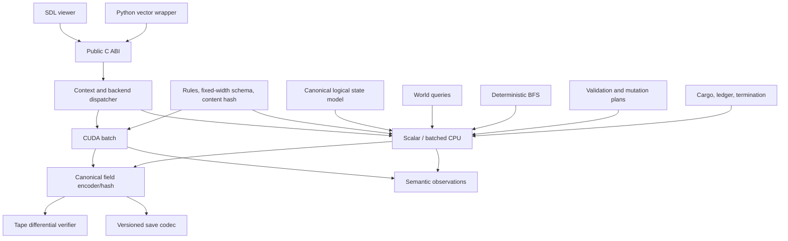

# MVP product architecture and audit

## Status, audience, and evidence boundary

This report defines a **proposed original product**: a Linux-first C17/CUDA/Python
reinforcement-learning environment inspired by the general transportation-management
loop. It also audits `research-notes/05-clean-room-cuda-mvp.md`.

It is source-aware and cites the OpenTTD checkout at commit
`29f808ef0022064e6d9a83c8476d1e0f4686af86`. Consequently, this report is **not a
sanitized clean-room specification** and must not be handed unchanged to a team whose
legal independence depends on never receiving source-derived material. A source-exposed
specification team and counsel must remove upstream symbols, implementation details,
and source citations before an independently licensed implementation team receives a
behavior-only specification.

Terms used below:

- **Observed** means established in the pinned OpenTTD source or documentation.
- **Proposed** or **Recommendation** means newly selected for this MVP. It is not a
  claim about OpenTTD and is not a compatibility promise.
- Confidence applies only to observed claims. Product recommendations are decisions,
  not factual findings needing confidence scores.

This is a practical product and licensing audit, not legal advice.

## 1. Upstream observations that constrain the product decision

| Observed finding | Evidence | Relevance to the proposed MVP | Confidence |
|---|---|---|---|
| OpenTTD is C++20 and builds most production sources into one object library; it is not a supported C, CUDA, or RL library ABI. | `CMakeLists.txt`: `project`, `CMAKE_CXX_STANDARD`, `openttd_lib`; `src/openttd.cpp`: `openttd_main`, `StateGameLoop` | A new C ABI and real component boundaries must be designed rather than inferred from an internal CMake target. | High |
| Authoritative game work is advanced by a central tick loop with a defined phase order; stations are serviced before vehicle ticks. | `src/openttd.cpp:StateGameLoop`; `src/vehicle.cpp:CallVehicleTicks`, including `LoadUnloadStation` before vehicle iteration | A deterministic phase contract is a sound design idea, but this MVP deliberately chooses its own timing and ordering. | High |
| OpenTTD has 74 ticks per ordinary economy day, while calendar/economy clocks can differ. | `src/timer/timer_game_tick.h:Ticks::DAY_TICKS`; calendar/economy timer sources | The MVP uses one clock and 32 ticks/day. This is an original simplification, not parity. | High |
| Player/script mutations pass through a command system that validates, executes, and charges money. | `src/command_func.h:CommandHelper`; `src/command.cpp:InternalExecuteValidateTestAndPrepExec`; `src/company_cmd.cpp:SubtractMoneyFromCompany` | An atomic command boundary is retained as a general architecture pattern; names, layouts, errors, and rules are newly designed. | High |
| OpenTTD road routing uses a feature-rich YAPF pathfinder over implicit directional tile connectivity. | `src/pathfinder/yapf/yapf_road.cpp:YapfRoadVehicleChooseTrack`; `src/pathfinder/follow_track.hpp` | Reproducing it is outside the MVP. A bounded deterministic BFS on a four-neighbour grid is sufficient. | High |
| OpenTTD cargo uses station packets, rating/catchment rules, loading stages, delivery acceptance, and a time/distance payment function. | `src/cargopacket.h`; `src/station_cmd.cpp:MoveGoodsToStation`; `src/economy.cpp:LoadUnloadStation`, `GetTransportedGoodsIncome` | The proposed single-cargo stock/terminal model and formula are intentionally different and much smaller. | High |
| OpenTTD save/load is chunked, versioned, and spread across domain-specific handlers. | `src/saveload/saveload.cpp:SaveOrLoad`; `src/saveload/*_sl.cpp`; `docs/savegame_format.md` | The MVP needs a new small format and a narrow compatibility promise, not OpenTTD save compatibility. | High |
| A null video driver can run a finite tick count, and the official regression harness uses it. | `src/video/null_v.cpp:VideoDriver_Null`; `cmake/scripts/Regression.cmake`, `-vnull:ticks=30000` | Rendering-free simulation should be a first-class target, but the upstream null driver is not an RL API. | High |
| OpenTTD is GPL version 2, with separately licensed third-party material; a language translation of its source is a modification under the supplied GPL text. | `README.md` section 3; `COPYING.md` sections 0–3; representative source headers | A source-guided port must be treated as GPL-2.0-only unless counsel concludes otherwise. The independently licensed route requires actual process separation. | High on repository license; legal application requires counsel |
| The pinned Linux dedicated build completed and all 98 registered tests passed, but these tests are not exhaustive gameplay parity evidence. | `research-notes/07-build-verification.md`; `src/tests/`; `regression/` | Upstream is a useful research reference, but passing upstream tests cannot validate a new engine or a broad “one-to-one” claim. | High |

### Netherite as a methodology reference, not a dependency

`research-notes/10-netherite-reference.md` records the public Netherite repository
at commit `3ebc6ccb6b9eaf3a5f720dd979987d60db9bf952`. Its transferable contribution is
a verification workflow, not code or proof that a whole game was ported exactly:

```text
pinned external oracle + immutable configuration
    -> versioned input/state tape
    -> C replay and first-divergence diagnosis
    -> separate CPU/CUDA canonical comparison
    -> semantic RL observations independent from human rendering
```

The repository's own gates say full-game quality/pixel parity remains open, and
its reported performance was not independently reproduced. Its human product
retains custom C/CUDA rasterization; rendering was not simply turned off. It also
has no clear project-wide public license, so no source, interfaces, tests, tables,
or fixtures should be copied from it. Confidence in those repository-state and
documented-method observations is **High**; confidence in unrerun numerical claims
is **Medium**.

**Recommendation:** adopt four process lessons:

1. keep oracle agreement, CPU/CUDA self-agreement, performance, and product
   completeness as different gates;
2. diagnose the first divergence rather than accepting comparisons contaminated
   by an earlier mismatch;
3. record every skip as `SKIP` with an inapplicable/unavailable reason—never as a
   pass; and
4. maintain a divergence ledger with a minimal tape for every accepted gap.

For this original rules-v1 MVP, the project-owned C scalar backend is the release
oracle. Optional black-box OpenTTD experiments are research evidence only and do
not become a compatibility promise. If restricted OpenTTD parity is later chosen,
freeze an unmodified executable/config/content set and have a source-exposed team
produce a neutral command/result/state tape under the legal process in
`research-notes/02-docs-legal.md`; the independent implementation team must not
receive upstream or Netherite source-derived details.

### Product conclusion from the evidence

**Recommendation:** do not make “exact OpenTTD parity” an MVP requirement. The
smallest coherent product is an original, deterministic road-freight game with a
scalar C reference environment, a semantically equivalent batched CUDA backend,
and a Python vector API. Exactness means **C/CUDA agreement with this project's
own published rules**, not agreement with OpenTTD source, saves, timings, economy,
pathfinder, assets, or user interface.

## 2. Smallest coherent playable MVP

### Player experience

The release contains one original 32x32 fixed scenario. A quarry-like source and
a workshop-like sink are visible on flat ground. The player builds cardinal road
edges, places one pickup terminal, one delivery terminal, and one garage, buys a
single truck type, assigns the two terminals as a circular route, and starts the
truck. Material is produced, loaded, transported, accepted, and converted into
cash. The player wins after delivering 100 units while solvent before day 30;
the player loses on insolvency or the day-30 deadline. The game can be paused,
single-stepped, saved, loaded, and continued.

An RL agent performs the same actions through the public C/Python API. It receives
semantic tensors, scalar accounting signals, deterministic errors for invalid
actions, and explicit `terminated`/`truncated` outcomes. No RGB rendering is
required for training.

### Definition of playable

A clean installation is playable when a user, without debug state editing, can:

1. start the fixed scenario;
2. build a connected source-to-sink road with two terminals and a garage;
3. buy a truck, assign both stops, and start it;
4. see cargo production, loading, movement, unloading, revenue, costs, and time;
5. win or lose with a textual reason; and
6. save at a tick boundary, exit, load, and continue.

### Definition of complete

The MVP is complete only when every acceptance criterion in section 10 passes on
a clean Linux runner, including human play, C/Python use, save continuation,
scalar/batched CPU/CUDA differential tests, and the declared benchmark workload.
An impressive CUDA benchmark alone is not product completion.

### Required MVP scope

| Area | Required decision |
|---|---|
| World | One original fixed 32x32 flat map; buildable ground and immutable obstacle tiles; one producer and one consumer. |
| Company | One company, one signed 64-bit balance, categorized cumulative costs/revenue, delivered-unit score. |
| Construction | Build one reciprocal road edge between adjacent tiles; place exactly two cargo terminals and at least one garage. Rejected commands are atomic. |
| Transport | One truck definition, maximum eight trucks, two-stop circular orders, deterministic BFS route, fixed-point progress, overlaps allowed. |
| Cargo | One original cargo (`material`), integer production, source staging, bounded terminal pickup queue, fixed-rate load/unload, onboard age and distance, accepted final delivery. |
| Economy | Original integer costs/payment constants, moving cost, purchase/build costs, no credit or loan, explicit insolvency. |
| Time/end | 32 ticks/day; 30-day time limit; win at 100 delivered units and non-negative balance; insolvency terminates; time limit truncates. |
| Persistence | New versioned little-endian snapshot/save format; canonical hash; future-trajectory round trip; safe failure on malformed data. |
| Human interface | Minimal SDL2 top-down semantic viewer with complete keyboard path, mouse convenience, text status/errors, pause/step/speed/save/load. |
| RL | Stable C ABI, scalar and batched CPU execution, batched CUDA execution, Python vector wrapper, semantic observations, reward components. |

### Simplifications fixed by contract

- Multiple trucks may occupy the same road tile; there are no collisions,
  overtaking, traffic lights, or reservations.
- All roads are two-way, orthogonal, level, and have equal traversal cost.
- A terminal has a one-tile footprint and a Manhattan catchment radius of one.
- There is one cargo source, sink, cargo type, company, truck type, and scenario.
- A truck route is exactly two terminal handles in circular order.
- Cargo has no transfers, station ratings, competing destinations, or decay while
  waiting. Onboard value may decline with transit ticks according to the original
  content table.
- A vehicle crosses at most one road edge per authoritative tick.
- Topology changes are allowed only while paused in the human app. The API rejects
  road construction during active simulation in MVP rules version 1. This removes
  route invalidation races from the smallest release.
- Entity storage and all scratch buffers are fixed-capacity. “No allocation during
  step” means no heap allocation; deterministic slot allocation inside preallocated
  arrays is permitted by commands.

### Explicit non-goals

- Procedural maps, multiple scenarios, towns/house growth, passengers, mail,
  multiple industries/cargo types, vehicle variants, refitting, or transfers.
- Road demolition, terminal/garage removal, truck sale, dynamic construction while
  running, collisions, congestion, breakdowns, servicing, or replacement.
- Rail, signals, waterways, aircraft, slopes, terrain modification, bridges, or
  tunnels.
- Loans, inflation, subsidies, ratings, stock markets, competitors, scripting,
  multiplayer, modding, downloaded content, or localization beyond project-owned
  English strings.
- OpenTTD/Transport Tycoon save, command, network, data, NewGRF, script, timing,
  economic, rendering, or pixel compatibility.
- Original or OpenTTD names, branding, UI text/layout, maps, constants, code,
  graphics, fonts, music, sound, tests, fixtures, or data tables.
- Windows/macOS/web/mobile packages, distributed training, or a stable asynchronous
  CUDA-stream ABI in the first release.

### MVP feature specification sheet

This table is entirely the proposed original product unless the final column says
“Observed motivation.”

| Feature | User value and workflow | Functional/data/rule requirements | Dependencies and edge cases | Status | Evidence boundary |
|---|---|---|---|---|---|
| Fixed scenario | Player can understand one solvable transport problem immediately: inspect source/sink, then build. | 32x32 original tile array, immutable sites/obstacles, opening balance, rules/content hashes. | Reset, world query; reject corrupt/overlapping content and prove a winning tape. | Required | Recommendation; OpenTTD map sizes/generation are not reused. |
| Road construction | Player connects the route and sees exact cost/error. | Adjacent cardinal edge action, reciprocal bits, paused-only, checked debit, atomic rejection. | World, commands, company; bounds, duplicate edge, obstacle, insufficient funds. | Required | Observed motivation: test/execute command boundary in `src/command*`; new API/rules. |
| Terminals/garage | Player creates pickup, delivery, and purchase points. | Fixed stores, one-tile structures beside road, role validation, lowest-free-slot handles. | Roads, company; overlap, capacity, stale handles, role count. | Required | Original design. |
| Truck purchase/orders | Player buys one truck and selects pickup/delivery loop. | One data-defined truck, max eight, stopped purchase, exactly two distinct terminal handles. | Garage, entity store, orders; funds, invalid role, no route, stale destination. | Required | Observed motivation: vehicles/orders exist upstream; semantics are new. |
| Routing/movement | Truck visibly and deterministically reaches both stops. | Bounded BFS, N/E/S/W ties, fixed-point progress, max one edge/tick, overlap allowed. | Roads/orders/clock; disconnected path, cache rebuild, max path. | Required | Deliberate simplification of observed road YAPF. |
| Cargo loop | Transport causes material to move from producer to accepted sink. | Integer production remainder, source stock, terminal capture, bounded load/unload, onboard age/distance, conservation. | Sites/terminals/truck; no terminal, full queue/truck, return trip, capacity overflow. | Required | Deliberate simplification of observed packet/rating system. |
| Economy/end | Player receives understandable cash feedback and a definite outcome. | Checked int64 ledger, original payment constants, moving cost, 100-unit goal, insolvency, day-30 truncation. | Cargo/clock/company; overflow, same-tick goal/insolvency precedence. | Required | Original formula and goal; no upstream balance constants. |
| Save/load | User can close and resume without trajectory change. | New chunk format, CRC32C, bounded staging decode, atomic app write, canonical future equality. | Full model/codec; truncation, duplicate chunks, unsupported rules/content. | Required | General chunking idea only; no OpenTTD tags/layouts. |
| Human viewer | Player can complete the loop with keyboard or pointer. | One top-down SDL screen, HUD, tools, inspector, errors, pause/step/speed, save/load. | Public C API only; scaling, focus, grayscale, font license. | Required product / optional core dependency | Original view; graphical parity excluded. |
| Python RL | Researcher can train many environments through one action/state contract. | Vector reset/step, structured actions, semantic tensors, raw info, seeded repetition. | C façade, CPU batch; view lifetime, invalid action, terminal auto-reset policy (off by default). | Required | Original API. |
| CUDA batch | Researcher can accelerate complete rules-v1 transitions. | GPU SoA, bounded scratch, device observations, canonical hash, CPU parity. | All semantic phases; unusual batch sizes, isolation, memory capacity, driver/toolkit. | Required for MVP release | Netherite is methodology evidence only, not implementation evidence. |

### One-screen human interface

```text
+----------------------------------------------------------------------------+
| Balance 18,240 | Day 07/30 | Delivered 36/100 | [Pause] [1x 4x 16x]       |
| Tools: [Road] [Pickup] [Delivery] [Garage] [Truck] [Orders] [Inspect]      |
|----------------------------------------------------------------------------|
|                                                                            |
|                          TOP-DOWN 32x32 MAP                                 |
|   [SOURCE] == roads == [pickup] ---- truck ---- [delivery] == [SINK]       |
|                       selection outline / textual error marker             |
|                                                                            |
|----------------------------------------------------------------------------|
| Selection: Truck 0 | cargo 8/16 | target Delivery | state Travelling       |
| Last result: accepted; cost 40 | [Save] [Load] | keyboard help [?]         |
+----------------------------------------------------------------------------+
```

`viewer/` owns focus, cursor, camera, interpolation, and tool previews. It asks
the same command validator used for execution and never writes simulation state.
At 32x32 the full map may fit, but pan and discrete zoom are UI-local conveniences.

### Configuration model

Use one project-owned `settings.toml` for window size/fullscreen, UI scale, key
bindings, camera speed, reduced motion, color mode, autosave interval/retention,
and preferred backend/device. Gameplay rules are **not** read from mutable client
settings when loading; they live in the save and are identified by rules/content
hashes. The Python constructor receives equivalent explicit options. No secrets,
network config, mod paths, or arbitrary content search paths exist in MVP.

## 3. Recommended stack and build products

This section is a recommendation.

| Layer | Choice | Reason / boundary |
|---|---|---|
| Reference core | ISO C17, fixed-width integers, no floating point in authoritative transitions | Auditable semantics and a portable CPU oracle. |
| GPU | CUDA C++ compiled by `nvcc`, exporting only `extern "C"` entry points | CUDA syntax requires a C++ compiler; shared headers are restricted to a C/C++ common subset. |
| Build | CMake + Ninja + CTest; GCC and Clang CPU jobs | Linux-first, reproducible targets, no dependency on OpenTTD's build files. |
| Python | Python 3.11+, `ctypes` for control, NumPy CPU views, DLPack-compatible device observation export for PyTorch | Keeps the public boundary in C and avoids a large binding framework. |
| Viewer | SDL2 plus an independently licensed font or audited system-font dependency | Viewer is required for product play but absent from headless library targets. |
| Tests | Project-owned C test harness under CTest; `pytest`; ASan/UBSan; compute-sanitizer for release candidates | Avoid importing upstream tests and cover both language boundaries. |
| Packaging | Linux `.tar.zst`/`.tar.gz` SDK plus Python wheel; CPU-only build must not require CUDA loader libraries | A CPU user can install/run without an NVIDIA driver. CUDA wheel strategy remains a release decision. |

Recommended build targets:

```text
rf_core             C17 static library; scalar reference only
rf_backend_cpu      C17 scalar and CPU-batch backend
rf_backend_cuda     optional CUDA shared object, loaded only on request
routefoundry        minimal SDL2 executable (working name only)
librf.so            stable public C façade
rf_tests            unit/property/differential executables
rf_bench            feature-locked benchmark
python package      vector environment and tensor adapters
```

The provisional product name must be trademark-cleared before public use.

## 4. Architecture and dependency graph



### Module responsibilities and allowed dependencies

| Module | Responsibility | May depend on | Must not depend on |
|---|---|---|---|
| `contract/` | ABI version, fixed widths, limits, errors, action/result schemas, timing/rounding/overflow rules | C standard headers | SDL, Python, CUDA runtime |
| `content/` | Original scenario and economic constants; stable content hash | `contract` | Runtime mutable state |
| `model/` | CPU canonical logical structs and entity-slot rules | `contract`, `content` | Renderer, filesystem, Python |
| `world/` | Tile/coordinate/connectivity/catchment queries | `contract`, `model` | Economy, UI |
| `routing/` | Bounded BFS and route-cache interface | `contract`, `world`, read-only `model` | Ledger, UI |
| `commands/` | Decode, validate, quote, and produce bounded mutation plans | `contract`, `content`, `world`, read-only `model` | Renderer, CUDA allocation |
| `simulation/` | Apply plans; tick vehicles/cargo/time; ledger commits; terminal checks | all domain modules | SDL, Python, filesystem |
| `codec/` | Canonical field encoding/hash and save framing | `contract`, read-only `model`; controlled model import | Renderer, backend-specific padding |
| `observation/` | Read-only semantic observation encoding | `contract`, read-only `model` | Reward policy mutation, viewer |
| `backend_cpu/` | Context storage and scalar/batch façade | domain modules | CUDA |
| `backend_cuda/` | GPU SoA storage, bounded kernels, import/export, device observations | `contract`, `content`, approved shared leaf rules | CPU struct layout as an ABI, SDL, Python |
| `api/` | Opaque contexts, capability query, lifecycle, synchronous reset/step/observe/snapshot | CPU/CUDA backends | Domain layout in public headers |
| `viewer/` | Semantic drawing and input-to-action mapping | public API only | Direct state mutation |
| `python/` | Vector API, NumPy/PyTorch adapters, reward wrapper | public ABI only | Private C/CUDA headers |

Critical rules:

1. The **logical field schema and transition rules** are normative; CPU AoS and
   CUDA SoA layouts may differ. Same layout is not required for parity.
2. Canonical bytes are emitted field-by-field in explicit little-endian order.
   Raw struct bytes, pointers, padding, route caches, and scratch buffers are never
   hashed or saved.
3. CPU is the release oracle. Every CUDA optimization must pass per-tick canonical
   comparison before its benchmark is considered.
4. The MVP CUDA implementation begins with one logical thread per environment and
   globally allocated SoA scratch. Parallel entity/path kernels are later
   optimizations, not prerequisites.
5. Renderer and Python submit only public actions. There is no privileged UI
   mutation path.

## 5. Proposed logical data model

All entities use fixed-capacity slots. A public handle contains a slot index and
generation; empty or stale handles fail validation. Slot allocation always chooses
the lowest free index. The choice is part of rules version 1.

| Entity | Authoritative fields | Ownership/lifecycle | Save/hash rule |
|---|---|---|---|
| `rf_game` | rules/content version, episode status/reason, clock, company, world, entity stores | Created/reset by context; terminal state accepts only reset/save/query | Encode all named fields, never object bytes |
| `rf_clock` | `tick`, `day`, `tick_in_day`, `action_step` | Advanced once at the end of each simulation tick | Required |
| `rf_world` | width=32, height=32, tile array, topology revision | Scenario reset creates it; commands add roads/structures | Encode dimensions, revision, every tile |
| `rf_tile` | terrain/obstacle kind, four road-edge bits, structure kind and slot | Value in row-major world array | Reserved bits must be zero |
| `rf_site` | kind producer/sink, tile, cargo type, production accumulator, source stock, received total | Two immutable sites created by scenario | Required |
| `rf_terminal` | slot/generation, tile, role pickup/delivery, waiting units | Command-created in fixed store; no removal in MVP | Encode occupancy, generation, fields in slot order |
| `rf_garage` | slot/generation, tile | Command-created; purchase location; no removal | Same |
| `rf_truck` | slot/generation, active/stopped/state, tile/direction, progress, capacity/cargo, pickup tick, trip distance, two orders, cursor, cached route metadata | Purchased in garage; max eight; no sale | Encode all except route path/cache; rebuild deterministically |
| `rf_company` | balance, total build/purchase/run cost, total revenue, delivered units | Exactly one | Required signed/unsigned widths and checked arithmetic |
| `rf_episode` | goal units, deadline tick, terminal/truncated flags, reason, negative-balance counter | Created on reset; evaluated after every tick | Required, including the insolvency counter |
| `rf_route_cache` | topology revision, bounded tile sequence, count/cursor | Derived per truck; invalidated/rebuilt | Excluded from canonical state; cache rebuild must not affect outcomes |
| `rf_mutation_plan` | quoted cost, bounded writes, optional created slot | Per-action scratch, not state | Tape result only; never saved |
| `rf_action` | ABI/struct size, opcode, flags, four fixed operands | Ephemeral; recorded in action tapes | Stable little-endian tape encoding |
| `rf_step_result` | error, flags, balance/delivery deltas, created handle, state hash | Ephemeral output | Tape evidence, not save state |

### Core invariants

- Every road edge has the opposite edge on its in-bounds neighbour.
- Every live handle resolves to one occupied slot with the same generation.
- Structures never overlap immutable sites or each other.
- A truck is either in a garage/stopped, travelling, dwelling, no-route, or
  terminal; impossible flag combinations fail invariant checks.
- `source_stock + terminal_waiting + onboard + delivered` equals cumulative
  produced units, except when a checked capacity overflow terminates the episode.
- `opening_balance + revenue - build - purchase - running == balance` using checked
  signed 64-bit arithmetic.
- All loops that mutate multiple entities use ascending slot ID.
- Capacity exhaustion returns a stable error without partial mutation. Arithmetic
  overflow is a fatal deterministic episode error, never C undefined behavior.

## 6. Exact proposed simulation and command contract

These rules are original recommendations, not observed OpenTTD behavior.

### Timing and tick phases

```text
step(action, repeat):
    validate repeat in [1, 256]
    validate and atomically apply action once before the first repeated tick
    for repeat ticks, unless terminal:
        1. produce material using integer accumulator; retain remainder
        2. offer source stock to the lowest-ID eligible pickup terminal
        3. for each live truck in ascending slot order:
             a. if dwelling: unload accepted cargo, then load oldest eligible cargo
             b. otherwise resolve/rebuild bounded BFS route when necessary
             c. advance at most one edge using fixed-point progress
             d. on target entry, enter DWELL; service begins next tick
             e. charge running cost only if edge progress advanced
        4. commit ledger deltas in ascending truck ID
        5. increment tick and derive day/tick_in_day using 32 ticks/day
        6. evaluate insolvency, 100-unit win, and day-30 truncation in that order
        7. accumulate raw reward components for this public step
    encode observation/result; optionally encode canonical state hash
```

No truck collision or occupancy arbitration occurs: overlaps are legal. A truck
can move at most one edge per tick. Arrival never unloads in the movement phase;
service starts on the following tick, eliminating ambiguous double service.

### Deterministic routing

Use BFS because every road edge costs one:

- queue capacity is exactly 1,024 nodes for the 32x32 map;
- visit neighbours in fixed `north, east, south, west` order;
- mark visited when enqueued, not when dequeued;
- store predecessor direction per tile;
- the first discovered destination is the route;
- route length cannot exceed 1,023 edges;
- no path yields `RF_TRUCK_NO_ROUTE`, not fallback movement;
- cache is keyed by topology revision and destination handle.

This fully specifies equal-path tie breaking without an A* heap. It also makes a
one-thread-per-environment CUDA reference straightforward.

### Cargo and economy

The content table must freeze exact values before Phase 1. A proposed shape is:

```text
production_period_ticks, production_units
terminal_capture_per_tick, load_per_tick, unload_per_tick
road_edge_cost, terminal_cost, garage_cost, truck_price
truck_running_cost_per_moving_tick
unit_value, grace_ticks, minimum_value_numerator, value_denominator
opening_balance, insolvency_floor, insolvency_grace_ticks
goal_units=100, deadline_ticks=30*32
```

Payment is newly defined with checked 64-bit intermediates:

```text
distance_factor = max(truck_trip_distance, 1)
late_steps = min(onboard_age_ticks / grace_ticks, value_denominator - 1)
value_num = max(minimum_value_numerator, value_denominator - late_steps)
revenue = units * unit_value * distance_factor * value_num / value_denominator
```

Division rounds toward zero. The constants must guarantee nonzero `grace_ticks`,
positive denominator, `minimum_value_numerator <= value_denominator`, and that the
maximum contractual quantity cannot overflow. The independent ledger test computes
the formula from test vectors, not by calling production code.

### Command set

| Opcode | Preconditions | Atomic effect |
|---|---|---|
| `NOOP` | Always valid, including paused state | No mutation before ticks |
| `BUILD_ROAD_EDGE` | Paused; adjacent ground tiles; no immutable obstruction; funds available | Add both reciprocal edge bits; debit one new-edge cost; increment topology revision |
| `BUILD_TERMINAL` | Paused; valid ground adjacent to an existing road; role count not exceeded; funds | Allocate lowest slot, write tile structure, debit cost |
| `BUILD_GARAGE` | Paused; valid ground adjacent to road; funds | Allocate lowest slot, write structure, debit cost |
| `BUY_TRUCK` | Valid owned garage; free truck slot; funds | Allocate lowest slot, initialize stopped truck at garage, debit price |
| `SET_TWO_STOP_ROUTE` | Owned stopped truck; two distinct live terminals with pickup then delivery roles | Replace both orders and reset route cursor/cache |
| `START_STOP_TRUCK` | Live truck with valid orders and reachable current target when starting | Toggle stopped/running; preserve other state |

Every validator returns a complete bounded mutation plan or an error. Execution
may not discover a new normal validation failure. In debug/test builds, applying a
plan to a copy and revalidating invariants is mandatory.

### Public C ABI proposal

The exact header is a Phase-0 artifact. It must include `abi_version` and
`struct_size` in every extensible public struct, opaque context handles, explicit
buffer location, and reserved-zero fields. Minimal operations are:

```c
rf_status rf_get_api(uint32_t requested_abi, const rf_api **out);
rf_status rf_context_create(const rf_config *config, rf_context **out);
void      rf_context_destroy(rf_context *context);
rf_status rf_capabilities(const rf_context *context, rf_caps *out);
rf_status rf_reset(rf_context *context, const uint64_t *seeds, uint32_t count);
rf_status rf_step(rf_context *context, const rf_action *actions,
                  uint32_t repeat, rf_step_result *host_results);
rf_status rf_observation_view(rf_context *context, rf_observation_view *out);
rf_status rf_state_hashes(rf_context *context, uint64_t *host_hashes);
rf_status rf_snapshot_export(rf_context *context, uint32_t env,
                             void *host_dst, size_t capacity, size_t *written);
rf_status rf_snapshot_import(rf_context *context, uint32_t env,
                             const void *host_src, size_t length);
const char *rf_status_string(rf_status status);
```

MVP calls are synchronous at the API boundary. A context owns its CUDA stream and
keeps observation device memory valid until the next reset, step, import, or
destroy. `rf_observation_view` reports pointer, location (`HOST` or `CUDA`), device
index, element type, shape, byte strides, byte length, and a generation token.
The Python adapter turns CUDA views into DLPack capsules and rejects stale
generations. User-provided streams and asynchronous events are post-MVP.

### Python contract

- `VectorEnv(num_envs, backend="cpu"|"cuda", device=0, rules="v1")`
- `reset(seed: int | sequence[int]) -> observation, info`
- `step(actions, repeat=1) -> observation, reward, terminated, truncated, info`
- fixed action matrix shape `[N, 6]` of `int32` values;
- observations: `tiles uint8[N,6,32,32]`, `trucks int32[N,8,F]`,
  `truck_mask bool[N,8]`, and `global int64[N,G]`;
- CPU arrays are NumPy views or copies with documented lifetime; CUDA observations
  become PyTorch tensors without a device-to-host observation copy;
- reward is wrapper configuration, while `info` always returns raw balance,
  revenue, costs, delivered units, invalid-action code, and state hash;
- evaluation uses delivered units, goal success, final balance, and ticks, not
  shaped reward alone.

## 7. Persistence requirements

The first release supports one format major and minor. It rejects incompatible
major versions; migrations are not an MVP requirement.

```text
Header: 8-byte project magic, format major/minor, rules version,
        content hash, payload length, CRC32C
Chunks: GAME, WRLD, SITE, TERM, GARG, TRUK, COMP, EPIS
Each chunk: tag, flags(required/optional), version, byte length, payload
```

Requirements:

1. Encoding is little-endian, field-by-field, independent of C/CUDA layout and
   host padding.
2. Maximum accepted file size is 1 MiB for MVP rules v1. Every count, length,
   multiplication, handle, reserved bit, and duplicate required chunk is checked
   before state commit.
3. Decode occurs into scratch state. On any failure, the live environment remains
   byte-for-byte canonically unchanged.
4. CRC32C parameters and test vectors are specified in the format document. It is
   corruption detection, not authentication.
5. Canonical state excludes caches and file framing. After load, caches rebuild and
   the next 10,000 ticks of the same action tape must match the unsaved run.
6. Saving a CUDA environment synchronizes that context, exports one environment to
   bounded host staging, then uses the same codec as CPU. Import performs the
   inverse. Layout-specific device dumps are forbidden.
7. The app writes `name.tmp`, flushes and closes it, then atomically renames within
   the same directory. Existing saves are replaced only after a successful write.
8. Saves include the entire fixed map and content/rules hashes. No external map,
   OpenTTD data, or runtime art is required to resume simulation.
9. A save made in terminal state loads in terminal state. Reset is the only normal
   transition back to active.
10. Fuzzing includes truncation at every byte boundary, excessive lengths, duplicate
    chunks, stale handles, invalid enum values, CRC mismatch, and unknown required
    chunks.

## 8. Performance and accessibility requirements

### Performance gates

These are **provisional product targets**, not observed measurements. Phase 0 must
record a reference CPU, GPU, driver/toolkit, compiler flags, power mode, and exact
benchmark seed/action corpus. Targets may be changed only in a documented product
decision before release-candidate benchmarking.

Reference workload: rules v1, 32x32 map, eight live trucks, 4,096 environments,
one action and four ticks per step, observation encoding enabled, state hashing
sampled every 32 steps, after warmup.

| Gate | MVP target |
|---|---|
| Human viewer | 60 Hz rendering with simulation at 1x/4x/16x; p99 input-to-command-result under 100 ms on reference Linux desktop |
| Scalar C | At least 50,000 environment-ticks/s with observation encoding on one declared reference CPU core |
| CUDA throughput | At least 500,000 environment-ticks/s and at least 5x the scalar single-core throughput on the declared reference GPU at N=4,096 |
| CUDA latency | N=1 reset/step/observation p99 below 2 ms after initialization |
| Memory | Authoritative state + route scratch + observations no more than 32 KiB/environment at v1 limits; no growth during a 10-million-tick soak |
| Save | Export and import a default environment below 50 ms each; file below 128 KiB |

Every published benchmark must report hardware, toolkit/driver, batch, repeat,
entity counts, map, observation channels, hash frequency, warmup, sample count,
median/p95/p99, and transfer inclusion. A benchmark with disabled cargo,
observations, validation, or parity checks is a microbenchmark and cannot satisfy
the product gate. Correctness gates take precedence over speed.

### Accessibility gates

- The fixed scenario can be completed without a mouse. Keyboard focus/cursor is
  visible, all tools have bindings, and every action has a text label.
- Terrain, roads, structures, truck state, and errors are distinguishable by
  shape/icon/text as well as color. A grayscale screenshot review is a release
  gate.
- UI scale supports at least 100%, 150%, and 200%; text does not clip at 200% in
  the fixed 1280x720 acceptance viewport.
- Pause and single-step are always available; speed changes never alter
  authoritative outcomes. Optional movement interpolation can be disabled.
- Errors name the failed rule in plain text and remain in a dismissible history;
  transient color flashes are never the only feedback.
- The app has no audio requirement. If audio is later added, visual equivalents
  remain mandatory.
- SDL2 does not itself establish screen-reader accessibility. The MVP must state
  that limitation honestly; a line-oriented control/status mode is P1 unless a
  tested accessible widget layer is selected.

## 9. Exact phased implementation guide

### Phase 0 — decision record, contracts, and clean build

- **Objective:** freeze what is being built and how legal/provenance boundaries
  work before code can drift.
- **Tasks:** approve GPL-derivative versus independent strategy; freeze rules v1
  constants, map, limits, overflow/rounding, phase order, benchmark hardware,
  dependency manifest, ABI conventions, CMake presets, warnings, ASan/UBSan,
  CTest, Python test skeleton, and artifact names.
- **Dependencies:** legal/product decision only.
- **Interfaces:** `rf_status`, versioned public struct prefix, handles, checked
  arithmetic, content/rules hashes.
- **Unit tests:** ABI size/alignment assertions in C and C++; checked add/multiply;
  endian codec primitives; status-string completeness.
- **Integration tests:** clean GCC and Clang CPU configure/build/test; CPU-only
  package imports without CUDA installed.
- **Complete when:** decision record is signed, two clean trees reproduce the same
  empty-state canonical bytes, and CI is green.
- **Common risks:** implementation starts before license decision; constants live
  only in code; CUDA layout dictates semantics.

### Phase 1 — fixed world, clock, canonical state

- **Objective:** deterministic reset and time progression for the original fixed
  scenario.
- **Tasks:** tile/world/site/company/episode structs, fixed map loader, slot stores,
  clock, canonical encoder/hash, invariant checker, semantic tile observation.
- **Dependencies:** Phase 0.
- **Interfaces:** `rf_reset`, world query, clock tick, canonical encode/hash.
- **Unit tests:** coordinate edges; reciprocal-road invariant; slot generations;
  fixed map content hash; 0/1/31/32/33 tick day vectors.
- **Integration tests:** two runs reset and NOOP for 10,000 ticks with identical
  canonical hashes; batch order does not change results.
- **Complete when:** a fixed scenario can reset, advance, observe, and replay
  identically with no vehicles or commands.
- **Common risks:** hashing padding; content accidentally depends on renderer;
  fixed map is unsolvable or unoriginal.

### Phase 2 — atomic construction

- **Objective:** create a legal route and structures while paused.
- **Tasks:** action/tape codec, bounded mutation plan, road edges, terminals,
  garage, quote/debit, topology revision, error taxonomy.
- **Dependencies:** Phase 1.
- **Interfaces:** validate/plan/apply, `BUILD_ROAD_EDGE`, `BUILD_TERMINAL`,
  `BUILD_GARAGE`.
- **Unit tests:** bounds, adjacency, obstacle, duplicate edge, overlap, role limits,
  insufficient funds, plan capacity, checked costs, stale handles.
- **Integration tests:** golden scripted construction creates the intended network;
  every rejected command preserves canonical bytes; randomized actions preserve
  graph/ledger invariants.
- **Complete when:** the source-to-sink infrastructure can be built through public
  actions and fuzzing finds no partial failure.
- **Common risks:** quote/apply disagreement; reciprocal edge omissions; UI sneaks
  around commands.

### Phase 3 — trucks, orders, and BFS movement

- **Objective:** a purchased truck loops between two terminals.
- **Tasks:** truck store, buy/order/start commands, BFS scratch, route cache,
  fixed-point movement, dwell/no-route states, running costs.
- **Dependencies:** Phase 2.
- **Interfaces:** truck query, route find, `BUY_TRUCK`, `SET_TWO_STOP_ROUTE`,
  `START_STOP_TRUCK`.
- **Unit tests:** BFS equal-path vector, disconnected graph, maximum path, cache
  key, state transitions, one-edge-per-tick bound, running-cost ledger.
- **Integration tests:** one and eight overlapping trucks loop for 100,000 ticks;
  rebuilt cache yields same future hashes; no-route state is stable.
- **Complete when:** public actions produce a deterministic continuous route and
  all accounting/invariants hold.
- **Common risks:** route caches become authoritative; off-by-one arrival service;
  accidental occupancy/collision behavior.

### Phase 4 — cargo, economy, reward facts, and episode end

- **Objective:** complete the transport-management feedback loop.
- **Tasks:** production accumulator, source stock, terminal capture, load/unload,
  onboard age/distance, delivery, checked payment, raw reward facts, win/loss/
  truncation.
- **Dependencies:** Phase 3.
- **Interfaces:** cargo tick, ledger transaction batch, episode result, raw info
  fields.
- **Unit tests:** production fractions, capture tie, queue/capacity bounds, unload-
  before-load, conservation, payment boundary vectors, insolvency grace, terminal
  precedence.
- **Integration tests:** an independently calculated golden tape wins with exact
  balance/delivery/tick; idle and wasteful tapes truncate or fail as specified;
  10-million-tick random soak preserves invariants.
- **Complete when:** the headless C API can win and lose with explainable,
  independently checked accounting.
- **Common risks:** cargo loss/duplication; reward leaks terminal state; chosen
  constants make the scenario impossible or trivial.

### Phase 5 — save/load and human-playable Linux app

- **Objective:** satisfy the human product and persistence promises.
- **Tasks:** save framing/CRC/transactional decode, atomic app writes, SDL2 map and
  panels, keyboard/mouse tools, pause/step/speed, status/error history, UI scaling,
  original icons/strings/font audit.
- **Dependencies:** Phase 4.
- **Interfaces:** snapshot size/export/import, renderer projection, input-to-action
  mapper.
- **Unit tests:** codec field vectors, all malformed-save classes, command binding
  table, scale/layout bounds.
- **Integration tests:** save/load plus 10,000-tick future tape; keyboard-only
  scripted/manual acceptance; grayscale and 200%-scale captures; clean app package
  run.
- **Complete when:** a new user can complete, save, exit, reload, and finish the
  scenario without debug mutation.
- **Common risks:** UI becomes a second simulation; unsafe file replacement;
  bundled font/art has unclear licensing.

### Phase 6 — Python CPU vector environment

- **Objective:** make the complete CPU simulation usable by RL code.
- **Tasks:** batched CPU context, stable observation buffers, Python lifecycle,
  Gymnasium-compatible semantics, reward wrapper, seeded vector reset, examples
  and heuristic baseline.
- **Dependencies:** Phase 4; Phase 5 codec for snapshot API.
- **Interfaces:** public C façade, `VectorEnv`, NumPy views, capability query.
- **Unit tests:** shapes/dtypes/strides, stale view detection, seed broadcasting,
  exception/status mapping, reward component calculation.
- **Integration tests:** Python golden tape equals direct C hashes; permutation of
  environments; random and heuristic agents; destruction/reset/view-lifetime
  stress.
- **Complete when:** a documented Python script trains/evaluates against 256 CPU
  environments and the heuristic reaches the goal deterministically.
- **Common risks:** Python copies are hidden; wrapper reward changes state; lifetime
  bugs cross the C boundary.

### Phase 7 — CUDA semantic parity and release performance

- **Objective:** run the complete rules-v1 environment in CUDA batches without
  changing behavior.
- **Tasks:** SoA device state, one-thread-per-environment reference kernel, global
  BFS scratch, reset/step/observation/hash, CPU-device import/export, DLPack view,
  differential runner, compute-sanitizer, profiler-led optimizations, benchmark.
- **Dependencies:** Phase 6 and all prior semantic gates.
- **Interfaces:** backend selection/capability, same synchronous ABI, CUDA
  observation view.
- **Unit tests:** GPU codec primitives and content constants; batch sizes
  1/31/32/33/256/4,096; every error and capacity boundary.
- **Integration tests:** CPU scalar vs CPU batch vs CUDA per-tick hashes for valid,
  invalid, win, loss, save/import, reset, permutation, and randomized tapes;
  compute-sanitizer; 10-million-tick soak; feature-complete benchmark.
- **Complete when:** every section-10 criterion and declared performance gate
  passes; benchmark metadata and failures are published.
- **Common risks:** state/scratch footprint, warp divergence, stale DLPack views,
  benchmark shortcuts, toolkit/GPU deployment mismatch.

### Cross-phase testing strategy

The rules-v1 fixed scenario may not consume randomness during ordinary ticks, but
the API still accepts a 64-bit reset seed. Seed derivation is project-owned and
specified as `episode_seed = mixer(base_seed, env_logical_id, reset_count)` with
published vectors. Future random subsystems must use counter-addressed draws keyed
by rules version, seed, subsystem, tick, entity slot, and draw index; iteration or
CUDA scheduling may not change them.

| Test layer | Required coverage | Release evidence |
|---|---|---|
| Unit | Checked arithmetic, handles, coordinates, reciprocal edges, clock, BFS tie/no-path, command predicates/plans, cargo fractions, payment, termination, codec fields | CTest cases with named vectors |
| Property/fuzz | Random valid/invalid actions; atomic rejection; graph/entity/cargo/ledger invariants; save parser byte mutations and truncations | Reproducible failing seeds and corpus artifacts |
| Determinism | Same canonical field bytes for repeated seed/tape; different CPU compilers/builds; batch permutation; reset-count vectors | Per-tick hash logs, not raw struct comparison |
| Differential | Scalar C vs batched CPU vs CUDA at N=1/31/32/33/256/4096; first mismatch includes field path and minimal tape | Machine-readable first-divergence report |
| Construction | Every error, quote/debit equality, slot capacity, obstacle/bounds, public UI path | Command matrix and fuzz summary |
| Pathfinding | Unique/equal/disconnected/maximal routes, cache omission/rebuild, no fallback movement | Golden path lists and future hashes |
| Economy/cargo | Independent production/payment vectors, conservation, saturation, load/unload phase, insolvency/goal/deadline precedence | Golden ledger calculated outside production code |
| Persistence | Canonical save bytes, save/load/save stability, transactional failure, 10k future ticks, CPU/CUDA exchange | Fixture/version manifest and fuzz report |
| Long running | 10 million ticks across idle, heuristic, random valid, and random invalid policies; stable memory/capacity telemetry | Soak logs with sampled invariants |
| Performance | Complete fixed workload after parity, observation enabled, transfers disclosed, percentiles and memory | Versioned benchmark JSON/raw logs |
| UI/accessibility | Keyboard completion, pointer picking, 100/150/200% scale, grayscale, pause/speed hash equality, save errors | Acceptance checklist and captures |
| Packaging | Clean CPU-only install without CUDA; optional CUDA detection/failure; examples and license files present | Consumer-container/clean-run logs |

Every failure result is `PASS`, `FAIL`, or `SKIP(reason, profile)`. A skip cannot
satisfy a required release gate. Golden fixtures contain only original project
data and record the rules/content/build version that produced them.

## 10. Release acceptance criteria

| ID | Acceptance criterion | Authoritative evidence |
|---|---|---|
| AC-01 | License strategy, source-exposure roles, dependencies, assets, and provisional-name review are documented; no forbidden upstream content is present. | Signed decision record, provenance log, SBOM, similarity/asset scan, release review |
| AC-02 | GCC and Clang build/test CPU-only on clean Linux; installing/importing CPU package does not require an NVIDIA driver or CUDA library. | Clean CI logs and artifact test |
| AC-03 | A keyboard-only user completes the fixed scenario through the public action path; win/loss reasons and accounting are visible. | Recorded acceptance script/checklist and canonical action tape |
| AC-04 | Every rejected command leaves canonical state unchanged; every accepted quote equals the ledger debit. | Exhaustive command cases plus property/fuzz results |
| AC-05 | Repeating any release tape with the same rules/content/seed yields the same canonical hash each tick on scalar C. | Determinism corpus logs |
| AC-06 | Save/load preserves immediate canonical state and the next 10,000-tick trajectory; malformed input never partially commits. | Round-trip/future-tape and fuzz logs |
| AC-07 | Python CPU results, observations, and hashes equal direct C for the full golden corpus; view lifetimes are enforced. | `pytest`/C differential report |
| AC-08 | Scalar C, batched CPU, and CUDA match per tick at N=1/31/32/33/256/4,096 across golden and randomized command tapes, all terminal modes, and capacity errors. | Differential matrix |
| AC-09 | CUDA reset/import of one environment cannot influence another; batch permutation only permutes outputs. | Isolation/permutation tests |
| AC-10 | ASan/UBSan, save fuzzing, long soak, and compute-sanitizer report no failure for release configuration. | Sanitizer and soak artifacts |
| AC-11 | Section-8 performance and memory targets pass on declared hardware with the full feature manifest. | Versioned benchmark JSON and raw logs |
| AC-12 | Accessibility gates pass at 1280x720, 100/150/200% scale, keyboard-only operation, and grayscale review. | UI acceptance report/screenshots |
| AC-13 | Save format, ABI, rules, observations, action errors, build/install, and benchmark method are documented from a clean consumer's perspective. | Published versioned docs and example run |
| AC-14 | Final SDK/wheel archives are rebuilt from a clean tree, inventories match source, and repository/worktree remain clean after tests. | Reproducible-build manifest and `git status` evidence |

## 11. Prioritized relative backlog

Estimates are relative Fibonacci points, not time promises.

| ID | User story / deliverable | Priority | Dependencies | Points | Acceptance |
|---|---|---:|---|---:|---|
| MVP-001 | Choose GPL derivative or independent implementation process | P0 | — | 3 | Signed strategy/source-exposure decision |
| MVP-002 | Freeze rules-v1 scope, constants, limits, and fixed map | P0 | 001 | 5 | Versioned contract and solvable golden plan |
| MVP-003 | Create Linux CMake/GCC/Clang/CTest foundation | P0 | 001 | 3 | Clean CPU-only CI passes |
| MVP-004 | Define versioned C ABI, errors, widths, handles, overflow | P0 | 002,003 | 5 | C/C++ layout and checked-arithmetic tests |
| MVP-005 | Implement canonical endian writer/reader/hash primitives | P0 | 004 | 5 | Golden bytes and hash vectors |
| MVP-006 | Implement fixed map, tiles, sites, and company reset | P0 | 002,004 | 5 | Fixed content hash/invariants pass |
| MVP-007 | Implement clock and episode status | P0 | 006 | 3 | Tick/day/deadline vectors pass |
| MVP-008 | Implement action/tape codec and bounded mutation plan | P0 | 004 | 5 | Codec and no-partial-plan tests |
| MVP-009 | Implement reciprocal road-edge command | P0 | 006,008 | 5 | Bounds/funds/atomic/fuzz tests |
| MVP-010 | Implement terminal and garage placement | P0 | 009 | 5 | Role/overlap/slot/ledger tests |
| MVP-011 | Implement truck slots, purchase, and start/stop | P0 | 010 | 5 | Handle/funds/state tests |
| MVP-012 | Implement two-stop order command | P0 | 011 | 3 | Role/handle/stopped validation passes |
| MVP-013 | Implement bounded deterministic BFS | P0 | 009 | 5 | Tie/no-path/max-path vectors pass |
| MVP-014 | Implement movement, dwell, cache, and running costs | P0 | 011,012,013 | 8 | 100k-tick route/ledger test |
| MVP-015 | Implement production and source/terminal stock flow | P0 | 010 | 5 | Fraction/capacity/conservation tests |
| MVP-016 | Implement load/unload, delivery, age/distance | P0 | 014,015 | 8 | Cargo conservation and arrival phase tests |
| MVP-017 | Implement revenue, win, insolvency, and truncation | P0 | 016 | 5 | Independent golden ledger and outcomes |
| MVP-018 | Implement canonical full-state codec and save framing | P0 | 005,017 | 8 | Future-trajectory round-trip/fuzz pass |
| MVP-019 | Build semantic observations and raw result facts | P0 | 017 | 5 | Shape/value oracle passes |
| MVP-020 | Build SDL2 semantic viewer and input mapper | P0 | 009-019 | 8 | Public actions only; UI smoke passes |
| MVP-021 | Add save UI, keyboard completion, scaling/accessibility | P0 | 018,020 | 5 | AC-03/06/12 pass |
| MVP-022 | Implement batched CPU backend and public façade | P0 | 019 | 8 | Scalar/batch differential passes |
| MVP-023 | Implement Python CPU vector wrapper and heuristic | P0 | 022 | 8 | C/Python differential; heuristic wins |
| MVP-024 | Implement CUDA SoA reset/import/export | P0 | 022 | 8 | CPU/CUDA empty/full state hashes match |
| MVP-025 | Implement CUDA step and BFS reference kernel | P0 | 024 | 13 | Full differential matrix passes |
| MVP-026 | Implement CUDA observations and DLPack lifetime | P0 | 019,025 | 8 | Zero-copy/view-generation tests pass |
| MVP-027 | Add sanitizers, fuzzing, permutation, and long-soak matrix | P0 | 018,025,026 | 8 | AC-08/09/10 pass |
| MVP-028 | Profile and optimize feature-complete CUDA workload | P0 | 027 | 8 | AC-11 passes without parity regression |
| MVP-029 | Package CPU SDK/wheel and optional CUDA component | P0 | 021,023,028 | 8 | Clean consumer install/run passes |
| MVP-030 | Complete SBOM, notices, provenance, docs, and release audit | P0 | all | 5 | AC-01/13/14 pass |
| P1-001 | Add deterministic obstacle-map variants | P1 | MVP release | 8 | Seed corpus remains solvable |
| P1-002 | Add road/structure removal and truck sale | P1 | MVP release | 8 | Dynamic invalidation/accounting tests |
| P1-003 | Add a second cargo and truck definition | P1 | MVP release | 8 | Conservation/acceptance remains typed |
| P1-004 | Add asynchronous stream/event API | P1 | MVP release | 13 | Lifetime/concurrency contract proven |
| P1-005 | Add line-oriented accessible control/status client | P1 | MVP release | 5 | Scenario can be completed via text client |

## 12. Risk register and unanswered decisions

| Risk | Likelihood | Impact | Containment / proof gate |
|---|---:|---:|---|
| “Inspired” drifts into source translation or exact-parity claims | High | Critical | License decision, source-exposure separation, no upstream code/data, AC-01 |
| Product scope grows before a complete vertical loop | High | Critical | Rules-v1 freeze; all deferred items require post-MVP change record |
| CPU/CUDA behavior diverges through layout, order, or capacity errors | High | Critical | Logical schema, integer rules, per-tick hashes, unusual batch sizes, AC-08/09 |
| GPU BFS scratch or per-environment state harms occupancy | Medium | High | 32x32 bound, global SoA scratch, 32-KiB budget, profile after parity |
| Reward is learnable in unintended ways | High | High | Raw facts separated from wrapper reward; heuristic/adversarial evaluation |
| Save decoder corrupts live state or becomes an endless compatibility burden | Medium | High | Scratch decode, 1-MiB cap, one major only, fuzz, future-trajectory tests |
| Economy constants make the fixed scenario impossible/trivial | Medium | High | Freeze a hand-calculated solvable tape and heuristic before UI/CUDA work |
| CUDA deployment/license packaging blocks release | Medium | Critical | CPU-only artifact, exact toolkit/GPU matrix, counsel/SBOM review before wheel design |
| Optional viewer silently becomes authoritative | Medium | High | Viewer depends only on public ABI; headless golden tape is canonical |
| Device observation lifetime causes use-after-free or stale training data | Medium | High | Generation tokens, synchronous MVP API, destruction/reset tests |

Five product decisions remain genuinely open:

1. Is the release GPL-2.0-only and source-derived, or independently implemented?
2. Which exact GPU architecture/toolkit/driver and CPU define release performance?
3. Does the user accept the fixed-map/one-cargo scope, or is procedural variety a
   launch requirement worth delaying CUDA?
4. Will the CUDA component ship in a wheel/SDK, be built locally, or be hosted only?
5. Is tested screen-reader operation required for MVP? If yes, SDL2 plus custom
   controls is insufficient and the UI stack/scope must change now.

### Clean-room/reuse checklist (final-report section N)

- [ ] The project has explicitly chosen either a GPL-2.0-only source-derived
  route or an independently implemented route; it does not blur the two.
- [ ] The independent implementation team, if used, receives a legally reviewed
  behavior-only specification rather than this source-aware report or checkout.
- [ ] No OpenTTD or Netherite source, identifiers, comments, layouts, constants,
  tables, interfaces, tests, fixtures, saves, strings, artwork, fonts, audio,
  maps, scenarios, or branding are copied.
- [ ] Every new requirement has permitted provenance: public behavior experiment,
  independently known rule, or project-original product decision.
- [ ] New project names, commands, schema tags, errors, content, formulas, map,
  visual language, text, and balancing are documented as original artifacts.
- [ ] Every dependency and asset has version, canonical source, license, author,
  checksum, notices, and distribution treatment recorded in the SBOM/provenance
  manifest.
- [ ] Original TTD payloads, OpenTTD/OpenGFX assets, third-party add-ons, user
  saves, and oracle pixels/audio do not enter public artifacts without a separate
  approved license review.
- [ ] Black-box oracle traces use a neutral project-owned schema, frozen
  executable/config/content hashes, approved fields, and publication scrubbing.
- [ ] CPU/CUDA agreement is never described as proof against an external oracle;
  external-oracle agreement is never described as whole-game completeness.
- [ ] Contributor attestations record source exposure, employer rights, generated
  material, and asset authorship; similarity/provenance review happens before
  merge and release.
- [ ] CUDA runtime/toolkit linkage and every binary/wheel distribution channel
  have specific legal/notice review; CPU-only use remains available.
- [ ] The final name/logo and descriptive mentions of OpenTTD/Transport Tycoon
  receive trademark/passing-off review and clearly avoid affiliation claims.
- [ ] If upstream GPL material is intentionally reused, the affected product is
  no longer called clean-room; GPL text, source delivery, modification notices,
  credits, and complete corresponding build/install source are supplied.

### A–N final-deliverable coverage matrix

This specialist report is deliberately MVP-focused; repository-wide facts remain
authoritative in notes 00–07 and 10. The consolidator can use the following map to
avoid dropping an attached-prompt requirement:

| Required final section | Primary evidence/content |
|---|---|
| A. Executive Summary | This report sections 1–2; upstream overview in notes 00/03 |
| B. Repository Fact Sheet | `00-repository-metadata.md`, `01-repository-build.md`, `07-build-verification.md` |
| C. Feature Specification Sheet | This report “MVP feature specification sheet”; broader observed features in notes 03/06 |
| D. System Architecture | This report section 4; observed dependency architecture in notes 01/03/06 |
| E. Core Data Model | This report section 5; observed entities in note 03 |
| F. Simulation Rules | This report section 6; observed OpenTTD loop/economy in note 03 |
| G. MVP Definition | This report section 2, including playable/complete/scope/non-goals |
| H. Recommended MVP Architecture | This report sections 3–6 |
| I. Phased Build Guide | This report section 9, with objective/tasks/dependencies/interfaces/tests/completion/risks for every phase |
| J. Development Backlog | This report section 11, ordered relative estimates and acceptance |
| K. API and Interface Proposals | This report section 6 C ABI/Python/commands plus module interfaces in section 4 |
| L. Testing Strategy | Cross-phase testing strategy and sections 8/10 |
| M. Risks and Open Questions | This report section 12; legal questions in note 02 |
| N. Clean-Room Implementation Checklist | Checklist immediately above; legal detail in note 02 |

The feature sheet, simulation formulas, API, save tags, data model, viewer, and
backlog in this report are recommendations. OpenTTD observations must retain their
file/symbol/confidence evidence when moved into A–F; do not merge the two voices
into an unlabeled narrative.

## 13. Audit of `05-clean-room-cuda-mvp.md`

The earlier note is directionally strong on deterministic commands, renderer
separation, canonical state, CPU/CUDA differential verification, and honest
benchmark reporting. The consolidator should retain those principles. It should
make the following corrections rather than treating note 05 as implementation-
ready.

| Severity | Gap or overclaim in note 05 | Required correction |
|---|---|---|
| Critical | The title and opening call the report “clean-room,” but the report sits in a source-analysis corpus and incorporates source-derived architecture. | Rename it an independent-design proposal/source-aware audit. State that it is not a sanitized clean-room handoff and require a separate reviewed behavior-only spec. |
| Critical | The legal strategy remains an open question while implementation phases and a public repository are proposed. | Make a signed GPL-derivative vs independent-process decision Phase 0 and block public implementation/distribution until it exists. |
| High | “Same action stream and seed must produce identical authoritative state” can be read as OpenTTD parity. | Define exactness as this project's CPU/CUDA canonical parity only; explicitly exclude OpenTTD parity from MVP. |
| High | The scope is not the smallest coherent MVP: four settlements, two cargoes, two truck variants, procedural generation, demolition/sale, migrations, SDL, Python, and CUDA all arrive together. | Reduce rules v1 to one fixed 32x32 scenario, one cargo/source/sink/truck, no removal/sale, then place variety in P1. |
| High | “Fixed for the first release but generated deterministically from a seed” is contradictory. | Choose a fixed authored template for MVP. Seeds initialize the API but do not promise map variation; procedural variants are P1. |
| High | Byte-identical CPU runs can accidentally include raw struct padding/pointers. | Require byte identity only for the canonical field encoding and saves; never hash raw structs. |
| High | The CPU/CUDA gate uses only `>=256` environments and one 10k tape. Warp-boundary, singleton, reset, terminal, capacity, and isolation cases are absent. | Test N=1/31/32/33/256/4096, valid/invalid/terminal/save tapes, permutation, batch isolation, and longer soaks. |
| High | “No allocation during step” conflicts with command-created terminals, garages, and carriers. | Say no heap allocation; use deterministic allocation from preallocated slots and bounded mutation scratch. |
| High | CPU/CUDA are said not to change “state layout,” which unnecessarily couples AoS and SoA. | Make the logical schema normative while allowing CPU AoS and GPU SoA; compare canonical encodings. |
| High | A*/BFS tie-breaking is not complete enough to reproduce all frontier behavior, and A* adds needless heap/scratch complexity on equal-cost roads. | Select bounded BFS, fixed neighbour order, enqueue-time visited marking, fixed queue, and explicit no-path behavior. |
| High | Vehicle occupancy appears in state/observations, but collision and multi-vehicle arbitration semantics are not defined. | Explicitly permit overlaps for MVP or define full arbitration. This report selects overlap. |
| High | Cargo lots aggregate by age bucket and also store birth ticks without defining merge/split/rounding semantics. | Use one cargo/source and define scalar source/terminal stock plus truck pickup tick; defer age-bucket merging. |
| High | The proposed insolvency grace period is not represented in the data model or exact terminal precedence. | Serialize a negative-balance counter and define win, insolvency, and time-limit ordering. |
| High | Public CUDA functions accept raw pointers and `void *stream` without a pointer-space, ownership, async-error, or lifetime contract. | Use a synchronous MVP ABI with explicit buffer location/device/shape/strides/generation. Defer user streams; use DLPack only through a documented adapter. |
| High | The ABI lacks a general `abi_version`/`struct_size` negotiation rule, capability query, reserved-zero validation, and CPU observation counterpart. | Add `rf_get_api`, versioned extensible structs, `rf_capabilities`, backend-neutral observation views, and explicit reserved fields. |
| High | The save format names CRC64 but not its exact variant; required/optional chunks are not encoded; atomic file replacement and live-state rollback are missing. | Specify one checksum algorithm/test vectors, chunk flags, bounds, scratch decode, transactional commit, and app-level temp-write/rename. |
| Medium | Migrators are required before even one released format exists. | MVP supports only current major/minor and rejects incompatible major. Add migrations only after a second supported release. |
| High | Persistence is both a “playable” requirement and postponed to Phase 6 after the RL loop. | Build canonical encoding in Phase 1 and user save/load before Python/CUDA release work. |
| High | The debug viewer is called optional while “playable without debug tools” is required. | Make the viewer optional to core linkage but required in the human MVP artifact and acceptance test. |
| High | The numerical performance table has no declared hardware and therefore appears more authoritative than its evidence permits. | Mark targets provisional, freeze hardware/workload in Phase 0, use relative and absolute gates, and never report them as observed results. |
| Medium | A 24-hour soak appears without a tick/state coverage requirement and may consume CI without finding ordering bugs. | Define a 10-million-tick invariant/differential corpus first; run longer soak as scheduled evidence, not a substitute for targeted tests. |
| High | Accessibility is absent. | Add keyboard-only completion, non-colour cues, 200% scale, pause/step, persistent text errors, and an explicit screen-reader limitation/decision. |
| Medium | The proposed `action_mask[N,A]` does not specify the enormous parameterized action space or how masks relate to operands. | Use fixed structured operands and deterministic invalid-action errors in MVP; mask only opcode/role availability or defer a legal-action catalog. |
| Medium | Reward is described but the ABI has a single `int32 reward` and no exact component buffer/scaling contract. | Keep reward in the Python wrapper, return raw int64 accounting facts, version reward configuration separately, and evaluate unshaped outcomes. |
| High | The one-block/one-warp CUDA mapping is selected before profiling and makes ordered semantics/scratch ownership vague. | Start with one logical thread per environment and global SoA scratch; optimize only after full differential parity. |
| Medium | The phase plan does not require a hand-calculated solvable scenario before GPU/UI effort. | Freeze a golden winning tape and independent ledger calculation in Phase 0/4. |
| Medium | Save size and throughput figures are asserted before a frozen encoded schema and benchmark machine exist. | Treat them as product budgets, measure after schema freeze, and revise only through a recorded decision. |
| Medium | CPU-only installation is stated but packaging does not prove that importing Python avoids CUDA loader resolution. | Add a clean CPU-only artifact/import test with CUDA absent. |
| Medium | The provisional name is introduced without a downstream release gate. | Keep it visibly provisional and add trademark/name clearance to AC-01. |
| High | Note 05's differential plan proves only project CPU/CUDA self-consistency but can be read as the Netherite-style external parity workflow that motivated the user. | State two independent planes: CPU/CUDA parity is mandatory for this original MVP; any OpenTTD-oracle comparison needs a frozen black-box oracle, neutral tape, first-divergence report, and separate legally reviewed scope. |
| High | Netherite-like throughput numbers can make note 05's unmeasured targets look externally validated. | Cite `10-netherite-reference.md` only as methodology. Its performance is self-reported/unrerun, its scope is narrow, and its full-game/pixel gate remains open. |
| Critical | A developer might copy Netherite's C ABI, CUDA kernels, tapes, or Python wrapper as a shortcut. | Explicitly prohibit copying: the audited public repository has no clear project-wide license. Design this project's API and fixtures independently. |
| High | Gate semantics do not distinguish failure from missing artifacts/known skips. | Use `PASS`/`FAIL`/`SKIP(reason, profile)` and prohibit a skip from satisfying a required release criterion, following the caution in note 10. |
| Medium | There is no living divergence ledger/first-divergence artifact format. | Differential tooling must emit the earliest differing field/tick and minimized tape; accepted divergences require owner, scope, reproduction, impact, and closure gate. |

### Consolidator instructions

When assembling the final report:

1. Present the upstream observations in section 1 as evidence-backed analysis.
2. Present sections 2–12 as **recommendations for an original product**, never as
   OpenTTD behavior or promised OpenTTD compatibility.
3. Do not call the resulting source-aware document a clean-room implementation
   specification. Include the separate sanitized-handoff requirement.
4. Replace note 05's wider launch scope and unsupported benchmark figures with the
   rules-v1 slice and gates in this audit, or explicitly label any wider choice as
   a product-owner expansion with schedule/risk consequences.
5. Carry all acceptance criteria—not just CUDA parity—into the definition of done.

## 14. Recommended first vertical slice

Before road construction, general routing, UI, or CUDA, implement a fixed 8x8
test fixture with a prebuilt unique path, preplaced producer/sink terminals, one
garage, one stopped truck, and fixed two-stop orders. Expose only `NOOP` and
`START_STOP_TRUCK`. Complete production, load, one-edge-per-tick movement, next-
tick dwell service, delivery, ledger, terminal result, semantic observation,
canonical hash, and save/load in scalar C.

This slice is not the product MVP. It is the shortest proof of the architectural
seams that are most expensive to change later: time, canonical state, cargo
conservation, money, API, observation, and persistence. Once its future-trajectory
save test is green, expand to the 32x32 scenario, construction actions, bounded
BFS, Python batch execution, and finally CUDA.

### Recommended MVP in ten bullets

1. One original fixed 32x32 Linux scenario.
2. One company, source, sink, freight cargo, truck type, and two-stop route.
3. Flat two-way cardinal roads, two terminals, and a garage built while paused.
4. Deterministic C17 scalar reference with explicit integer phase/overflow rules.
5. Bounded BFS and fixed-capacity state; overlapping trucks, no traffic model.
6. Original simple cargo/economy rules with a 100-unit/day-30 episode objective.
7. Versioned canonical state, transactional save/load, and future-tape equality.
8. Minimal keyboard-completable SDL2 viewer independent of authoritative state.
9. Stable synchronous C ABI and Python CPU/CUDA vector environment with semantic observations.
10. CUDA ships only after broad per-tick CPU parity, sanitizer, performance, accessibility, provenance, and packaging gates pass.
